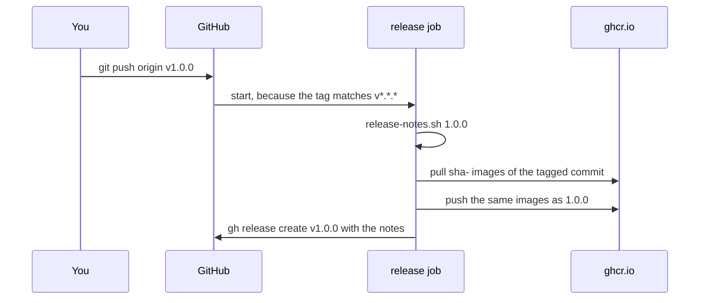

## Before you start

- [[devops.l2.changelog]] — you know `CHANGELOG.md` has a section per version, and that the 1.0.0 section lists what changed for clients.
- [[devops.l2.tagging-images-by-commit]] — you know every green push to `master` leaves images tagged `sha-` plus the commit id in `ghcr.io`.

## The situation

The commit at stage-2 is ready to become Đơn Hàng 1.0.0. Its images already sit in `ghcr.io` as `sha-7a131bc…`, built by CI after its tests passed. The app team wants to pull `donhang-api:1.0.0` and read the 1.0.0 notes next to it. A teammate proposes a manual checklist: rebuild the image from that commit "so it is fresh", push it as `1.0.0`, then paste the notes into GitHub by hand. Another asks how anyone will later find which commit 1.0.0 was. How do you mark a commit as a version, and turn that mark into images and notes without building anything again?

## Core concepts

- **git tag** — a name fixed to one commit, such as `v1.0.0`; unlike a branch, it does not move when new commits arrive.
- Annotated tag — a git tag with its own message, tagger and date, made with `git tag -a`.
- Promoting an image — giving an image that already passed CI one more tag, the version, without building it again.
- Release notes — the text of a GitHub release, the page GitHub shows for a tagged version, which the `gh` command-line tool creates with `gh release create`; Đơn Hàng takes the text from that version's section of `CHANGELOG.md`.

## How it works



In the situation above, the mark is a git tag. `git tag -a v1.0.0` creates an annotated tag on the current commit, with a message of its own. A plain `git push` sends your current branch but no tags; a tag travels only when asked, as in `git push origin v1.0.0`.

Pushing that tag starts Đơn Hàng's `release.yml`, which runs for tags matching `v*.*.*`. After checking out the tagged commit, it runs `scripts/release-notes.sh 1.0.0`, which prints the `## [1.0.0]` section of `CHANGELOG.md` and fails if there is none, before anything is pushed.

Next it pulls the `sha-` images of the tagged commit, adds the tag `1.0.0` to them and pushes. Nothing is built, so `1.0.0` is the very image CI built from that commit after its tests passed. The `1.0.0` drops the `v` from the git tag's name.

Because the release reuses images CI already pushed, it depends on them. A commit that never went through `master` has no `sha-` image: the pull fails and so does the release. That is intended; only a commit that passed CI on `master` can become a version.

Last, `gh release create` makes a GitHub release attached to the tag, with the notes from the notes step.

Đơn Hàng's commits carry two kinds of git tag. `stage-0`, `stage-1` and `stage-2` mark states of the course, while `v0.1.0` and `v1.0.0` mark product versions. One commit can carry both: the stage-2 commit is also `v1.0.0`.

## In the Đơn Hàng system

The trigger and permissions of `release.yml`:

```yaml file=.github/workflows/release.yml tag=stage-2 lines=3-13
# lesson: devops.l2.cutting-a-release
# Runs when a version tag such as v1.0.0 is pushed. It builds nothing: the
# images ci.yml pushed for the tagged commit get the version as a second
# tag, and that version's section of CHANGELOG.md becomes the release notes.
on:
  push:
    tags: ['v*.*.*']

permissions:
  contents: write # create the GitHub release
  packages: write # push the version tag to ghcr.io
```

`tags: ['v*.*.*']` limits the workflow to tag pushes that look like versions, so pushing `stage-2` starts nothing here. `contents: write` lets the job create the GitHub release, and `packages: write` lets it push to `ghcr.io`.

The step that promotes the images:

```yaml file=.github/workflows/release.yml tag=stage-2 lines=31-44
      # lesson: devops.l2.cutting-a-release
      # Pull the images ci.yml pushed when this commit reached master. A commit
      # that never went through master has no sha- images: docker pull fails,
      # and so does the release. Tag v1.0.0 gives the images the tag 1.0.0.
      - name: Promote the tested images to this version
        run: |
          commit=$(git rev-parse HEAD)
          version="${GITHUB_REF_NAME#v}"
          docker pull "ghcr.io/duyan11110/donhang-api:sha-$commit"
          docker pull "ghcr.io/duyan11110/donhang-migrate:sha-$commit"
          docker tag "ghcr.io/duyan11110/donhang-api:sha-$commit" "ghcr.io/duyan11110/donhang-api:$version"
          docker tag "ghcr.io/duyan11110/donhang-migrate:sha-$commit" "ghcr.io/duyan11110/donhang-migrate:$version"
          docker push "ghcr.io/duyan11110/donhang-api:$version"
          docker push "ghcr.io/duyan11110/donhang-migrate:$version"
```

`git rev-parse HEAD` prints the id of the commit the job's copy of the repository is on; the job checked out the tag, so that is the tagged commit. `GITHUB_REF_NAME` holds the tag's name, and `${GITHUB_REF_NAME#v}` turns `v1.0.0` into `1.0.0`, because Đơn Hàng's image versions carry no `v`. The run for `v1.0.0` shows the result: the pull of `sha-7a131bc…` reports digest `sha256:1d0825b5…`, and the push of `1.0.0` reports the same digest. One image, two tags.

## Beginners often think…

- **"`git push` uploads my tags together with my commits."** → Actually a plain `git push` sends your current branch, not tags; a tag goes up only when named, as in `git push origin v1.0.0`, or with `--tags`, which pushes all of them. You notice this when the tag exists on your laptop, but no release run appears on GitHub.
- **"A release should rebuild the image from the tagged commit so that it is fresh."** → Actually a rebuild makes a separate image that no CI run has produced or checked; promoting keeps the one CI built after the tests. You notice this when the digest of `1.0.0` differs from the `sha-` image of the same commit.
- **"A git tag and an image tag are the same thing, so creating one creates the other."** → Actually a git tag names a commit in the repository, an image tag names an image in a registry. Here `release.yml` connects them; without it, `v1.0.0` would create no `1.0.0` image. You notice this when a tag pushed to a repository without such a workflow leaves the registry unchanged.

## Try it (3 minutes)

In your Đơn Hàng folder at stage-2, in Git Bash:

1. Run `git tag --points-at 7a131bc`, which lists the git tags on the stage-2 commit, named by the start of its id.
2. Run `scripts/release-notes.sh 1.0.0 | head -2`; `head -2` keeps the first two lines.
3. Run `scripts/release-notes.sh 9.9.9`, then `echo $?`, which prints the exit code of the last command: `0` for success, anything else for failure.

Expected result: step 1 prints `stage-2` and `v1.0.0`, two git tags on one commit. Step 2 prints the first two lines of the 1.0.0 notes, starting "The first version with a declared public API". Step 3 prints "CHANGELOG.md has no section for version 9.9.9" and `1`: a release of 9.9.9 would stop at the notes step, before any push.

<details><summary>Suggested answer</summary>

The course tag and the version tag sit on the same commit, which is why 1.0.0 is exactly the stage-2 code. The notes come from the changelog, and a version without a section fails before any image is pushed.

</details>

## Connections

- [[devops.l2.changelog]] — prerequisite: the section `release-notes.sh` copies into the release.
- [[devops.l2.tagging-images-by-commit]] — prerequisite: the `sha-` images the release promotes instead of rebuilding.
- [[devops.l2.building-images-in-ci]] — the same build-once idea, carried from CI all the way to a version.
- [[foundation.l2.git-mental-model]] — a git tag is one more name pointing at a commit, like a branch that never moves.

## Five-line summary

1. A git tag is a name fixed to one commit; `git tag -a v1.0.0` makes an annotated one, and `git push origin v1.0.0` sends it.
2. Pushing a `v*.*.*` tag starts `release.yml`, which pulls the commit's `sha-` images and pushes them as `1.0.0`, building nothing.
3. A commit that never reached `master` has no `sha-` image, so its release fails: only code that passed CI becomes a version.
4. The release notes are that version's section of `CHANGELOG.md`, printed by `scripts/release-notes.sh`.
5. `stage-N` tags mark course states and `vX.Y.Z` tags product versions; the stage-2 commit carries `stage-2` and `v1.0.0`.
