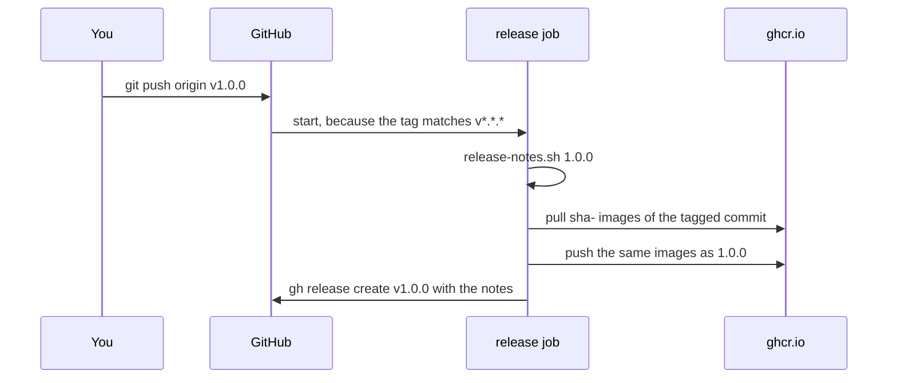

## Bạn cần biết trước

- [[devops.l2.changelog]] — bạn biết `CHANGELOG.md` có một mục cho mỗi phiên bản, và mục 1.0.0 liệt kê những gì đã đổi với client.
- [[devops.l2.tagging-images-by-commit]] — bạn biết mỗi lần push xanh lên `master` để lại trong `ghcr.io` các image mang tag `sha-` cộng id commit.

## Tình huống

Commit ở stage-2 đã sẵn sàng thành Đơn Hàng 1.0.0. Image của nó đã nằm trong `ghcr.io` dưới tên `sha-7a131bc…`, do CI build sau khi test qua. Nhóm app muốn pull `donhang-api:1.0.0` và đọc ghi chú 1.0.0 đi kèm. Một đồng nghiệp đề xuất làm theo checklist bằng tay: build lại image từ commit đó "cho mới", push nó dưới `1.0.0`, rồi tự dán ghi chú lên GitHub. Người khác hỏi sau này làm sao biết 1.0.0 là commit nào. Làm sao đánh dấu một commit là một phiên bản, rồi biến dấu đó thành image và ghi chú mà không build lại gì?

## Khái niệm cốt lõi

- **git tag** (tên gắn cố định vào một commit, thường để đánh dấu một phiên bản phát hành) — một cái tên gắn cố định vào một commit, như `v1.0.0`; khác với nhánh, nó không dời khi có commit mới.
- Annotated tag — git tag có thông điệp, người gắn tag và ngày riêng, tạo bằng `git tag -a`.
- Nâng hạng image — cho một image đã qua CI thêm một tag nữa, là phiên bản, mà không build lại.
- Ghi chú phát hành — nội dung của một GitHub release, trang GitHub hiển thị cho một phiên bản đã gắn tag, do công cụ dòng lệnh `gh` tạo bằng `gh release create`; Đơn Hàng lấy nội dung từ mục của phiên bản đó trong `CHANGELOG.md`.

## Cơ chế hoạt động



Trong tình huống trên, dấu đánh dấu là một git tag. `git tag -a v1.0.0` tạo một annotated tag trên commit hiện tại, kèm thông điệp riêng. `git push` thông thường gửi nhánh hiện tại nhưng không gửi tag nào; tag chỉ được gửi khi được yêu cầu, như `git push origin v1.0.0`.

Push tag đó khởi động `release.yml` của Đơn Hàng, workflow chạy với các tag khớp `v*.*.*`. Sau khi checkout commit được gắn tag, nó chạy `scripts/release-notes.sh 1.0.0`, script in mục `## [1.0.0]` của `CHANGELOG.md` và lỗi nếu không có mục đó, trước khi push bất cứ thứ gì.

Tiếp theo, nó pull các image `sha-` của commit được gắn tag, thêm tag `1.0.0` cho chúng rồi push. Không có gì được build, nên `1.0.0` chính là image mà CI đã build từ commit đó sau khi test qua. `1.0.0` bỏ chữ `v` trong tên git tag.

Vì bản phát hành dùng lại image CI đã push, nó phụ thuộc vào các image đó. Một commit chưa từng đi qua `master` thì không có image `sha-`: lần pull lỗi và bản phát hành cũng lỗi theo. Đó là chủ ý; chỉ commit đã qua CI trên `master` mới thành phiên bản được.

Cuối cùng, `gh release create` tạo một GitHub release gắn với tag, kèm ghi chú từ bước đọc ghi chú.

Các commit của Đơn Hàng mang hai loại git tag. `stage-0`, `stage-1` và `stage-2` đánh dấu các trạng thái của khóa học, còn `v0.1.0` và `v1.0.0` đánh dấu phiên bản sản phẩm. Một commit có thể mang cả hai: commit stage-2 cũng là `v1.0.0`.

## Trong hệ thống Đơn Hàng

Phần kích hoạt và quyền của `release.yml`:

```yaml file=.github/workflows/release.yml tag=stage-2 lines=3-13
# lesson: devops.l2.cutting-a-release
# Runs when a version tag such as v1.0.0 is pushed. It builds nothing: the
# images ci.yml pushed for the tagged commit get the version as a second
# tag, and that version's section of CHANGELOG.md becomes the release notes.
on:
  push:
    tags: ['v*.*.*']

permissions:
  contents: write # create the GitHub release
  packages: write # push the version tag to ghcr.io
```

`tags: ['v*.*.*']` giới hạn workflow vào các lần push tag trông như phiên bản, nên push `stage-2` không khởi động gì ở đây. `contents: write` cho job tạo GitHub release, còn `packages: write` cho nó push lên `ghcr.io`.

Bước nâng hạng image:

```yaml file=.github/workflows/release.yml tag=stage-2 lines=31-44
      # lesson: devops.l2.cutting-a-release
      # Pull the images ci.yml pushed when this commit reached master. A commit
      # that never went through master has no sha- images: docker pull fails,
      # and so does the release. Tag v1.0.0 gives the images the tag 1.0.0.
      - name: Promote the tested images to this version
        run: |
          commit=$(git rev-parse HEAD)
          version="${GITHUB_REF_NAME#v}"
          docker pull "ghcr.io/duyan11110/donhang-api:sha-$commit"
          docker pull "ghcr.io/duyan11110/donhang-migrate:sha-$commit"
          docker tag "ghcr.io/duyan11110/donhang-api:sha-$commit" "ghcr.io/duyan11110/donhang-api:$version"
          docker tag "ghcr.io/duyan11110/donhang-migrate:sha-$commit" "ghcr.io/duyan11110/donhang-migrate:$version"
          docker push "ghcr.io/duyan11110/donhang-api:$version"
          docker push "ghcr.io/duyan11110/donhang-migrate:$version"
```

`git rev-parse HEAD` in id của commit mà bản sao repository của job đang đứng; job đã checkout tag, nên đó là commit được gắn tag. `GITHUB_REF_NAME` chứa tên tag, và `${GITHUB_REF_NAME#v}` biến `v1.0.0` thành `1.0.0`, vì phiên bản image của Đơn Hàng không có `v`. Lần chạy cho `v1.0.0` cho thấy kết quả: lần pull `sha-7a131bc…` báo digest `sha256:1d0825b5…`, và lần push `1.0.0` báo đúng digest đó. Một image, hai tag.

## Người mới hay nghĩ rằng…

- **"`git push` đẩy tag lên cùng với commit."** → Thực ra `git push` thông thường gửi nhánh hiện tại, không gửi tag; tag chỉ lên khi được nêu tên, như `git push origin v1.0.0`, hoặc với `--tags`, tùy chọn push tất cả tag. Bạn sẽ nhận ra khi tag có trên laptop, nhưng GitHub không có lần chạy release nào.
- **"Bản phát hành nên build lại image từ commit được gắn tag cho mới."** → Thực ra bản build lại là một image khác mà không lần chạy CI nào tạo ra hay kiểm; nâng hạng thì giữ đúng image CI đã build sau khi test. Bạn sẽ nhận ra khi digest của `1.0.0` khác với image `sha-` của cùng commit.
- **"Git tag và tag image là một, nên tạo cái này là có cái kia."** → Thực ra git tag đặt tên cho một commit trong repository, còn tag image đặt tên cho một image trong registry. Ở đây `release.yml` nối chúng lại; không có nó, `v1.0.0` không tạo ra image `1.0.0` nào. Bạn sẽ nhận ra khi push một tag lên repository không có workflow như vậy mà registry không đổi gì.

## Thử ngay (3 phút)

Trong thư mục Đơn Hàng ở stage-2, mở Git Bash:

1. Chạy `git tag --points-at 7a131bc`, lệnh liệt kê các git tag trên commit stage-2, gọi commit bằng phần đầu id của nó.
2. Chạy `scripts/release-notes.sh 1.0.0 | head -2`; `head -2` giữ lại hai dòng đầu.
3. Chạy `scripts/release-notes.sh 9.9.9`, rồi `echo $?`, lệnh in mã thoát của lệnh vừa chạy: `0` là thành công, giá trị khác là lỗi.

Kết quả mong đợi: bước 1 in `stage-2` và `v1.0.0`, hai git tag trên cùng một commit. Bước 2 in hai dòng đầu của ghi chú 1.0.0, bắt đầu bằng "The first version with a declared public API". Bước 3 in "CHANGELOG.md has no section for version 9.9.9" và `1`: một bản phát hành 9.9.9 sẽ dừng ở bước đọc ghi chú, trước mọi lần push.

<details><summary>Gợi ý đáp án</summary>

Tag của khóa học và tag phiên bản nằm trên cùng một commit, vì thế 1.0.0 chính xác là code của stage-2. Ghi chú đến từ changelog, và một phiên bản không có mục trong đó sẽ lỗi trước khi bất kỳ image nào được push.

</details>

## Liên hệ

- [[devops.l2.changelog]] — điều kiện tiên quyết: mục mà `release-notes.sh` chép vào bản phát hành.
- [[devops.l2.tagging-images-by-commit]] — điều kiện tiên quyết: các image `sha-` mà bản phát hành nâng hạng thay vì build lại.
- [[devops.l2.building-images-in-ci]] — cùng ý build một lần, mang từ CI tới tận một phiên bản.
- [[foundation.l2.git-mental-model]] — git tag là thêm một cái tên trỏ tới commit, giống một nhánh không bao giờ dời.

## Tóm tắt 5 dòng

1. Git tag là tên gắn cố định vào một commit; `git tag -a v1.0.0` tạo một annotated tag, và `git push origin v1.0.0` gửi nó lên.
2. Push một tag `v*.*.*` khởi động `release.yml`, workflow pull các image `sha-` của commit rồi push chúng dưới `1.0.0`, không build gì.
3. Commit chưa từng lên `master` thì không có image `sha-`, nên bản phát hành của nó lỗi: chỉ code đã qua CI mới thành phiên bản.
4. Ghi chú phát hành là mục của phiên bản đó trong `CHANGELOG.md`, do `scripts/release-notes.sh` in ra.
5. Tag `stage-N` đánh dấu trạng thái khóa học, tag `vX.Y.Z` đánh dấu phiên bản sản phẩm; commit stage-2 mang cả `stage-2` lẫn `v1.0.0`.
