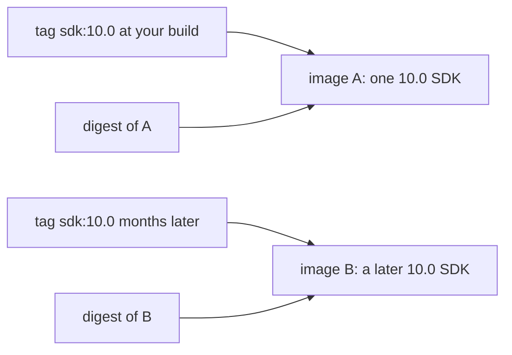

## Before you start

- [[devops.l2.container-registry]] — you know a registry stores images by name and tag, and that `docker pull` downloads one by that name.
- [[devops.l1.dockerfile-for-dotnet]] — you know `DonHang.Api/Dockerfile` starts from `mcr.microsoft.com/dotnet/sdk:10.0` to build the API.

## The situation

You built `donhang-api:stage-1` on your laptop when you joined. Months later a new teammate checks out the same `stage-1` code and builds it. Same commit, same `DonHang.Api/Dockerfile`, same line `FROM mcr.microsoft.com/dotnet/sdk:10.0`, yet `docker run --rm mcr.microsoft.com/dotnet/sdk:10.0 dotnet --version` prints two different SDK versions on the two laptops. Another teammate suggests the team simply run `latest` of every image, "so we are always current". The image names look identical everywhere. What does a name with a tag actually promise about which image you get, and how do you name one exact image?

## Core concepts

- Tag — the part after the colon in an image name, such as `10.0` in `sdk:10.0`; it is a label that points at one image in a registry at a time.
- Moving a tag — pushing a different image under a name and tag that already exist; unless the image's owner has made its tags immutable on the registry, the tag then points at the new image.
- `latest` — the tag Docker adds when a name has none, so `docker pull caddy` means `caddy:latest`.
- **image digest** — `sha256:` followed by a hash computed from an image's content, naming exactly that image in a registry.
- Pull by digest — writing the digest after `@` instead of a tag, as in `caddy@sha256:…`, so the registry returns only that image.
- Pinning — writing an image's digest into a reference, such as a `FROM` line, so every build resolves to that one image.

## How it works



In the situation above, both builds asked the registry for `mcr.microsoft.com/dotnet/sdk:10.0`. A tag is a label: by default, whoever can push to that name can push a new image under the same tag, and the registry points the tag at it. Microsoft uses `10.0` as a release line: each new 10.0 SDK release is pushed under it. So is each new build of a release's image, which Microsoft makes when, for example, the Linux files underneath get fixes. A new laptop gets the image the tag points to when it pulls, so the two SDK images report different versions.

`latest` is the same kind of label. Docker adds it only when a name has no tag; it does not mean newest. It points at whatever image was last pushed under `latest`, and a publisher may never push it at all, or push an old image there.

A version-looking tag such as `2.10.0` is still just a tag. Some publishers never move such tags, and some registries let an image's owner make its tags immutable, but by default a registry allows the move, and nothing in the name tells you which case you have.

An image digest is different in kind. It is a hash computed from the image's content, so a different image always has a different digest. Pulling `name@sha256:…` returns that image, whatever later happens to the tags. `docker pull` prints the digest of what it downloaded.

Pinning a base image by digest makes every build start from the same bytes. The opposite view also holds: a pinned base no longer picks up security fixes, so someone must change the digest to receive them. Pinning suits a team that reviews base updates; following the tag suits one that wants fixes to arrive on each rebuild.

## In the Đơn Hàng system

The two base images of the API's Dockerfile:

```dockerfile file=DonHang.Api/Dockerfile tag=stage-1 lines=5-19
FROM mcr.microsoft.com/dotnet/sdk:10.0 AS build
WORKDIR /src

COPY global.json Directory.Packages.props ./
COPY DonHang.Domain/DonHang.Domain.csproj DonHang.Domain/
COPY DonHang.Infrastructure/DonHang.Infrastructure.csproj DonHang.Infrastructure/
COPY DonHang.Api/DonHang.Api.csproj DonHang.Api/
RUN dotnet restore DonHang.Api/DonHang.Api.csproj

COPY DonHang.Domain/ DonHang.Domain/
COPY DonHang.Infrastructure/ DonHang.Infrastructure/
COPY DonHang.Api/ DonHang.Api/
RUN dotnet publish DonHang.Api/DonHang.Api.csproj -c Release -o /app --no-restore

FROM mcr.microsoft.com/dotnet/aspnet:10.0 AS final
```

Both `FROM` lines name a tag, `10.0`, and no digest. So Đơn Hàng's code fixes .NET 10.0 but not which 10.0 SDK or runtime build: on a machine that pulls the bases again, such as a new laptop, a build months from now can start from different images than today's. Đơn Hàng does not pin these by digest; the lesson explains the option, it does not change the file.

The services that Compose pulls instead of building name a tag too:

```yaml file=docker-compose.yml tag=stage-1 lines=44-46
  web:
    image: caddy:2.10.0
    container_name: donhang-web
```

`caddy:2.10.0` looks exact, but whether Caddy's publishers ever move it cannot be read from the name. It is a tag, so if the same image is required everywhere, only a digest guarantees it. The API's own image, `donhang-api:stage-1`, was never pushed, so no registry has given it a digest yet; the next lessons push Đơn Hàng's images.

## Beginners often think…

- **"`latest` always gives me the newest version of an image."** → Actually `latest` is only the tag Docker fills in when you give none, and it points at whatever was last pushed under that tag. You notice this when `docker pull` of a name without a tag fails because the publisher never pushed `latest`, or brings an image older than one of its version tags.
- **"Once an image is published under a version tag such as `2.10.0`, that tag gives the same image forever."** → Actually, by default a registry lets anyone with push rights move a tag, and whether a publisher does is a policy you cannot read from the name. You notice this when the digest `docker pull` prints for the same tag differs from the one you recorded: `sdk:10.0.401`, a full version, has resolved to two different digests on the same day.
- **"Two images with the same name and tag on two machines must be identical."** → Actually each machine got whatever the tag pointed to when it pulled or built, as in the situation. You notice this when two machines show the same name and tag with different digests.

## Try it (3 minutes)

With Docker running and the lab started at least once, in a terminal:

1. Run `docker image ls --digests caddy` and copy the value in the `DIGEST` column.
2. Run `docker pull caddy@` followed by the digest you copied.
3. Think: if someone moved the tag `2.10.0` tomorrow, what would step 2 return then?

Expected result: step 1 shows `caddy` with tag `2.10.0` and a digest starting with `sha256:`. Step 2 ends with "Image is up to date": you named the image by its digest, and you already have exactly that one.

<details><summary>Suggested answer</summary>

`caddy` has a digest because it came from a registry, and pulling by that digest asks for that exact image, not for whatever `2.10.0` points to today. If the tag were moved tomorrow, the same command would still return this image.

</details>

## Connections

- [[devops.l2.container-registry]] — prerequisite: the registry is what holds tags and answers pulls by tag or by digest.
- [[devops.l1.dockerfile-for-dotnet]] — the same `FROM` line, now read as a tag that can move rather than a fixed SDK.
- [[devops.l2.tagging-images-by-commit]] — how Đơn Hàng names its own images so a tag says which commit runs.
- [[devops.l2.pushing-images-from-ci]] — next: where Đơn Hàng's images get their first registry, and so their digests.

## Five-line summary

1. A tag is a movable label on one image in a registry; only a digest names one exact image for good.
2. `latest` is just the tag Docker adds when you give none; it means "last pushed there", not newest.
3. `sdk:10.0` in `DonHang.Api/Dockerfile` follows the 10.0 line, so builds months apart can start from different SDK images.
4. A version-looking tag such as `2.10.0` may stay put, but by default the registry does not guarantee it.
5. Pinning by digest gives the same bytes every time, at the cost of changing the digest to receive fixes.
