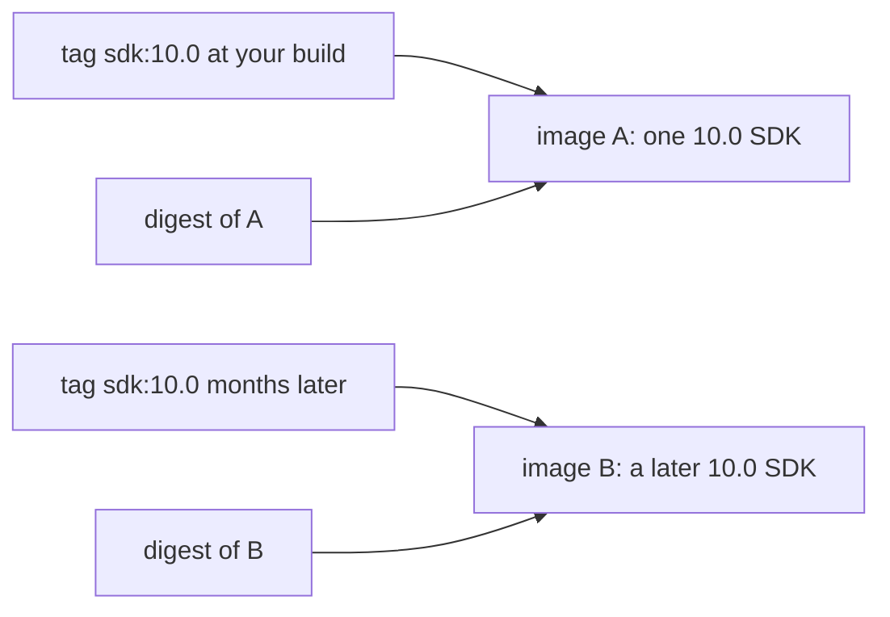

## Bạn cần biết trước

- [[devops.l2.container-registry]] — bạn biết registry lưu image theo tên và tag, và `docker pull` tải một image về theo cái tên đó.
- [[devops.l1.dockerfile-for-dotnet]] — bạn biết `DonHang.Api/Dockerfile` bắt đầu từ `mcr.microsoft.com/dotnet/sdk:10.0` để build API.

## Tình huống

Bạn build `donhang-api:stage-1` trên laptop khi mới vào nhóm. Vài tháng sau, một đồng nghiệp mới checkout cùng mã `stage-1` và build. Cùng commit, cùng `DonHang.Api/Dockerfile`, cùng dòng `FROM mcr.microsoft.com/dotnet/sdk:10.0`, vậy mà `docker run --rm mcr.microsoft.com/dotnet/sdk:10.0 dotnet --version` in ra hai phiên bản SDK khác nhau trên hai laptop. Một đồng nghiệp khác đề xuất cả nhóm cứ chạy `latest` của mọi image, "để lúc nào cũng mới". Tên image trông giống hệt nhau ở mọi nơi. Một cái tên kèm tag thật ra hứa hẹn gì về image bạn nhận được, và làm sao gọi đúng một image duy nhất?

## Khái niệm cốt lõi

- Tag — phần sau dấu hai chấm trong tên image, như `10.0` trong `sdk:10.0`. Nó là một nhãn, mỗi lúc trỏ tới một image trên registry.
- Dời tag — push một image khác dưới một tên và tag đã có. Trừ khi chủ image đã đặt tag của nó là bất biến trên registry, tag khi đó trỏ sang image mới.
- `latest` — tag mà Docker tự thêm khi tên không có tag, nên `docker pull caddy` nghĩa là `caddy:latest`.
- **image digest** (mã sha256 tính từ nội dung image, chỉ đúng một image; khác tag, nó không bao giờ trỏ sang image khác) — `sha256:` theo sau là một mã hash tính từ nội dung image, chỉ đúng image đó trên registry.
- Pull theo digest — viết digest sau `@` thay cho tag, như `caddy@sha256:…`, để registry chỉ trả về đúng image đó.
- Ghim — viết digest của một image vào một tham chiếu, như dòng `FROM`, để mọi lần build đều ra đúng image đó.

## Cơ chế hoạt động



Trong tình huống trên, cả hai lần build đều hỏi registry `mcr.microsoft.com/dotnet/sdk:10.0`. Tag là một nhãn: mặc định, ai push được vào tên đó thì push được image mới dưới cùng tag, và registry cho tag trỏ sang image ấy. Microsoft dùng `10.0` làm một dòng phát hành: mỗi bản SDK 10.0 mới đều được push dưới tag này. Mỗi lần build lại image của một bản cũng vậy, Microsoft làm việc đó khi, chẳng hạn, các file Linux bên dưới có bản sửa. Laptop mới nhận image mà tag đang trỏ tới lúc nó pull, nên hai image SDK báo hai phiên bản khác nhau.

`latest` cũng là một nhãn như thế. Docker chỉ thêm nó khi tên không có tag, và nó không có nghĩa là mới nhất. Nó trỏ tới image nào được push lần cuối dưới `latest`, và nhà phát hành có thể không bao giờ push tag này, hoặc push một image cũ vào đó.

Một tag trông như số phiên bản, như `2.10.0`, vẫn chỉ là tag. Có nhà phát hành không bao giờ dời những tag như vậy, và có registry cho chủ image đặt tag là bất biến, nhưng mặc định registry cho phép dời, và cái tên không cho bạn biết mình đang ở trường hợp nào.

Image digest thì khác hẳn về bản chất. Nó là mã hash tính từ nội dung image, nên image khác thì luôn có digest khác. Pull `name@sha256:…` trả về đúng image đó, bất kể sau này tag thay đổi ra sao. `docker pull` in ra digest của thứ nó vừa tải về.

Ghim base image theo digest giúp mọi lần build bắt đầu từ đúng cùng một nội dung. Quan điểm ngược lại cũng đúng: base image đã ghim không còn tự nhận bản vá bảo mật, nên phải có người đổi digest để nhận chúng. Ghim hợp với nhóm có xem xét các bản cập nhật base image; đi theo tag hợp với nhóm muốn bản sửa tự đến ở mỗi lần build lại.

## Trong hệ thống Đơn Hàng

Hai base image trong Dockerfile của API:

```dockerfile file=DonHang.Api/Dockerfile tag=stage-1 lines=5-19
FROM mcr.microsoft.com/dotnet/sdk:10.0 AS build
WORKDIR /src

COPY global.json Directory.Packages.props ./
COPY DonHang.Domain/DonHang.Domain.csproj DonHang.Domain/
COPY DonHang.Infrastructure/DonHang.Infrastructure.csproj DonHang.Infrastructure/
COPY DonHang.Api/DonHang.Api.csproj DonHang.Api/
RUN dotnet restore DonHang.Api/DonHang.Api.csproj

COPY DonHang.Domain/ DonHang.Domain/
COPY DonHang.Infrastructure/ DonHang.Infrastructure/
COPY DonHang.Api/ DonHang.Api/
RUN dotnet publish DonHang.Api/DonHang.Api.csproj -c Release -o /app --no-restore

FROM mcr.microsoft.com/dotnet/aspnet:10.0 AS final
```

Cả hai dòng `FROM` đều ghi tag `10.0` và không có digest. Vậy mã của Đơn Hàng cố định .NET 10.0, nhưng không cố định bản build SDK hay runtime 10.0 nào: trên máy pull lại base image, như một laptop mới, lần build vài tháng sau có thể bắt đầu từ image khác hôm nay. Đơn Hàng không ghim các image này theo digest; bài chỉ giải thích lựa chọn đó, không sửa file.

Các service mà Compose pull thay vì build cũng ghi tag:

```yaml file=docker-compose.yml tag=stage-1 lines=44-46
  web:
    image: caddy:2.10.0
    container_name: donhang-web
```

`caddy:2.10.0` trông chính xác, nhưng nhà phát hành Caddy có bao giờ dời nó hay không thì không đọc ra được từ cái tên. Nó là tag, nên nếu mọi nơi bắt buộc dùng cùng một image, chỉ digest mới bảo đảm được. Image của chính API, `donhang-api:stage-1`, chưa từng được push, nên chưa registry nào cấp digest cho nó; các bài sau sẽ push image của Đơn Hàng.

## Người mới hay nghĩ rằng…

- **"`latest` luôn cho tôi phiên bản mới nhất của image."** → Thực ra `latest` chỉ là tag Docker tự điền khi bạn không ghi tag, và nó trỏ tới image được push lần cuối dưới tag đó. Bạn sẽ nhận ra khi `docker pull` một tên không kèm tag bị lỗi vì nhà phát hành chưa từng push `latest`, hoặc mang về một image cũ hơn một tag phiên bản của chính nó.
- **"Khi image đã được phát hành dưới một tag phiên bản như `2.10.0`, tag đó mãi mãi cho cùng một image."** → Thực ra, mặc định registry cho bất kỳ ai có quyền push dời một tag, và nhà phát hành có làm vậy hay không là chính sách bạn không đọc ra được từ cái tên. Bạn sẽ nhận ra khi digest mà `docker pull` in ra cho cùng một tag khác với digest bạn đã ghi lại: `sdk:10.0.401`, một phiên bản đầy đủ, từng trỏ tới hai digest khác nhau trong cùng một ngày.
- **"Hai image cùng tên và tag trên hai máy chắc chắn giống hệt nhau."** → Thực ra mỗi máy nhận thứ mà tag đang trỏ tới vào lúc nó pull hoặc build, như trong tình huống. Bạn sẽ nhận ra khi hai máy hiện cùng tên và tag nhưng digest khác nhau.

## Thử ngay (3 phút)

Khi Docker đang chạy và lab đã được khởi động ít nhất một lần, mở terminal:

1. Chạy `docker image ls --digests caddy` và chép giá trị trong cột `DIGEST`.
2. Chạy `docker pull caddy@` theo sau là digest vừa chép.
3. Nghĩ xem: nếu ngày mai có người dời tag `2.10.0`, bước 2 khi đó sẽ trả về gì?

Kết quả mong đợi: bước 1 hiện `caddy` với tag `2.10.0` và một digest bắt đầu bằng `sha256:`. Bước 2 kết thúc bằng "Image is up to date": bạn gọi image bằng digest của nó, và máy bạn đã có đúng image đó.

<details><summary>Gợi ý đáp án</summary>

`caddy` có digest vì nó đến từ registry, và pull theo digest đó là hỏi đúng image ấy, không phải image mà `2.10.0` đang trỏ tới hôm nay. Nếu ngày mai tag bị dời, cùng lệnh đó vẫn trả về image này.

</details>

## Liên hệ

- [[devops.l2.container-registry]] — điều kiện tiên quyết: registry là nơi giữ tag và trả lời các lần pull theo tag hoặc theo digest.
- [[devops.l1.dockerfile-for-dotnet]] — cùng dòng `FROM` đó, giờ đọc như một tag có thể dời chứ không phải một SDK cố định.
- [[devops.l2.tagging-images-by-commit]] — cách Đơn Hàng đặt tên image của chính mình để tag cho biết commit nào đang chạy.
- [[devops.l2.pushing-images-from-ci]] — bài kế: nơi image của Đơn Hàng lần đầu có registry, và vì thế có digest.

## Tóm tắt 5 dòng

1. Tag là nhãn dời được, gắn vào một image trên registry; chỉ digest mới chỉ đúng một image mãi mãi.
2. `latest` chỉ là tag Docker thêm khi bạn không ghi tag; nó nghĩa là "push lần cuối vào đây", không phải mới nhất.
3. `sdk:10.0` trong `DonHang.Api/Dockerfile` đi theo dòng 10.0, nên các lần build cách nhau vài tháng có thể bắt đầu từ image SDK khác nhau.
4. Tag trông như phiên bản, như `2.10.0`, có thể đứng yên, nhưng mặc định registry không bảo đảm điều đó.
5. Ghim theo digest cho cùng một nội dung mỗi lần, đổi lại phải đổi digest để nhận bản sửa.
