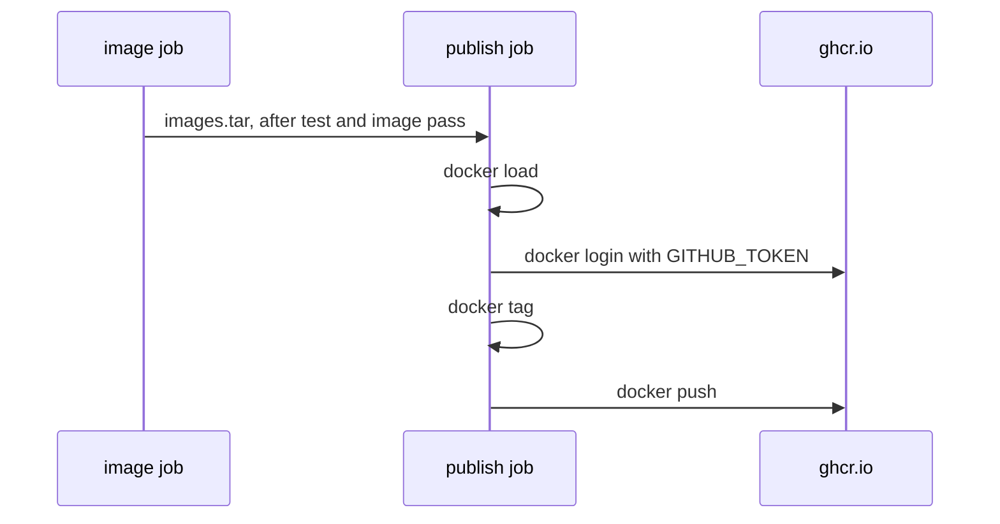

## Before you start

- [[devops.l2.image-tags-and-digests]] — you know a tag is a movable name for an image and a digest names one exact image.
- [[devops.l2.deployment-environments]] — you know `staging` and `publish` run only for pushes to `master`, after `test` and `image`, and that environment secrets reach only the jobs that ask.
- [[devops.l1.secrets-vs-config]] — you know a secret is config whose reader gains the power it protects.

## The situation

The team wants a test machine outside GitHub to run the API image that CI built for the latest green commit on `master`. You now know the image must go to a container registry first. One developer offers to save his personal GitHub password as a repository secret, so CI can log in. Another wants every pull request to push its image too, "so reviewers can try it". A third worries that pushing means building again, so the registry might get an image the tests never saw. How should Đơn Hàng's CI push its images, with what credentials, and which images should reach the registry?

## Core concepts

- GitHub Container Registry — GitHub's container registry, at the host `ghcr.io`, where an image name has the form `ghcr.io/<owner>/<name>`.
- `GITHUB_TOKEN` — a token GitHub creates at the start of each job of a workflow run; it stops working when the job ends.
- `permissions:` — the workflow key that says what `GITHUB_TOKEN` may do; a job that lists it gets only the permissions listed, plus read access to basic repository metadata.
- `packages: write` — the permission that lets `GITHUB_TOKEN` push to GitHub Container Registry, where GitHub calls each stored image name a package.
- `docker tag` — the command that gives an image already on the machine one more name; it builds nothing and copies nothing.

## How it works



In the situation above, the registry is GitHub Container Registry. From stage-2, Đơn Hàng publishes `ghcr.io/duyan11110/donhang-api` and `ghcr.io/duyan11110/donhang-migrate` there. The owner part, `duyan11110`, is the GitHub account that owns the repository.

No personal password is needed. GitHub creates a `GITHUB_TOKEN` for each job, and the `publish` job logs in to `ghcr.io` with its own. Đơn Hàng's repository gives the token read-only access by default, so it can push only because the job declares `permissions: packages: write`. It ends with the job, so nothing long-lived sits in the repository's secrets. A personal token, by contrast, acts as its owner across whatever its scopes allow, and keeps working until it expires or someone revokes it.

`publish` runs only for pushes to `master` and `needs:` both `test` and `image`. So an image reaches the registry only after the quality gate passed on a commit pushed to `master`. Pull requests run `test` and `image` but never `publish`.

`publish` does not build. It downloads the `images` artifact and runs `docker load`, then logs in. `docker tag` adds a second name, with the registry host and owner in front, to the image already loaded, and `docker push` uploads that image under the new name. Because no step builds, the image in the registry is the one the `image` job built, the same file `staging` loads. `publish` does not wait for `staging`; both start once `test` and `image` pass.

Pushing from every pull request has a cost that stored images hide: anyone who can pull may run them, and a deployment that names the wrong tag would run code nobody reviewed. That is why a team pushes only green commits from its main branch when it wants the registry to hold only images it would run.

## In the Đơn Hàng system

The start of the `publish` job in `ci.yml`:

```yaml file=.github/workflows/ci.yml tag=stage-2 lines=130-152
  # lesson: devops.l2.pushing-images-from-ci
  # Only master's green commits reach the registry. The job logs in with the
  # GITHUB_TOKEN GitHub creates for this run, which may push packages only
  # because `permissions:` says so. It pushes the images the tests passed
  # with: loaded from the artifact, never rebuilt.
  publish:
    if: github.event_name == 'push' && github.ref == 'refs/heads/master'
    needs: [test, image]
    runs-on: ubuntu-24.04
    permissions:
      packages: write
    steps:
      - uses: actions/download-artifact@v4
        with:
          name: images

      - name: Load the images
        run: docker load --input images.tar

      - name: Log in to GitHub Container Registry
        env:
          GITHUB_TOKEN: ${{ secrets.GITHUB_TOKEN }}
        run: echo "$GITHUB_TOKEN" | docker login ghcr.io --username "$GITHUB_ACTOR" --password-stdin
```

`permissions:` sits on the job, so this job's token gets `packages: write` plus the metadata access every token has; the run's log lists exactly "Metadata: read" and "Packages: write". `secrets.GITHUB_TOKEN` is how a workflow reads the job's token, `GITHUB_ACTOR` holds the account that started the run, and `--password-stdin` feeds the token to `docker login` without putting it on the command line.

The last step names and pushes the images:

```yaml file=.github/workflows/ci.yml tag=stage-2 lines=159-166
      - name: Tag the images with this commit and push them
        run: |
          api="ghcr.io/duyan11110/donhang-api:sha-$GITHUB_SHA"
          migrate="ghcr.io/duyan11110/donhang-migrate:sha-$GITHUB_SHA"
          docker tag donhang-api:stage-2 "$api"
          docker tag donhang-migrate:stage-2 "$migrate"
          docker push "$api"
          docker push "$migrate"
```

`docker tag` adds a name under `ghcr.io/duyan11110` to `donhang-api:stage-2`, which keeps its old name too. `GITHUB_SHA` holds the commit id; the tag built from it is the next lesson's subject. The log of the `stage-2` run shows the whole job: `Loaded image: donhang-api:stage-2`, the login, then the push, which prints the pushed image's digest, `sha256:1d0825b5…`. No line builds anything.

## Beginners often think…

- **"To push to GitHub's registry, CI needs my personal GitHub password or token stored as a secret."** → Actually the job's own `GITHUB_TOKEN` can push, once `permissions:` grants `packages: write`. You notice this when `publish` fails at `docker push` with an access error: the job is missing `packages: write`, not a password.
- **"Pushing an image from every pull request is harmless, since images in a registry are only stored, not run."** → Actually anything that can pull an image can run it, so unreviewed code becomes runnable under a real name. You notice this when a server pulls a tag and starts code that never passed review.
- **"`docker tag` makes a copy of the image, so the pushed image may differ from the one that was tested."** → Actually `docker tag` only adds a name to the same image; nothing is rebuilt or copied. You notice this when `docker image ls` shows both names with the same value in the `IMAGE ID` column.

## Try it (3 minutes)

The images are public, so no login is needed. In a terminal:

1. Run `docker buildx imagetools inspect ghcr.io/duyan11110/donhang-api:sha-7a131bc83612d30c266e066c85e28f26bd7dc60d`. This asks the registry about the image `publish` pushed for the `stage-2` commit, without downloading it.
2. Read the `Digest:` line.
3. Think: if `publish` had run `docker build` instead of `docker load`, what would the tests and `staging` have told you about this image?

Expected result: `Digest:` shows `sha256:1d0825b5…`, the digest the `publish` log printed when it pushed. The registry still holds exactly what that job pushed.

<details><summary>Suggested answer</summary>

Nothing directly. A new build makes a separate image, and the tests and `staging` ran with the image from `images.tar`. Because `publish` only loaded that image, added a name and pushed, the digest you read belongs to the image those jobs used.

</details>

## Connections

- [[devops.l2.image-tags-and-digests]] — prerequisite: the registry now holds Đơn Hàng's images, each under a tag and a digest.
- [[devops.l2.workflow-artifacts]] — how `images.tar` reaches `publish` from the `image` job.
- [[devops.l1.secrets-vs-config]] — why a short-lived job token beats a personal secret stored in the repository.
- [[devops.l2.tagging-images-by-commit]] — next: why the tag after the colon is `sha-` and the commit id.

## Five-line summary

1. CI pushes Đơn Hàng's images to GitHub Container Registry as `ghcr.io/duyan11110/donhang-api` and `donhang-migrate`, from the `publish` job.
2. The job logs in with its own `GITHUB_TOKEN`, which can push only because `permissions:` grants `packages: write`.
3. `publish` runs only for pushes to `master`, after `test` and `image` pass, so only green commits on `master` reach the registry.
4. It loads the artifact and uses `docker tag` to add a registry name; nothing is rebuilt.
5. The image in the registry is the one the `image` job built and the later jobs loaded, not a rebuild.
