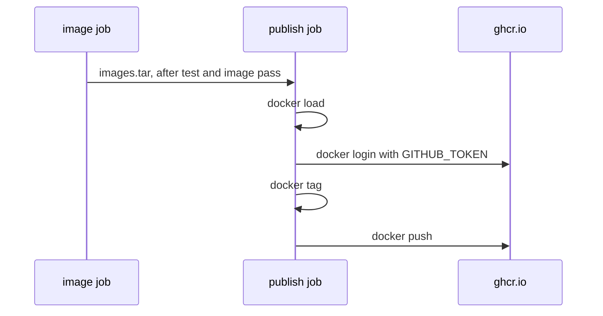

## Bạn cần biết trước

- [[devops.l2.image-tags-and-digests]] — bạn biết tag là tên dời được của một image, còn digest chỉ đúng một image.
- [[devops.l2.deployment-environments]] — bạn biết `staging` và `publish` chỉ chạy khi push lên `master`, sau `test` và `image`, và secret của environment chỉ tới được những job có yêu cầu.
- [[devops.l1.secrets-vs-config]] — bạn biết secret là config mà ai đọc được sẽ có được quyền nó bảo vệ.

## Tình huống

Nhóm muốn một máy test bên ngoài GitHub chạy image API mà CI đã build cho commit xanh mới nhất trên `master`. Giờ bạn đã biết image phải được đưa lên container registry trước. Một bạn đề nghị lưu mật khẩu GitHub cá nhân của mình làm secret của repository, để CI đăng nhập. Bạn khác muốn mọi pull request cũng push image, "để người review thử". Bạn thứ ba lo rằng push nghĩa là build lại, nên registry có thể nhận một image mà test chưa từng thấy. CI của Đơn Hàng nên push image thế nào, bằng thông tin đăng nhập gì, và image nào nên lên registry?

## Khái niệm cốt lõi

- GitHub Container Registry — container registry của GitHub, ở host `ghcr.io`, nơi tên image có dạng `ghcr.io/<owner>/<name>`.
- `GITHUB_TOKEN` — token mà GitHub tạo khi mỗi job của một lần chạy workflow bắt đầu; nó hết hiệu lực khi job kết thúc.
- `permissions:` — khóa trong workflow quy định `GITHUB_TOKEN` được làm gì; job nào ghi khóa này chỉ nhận đúng các quyền được liệt kê, cộng quyền đọc metadata cơ bản của repository.
- `packages: write` — quyền cho `GITHUB_TOKEN` push lên GitHub Container Registry, nơi GitHub gọi mỗi tên image được lưu là một package.
- `docker tag` — lệnh đặt thêm một tên cho image đã có trên máy; nó không build gì và không chép gì.

## Cơ chế hoạt động



Trong tình huống trên, registry là GitHub Container Registry. Từ stage-2, Đơn Hàng phát hành `ghcr.io/duyan11110/donhang-api` và `ghcr.io/duyan11110/donhang-migrate` ở đó. Phần owner, `duyan11110`, là tài khoản GitHub sở hữu repository.

Không cần mật khẩu cá nhân nào. GitHub tạo một `GITHUB_TOKEN` cho mỗi job, và job `publish` đăng nhập vào `ghcr.io` bằng token của chính nó. Repository của Đơn Hàng mặc định chỉ cho token quyền đọc, nên nó push được chỉ vì job khai báo `permissions: packages: write`. Token hết hạn cùng job, nên không có gì sống lâu nằm trong secret của repository. Ngược lại, token cá nhân hành động thay chủ của nó trong mọi phạm vi được cấp, và còn dùng được cho tới khi hết hạn hoặc bị thu hồi.

`publish` chỉ chạy khi push lên `master` và `needs:` cả `test` lẫn `image`. Vì vậy image chỉ lên registry sau khi quality gate đã qua trên một commit được push lên `master`. Pull request chạy `test` và `image` nhưng không bao giờ chạy `publish`.

`publish` không build. Nó tải artifact `images` về, chạy `docker load`, rồi đăng nhập. `docker tag` thêm một tên thứ hai, có host của registry và owner phía trước, cho image đã load, và `docker push` tải image đó lên dưới tên mới. Vì không bước nào build, image trên registry chính là image job `image` đã build, cũng là file mà `staging` load. `publish` không chờ `staging`; cả hai bắt đầu khi `test` và `image` qua.

Push từ mọi pull request có một cái giá mà việc "chỉ lưu" che đi: ai pull được thì chạy được, và một lần deploy ghi nhầm tag sẽ chạy code chưa ai review. Vì thế, khi muốn registry chỉ chứa những image mình sẵn sàng chạy, nhóm chỉ push các commit xanh từ nhánh chính.

## Trong hệ thống Đơn Hàng

Phần đầu của job `publish` trong `ci.yml`:

```yaml file=.github/workflows/ci.yml tag=stage-2 lines=130-152
  # lesson: devops.l2.pushing-images-from-ci
  # Only master's green commits reach the registry. The job logs in with the
  # GITHUB_TOKEN GitHub creates for this run, which may push packages only
  # because `permissions:` says so. It pushes the images the tests passed
  # with: loaded from the artifact, never rebuilt.
  publish:
    if: github.event_name == 'push' && github.ref == 'refs/heads/master'
    needs: [test, image]
    runs-on: ubuntu-24.04
    permissions:
      packages: write
    steps:
      - uses: actions/download-artifact@v4
        with:
          name: images

      - name: Load the images
        run: docker load --input images.tar

      - name: Log in to GitHub Container Registry
        env:
          GITHUB_TOKEN: ${{ secrets.GITHUB_TOKEN }}
        run: echo "$GITHUB_TOKEN" | docker login ghcr.io --username "$GITHUB_ACTOR" --password-stdin
```

`permissions:` nằm trên job, nên token của job này nhận `packages: write` cộng quyền metadata mà token nào cũng có; log của lần chạy liệt kê đúng "Metadata: read" và "Packages: write". `secrets.GITHUB_TOKEN` là cách workflow đọc token của job, `GITHUB_ACTOR` chứa tài khoản đã khởi động lần chạy, và `--password-stdin` đưa token vào `docker login` mà không để nó nằm trên dòng lệnh.

Bước cuối đặt tên và push các image:

```yaml file=.github/workflows/ci.yml tag=stage-2 lines=159-166
      - name: Tag the images with this commit and push them
        run: |
          api="ghcr.io/duyan11110/donhang-api:sha-$GITHUB_SHA"
          migrate="ghcr.io/duyan11110/donhang-migrate:sha-$GITHUB_SHA"
          docker tag donhang-api:stage-2 "$api"
          docker tag donhang-migrate:stage-2 "$migrate"
          docker push "$api"
          docker push "$migrate"
```

`docker tag` thêm cho `donhang-api:stage-2` một tên dưới `ghcr.io/duyan11110`, và image vẫn giữ tên cũ. `GITHUB_SHA` chứa id của commit; tag tạo từ nó là chủ đề của bài sau. Log của lần chạy `stage-2` cho thấy cả job: `Loaded image: donhang-api:stage-2`, đăng nhập, rồi push, lệnh push in ra digest của image vừa push, `sha256:1d0825b5…`. Không dòng nào build gì cả.

## Người mới hay nghĩ rằng…

- **"Muốn push lên registry của GitHub, CI cần mật khẩu hoặc token GitHub cá nhân của tôi lưu làm secret."** → Thực ra `GITHUB_TOKEN` của chính job push được, một khi `permissions:` cấp `packages: write`. Bạn sẽ nhận ra khi `publish` lỗi ở `docker push` với lỗi truy cập: job thiếu `packages: write`, chứ không thiếu mật khẩu.
- **"Push image từ mọi pull request là vô hại, vì image trên registry chỉ được lưu, không được chạy."** → Thực ra thứ gì pull được image thì chạy được nó, nên code chưa review trở thành thứ chạy được dưới một cái tên thật. Bạn sẽ nhận ra khi một server pull một tag và khởi động code chưa từng qua review.
- **"`docker tag` tạo một bản sao của image, nên image được push có thể khác image đã được test."** → Thực ra `docker tag` chỉ thêm một tên cho cùng một image; không gì được build lại hay sao chép. Bạn sẽ nhận ra khi `docker image ls` hiện cả hai tên với cùng giá trị ở cột `IMAGE ID`.

## Thử ngay (3 phút)

Các image này công khai, nên không cần đăng nhập. Mở terminal:

1. Chạy `docker buildx imagetools inspect ghcr.io/duyan11110/donhang-api:sha-7a131bc83612d30c266e066c85e28f26bd7dc60d`. Lệnh này hỏi registry về image mà `publish` đã push cho commit `stage-2`, không tải image về.
2. Đọc dòng `Digest:`.
3. Nghĩ xem: nếu `publish` chạy `docker build` thay vì `docker load`, test và `staging` sẽ cho bạn biết gì về image này?

Kết quả mong đợi: `Digest:` hiện `sha256:1d0825b5…`, đúng digest mà log của `publish` in ra khi push. Registry vẫn giữ nguyên thứ job đó đã push.

<details><summary>Gợi ý đáp án</summary>

Không trực tiếp cho biết gì. Một lần build mới tạo ra một image riêng, còn test và `staging` đã chạy với image trong `images.tar`. Vì `publish` chỉ load image đó, thêm tên rồi push, digest bạn đọc được thuộc về đúng image mà các job kia đã dùng.

</details>

## Liên hệ

- [[devops.l2.image-tags-and-digests]] — điều kiện tiên quyết: giờ registry đã giữ image của Đơn Hàng, mỗi image có một tag và một digest.
- [[devops.l2.workflow-artifacts]] — cách `images.tar` đi từ job `image` tới `publish`.
- [[devops.l1.secrets-vs-config]] — vì sao một token sống ngắn của job tốt hơn một secret cá nhân lưu trong repository.
- [[devops.l2.tagging-images-by-commit]] — bài kế: vì sao tag sau dấu hai chấm là `sha-` và id của commit.

## Tóm tắt 5 dòng

1. CI push image của Đơn Hàng lên GitHub Container Registry dưới tên `ghcr.io/duyan11110/donhang-api` và `donhang-migrate`, từ job `publish`.
2. Job đăng nhập bằng `GITHUB_TOKEN` của chính nó, token này push được chỉ vì `permissions:` cấp `packages: write`.
3. `publish` chỉ chạy khi push lên `master`, sau khi `test` và `image` qua, nên chỉ commit xanh trên `master` mới lên registry.
4. Nó load artifact và dùng `docker tag` để thêm tên registry; không gì được build lại.
5. Image trên registry chính là image job `image` đã build và các job sau đã load, không phải một bản build lại.
