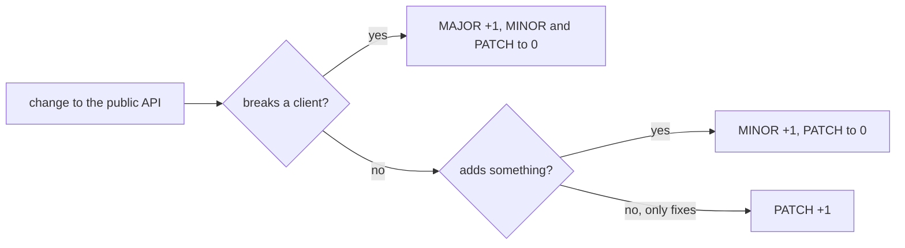

## Before you start

- [[devops.l2.tagging-images-by-commit]] — you know a `sha-` tag says which commit runs, but not which of two images is newer.
- [[backend.l2.api-versioning]] — you know a breaking change can ship under a new URL version such as `/api/v2` while `/api/v1` stays unchanged.

## The situation

The team behind `DonHang.App` asks you a plain question before each upgrade: "Can we move to the new API, or will our app break?" At stage-1 you can only answer with commit ids and a list of changes to read. Three changes are waiting: fixing a bug in cancelling orders, adding a price filter to `GET /api/v1/products`, and removing `POST /api/v1/auth/login`. A commit id cannot say which of these is safe for the app. What number could you give each release so that a client sees, at a glance, how careful the upgrade must be?

## Core concepts

- Public API — what clients are allowed to rely on, written down in code or documentation; for a web API such as Đơn Hàng's, the requests it accepts and the responses it promises.
- Backward compatible — a change after which every request still gets the response the public API promised; behavior the API never promised, such as a bug, does not count.
- **semantic versioning** — a numbering rule, MAJOR.MINOR.PATCH, where the part that goes up tells clients what kind of change a release contains.
- Version 0.y.z — the range for initial development, where anything may change at any time.

## How it works

In the situation above, each of the three changes maps to one part of the number, in the diagram's order. Under version 2.0.0 of the semantic versioning rules, MAJOR goes up for any breaking change to the public API, such as removing `POST /api/v1/auth/login`. MINOR goes up for backward-compatible additions, such as a new optional filter. PATCH goes up for backward-compatible bug fixes, such as making cancellation follow its intended rule: a client that relied on the bug relied on something the API never promised. A release that both adds and breaks is a MAJOR; the leftmost part that must change wins.

Raising a part resets the parts to its right. Raising MINOR sets PATCH to 0, and raising MAJOR sets both to 0. So after 1.4.2 the next release is 1.4.3, 1.5.0 or 2.0.0, leaving aside pre-release labels, which this lesson skips. Each part is a whole number compared as a number, so 1.10.0 comes after 1.9.0.

The numbers only mean something against a declared public API: one written down, so clients know what they may rely on. For Đơn Hàng that is its requests and responses. A release whose only changes are ones clients cannot see, such as renamed private code, still gets a new number, normally a PATCH.

Before 1.0.0 the promise is weaker. Versions 0.y.z are for initial development: anything may change at any time, and clients should not treat the API as stable. Version 1.0.0 is the release whose public API the team promises to keep; from then on every breaking change costs a MAJOR.

## In the Đơn Hàng system

At stage-1 Đơn Hàng's API has a sign-in endpoint, `POST /api/v1/auth/login`, product endpoints and order endpoints, all under `/api/v1`. At this point its image is only built on each machine, as `donhang-api:stage-1`; the `sha-` tags arrive with stage-2, and nothing states a product version for the API yet. The app team therefore has nothing better than a commit id and the changes to read one by one.

The `v1` in `/api/v1` is a different kind of version. It versions the URL contract, not the product. Many product releases can ship under `/api/v1`: after a 1.4.2, for example, a fix is 1.4.3 and a new filter 1.5.0, and the paths do not change.

The two numbers move independently. Adding `/api/v2` next to an unchanged `/api/v1` breaks no client, so for the product it is a new feature, a MINOR. The MAJOR comes when a release removes or changes something clients use, for example the day `/api/v1` itself is retired.

The release number is a promise made by people, not checked by any tool unless the team adds one. Whoever makes a release decides which part goes up, so the decision is only as good as their knowledge of what clients rely on.

## Beginners often think…

- **"After 1.9.0 the next minor version is 2.0.0, and 1.10.0 would be older than 1.9.0."** → Actually each part is a separate whole number, so MINOR goes from 9 to 10 and 1.10.0 is newer. You notice this when a list sorted as text puts 1.10.0 before 1.9.0.
- **"A MAJOR version bump means the release has big new features."** → Actually MAJOR means at least one change breaks a client, however small; a large feature that breaks nothing is a MINOR. You notice this when a 2.0.0 contains one removed endpoint and nothing else, and an app that used it stops working.
- **"The `v1` in `/api/v1` and the product's version must always change together."** → Actually the URL version changes only when a contract breaks, while the product version moves with every release. You notice this when the product reaches 1.5.0 and every path still says `/api/v1`.

## Try it (3 minutes)

The API is at 1.4.2. Three releases follow, one change each, in this order:

1. A fix: cancelling an order that has already shipped is now refused, as the order rules always intended.
2. An addition: `GET /api/v1/products` accepts an optional `maxPriceVnd` filter.
3. A removal: `POST /api/v1/auth/login` is deleted.

Write the version number of each release.

Expected result: three version numbers, each derived from the one before.

Suggested answer

1.4.3, then 1.5.0, then 2.0.0. The fix raises PATCH. The optional filter adds without breaking, so MINOR goes up and PATCH resets. Removing an endpoint breaks every client that calls it, so MAJOR goes up and both other parts reset to 0.

## Connections

- [[devops.l2.tagging-images-by-commit]] — the gap this lesson fills: a commit tag names code, a version number tells a client how risky the upgrade is.
- [[backend.l2.api-versioning]] — the URL version, which changes only for a break and moves independently of the product version.
- [[backend.l2.breaking-changes]] — what counts as breaking, and so when MAJOR must go up.
- [[devops.l2.changelog]] — next: where each version's changes are written down for the people who use them.

## Five-line summary

1. Semantic versioning numbers releases MAJOR.MINOR.PATCH so the part that goes up tells clients what kind of change came.
2. PATCH is a backward-compatible fix, MINOR a backward-compatible addition, MAJOR any breaking change to the public API.
3. Raising a part resets the parts to its right, and each part compares as a number, so 1.10.0 follows 1.9.0.
4. The numbers mean something only against a declared public API; 0.y.z promises nothing, 1.0.0 defines the API.
5. The `v1` in `/api/v1` versions the URL contract; many product releases can ship under it.
