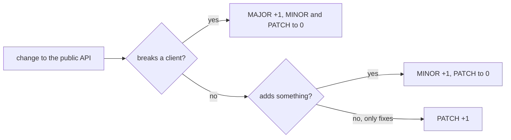

## Bạn cần biết trước

- [[devops.l2.tagging-images-by-commit]] — bạn biết tag `sha-` cho biết commit nào đang chạy, nhưng không cho biết image nào mới hơn.
- [[backend.l2.api-versioning]] — bạn biết một breaking change có thể ra dưới phiên bản URL mới như `/api/v2` trong khi `/api/v1` giữ nguyên.

## Tình huống

Nhóm làm `DonHang.App` hỏi bạn một câu đơn giản trước mỗi lần nâng cấp: "Bọn mình chuyển sang API mới được không, hay app sẽ hỏng?" Ở stage-1, bạn chỉ trả lời được bằng id commit và một danh sách thay đổi phải đọc. Có ba thay đổi đang chờ: sửa một lỗi khi hủy đơn, thêm bộ lọc giá cho `GET /api/v1/products`, và xóa `POST /api/v1/auth/login`. Id commit không cho biết thay đổi nào an toàn với app. Bạn có thể gắn con số nào cho mỗi bản phát hành để client nhìn qua là biết lần nâng cấp cần cẩn thận đến đâu?

## Khái niệm cốt lõi

- Public API — những gì client được phép dựa vào, được ghi ra trong code hoặc tài liệu; với một web API như của Đơn Hàng, đó là các request nó nhận và các response nó hứa trả về.
- Tương thích ngược — thay đổi mà sau đó mọi request vẫn nhận được response như public API đã hứa; hành vi API chưa từng hứa, như một lỗi, không tính.
- **semantic versioning** (quy ước MAJOR.MINOR.PATCH: PATCH sửa lỗi, MINOR thêm mà không phá, MAJOR có breaking change) — một quy tắc đánh số MAJOR.MINOR.PATCH, trong đó phần được tăng cho client biết bản phát hành chứa loại thay đổi gì.
- Phiên bản 0.y.z — khoảng dành cho giai đoạn phát triển ban đầu, khi mọi thứ có thể đổi bất cứ lúc nào.

## Cơ chế hoạt động

Trong tình huống trên, mỗi thay đổi ứng với một phần của con số, theo đúng thứ tự trong sơ đồ. Theo phiên bản 2.0.0 của bộ quy tắc semantic versioning, MAJOR tăng khi có bất kỳ breaking change nào với public API, như xóa `POST /api/v1/auth/login`. MINOR tăng khi thêm mà vẫn tương thích ngược, như một bộ lọc tùy chọn mới. PATCH tăng khi sửa lỗi mà vẫn tương thích ngược, như khiến việc hủy đơn theo đúng quy tắc dự định: client nào dựa vào lỗi là dựa vào thứ API chưa từng hứa. Một bản phát hành vừa thêm vừa phá là MAJOR; phần nằm bên trái nhất buộc phải đổi sẽ quyết định.

Tăng một phần thì các phần bên phải nó về 0. Tăng MINOR thì PATCH về 0, tăng MAJOR thì cả hai về 0. Vì vậy sau 1.4.2, bản kế tiếp là 1.4.3, 1.5.0 hoặc 2.0.0, chưa tính các nhãn tiền phát hành mà bài này bỏ qua. Mỗi phần là một số nguyên và được so như số, nên 1.10.0 đến sau 1.9.0.

Các con số chỉ có nghĩa khi so với một public API đã được khai báo: tức đã được ghi ra, để client biết mình được dựa vào gì. Với Đơn Hàng, đó là các request và response của nó. Một bản phát hành chỉ có những thay đổi client không thấy được, như đổi tên code nội bộ, vẫn nhận số mới, thường là một PATCH.

Trước 1.0.0, lời hứa yếu hơn. Các phiên bản 0.y.z dành cho giai đoạn phát triển ban đầu: mọi thứ có thể đổi bất cứ lúc nào, và client không nên coi API là ổn định. Phiên bản 1.0.0 là bản mà nhóm hứa giữ public API của nó; từ đó trở đi, mỗi breaking change đều phải trả bằng một lần tăng MAJOR.

## Trong hệ thống Đơn Hàng

Ở stage-1, API của Đơn Hàng có một endpoint đăng nhập, `POST /api/v1/auth/login`, các endpoint sản phẩm và đơn hàng, tất cả nằm dưới `/api/v1`. Lúc này image của nó chỉ được build trên từng máy, với tên `donhang-api:stage-1`; tag `sha-` đến stage-2 mới có, và chưa có gì nêu phiên bản sản phẩm cho API. Vì vậy nhóm app không có gì tốt hơn một id commit và danh sách thay đổi phải đọc từng cái.

`v1` trong `/api/v1` là một loại phiên bản khác. Nó đánh phiên bản cho hợp đồng URL, không phải cho sản phẩm. Nhiều bản phát hành sản phẩm có thể cùng nằm dưới `/api/v1`: chẳng hạn sau 1.4.2, một bản sửa lỗi là 1.4.3 và một bộ lọc mới là 1.5.0, còn đường dẫn không đổi.

Hai con số đi độc lập với nhau. Thêm `/api/v2` bên cạnh một `/api/v1` không đổi không làm hỏng client nào, nên với sản phẩm đó là tính năng mới, một MINOR. MAJOR đến khi một bản phát hành xóa hoặc đổi thứ client đang dùng, ví dụ ngày chính `/api/v1` bị gỡ bỏ.

Số phiên bản là lời hứa của con người, không công cụ nào kiểm tra trừ khi nhóm tự thêm. Người làm bản phát hành quyết định phần nào tăng, nên quyết định chỉ tốt bằng hiểu biết của họ về những gì client đang dựa vào.

## Người mới hay nghĩ rằng…

- **"Sau 1.9.0, bản minor kế tiếp là 2.0.0, và 1.10.0 sẽ cũ hơn 1.9.0."** → Thực ra mỗi phần là một số nguyên riêng, nên MINOR đi từ 9 lên 10 và 1.10.0 mới hơn. Bạn sẽ nhận ra khi một danh sách sắp xếp theo kiểu chữ đặt 1.10.0 trước 1.9.0.
- **"Tăng MAJOR nghĩa là bản phát hành có tính năng mới lớn."** → Thực ra MAJOR nghĩa là có ít nhất một thay đổi làm hỏng client, dù nhỏ đến đâu; một tính năng lớn không phá gì chỉ là MINOR. Bạn sẽ nhận ra khi một bản 2.0.0 chỉ có một endpoint bị xóa, và app nào dùng endpoint đó ngừng chạy.
- **"`v1` trong `/api/v1` và phiên bản sản phẩm luôn phải đổi cùng nhau."** → Thực ra phiên bản URL chỉ đổi khi hợp đồng bị phá, còn phiên bản sản phẩm đổi theo mỗi bản phát hành. Bạn sẽ nhận ra khi sản phẩm lên 1.5.0 mà mọi đường dẫn vẫn là `/api/v1`.

## Thử ngay (3 phút)

API đang ở 1.4.2. Tiếp theo là ba bản phát hành, mỗi bản một thay đổi, theo thứ tự:

1. Sửa lỗi: hủy một đơn đã giao giờ bị từ chối, đúng như quy tắc đơn hàng vẫn dự định.
2. Thêm: `GET /api/v1/products` nhận bộ lọc tùy chọn `maxPriceVnd`.
3. Xóa: `POST /api/v1/auth/login` bị xóa.

Viết số phiên bản của từng bản phát hành.

Kết quả mong đợi: ba số phiên bản, mỗi số suy ra từ số trước nó.

Gợi ý đáp án

1.4.3, rồi 1.5.0, rồi 2.0.0. Bản sửa lỗi tăng PATCH. Bộ lọc tùy chọn thêm mà không phá, nên MINOR tăng và PATCH về 0. Xóa một endpoint làm hỏng mọi client gọi nó, nên MAJOR tăng và hai phần còn lại về 0.

## Liên hệ

- [[devops.l2.tagging-images-by-commit]] — khoảng trống bài này lấp: tag theo commit chỉ ra code, còn số phiên bản cho client biết lần nâng cấp rủi ro ra sao.
- [[backend.l2.api-versioning]] — phiên bản URL, chỉ đổi khi có thay đổi phá vỡ và đi độc lập với phiên bản sản phẩm.
- [[backend.l2.breaking-changes]] — thế nào là phá vỡ, và vì thế khi nào MAJOR phải tăng.
- [[devops.l2.changelog]] — bài kế: nơi ghi lại thay đổi của từng phiên bản cho những người dùng nó.

## Tóm tắt 5 dòng

1. Semantic versioning đánh số bản phát hành theo MAJOR.MINOR.PATCH để phần được tăng cho client biết loại thay đổi nào vừa đến.
2. PATCH là bản sửa lỗi tương thích ngược, MINOR là phần thêm tương thích ngược, MAJOR là bất kỳ breaking change nào với public API.
3. Tăng một phần thì các phần bên phải về 0, và mỗi phần được so như số, nên 1.10.0 đến sau 1.9.0.
4. Các con số chỉ có nghĩa khi so với một public API đã khai báo; 0.y.z không hứa gì, 1.0.0 định nghĩa API.
5. `v1` trong `/api/v1` đánh phiên bản cho hợp đồng URL; nhiều bản phát hành sản phẩm có thể nằm dưới nó.
