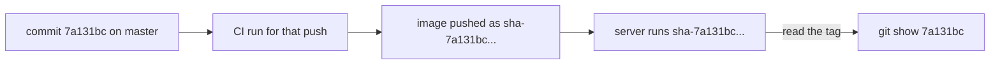

## Before you start

- [[devops.l2.pushing-images-from-ci]] — you know the `publish` job pushes Đơn Hàng's images to `ghcr.io` after `test` and `image` pass on `master`.
- [[foundation.l2.git-mental-model]] — you know a commit id is computed from the commit's content, so it names exactly one snapshot.

## The situation

A customer reports that cancelling an order returns the wrong error on the test server. You want to read the code that is running there. If the server ran `ghcr.io/duyan11110/donhang-api:master`, the name would only say "some commit that was on `master` once". With `latest` it would say even less. The team argues about tagging by branch, by build date or not at all, and about how to send the server back if a fix makes things worse. What should a tag on Đơn Hàng's image say, and what can it not say?

## Core concepts

- Commit tag — an image tag made from the id of the commit the image was built from; in Đơn Hàng, `sha-` followed by the full 40-character id.
- Moving tag — a tag such as `master` or `latest` that is pushed again and again, pointing at a new image each time.
- Write-once tag — a tag the team pushes once and never pushes again, so it keeps naming the same image.
- Deploying by tag — telling a machine which image to run by its full name and tag, so the tag records what runs there.

## How it works



In the situation above, Đơn Hàng's image on the test server is named by a commit tag. Each push to `master` starts one CI run, and its `publish` job pushes both images as `sha-` followed by the id of the push's last commit. So the tag on a running image leads straight back to the commit, and `git show` with that id shows the exact code.

A branch name cannot do this. `master` moves with every push, so a tag named `master` would move too, and two servers that both run `:master` could be running different code. A commit id never moves: it names one snapshot.

Each push to `master` that passes `test` and `image` is built and pushed once, so in practice a `sha-` tag is written once and keeps naming the same image. Commits in the middle of a push get no image of their own; only the last one does. That is Đơn Hàng's convention, not a rule the registry enforces. If someone re-ran the workflow for that commit, the `image` job would build again; a rebuild is a separate image, and the push would move the tag to it.

Đơn Hàng never pushes `latest`, so no deployment can name it. A deployment names a tag that is written once and leads to one commit, here a `sha-` tag; the version tag in this module's last lesson works the same way. Going back means naming the tag that ran before; the image is still in the registry under that name.

One thing a commit id cannot say is order. `sha-7a131bc…` and `sha-bb18424…` tell you nothing about which is newer, or whether one breaks clients of the other. A build date would give order but not the code. People and client apps need a version number for that.

## In the Đơn Hàng system

The step in `publish` that names the images:

```yaml file=.github/workflows/ci.yml tag=stage-2 lines=154-166
      # lesson: devops.l2.tagging-images-by-commit
      # sha- and the full id of the commit that was pushed, 40 characters:
      # every image in the registry leads back to the code that built it.
      # docker tag only adds a name to the loaded image; it builds nothing.
      # Never `latest`: a deployment always names the commit it runs.
      - name: Tag the images with this commit and push them
        run: |
          api="ghcr.io/duyan11110/donhang-api:sha-$GITHUB_SHA"
          migrate="ghcr.io/duyan11110/donhang-migrate:sha-$GITHUB_SHA"
          docker tag donhang-api:stage-2 "$api"
          docker tag donhang-migrate:stage-2 "$migrate"
          docker push "$api"
          docker push "$migrate"
```

`GITHUB_SHA` holds the id of the last commit the push brought to `master`, all 40 characters. Both images of one commit get the same tag, so the API image and its migrations image can always be matched. Nothing in `ci.yml` pushes any other tag; a separate release workflow adds version tags, as this module's last lesson shows.

The registry shows the result. `donhang-api` holds `sha-` tags, one per `master` push that `publish` completed, plus one such version tag, and no `latest` or `master`. Asking for `ghcr.io/duyan11110/donhang-api:latest` fails with "not found".

## Beginners often think…

- **"Tagging the image with the branch name, like `master`, tells you which code is running."** → Actually a branch moves with every push, so a tag named after it moves too and names a different image after each push. You notice this when two servers both run `:master` and behave differently.
- **"`latest` is the safest tag to deploy, because it is always up to date."** → Actually `latest` is just the last image pushed under that name, and a deployment that names it cannot tell you which commit runs or how to go back. You notice this when you need the previous version and nothing records what "latest" pointed to yesterday.

## Try it (3 minutes)

In your Đơn Hàng folder, in Git Bash:

1. Run `git log -1 --format=%H stage-2` and copy the id; `%H` prints the full 40-character id.
2. Run `docker buildx imagetools inspect ghcr.io/duyan11110/donhang-api:sha-` followed directly by that id, with no space.
3. Run `docker buildx imagetools inspect ghcr.io/duyan11110/donhang-api:latest`.

Expected result: step 1 prints `7a131bc83612d30c266e066c85e28f26bd7dc60d`. Step 2 finds the image and prints its `Digest:`. Step 3 fails with "not found": Đơn Hàng never pushed `latest`.

<details><summary>Suggested answer</summary>

The commit marked `stage-2` gave the image its tag, so the step from the tag back to the code is one `git show`. `latest` does not exist, so no machine can run "whatever was pushed last" by accident.

</details>

## Connections

- [[devops.l2.pushing-images-from-ci]] — prerequisite: the `publish` job whose last step adds these names.
- [[foundation.l2.git-mental-model]] — the commit id the tag carries, and why it names one snapshot.
- [[devops.l2.image-tags-and-digests]] — why a tag can move at all, and why the write-once rule is a convention.
- [[devops.l2.semantic-versioning]] — next: the version number that says what a commit id cannot.

## Five-line summary

1. Đơn Hàng tags each image it pushes as `sha-` plus the full id of the commit, so a running image leads back to its code.
2. A branch name like `master` moves with every push; a commit id names one snapshot.
3. Each green `master` push is pushed once, so a `sha-` tag names one image by convention; a re-run could still move it.
4. Đơn Hàng never pushes `latest`: a deployment names a write-once tag, and going back names the one before.
5. A commit id does not say which version is newer; that takes a version number.
