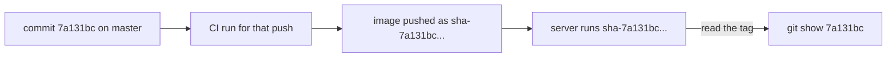

## Bạn cần biết trước

- [[devops.l2.pushing-images-from-ci]] — bạn biết job `publish` push image của Đơn Hàng lên `ghcr.io` sau khi `test` và `image` qua trên `master`.
- [[foundation.l2.git-mental-model]] — bạn biết id của commit được tính từ nội dung commit, nên nó chỉ đúng một snapshot.

## Tình huống

Một khách hàng báo rằng hủy đơn trên server test trả về sai lỗi. Bạn muốn đọc code đang chạy ở đó. Nếu server chạy `ghcr.io/duyan11110/donhang-api:master`, cái tên chỉ nói được "một commit nào đó từng nằm trên `master`". Với `latest` thì nó còn nói ít hơn nữa. Nhóm tranh luận nên gắn tag theo nhánh, theo ngày build hay không gắn gì, và làm sao đưa server quay lại nếu bản sửa làm mọi thứ tệ hơn. Tag trên image của Đơn Hàng nên nói điều gì, và nó không nói được điều gì?

## Khái niệm cốt lõi

- Tag theo commit — tag image tạo từ id của commit đã build ra image; ở Đơn Hàng là `sha-` theo sau là id đầy đủ 40 ký tự.
- Tag di động — tag như `master` hay `latest`, được push đi push lại, mỗi lần trỏ tới một image mới.
- Tag ghi một lần — tag mà nhóm push một lần và không bao giờ push lại, nên nó luôn chỉ cùng một image.
- Deploy theo tag — chỉ cho một máy biết chạy image nào bằng tên đầy đủ kèm tag, để tag ghi lại thứ đang chạy ở đó.

## Cơ chế hoạt động



Trong tình huống trên, image trên server test của Đơn Hàng được đặt tên bằng tag theo commit. Mỗi lần push lên `master` khởi động một lần chạy CI, và job `publish` của nó push cả hai image với tag `sha-` theo sau là id của commit cuối cùng trong lần push. Vì vậy tag trên một image đang chạy dẫn thẳng về commit, và `git show` với id đó cho thấy đúng code.

Tên nhánh không làm được điều này. `master` dời theo mỗi lần push, nên tag tên `master` cũng dời theo, và hai server cùng chạy `:master` có thể đang chạy code khác nhau. Id commit thì không bao giờ dời: nó chỉ một snapshot.

Mỗi lần push lên `master` qua được `test` và `image` được build và push một lần, nên trên thực tế một tag `sha-` chỉ được ghi một lần và luôn chỉ cùng một image. Những commit nằm giữa một lần push không có image riêng; chỉ commit cuối có. Đây là quy ước của Đơn Hàng, không phải luật registry ép buộc. Nếu ai đó chạy lại workflow cho commit đó, job `image` sẽ build lại; bản build lại là một image khác, và lần push sẽ dời tag sang nó.

Đơn Hàng không bao giờ push `latest`, nên không lần deploy nào ghi được tên đó. Một lần deploy ghi một tag được ghi một lần và dẫn về đúng một commit, ở đây là tag `sha-`; tag phiên bản trong bài cuối của module này cũng hoạt động như vậy. Quay lại nghĩa là ghi tag đã chạy trước đó; image vẫn nằm trên registry dưới tên ấy.

Có một điều id commit không nói được, đó là thứ tự. `sha-7a131bc…` và `sha-bb18424…` không cho bạn biết cái nào mới hơn, hay cái này có làm hỏng client của cái kia không. Ngày build thì cho thứ tự nhưng không chỉ ra code. Con người và ứng dụng client cần một số phiên bản cho việc đó.

## Trong hệ thống Đơn Hàng

Bước trong `publish` đặt tên cho các image:

```yaml file=.github/workflows/ci.yml tag=stage-2 lines=154-166
      # lesson: devops.l2.tagging-images-by-commit
      # sha- and the full id of the commit that was pushed, 40 characters:
      # every image in the registry leads back to the code that built it.
      # docker tag only adds a name to the loaded image; it builds nothing.
      # Never `latest`: a deployment always names the commit it runs.
      - name: Tag the images with this commit and push them
        run: |
          api="ghcr.io/duyan11110/donhang-api:sha-$GITHUB_SHA"
          migrate="ghcr.io/duyan11110/donhang-migrate:sha-$GITHUB_SHA"
          docker tag donhang-api:stage-2 "$api"
          docker tag donhang-migrate:stage-2 "$migrate"
          docker push "$api"
          docker push "$migrate"
```

`GITHUB_SHA` chứa id của commit cuối cùng mà lần push đưa lên `master`, đủ 40 ký tự. Hai image của cùng một commit mang cùng một tag, nên image API và image migration của nó luôn ghép đúng được với nhau. Không chỗ nào trong `ci.yml` push tag khác; một workflow phát hành riêng thêm tag phiên bản, như bài cuối của module này sẽ cho thấy.

Registry cho thấy kết quả. `donhang-api` giữ các tag `sha-`, mỗi tag cho một lần push lên `master` mà `publish` đã chạy xong, cộng một tag phiên bản như vậy, và không có `latest` hay `master`. Hỏi `ghcr.io/duyan11110/donhang-api:latest` sẽ lỗi "not found".

## Người mới hay nghĩ rằng…

- **"Gắn tag image bằng tên nhánh, như `master`, cho biết code nào đang chạy."** → Thực ra nhánh dời theo mỗi lần push, nên tag đặt theo tên nhánh cũng dời và chỉ một image khác sau mỗi lần push. Bạn sẽ nhận ra khi hai server cùng chạy `:master` mà hành xử khác nhau.
- **"`latest` là tag an toàn nhất để deploy, vì nó luôn mới."** → Thực ra `latest` chỉ là image được push lần cuối dưới tên đó, và một lần deploy ghi tên này không cho biết commit nào đang chạy hay quay lại bằng cách nào. Bạn sẽ nhận ra khi cần bản trước đó mà không gì ghi lại hôm qua "latest" trỏ tới đâu.

## Thử ngay (3 phút)

Trong thư mục Đơn Hàng, mở Git Bash:

1. Chạy `git log -1 --format=%H stage-2` và chép id; `%H` in ra id đầy đủ 40 ký tự.
2. Chạy `docker buildx imagetools inspect ghcr.io/duyan11110/donhang-api:sha-` theo sau là id đó, viết liền, không có dấu cách.
3. Chạy `docker buildx imagetools inspect ghcr.io/duyan11110/donhang-api:latest`.

Kết quả mong đợi: bước 1 in ra `7a131bc83612d30c266e066c85e28f26bd7dc60d`. Bước 2 tìm thấy image và in `Digest:` của nó. Bước 3 lỗi "not found": Đơn Hàng chưa từng push `latest`.

<details><summary>Gợi ý đáp án</summary>

Commit được đánh dấu `stage-2` đã cho image tag của nó, nên từ tag quay về code chỉ cần một lệnh `git show`. `latest` không tồn tại, nên không máy nào vô tình chạy "thứ được push gần nhất".

</details>

## Liên hệ

- [[devops.l2.pushing-images-from-ci]] — điều kiện tiên quyết: job `publish` mà bước cuối của nó thêm các tên này.
- [[foundation.l2.git-mental-model]] — id commit mà tag mang theo, và vì sao nó chỉ một snapshot.
- [[devops.l2.image-tags-and-digests]] — vì sao tag có thể dời, và vì sao quy tắc ghi một lần chỉ là quy ước.
- [[devops.l2.semantic-versioning]] — bài kế: số phiên bản nói được điều mà id commit không nói được.

## Tóm tắt 5 dòng

1. Đơn Hàng gắn tag cho mỗi image nó push là `sha-` cộng id đầy đủ của commit, nên image đang chạy dẫn ngược về code của nó.
2. Tên nhánh như `master` dời theo mỗi lần push; id commit chỉ một snapshot.
3. Mỗi lần push xanh lên `master` được push một lần, nên theo quy ước một tag `sha-` chỉ một image; chạy lại vẫn có thể dời nó.
4. Đơn Hàng không bao giờ push `latest`: một lần deploy ghi một tag ghi một lần, và quay lại là ghi tag trước đó.
5. Id commit không cho biết phiên bản nào mới hơn; việc đó cần một số phiên bản.
