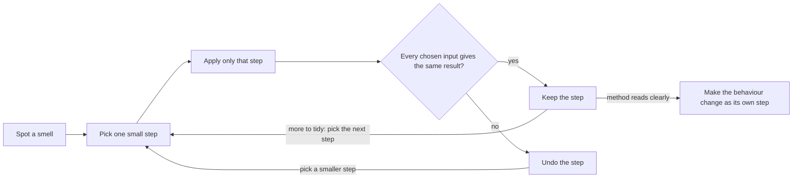

## Before you start

- [[foundation.l1.small-functions]] — you saw that moving lines into a named function is safe, while rewriting them on the way is a second change that needs its own check. This lesson turns that rule into a routine for tidying code that already works.

## The situation

You are asked to give loyal customers free shipping in Đơn Hàng, so you open `Smells.ShippingVnd`, where the shipping rule lives. It already takes a parameter called `loyal`, but nothing in the method reads it. Some prices sit four `if` statements deep, the same two lines appear twice, and a comment says "charge 30000" while the line under it can return 60000. Numbers such as 2000000 appear with no word saying what they are. No test covers the method, so nothing will warn you if an edit shifts a price. Which of these oddities matter, and how do you reshape the method without changing any price it returns today?

## Core concepts

- **code smell** — a sign you can see on the surface of code, such as a repeated block or an unexplained number, that points at a deeper design problem without saying what that problem is.
- magic number — a value written straight into the code, like `2000000`, with no name to say what it means.
- **refactoring** — changing the structure of code without changing its behaviour, in steps small enough that each one is obviously safe.
- safety net — what you do after every step to confirm the inputs you chose still give the same results. When tests exist — code in the project that calls the method with fixed inputs and reports any result that differs — you run them; otherwise you trace a few chosen inputs by hand.

## How it works



Every oddity you listed in the code is a code smell; the missing test is not a smell but the reason your safety net has to be a hand trace. You spotted each by reading; none alone shows that a price is wrong, but each gives you a place to look. The repeated pair of lines asks whether the check between them, which you will see in the code below, matters; the unread `loyal` asks whether a rule was planned and never written.

Then the loop in the diagram starts. You pick one step small enough that reading it shows it is safe, apply only that step, and check. If every chosen input still gives the same result, you keep the step. If any result moved, the step changed behaviour, so it was not refactoring; you undo it instead of adding edits on top to fix the result, then try again with a smaller step.

The safety net keeps the loop safe. With tests, you run them after each step. `ShippingVnd` has none at stage-0, the state of the Đơn Hàng repository this lesson uses, so you check by hand. Before the first step, choose inputs that between them reach every `return` in the method below and both sides of every `? :`, with totals just below and at `2000000`; write down each price and trace them again after every step. A hand check only works for a change you can hold in your head, so steps stay tiny.

When the method reads clearly, you leave the loop and add the loyal rule as its own step, whose check expects some prices to change. Tidying first pays off when you are about to read and edit the method anyway.

## In the Đơn Hàng system

The shipping rule, with all five of this lesson's smells, is one method in the samples project.

```csharp file=samples/DonHang.Samples/Samples/Clean/Smells.cs tag=stage-0 lines=8-30
    public static int ShippingVnd(
        int totalVnd, bool express, bool loyal, bool pickUp, string city, int weightGram)
    {
        if (!pickUp)
        {
            if (city == "Hà Nội" || city == "Hồ Chí Minh")
            {
                if (weightGram < 5000)
                {
                    // charge 30000 unless the total reaches 2000000
                    if (totalVnd < 2000000) return express ? 60000 : 30000;
                    return express ? 60000 : 0;
                }

                if (totalVnd < 2000000) return express ? 60000 : 30000;
                return express ? 60000 : 0;
            }

            return express ? 90000 : 45000;
        }

        return 0;
    }
```

Here are the five smells, by the file's line numbers: the block above starts at line 8, so its first line is line 8 and its last is line 30. Line 9 is a long parameter list: six inputs, each one more value a caller or a test must set up. The unread `loyal` is a smell of its own, not one of this lesson's five; you leave it for your rule. Every price and limit in the body is a magic number. No name in the code says that `2000000` is the order total from which standard shipping to Hà Nội and Hồ Chí Minh is free; only the comment on line 17 hints at it.

That comment repeats the code, and it is already incomplete: it mentions 30000 but not the 60000 of express, and the compiler builds nothing from a `//` comment, so nothing notices. The first prices are returned inside four nested `if` statements, the nesting that guard clauses avoid, as in the previous lesson.

The two `if (totalVnd < 2000000) return express ? 60000 : 30000;` lines, each with a `return express ? 60000 : 0;` under it (lines 18–19 and 22–23), are duplicated code, identical apart from indentation. That duplicate points at the deepest problem. Whichever way the weight check on line 15 goes, the same two lines run, so `weightGram` never changes the price.

Maybe the weight rule was meant to differ; maybe the check was never needed and can go. The smell cannot tell you which, and refactoring does not decide it either: that is a behaviour question for whoever owns the shipping rule.

Three refactorings, each followed by the hand check before the next:

1. Return early for pick-up. Move the pick-up case to the top as a guard clause that returns `0`. Everything below loses one level of nesting, and a pick-up order still costs `0`.
2. Remove the duplicate. Delete lines 15–20: the weight check, the comment and the first copy. For weights under 5000, the identical lines 22–23 now run instead of 18–19, so every price stays the same.
3. Name the numbers. Give `2000000` and each price a name that says what it is. A named constant with the same value changes no result.

The long parameter list remains, and after step 2 `weightGram` is unread too. `loyal` stays: your rule is about to read it.

## Beginners often think…

- **"Refactoring means rewriting the module properly."** → Actually refactoring is a chain of small steps that each leave every result unchanged. A rewrite changes many lines at once, so when a price comes out wrong afterwards, the check shows that a price moved but not which edit moved it. You notice this when a "cleanup" touches most of a method and a result that was right before is now wrong, with no single line to blame.
- **"If it works, touching it is only risk."** → Actually leaving it has a cost too: every smell stays in the way of the next person who must change the method. With the duplicate in `ShippingVnd`, a new free-shipping limit has to be typed in two places, and missing one makes parcels under 5000 grams and parcels from 5000 grams up disagree. You notice this when two copies of what should be one rule give different answers. The risk of touching code is real, which is why you tidy code you are about to change anyway, one checked step at a time.

## Try it (3 minutes)

1. In a bash shell at the root of the Đơn Hàng repository, run `grep -c ShippingVnd samples/DonHang.Samples.Tests/SamplesTests.cs`. `grep -c` prints how many lines of the file contain the word.
2. Run it again with `PlaceOrderSplit`, the class the previous lesson split into smaller functions, in place of `ShippingVnd`.

Expected result: the first command prints `0` and the second prints `2`. `SamplesTests.cs` holds every test in the test project at stage-0, and two of its tests call `PlaceOrderSplit.Place`, so the split in the previous lesson had tests. Tests report a moved result only on the inputs they actually run, so having them is not the same as checking every input. `ShippingVnd` has none at all, so every step you take on it must be small enough to check by hand.

## Connections

- [[foundation.l1.small-functions]] — returning early and moving lines without rewriting them come from there; this lesson adds the check after every step that keeps such moves safe.
- [[foundation.l1.naming]] — the fix for the comment smell: a name that says what the comment was trying to say.
- [[foundation.l1.oop-polymorphism]] — the same Hà Nội and Hồ Chí Minh standard and express prices and the pick-up price, written as one class per kind of shipping beside `ShippingFee`, a shipping class in the samples project that takes only the total, with tests already checking them.
- [[design.l1.unit-test-first-look]] — the next step after this lesson: unit tests, the tests described in Core concepts, of the kind `ShippingVnd` lacks at stage-0; with them, a command replaces the hand trace.

## Five-line summary

1. Refactoring changes the structure of code without changing its behaviour, one small checked step at a time, and code smells show where to start.
2. This lesson's five smells are duplicated code, long parameter lists, comments that repeat the code, magic numbers and deep nesting.
3. A smell points at a design problem without naming it: the duplicate in `ShippingVnd` hides that weight never changes the price.
4. After each step, tests or a hand trace of chosen inputs must show every result unchanged; without tests, keep the steps tiny.
5. Refactor code you are about to change anyway, then make the behaviour change as its own step.
