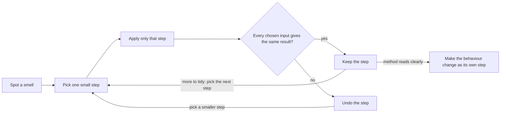

## Bạn cần biết trước

- [[foundation.l1.small-functions]] — bạn đã thấy chuyển các dòng vào một hàm có tên là an toàn, còn viết lại chúng trong lúc chuyển là một thay đổi thứ hai, cần được kiểm tra riêng. Bài này biến quy tắc đó thành một quy trình để dọn gọn code đang chạy đúng.

## Tình huống

Bạn được giao miễn phí vận chuyển cho khách hàng thân thiết trong Đơn Hàng, nên bạn mở `Smells.ShippingVnd`, nơi chứa quy tắc tính phí vận chuyển. Phương thức này đã có sẵn tham số `loyal`, nhưng không dòng nào trong đó đọc nó. Có những mức giá nằm sâu dưới bốn lớp `if`, cùng một cặp dòng xuất hiện hai lần, và một comment ghi "charge 30000" trong khi dòng ngay bên dưới có thể trả về 60.000. Những con số như 2.000.000 xuất hiện mà không có chữ nào nói chúng là gì. Không có test nào cho phương thức này, nên nếu một lần sửa làm lệch một mức giá, sẽ chẳng có gì báo cho bạn. Trong những điểm lạ này, điểm nào đáng lo, và làm sao sắp xếp lại phương thức mà không đổi bất kỳ mức giá nào nó đang trả về hôm nay?

## Khái niệm cốt lõi

- **code smell** (dấu hiệu bề mặt cho thấy code có vấn đề thiết kế sâu hơn: hàm dài, tham số nhiều, trùng lặp) — dấu hiệu bạn nhìn thấy ngay trên bề mặt code, như một khối lặp lại hay một con số không giải thích, chỉ về một vấn đề thiết kế sâu hơn mà không nói vấn đề đó là gì.
- magic number — một giá trị viết thẳng vào code, như `2000000`, không có tên nào nói nó mang nghĩa gì.
- **refactoring** (sửa cấu trúc code mà không đổi hành vi, từng bước nhỏ, có test bảo vệ) — thay đổi cấu trúc của code mà không thay đổi hành vi của nó, theo từng bước đủ nhỏ để bước nào cũng thấy rõ là an toàn.
- lưới an toàn — thứ bạn làm sau mỗi bước để xác nhận các đầu vào đã chọn vẫn cho ra đúng kết quả cũ. Khi đã có test, tức code trong project gọi phương thức với các đầu vào cố định và báo mọi kết quả bị lệch, bạn chạy test. Nếu không có, bạn tự dò tay vài đầu vào đã chọn.

## Cơ chế hoạt động



Mỗi điểm lạ bạn liệt kê trong code là một code smell. Chuyện thiếu test không phải smell, nhưng chính vì thiếu test mà lưới an toàn ở đây phải là dò tay. Bạn phát hiện từng smell bằng cách đọc. Riêng một smell không chứng minh mức giá nào sai, nhưng smell nào cũng cho bạn một chỗ để nhìn vào. Cặp dòng lặp lại đặt câu hỏi phép kiểm tra nằm giữa chúng, mà bạn sẽ thấy trong code bên dưới, có ý nghĩa gì không. Tham số `loyal` không ai đọc đặt câu hỏi có phải một quy tắc đã được dự tính rồi không bao giờ được viết ra.

Sau đó vòng lặp trong sơ đồ bắt đầu. Bạn chọn một bước đủ nhỏ để chỉ cần đọc là thấy nó an toàn, áp dụng đúng bước đó, rồi kiểm tra. Nếu mọi đầu vào đã chọn vẫn cho cùng kết quả, bạn giữ bước đó. Nếu có kết quả nào lệch, bước đó đã đổi hành vi, nên nó không phải refactoring. Bạn hoàn tác nó thay vì sửa chồng thêm cho kết quả khớp lại, rồi thử lại với một bước nhỏ hơn.

Lưới an toàn giữ cho vòng lặp an toàn. Có test thì bạn chạy test sau mỗi bước. `ShippingVnd` không có test nào ở stage-0, trạng thái của repository Đơn Hàng mà bài này dùng, nên bạn kiểm tra bằng tay. Trước bước đầu tiên, hãy chọn các đầu vào mà gộp lại chạm tới mọi `return` trong phương thức bên dưới và cả hai nhánh của mọi `? :`, với tổng tiền ngay dưới `2000000` và đúng bằng `2000000`. Ghi lại từng mức giá, rồi dò lại chúng sau mỗi bước. Kiểm tra bằng tay chỉ hiệu quả với thay đổi bạn giữ được trong đầu, nên các bước phải thật nhỏ.

Khi phương thức đã dễ đọc, bạn rời vòng lặp và thêm quy tắc cho khách thân thiết thành một bước riêng, với phép kiểm tra chờ đợi một số mức giá thay đổi. Dọn gọn trước là đáng công khi dù sao bạn cũng sắp đọc và sửa phương thức đó.

## Trong hệ thống Đơn Hàng

Quy tắc tính phí vận chuyển, mang đủ năm smell của bài này, là một phương thức trong project samples.

```csharp file=samples/DonHang.Samples/Samples/Clean/Smells.cs tag=stage-0 lines=8-30
    public static int ShippingVnd(
        int totalVnd, bool express, bool loyal, bool pickUp, string city, int weightGram)
    {
        if (!pickUp)
        {
            if (city == "Hà Nội" || city == "Hồ Chí Minh")
            {
                if (weightGram < 5000)
                {
                    // charge 30000 unless the total reaches 2000000
                    if (totalVnd < 2000000) return express ? 60000 : 30000;
                    return express ? 60000 : 0;
                }

                if (totalVnd < 2000000) return express ? 60000 : 30000;
                return express ? 60000 : 0;
            }

            return express ? 90000 : 45000;
        }

        return 0;
    }
```

Đây là năm smell, theo số dòng của file: khối trên bắt đầu ở dòng 8, nên dòng đầu là dòng 8 và dòng cuối là dòng 30. Dòng 9 là danh sách tham số dài: sáu đầu vào, mỗi cái là thêm một giá trị mà bên gọi hoặc test phải chuẩn bị. Tham số `loyal` không ai đọc cũng là một smell, nhưng không thuộc năm smell của bài này. Bạn để nó lại cho quy tắc của mình. Mọi mức giá và ngưỡng trong thân phương thức đều là magic number. Không tên nào trong code nói rằng `2000000` là tổng tiền đơn mà từ đó giao hàng tiêu chuẩn tới Hà Nội và Hồ Chí Minh được miễn phí. Chỉ có comment ở dòng 17 gợi ý điều đó.

Comment đó lặp lại code, và nó đã thiếu sót: nó nhắc 30000 nhưng không nhắc 60000 của giao nhanh, và compiler không dựng gì từ một comment `//`, nên chẳng có gì phát hiện ra. Những mức giá đầu tiên được trả về bên trong bốn lớp `if` lồng nhau, đúng kiểu lồng sâu mà guard clause tránh được, như ở bài trước.

Hai dòng `if (totalVnd < 2000000) return express ? 60000 : 30000;`, mỗi dòng có một dòng `return express ? 60000 : 0;` bên dưới (dòng 18–19 và 22–23), là code trùng lặp, giống hệt nhau ngoài phần thụt lề. Chính chỗ trùng lặp này chỉ về vấn đề sâu nhất. Phép kiểm tra cân nặng ở dòng 15 đi theo nhánh nào thì hai dòng giống nhau vẫn chạy, nên `weightGram` không bao giờ làm đổi mức giá.

Có thể quy tắc theo cân nặng vốn được định là khác đi. Cũng có thể phép kiểm tra đó chưa bao giờ cần và bỏ được. Smell không cho bạn biết là trường hợp nào, và refactoring cũng không quyết định chuyện đó: đó là câu hỏi về hành vi, dành cho người chịu trách nhiệm về quy tắc phí vận chuyển.

Ba bước refactoring, mỗi bước đi kèm lần dò tay trước khi sang bước tiếp:

1. Trả về sớm cho trường hợp tự đến lấy hàng. Đưa trường hợp pick-up lên đầu thành một guard clause trả về `0`. Mọi thứ bên dưới bớt một lớp lồng, và đơn tự đến lấy vẫn tốn `0`.
2. Xóa chỗ trùng lặp. Xóa dòng 15–20: phép kiểm tra cân nặng, comment và bản sao thứ nhất. Với cân nặng dưới 5000, hai dòng giống hệt 22–23 giờ chạy thay cho 18–19, nên mọi mức giá giữ nguyên.
3. Đặt tên cho các con số. Cho `2000000` và từng mức giá một cái tên nói rõ nó là gì. Một hằng số có tên mang cùng giá trị không đổi kết quả nào.

Danh sách tham số dài vẫn còn, và sau bước 2 thì `weightGram` cũng không còn ai đọc. `loyal` được giữ lại: quy tắc của bạn sắp đọc nó.

## Người mới hay nghĩ rằng…

- **"Refactoring nghĩa là viết lại module cho tử tế."** → Thực ra refactoring là một chuỗi bước nhỏ, bước nào cũng để mọi kết quả y như cũ. Viết lại thì đổi nhiều dòng cùng lúc, nên khi sau đó một mức giá ra sai, phép kiểm tra cho thấy có giá bị lệch nhưng không cho biết lần sửa nào làm lệch. Bạn sẽ nhận ra khi một lần "dọn dẹp" động vào gần hết một phương thức, và một kết quả trước đó đúng giờ lại sai, mà không có dòng nào để quy trách nhiệm.
- **"Code đang chạy thì động vào chỉ thêm rủi ro."** → Thực ra để nguyên cũng có giá: smell nào còn đó cũng cản đường người tiếp theo phải sửa phương thức. Với chỗ trùng lặp trong `ShippingVnd`, một ngưỡng miễn phí vận chuyển mới phải gõ ở hai nơi, và sót một nơi là kiện dưới 5.000 gram với kiện từ 5.000 gram trở lên cho kết quả khác nhau. Bạn sẽ nhận ra khi hai bản sao của thứ lẽ ra là một quy tắc lại cho hai câu trả lời khác nhau. Rủi ro khi động vào code là có thật, nên bạn chỉ dọn code mà dù sao bạn cũng sắp sửa, từng bước một, có kiểm tra.

## Thử ngay (3 phút)

1. Trong một bash shell ở thư mục gốc của repository Đơn Hàng, chạy `grep -c ShippingVnd samples/DonHang.Samples.Tests/SamplesTests.cs`. `grep -c` in ra số dòng trong file có chứa từ đó.
2. Chạy lại lệnh, thay `ShippingVnd` bằng `PlaceOrderSplit`, class mà bài trước đã tách thành các hàm nhỏ hơn.

Kết quả mong đợi: lệnh thứ nhất in `0` và lệnh thứ hai in `2`. `SamplesTests.cs` chứa mọi test trong test project ở stage-0, và hai test trong đó gọi `PlaceOrderSplit.Place`, nên lần tách hàm ở bài trước đã có test. Test chỉ báo kết quả bị lệch trên những đầu vào mà nó thực sự chạy, nên có test không đồng nghĩa với đã kiểm tra mọi đầu vào. `ShippingVnd` thì không có test nào, nên mọi bước bạn làm trên nó đều phải đủ nhỏ để kiểm tra bằng tay.

## Liên hệ

- [[foundation.l1.small-functions]] — trả về sớm và chuyển dòng mà không viết lại đều đến từ bài đó. Bài này thêm phép kiểm tra sau mỗi bước, thứ giữ cho những lần chuyển như vậy an toàn.
- [[foundation.l1.naming]] — cách chữa smell comment: một cái tên nói được điều mà comment đang cố nói.
- [[foundation.l1.oop-polymorphism]] — cùng các mức giá giao tiêu chuẩn và giao nhanh tới Hà Nội, Hồ Chí Minh và mức giá tự đến lấy, được viết thành mỗi loại giao hàng một class bên cạnh `ShippingFee`, một class phí vận chuyển trong project samples chỉ nhận tổng tiền, và đã có test kiểm tra chúng.
- [[design.l1.unit-test-first-look]] — bước tiếp theo sau bài này: unit test, loại test đã mô tả ở mục Khái niệm cốt lõi, đúng loại mà `ShippingVnd` còn thiếu ở stage-0. Có chúng rồi, một lệnh sẽ thay cho lần dò tay.

## Tóm tắt 5 dòng

1. Refactoring đổi cấu trúc code mà không đổi hành vi, từng bước nhỏ có kiểm tra, và code smell chỉ cho bạn chỗ bắt đầu.
2. Năm smell của bài này là code trùng lặp, danh sách tham số dài, comment lặp lại code, magic number và lồng sâu.
3. Smell chỉ về một vấn đề thiết kế mà không gọi tên nó: chỗ trùng lặp trong `ShippingVnd` che đi chuyện cân nặng không bao giờ làm đổi mức giá.
4. Sau mỗi bước, test hoặc lần dò tay các đầu vào đã chọn phải cho thấy mọi kết quả không đổi. Không có test thì giữ các bước thật nhỏ.
5. Refactor code mà dù sao bạn cũng sắp sửa, rồi đưa thay đổi hành vi vào một bước riêng.
