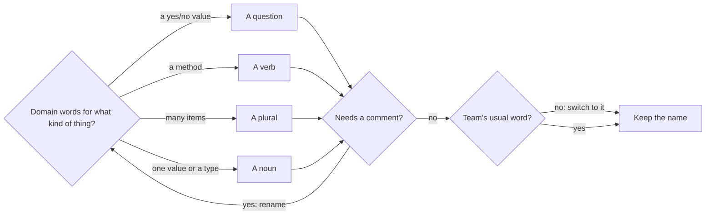

## Before you start

- No prerequisites — start here.

## The situation

You are reading the Đơn Hàng console samples to see how an order's total is worked out. You open `NamingBefore.cs` and find a method called `Calc` that takes `l` and `f`. It adds up `x.q * x.p` into `t`, and when `f` is true it takes a tenth of it off.

You read it three times. Is `q` a quantity? Is `p` a price or a product? What makes `f` true? Nothing is broken and the project builds, yet you cannot say what the method is for without tracing every line and guessing. What would the names have to say for you to understand this method without opening it?

## Core concepts

- domain words — the words the people who run Đơn Hàng use for its things, such as order line, quantity, unit price and loyal customer; "domain" here means the business Đơn Hàng serves, not a domain name.
- name shape — the form a name takes to match what it names: a yes/no value reads as a question, a method as a verb, a collection as a plural.
- abbreviation and type prefix — a letter standing for a word, like `q` for quantity, and a marker of the type stuck to the front of a name, like `lst` or `str`; both make the reader decode instead of read.
- naming consistency — one word for one thing across the whole codebase, so a name you learn in one file means the same in every other.
- PascalCase and camelCase — the two ways the C# naming conventions join words into one name: `TotalVnd` capitalises every word, `totalVnd` starts in lowercase.

## How it works



Read the diagram from the left. In the situation above, the first box is where `Calc` fails: it says a calculation happens, not what is calculated, and `t` says nothing at all. Start from domain words instead: a name built from them tells you what a value holds before you read how it is made.

Next, give the name the shape of what it names. A yes/no value reads as a question: `customerIsLoyal` is true or false, and `if (customerIsLoyal)` reads as a sentence. A method reads as a verb, because calling it does something, like `Save` and `Notify` in `PlaceOrderSplit.cs`, the sample that places an order. A collection reads as a plural, so `lines` holds many and `line` holds one. A single value or a type reads as a noun, like `totalVnd` or `OrderLine`. Abbreviations such as `q` and type prefixes such as `lst` make the reader decode first.

Then ask whether the name needs a comment to be understood. If `f` needs a comment saying it is true for loyal customers, that comment is the name you should have written: change the name, delete the comment, and take the new name back to the first box. A long, precise name such as `LoyaltyDiscountPercent` costs seconds to type once; a short, vague one costs time for every reader who meets it away from the line that explains it.

The last check is the team's usual word. If the rest of the code calls an amount of money `totalVnd`, with `Vnd` for Vietnamese đồng, a new method should not call it `sum`: switch to the team's word and keep it, even if it breaks a shape rule. One word for one thing lets you search for it and trust what you find.

## In the Đơn Hàng system

The console sample project holds the same calculation twice. First the version from the situation:

```csharp file=samples/DonHang.Samples/Samples/Clean/NamingBefore.cs tag=stage-0 lines=4-21
// Nothing here is wrong. Everything here has to be decoded.
public static class NamingBefore
{
    public static int Calc(List<(int q, int p)> l, bool f)
    {
        var t = 0;
        foreach (var x in l)
        {
            t += x.q * x.p;
        }

        if (f)
        {
            t -= t * 10 / 100;
        }

        return t;
    }
```

The file's own comment is accurate: the method returns a correct total. What is missing is meaning. The pair `(int q, int p)` does not say which number is the price, `l` could be any list, and the bare `10` in `t * 10 / 100` does not say what the tenth is for. Nothing in the sample project calls `Calc`, so there is no calling code to explain `f` either. Now the same steps with the domain's words put back:

```csharp file=samples/DonHang.Samples/Samples/Clean/NamingAfter.cs tag=stage-0 lines=3-25
public sealed record OrderLine(int Quantity, int UnitPriceVnd);

// lesson: foundation.l1.naming
// The same code, with the domain's words in it.
public static class NamingAfter
{
    private const int LoyaltyDiscountPercent = 10;

    public static int TotalVnd(List<OrderLine> lines, bool customerIsLoyal)
    {
        var totalVnd = 0;
        foreach (var line in lines)
        {
            totalVnd += line.Quantity * line.UnitPriceVnd;
        }

        if (customerIsLoyal)
        {
            totalVnd -= totalVnd * LoyaltyDiscountPercent / 100;
        }

        return totalVnd;
    }
```

The steps are the same, line for line; what changed is the names, plus a named type for the pair and a named constant for the 10. `OrderLine` gives the pair a name, and its two values are read as `line.Quantity` and `line.UnitPriceVnd`. `f` became `customerIsLoyal`, a question the `if` answers. `lines` is plural and each `line` is singular. The bare `10` became `LoyaltyDiscountPercent`, a name you can search for. Read the first line of the method alone and you know what goes in and what comes out.

The casing follows the C# naming conventions: types and methods are PascalCase, and local variables and method parameters are camelCase, so `TotalVnd` and `totalVnd` are one word in two roles. `Quantity` and `UnitPriceVnd` sit in parentheses like parameters, yet they and `LoyaltyDiscountPercent` are PascalCase too; the same conventions cover them with rules this lesson does not go into.

One name bends the verb rule: `TotalVnd` is a noun. Other samples name their order-total methods `TotalVnd` as well, in `WrongTotal.cs` and `LoggingDemo.cs`. A verb here would give one thing two names in one project. That is the diagram's "Team's usual word?" check at work: when the team already has a word, keeping it matters more than any single rule.

## Beginners often think…

- **"Short names are cleaner."** → Actually a short name moves the work from the writer to every reader: `t` is quicker to type than `totalVnd`, but whoever meets it has to rebuild its meaning from the lines around it. A short name is fine when its whole use fits in a few lines and its meaning is plain, like `i` counting through a short loop. You notice this when you come back to your own code after a few weeks and have to trace a variable to its first line to know what it holds.
- **"A comment can make up for a bad name."** → Actually an ordinary `//` comment stays where it is written, while the name appears on every line that uses what it names, including every call of a method; the comment does not follow it there. Ordinary here means the two-slash kind, not the three-slash `///` kind the compiler can read to build documentation. The compiler does not check what an ordinary comment says, so nothing tells you when one stops matching the code beside it. You notice this when a comment says one thing, the code does another, and you have to decide which to believe.

## Try it (3 minutes)

1. In a bash terminal, from the top folder of the example repository, run `cd samples/DonHang.Samples/Samples/Clean`, then `grep -c Vnd NamingBefore.cs NamingAfter.cs PlaceOrderSplit.cs`. `grep` searches files for a piece of text; with `-c` and several file names, it prints one line per file: the name, a colon, and how many lines contain `Vnd`.
2. Open `PlaceOrderSplit.cs` and find the line that calls `NamingAfter.TotalVnd`. Without looking back at the code above, say what that call gives back.

Expected result: the first line is `NamingBefore.cs:0`, and the other two files each show a count above zero; of these three files, only the one from the situation never writes money with the `Vnd` ending. The call reads `NamingAfter.TotalVnd(lines, customerIsLoyal)`, and its names alone tell you it returns a total in đồng for these lines, and that whether the customer is loyal changes it.

## Connections

- [[foundation.l1.small-functions]] — the next step: a block you can name honestly in a few words is usually a block that does one thing, and that lesson uses the name to decide where to cut.
- [[foundation.l1.code-smells-basic]] — a comment that explains what the code does is one of the warning signs listed there, and when the comment only explains what a value is, a better name is the fix.
- [[foundation.l1.reading-code]] — prerequisite for: when names use the team's words, a `grep` for a word you saw on screen leads straight to the code.
- [[foundation.l1.json-and-encoding]] — the same two casings again, where the program's data is written out as JSON and the names in C# and the names in JSON must agree on both sides.
- [[management.l1.code-review-basics]] — the same habit from the other seat: a teammate reads your change before it goes in, and an unclear name is something they can ask you to fix.

## Five-line summary

1. A good name says what a thing is or does in the domain's words, so the reader does not need to open it.
2. Yes/no values read as questions, methods as verbs, collections as plurals; abbreviations and type prefixes make the reader decode.
3. If a name needs a comment to be understood, change the name; a long precise name beats a short vague one.
4. Use the team's word for the team's thing everywhere; consistency matters more than any single naming rule.
5. By C# naming conventions, types and methods use PascalCase; local variables and method parameters use camelCase.
