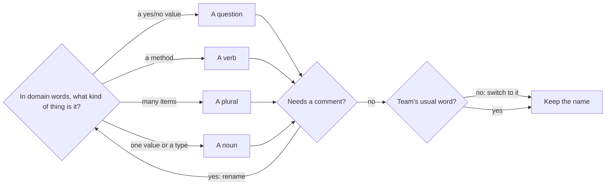

## Bạn cần biết trước

- Không cần kiến thức trước — bắt đầu từ đây.

## Tình huống

Bạn đang đọc các sample console của Đơn Hàng để xem tổng tiền của một đơn hàng được tính ra sao. Bạn mở `NamingBefore.cs` và thấy một phương thức tên `Calc`, nhận `l` và `f`. Nó cộng dồn `x.q * x.p` vào `t`, và khi `f` là true thì trừ đi một phần mười.

Bạn đọc ba lần. `q` là số lượng à? `p` là giá hay là sản phẩm? Khi nào `f` là true? Không có gì hỏng, project vẫn build được, vậy mà bạn không nói được phương thức này để làm gì nếu không lần theo từng dòng rồi đoán. Các cái tên phải nói gì để bạn hiểu phương thức này mà không cần mở nó ra?

## Khái niệm cốt lõi

- từ ngữ nghiệp vụ — những từ mà người vận hành Đơn Hàng dùng để gọi các thứ trong đó, như dòng hàng, số lượng, đơn giá và khách thân thiết. "Nghiệp vụ" (domain) ở đây là mảng kinh doanh mà Đơn Hàng phục vụ, không phải tên miền.
- hình dạng của tên — dạng mà một cái tên mang để khớp với thứ nó gọi: giá trị có/không đọc như một câu hỏi, phương thức đọc như một động từ, tập hợp đọc như một danh từ số nhiều.
- viết tắt và tiền tố kiểu — một từ bị cắt ngắn, như `q` thay cho quantity hay `Calc` thay cho calculate, và một dấu hiệu về kiểu gắn vào đầu tên, như `lst` hay `str`. Cả hai đều bắt người đọc giải mã thay vì đọc.
- tính nhất quán khi đặt tên — một từ cho một thứ trong toàn bộ codebase, để cái tên bạn học ở file này mang cùng nghĩa ở mọi file khác.
- PascalCase và camelCase — hai cách mà quy ước đặt tên của C# ghép nhiều từ thành một tên: `TotalVnd` viết hoa chữ đầu mọi từ, `totalVnd` bắt đầu bằng chữ thường.

## Cơ chế hoạt động



Trong tình huống ở trên, ô đầu tiên là chỗ `Calc` trượt: nó chỉ nói có một phép tính xảy ra, không nói tính cái gì, còn `t` thì chẳng nói gì cả. Hãy bắt đầu từ từ ngữ nghiệp vụ: cái tên dựng từ những từ đó cho bạn biết một giá trị chứa gì trước khi bạn đọc nó được tạo ra thế nào.

Tiếp theo, cho cái tên hình dạng của thứ nó gọi. Giá trị có/không đọc như câu hỏi: `if (customerIsLoyal)` đọc lên thành một câu. Phương thức đọc như động từ, vì gọi nó là làm một điều gì đó, như `Save` và `Notify` trong `PlaceOrderSplit.cs`, sample đặt một đơn hàng. Tập hợp đọc như danh từ số nhiều, nên `lines` chứa nhiều, còn `line` chứa một. Một giá trị đơn lẻ hay một kiểu đọc như danh từ, như `totalVnd` hay `OrderLine`. Viết tắt như `q` và tiền tố kiểu như `lst` bắt người đọc giải mã trước đã.

Sau đó, hỏi xem cái tên có cần comment mới hiểu được không. Nếu `f` cần một comment nói rằng nó là true với khách thân thiết, thì comment đó chính là cái tên lẽ ra bạn phải viết: đổi tên, xóa comment, rồi đưa tên mới quay lại ô đầu tiên. Một cái tên dài mà chính xác như `LoyaltyDiscountPercent` tốn vài giây để gõ một lần. Một cái tên ngắn mà mơ hồ tốn thời gian của mọi người đọc gặp nó ở xa dòng giải thích nó.

Bước kiểm tra cuối là từ quen dùng của nhóm. Nếu phần còn lại của code gọi một khoản tiền là `totalVnd`, với `Vnd` là viết tắt của đồng Việt Nam, thì phương thức mới không nên gọi nó là `sum`: chuyển sang từ của nhóm và giữ nguyên nó, kể cả khi nó phá một quy ước về hình dạng. Bản thân `Vnd` cũng là dạng viết tắt, nhưng ổn vì cả nhóm đều đọc được. Một từ cho một thứ giúp bạn tìm kiếm nó và tin vào những gì tìm thấy.

## Trong hệ thống Đơn Hàng

Project sample console chứa cùng một phép tính hai lần. Trước hết là bản trong tình huống:

```csharp file=samples/DonHang.Samples/Samples/Clean/NamingBefore.cs tag=stage-0 lines=4-21
// Nothing here is wrong. Everything here has to be decoded.
public static class NamingBefore
{
    public static int Calc(List<(int q, int p)> l, bool f)
    {
        var t = 0;
        foreach (var x in l)
        {
            t += x.q * x.p;
        }

        if (f)
        {
            t -= t * 10 / 100;
        }

        return t;
    }
```

Chính comment trong file đã gọi tên vấn đề: không có gì sai, nhưng mọi thứ đều phải giải mã. Thứ còn thiếu là ý nghĩa. Cặp `(int q, int p)` không cho biết số nào là giá, `l` có thể là bất kỳ danh sách nào, và số `10` trơ trọi trong `t * 10 / 100` không cho biết một phần mười đó để làm gì. Không chỗ nào trong project sample gọi `Calc`, nên cũng không có code gọi nào giải thích `f`. Giờ là đúng các bước ấy, với từ ngữ nghiệp vụ được đặt trở lại:

```csharp file=samples/DonHang.Samples/Samples/Clean/NamingAfter.cs tag=stage-0 lines=3-25
public sealed record OrderLine(int Quantity, int UnitPriceVnd);

// lesson: foundation.l1.naming
// The same code, with the domain's words in it.
public static class NamingAfter
{
    private const int LoyaltyDiscountPercent = 10;

    public static int TotalVnd(List<OrderLine> lines, bool customerIsLoyal)
    {
        var totalVnd = 0;
        foreach (var line in lines)
        {
            totalVnd += line.Quantity * line.UnitPriceVnd;
        }

        if (customerIsLoyal)
        {
            totalVnd -= totalVnd * LoyaltyDiscountPercent / 100;
        }

        return totalVnd;
    }
```

Các bước giữ nguyên, từng dòng một. Thứ thay đổi là các cái tên, cộng thêm một kiểu nhỏ có tên, `OrderLine`, chứa hai giá trị, và một hằng số có tên cho số 10. Hai giá trị được đọc ra là `line.Quantity` và `line.UnitPriceVnd`. `f` thành `customerIsLoyal`, một câu hỏi mà lệnh `if` trả lời. `lines` là số nhiều, còn mỗi `line` là số ít. Số `10` trơ trọi thành `LoyaltyDiscountPercent`, một cái tên bạn tìm kiếm được. Chỉ đọc dòng đầu tiên của phương thức là bạn biết cái gì đi vào và cái gì đi ra.

Cách viết hoa theo quy ước đặt tên của C#: kiểu và phương thức dùng PascalCase, còn biến cục bộ và tham số của phương thức dùng camelCase, nên `TotalVnd` và `totalVnd` là một từ ở hai vai trò. Các tên `Quantity` và `UnitPriceVnd` trong `OrderLine(...)` là thứ bạn đọc lại sau đó dưới dạng `line.Quantity` và `line.UnitPriceVnd`, và tên được đọc từ bên ngoài một kiểu qua dấu chấm cũng dùng PascalCase. `LoyaltyDiscountPercent` là hằng số, cũng dùng PascalCase.

Có một cái tên bẻ cong quy tắc động từ: `TotalVnd` là danh từ. Các sample khác cũng đặt tên phương thức tính tổng đơn hàng là `TotalVnd`, trong `WrongTotal.cs` và `LoggingDemo.cs`. Dùng động từ ở đây sẽ khiến một thứ có hai tên trong cùng một project. Đó chính là bước kiểm tra "Team's usual word?" trong sơ đồ: khi nhóm đã có sẵn một từ, giữ từ đó quan trọng hơn bất kỳ quy ước đặt tên riêng lẻ nào.

## Người mới hay nghĩ rằng…

- **"Tên ngắn thì gọn gàng hơn."** → Thực ra tên ngắn chuyển công sức từ người viết sang mọi người đọc: `t` gõ nhanh hơn `totalVnd`, nhưng ai gặp nó cũng phải dựng lại ý nghĩa từ các dòng xung quanh. Tên ngắn vẫn ổn khi toàn bộ chỗ dùng nó nằm gọn trong vài dòng và nghĩa của nó rõ ràng, như `i` đếm trong một vòng lặp ngắn. Bạn sẽ nhận ra khi quay lại code của chính mình sau vài tuần và phải lần một biến về tận dòng đầu tiên mới biết nó chứa gì.
- **"Comment có thể bù cho một cái tên dở."** → Thực ra comment `//` nằm yên ở chỗ nó được viết, còn cái tên xuất hiện trên mọi dòng dùng thứ nó gọi, kể cả mọi lần gọi một phương thức, và comment không đi theo tới đó. Compiler không kiểm tra nội dung comment, nên không có gì báo cho bạn khi một comment không còn khớp với code bên cạnh. Bạn sẽ nhận ra khi comment nói một đằng, code làm một nẻo, và bạn phải quyết định tin bên nào.

## Thử ngay (3 phút)

1. Trong một shell chạy được `grep`, từ thư mục gốc của repository ví dụ, chạy `cd samples/DonHang.Samples/Samples/Clean`, rồi `grep -c Vnd NamingBefore.cs NamingAfter.cs PlaceOrderSplit.cs`. `grep` tìm một đoạn chữ trong file. Với `-c` và nhiều tên file, nó in mỗi file một dòng: tên file, dấu hai chấm, và số dòng có chứa `Vnd`.
2. Mở `PlaceOrderSplit.cs` và tìm dòng gọi `NamingAfter.TotalVnd`. Không nhìn lại đoạn code ở trên, hãy nói lời gọi đó trả về cái gì.

Kết quả mong đợi: dòng đầu là `NamingBefore.cs:0`, còn hai file kia đều cho số lớn hơn không. Trong ba file này, chỉ file của tình huống là không bao giờ viết tiền với đuôi `Vnd`. Lời gọi là `NamingAfter.TotalVnd(lines, customerIsLoyal)`, và chỉ riêng các cái tên đã cho bạn biết nó trả về tổng tiền tính bằng đồng cho các dòng hàng này, và tổng đó thay đổi tùy khách có thân thiết hay không.

## Liên hệ

- [[foundation.l1.small-functions]] — bước tiếp theo: một khối code mà bạn đặt tên đúng sự thật được bằng vài chữ thường là khối làm một việc, và bài đó dùng cái tên để quyết định nên cắt ở đâu.
- [[foundation.l1.code-smells-basic]] — comment giải thích code làm gì là một trong các dấu hiệu cảnh báo được liệt kê ở đó, và khi comment chỉ giải thích một giá trị là gì, cách sửa là một cái tên tốt hơn.
- [[foundation.l1.reading-code]] — là kiến thức nền cho bài này: khi các cái tên dùng từ của nhóm, `grep` một từ bạn thấy trên màn hình sẽ dẫn thẳng tới code.
- [[foundation.l1.json-and-encoding]] — lại là hai cách viết hoa này, ở chỗ dữ liệu của chương trình được ghi ra dưới dạng JSON và tên trong C# với tên trong JSON phải khớp nhau ở cả hai phía.
- [[management.l1.code-review-basics]] — cùng thói quen này nhìn từ ghế bên kia: một đồng đội đọc thay đổi của bạn trước khi nó được đưa vào, và một cái tên không rõ ràng là thứ họ có thể yêu cầu bạn sửa.

## Tóm tắt 5 dòng

1. Tên tốt nói một thứ là gì hoặc làm gì bằng từ ngữ nghiệp vụ, để người đọc không cần mở nó ra.
2. Giá trị có/không đọc như câu hỏi, phương thức như động từ, tập hợp như danh từ số nhiều. Viết tắt và tiền tố kiểu bắt người đọc giải mã, trừ khi cả nhóm đã biết chúng.
3. Nếu một cái tên cần comment mới hiểu được, hãy đổi tên. Tên dài mà chính xác tốt hơn tên ngắn mà mơ hồ.
4. Dùng từ của nhóm cho thứ của nhóm ở mọi nơi. Tính nhất quán quan trọng hơn bất kỳ quy ước đặt tên riêng lẻ nào.
5. Theo quy ước đặt tên của C#, kiểu và phương thức dùng PascalCase, biến cục bộ và tham số của phương thức dùng camelCase.
