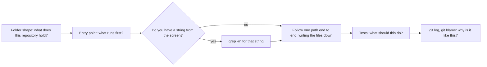

## Before you start

- [[foundation.l1.naming]] — a name built from the team's words tells a reader what a thing is without opening it. Here you read from the other side: those names are the first thing you read, and the word you search for.
- [[foundation.l1.pipes-and-filters]] — you chained `grep`, `head` and `|` over a file too large to read whole. This lesson points the same chain at source code instead of a log.

## The situation

Someone asks you to change the price of the wireless mouse in Đơn Hàng, and today is the first time you have opened the repository: the folder tree holding every file of the project, and the record of every change made to them. Eight folders sit at the top: `db`, `docs`, `git-playground`, `lab`, `outputs`, `samples`, `scripts`, `www`. You open `samples/DonHang.Samples/Program.cs`, the only name you recognise, read it to the bottom, then open a file it names. Twenty minutes later you have read three files and still cannot explain the folder list. Where do you start when the repository is large and the question is small?

## Core concepts

- folder shape — what the names of a repository's top-level folders say about what it holds, before you open a single file.
- entry point — the file where execution begins: `Program.cs` for the console project, or `scripts/up.sh` for the lab, the small Linux machine this repository's lesson scripts run inside.
- one path — the ordered list of files a single command or a single question travels through, written down as you follow it.
- backwards search — starting from a string you saw on screen and using `grep -rn` to reach the line that put it there.
- intent and reason — the two questions code will not answer about itself: what it should do, which the tests state, and why it looks like this, which the file's history states. Git keeps a record of every change someone saved into it, each with a message from whoever made it; `git blame <file>` names the change that last modified a line, and `git log -- <file>` prints the messages of the changes behind that file.

## How it works



Read the diagram from the left; the diamond is a question, not a step. Each box cuts down what you read next.

In the situation above, the first box is the step you skipped. Five of the eight names rule themselves in or out on sight: `db`, `docs`, `samples`, `scripts` and `www` say database, prose, sample code, scripts and a site of ready-made pages. The other three — `git-playground`, `lab` and `outputs` — say nothing about a price, and a name you cannot read is not a reason to open the folder. A question about a price now has one likely home.

The entry point answers what runs first. The Đơn Hàng console project keeps a list in `Program.cs` pairing each sample's name with the method that runs it, so one file names every sample it can run. The same file shows both ends: input arrives as the name you typed in `args[0]`, output leaves through `Console.WriteLine`.

When the answer is yes, `grep -rn` takes a pattern and then the folders to search; `-r` walks every file under them, and `-n` prints the line number. When the string you saw is written out literally somewhere in the repository, that lands you on the line in one step. When it is assembled from pieces or read from the database, search for a stable fragment instead.

The line the search names is where your path starts. Write that file down and follow the path on; the list is what you keep. With no such string, start at the entry point instead.

The last two boxes answer what the code will not. A test states what the code should do, in a form you can run. The file's recorded history states why a strange line is there.

## In the Đơn Hàng system

The repository writes this order down for you, as Vietnamese prose you can read before any code:

```markdown file=docs/clean-code/reading-order.md tag=stage-0 lines=7-30
1. **Nhìn thư mục gốc trước, không mở file nào.**
   `db/`, `www/`, `scripts/`, `samples/`, `docs/` — năm thư mục đã nói gần hết:
   có cơ sở dữ liệu, có trang tĩnh, có script, có code mẫu, có tài liệu.

2. **Tìm điểm vào.**
   Với một chương trình C#, đó là `Program.cs`. Với một kho script, đó là
   `scripts/up.sh`. Điểm vào cho bạn biết thứ gì chạy trước.

3. **Đi theo *một* luồng từ đầu đến cuối.**
   Chọn đúng một việc — ví dụ "chạy một câu truy vấn" — và bám theo:
   `scripts/sql/run-query.sh` → `psql` → `db/queries/select-basics.sql` →
   `db/schema.sql`. Ghi lại đường đi thành một danh sách file.

4. **Từ thứ nhìn thấy trên màn hình, tìm ngược về code.**
   Thấy chữ "Chuột không dây" ở đâu đó thì `grep -rn 'Chuột không dây'`. Đây là
   con đường ngắn nhất từ hành vi tới code, và luôn dùng được.

5. **Đọc test trước khi đọc phần khó.**
   Test nói code *nên* làm gì. Đọc `samples/DonHang.Samples.Tests` sẽ nhanh hơn
   đọc thẳng `PlaceOrderSplit.cs`.

6. **Đọc lịch sử của file trông kỳ lạ.**
   `git log -- <file>` và `git blame <file>` trả lời "vì sao nó như thế này",
   câu mà bản thân đoạn code không bao giờ trả lời được.
```

The six steps cover the same ground as the diagram in a different order: the list follows one path (step 3) before the backwards search (step 4), while the diagram lets a string you already have take you to the search first. Step 3 names a real route — `scripts/sql/run-query.sh`, then `psql`, which runs the file against the database and prints the rows back, then `db/queries/select-basics.sql`, then `db/schema.sql` — and asks you to keep it as a list of files. Step 4 is the backwards search, with the wireless mouse as its example.

One script walks list steps 1, 2 and 4, each a single command, and adds two of its own: a size count and a listing of the sample folders. Step 3, following one path, is the one you walk yourself:

```bash file=scripts/craft/map-codebase.sh tag=stage-0 lines=9-26
echo "1. what kind of thing is this?"
ls -1 db docs samples scripts www

echo
echo "2. where does execution start?"
find samples -name 'Program.cs'

echo
echo "3. how much code is there?"
find samples -name '*.cs' | wc -l

echo
echo "4. from a word you saw on screen to the line that produced it:"
grep -rn 'Chuột không dây' db samples | head -3

echo
echo "5. what the folders are named after:"
ls -1 samples/DonHang.Samples/Samples
```

```text output=true
1. what kind of thing is this?
db:
...
2. where does execution start?
samples/DonHang.Samples/Program.cs

3. how much code is there?
31

4. from a word you saw on screen to the line that produced it:
db/seed.sql:7:    (2, 'Chuột không dây',     450000),
samples/DonHang.Samples/Samples/Data/CollectionsChoice.cs:13:            new(2, "Chuột không dây", 450_000),

5. what the folders are named after:
Clean
Computer
Data
Debug
Http
Oop
```

The script's first command runs `ls -1`, which prints names one per line, over five folders it names in advance; the discovery the first box asks for is plain `ls` at the top of the repository, which the script skips because it already knows the answer. Its second command finds the entry point with `find samples -name 'Program.cs'`, which walks everything under `samples` and prints each file whose name matches, so you need not know where it lives.

Its search settles the situation in one command: the price is written in `db/seed.sql`, the file that fills the tables with their starting rows, and again in a C# sample, on the lines the output names.

The count of `.cs` files counts every one `find` sees under `samples`, so read it as a size signal, not as an inventory of files a person wrote: compiling the project writes a few extra `.cs` files there. The capture says `31` because the project had been compiled; a copy taken straight from the repository gives `25`, and either number is the same signal.

## Beginners often think…

- **"I need to understand the whole codebase before I can change anything."** → Actually you need to understand one path, the files a single question travels through. A change is safe when you know what reaches the line you touch and what that line feeds. You notice this when you are weeks into a job, have read a great deal, and still hand back your first small fix half done.
- **"The best way to learn a codebase is to read it top to bottom."** → Actually reading with no question does not stick: you have nothing to hang the detail on. Reading in depth is what you do second, after a path has shown you which four files matter. You notice this when you finish a folder, close the editor, and cannot say what any of it did.
- **"A line that looks strange means someone wrote careless code."** → Actually the reason is often outside the file: a system that returned something unexpected, a date that could not move, a rule nobody wrote down. `git blame <file>` names the recorded change that last modified that line, often the one that put it there and sometimes only the last one that touched it. `git log -- <file>` lists the changes that explain how the file came to be, each with its message, and the reason usually sits in one of them. You notice this when you tidy such a line away and something else breaks a week later.

## Try it (3 minutes)

1. From the top folder of the example repository, run `scripts/up.sh` and wait for it to finish — that starts the lab.
2. From the same folder, run `scripts/craft/map-codebase.sh` and read its five numbered steps in order.
3. Now do step 4 yourself for a different product. In that same folder on your own machine, run `grep -rn 'Bàn phím cơ' db samples`; this search only reads files, so it needs no lab. Open whichever of the two files is not SQL and read the lines around it.

Expected result: the script prints what is inside the five folders it names, `samples/DonHang.Samples/Program.cs` as the entry point, a count of `.cs` files, two lines for `Chuột không dây`, and last the names of the sample folders. Your own search prints two lines as well, in `db/seed.sql` and in `samples/DonHang.Samples/Samples/Data/CollectionsChoice.cs`; the C# file holds a short list of products written out again in code. Both answers took one command, against twenty minutes of reading in the situation.

## Connections

- [[foundation.l1.pipes-and-filters]] — prerequisite: the backwards search is `grep` and `head` chained over source files instead of over a log.
- [[foundation.l1.naming]] — the same skill from the writing seat: names taken from the team's words make a search land in the right file.
- [[foundation.l2.debugging-method]] — the next step: finding the code behind a behaviour that is wrong.
- [[foundation.l2.git-history-and-recovery]] — where `git log` and `git blame` become a way to read a file's past.
- [[management.l1.code-review-basics]] — the same reading under time pressure, on a change someone else wrote.

## Five-line summary

1. When a codebase is too large to read in one sitting, follow one path from the entry point instead of reading files in order.
2. Folder names and the entry point tell you what a repository holds and what runs first, before you open anything.
3. `grep -rn` for a string written out literally in the code is the shortest route from a behaviour to the line that produced it.
4. Write the path down as a list of files; one route you can explain beats a whole repository you cannot.
5. Tests say what the code should do; `git log -- <file>` and `git blame <file>` say why a file looks the way it does.
