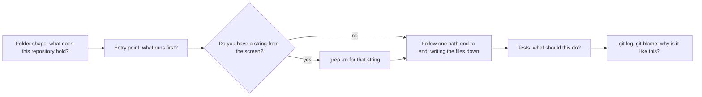

## Bạn cần biết trước

- [[foundation.l1.naming]] — một cái tên ghép từ những chữ của team cho người đọc biết một thứ là gì mà không cần mở nó ra. Ở bài này bạn đứng ở phía bên kia: những cái tên đó là thứ đầu tiên bạn đọc, và là chữ bạn đem đi tìm.
- [[foundation.l1.pipes-and-filters]] — bạn đã nối `grep`, `head` và `|` trên một file quá lớn để đọc hết. Bài này đem đúng chuỗi lệnh đó dùng cho source code thay vì cho log.

## Tình huống

Có người gửi bạn ảnh chụp màn hình con chuột không dây, `Chuột không dây`, và nhờ bạn đổi giá của nó trong Đơn Hàng. Hôm nay là lần đầu bạn mở repository: cây thư mục chứa mọi file của dự án, cùng bản ghi mọi thay đổi từng làm trên chúng. Liệt kê cấp trên cùng, bạn thấy tám thư mục: `db`, `docs`, `git-playground`, `lab`, `outputs`, `samples`, `scripts`, `www`. Bạn mở `samples/DonHang.Samples/Program.cs`, cái tên duy nhất bạn nhận ra, đọc nó, rồi đọc tiếp một file mà nó nhắc tới. Hai mươi phút sau, bạn đã đọc ba file mà vẫn chưa giải thích được danh sách thư mục kia. Khi repository thì lớn còn câu hỏi thì nhỏ, bạn bắt đầu từ đâu?

## Khái niệm cốt lõi

- hình dạng thư mục — những gì tên các thư mục cấp trên cùng của repository cho biết về thứ nó chứa, trước khi bạn mở file nào.
- điểm vào — file nơi chương trình bắt đầu chạy: `Program.cs` với project console, hoặc `scripts/up.sh` với lab, chiếc máy Linux nhỏ mà phần lớn script bài học của repository này, trong đó có map-codebase.sh, chạy bên trong.
- một luồng — danh sách có thứ tự các file mà một lệnh hay một câu hỏi đi qua, được ghi lại trong lúc bạn lần theo.
- tìm ngược — bắt đầu từ một chuỗi bạn thấy trên màn hình và dùng `grep -rn` để tới dòng code đã in ra nó.
- ý định — code nên làm gì, câu hỏi mà code không tự trả lời về mình. Test nói ra điều đó: những chương trình nhỏ chạy code với đầu vào biết trước rồi kiểm tra kết quả.
- lý do — vì sao code trông như thế này, điều mà lịch sử của file nói ra. Git giữ bản ghi mọi thay đổi người ta đã lưu vào, mỗi thay đổi kèm một lời nhắn của người làm. `git blame <file>` chỉ ra thay đổi cuối cùng đã sửa một dòng, còn `git log -- <file>` in lời nhắn của các thay đổi đứng sau file đó.

## Cơ chế hoạt động



Tình huống ở trên đã bỏ qua ô đầu tiên. Năm trong tám cái tên tự cho biết có liên quan hay không ngay khi nhìn: `db`, `docs`, `samples`, `scripts` và `www` nghĩa là database, tài liệu, code mẫu, script và một site gồm các trang làm sẵn. Ba cái còn lại không nói gì về giá. Với chuyện giá, `db`, tức database, là chỗ đầu tiên nên xem. Lệnh tìm bên dưới sẽ cho thấy đó không phải chỗ duy nhất.

Điểm vào trả lời câu hỏi thứ gì chạy trước. `Program.cs` giữ một danh sách ghép tên từng sample với phương thức chạy nó, nên chỉ một file đã nêu tên mọi sample mà project console chạy được. Đó cũng là nơi đầu vào đi vào, tức tên sample bạn gõ sau lệnh chạy project, và nơi đầu ra đi ra: mỗi sample in kết quả lên màn hình.

Khi câu trả lời là có, `grep -rn` nhận một mẫu tìm kiếm rồi tới các thư mục cần tìm. `-r` đi qua mọi file bên dưới chúng, còn `-n` in số dòng. Khi chuỗi được viết nguyên văn trong repository, bạn tới đúng dòng đó sau một bước. Khi chuỗi được ghép từ nhiều mảnh, hãy tìm một mảnh không đổi của nó. Khi nó đến từ dữ liệu không nằm trong repository, hãy tìm phần chữ cố định được in cạnh nó.

Luồng bắt đầu ở dòng mà lệnh tìm chỉ ra. Ghi file đó lại rồi lần tiếp, giữ nguyên danh sách. Nếu không có chuỗi nào như vậy, hãy bắt đầu từ điểm vào.

Hai ô cuối trả lời những gì code không tự nói: test cho biết code nên làm gì, ở dạng bạn chạy được, còn lịch sử đã ghi của file cho biết vì sao một dòng kỳ lạ lại nằm đó.

## Trong hệ thống Đơn Hàng

Repository đã viết sẵn thứ tự này cho bạn, bằng văn xuôi tiếng Việt để bạn đọc trước khi đụng vào code:

```markdown file=docs/clean-code/reading-order.md tag=stage-0 lines=7-30
1. **Nhìn thư mục gốc trước, không mở file nào.**
   `db/`, `www/`, `scripts/`, `samples/`, `docs/` — năm thư mục đã nói gần hết:
   có cơ sở dữ liệu, có trang tĩnh, có script, có code mẫu, có tài liệu.

2. **Tìm điểm vào.**
   Với một chương trình C#, đó là `Program.cs`. Với một kho script, đó là
   `scripts/up.sh`. Điểm vào cho bạn biết thứ gì chạy trước.

3. **Đi theo *một* luồng từ đầu đến cuối.**
   Chọn đúng một việc — ví dụ "chạy một câu truy vấn" — và bám theo:
   `scripts/sql/run-query.sh` → `psql` → `db/queries/select-basics.sql` →
   `db/schema.sql`. Ghi lại đường đi thành một danh sách file.

4. **Từ thứ nhìn thấy trên màn hình, tìm ngược về code.**
   Thấy chữ "Chuột không dây" ở đâu đó thì `grep -rn 'Chuột không dây'`. Đây là
   con đường ngắn nhất từ hành vi tới code, và luôn dùng được.

5. **Đọc test trước khi đọc phần khó.**
   Test nói code *nên* làm gì. Đọc `samples/DonHang.Samples.Tests` sẽ nhanh hơn
   đọc thẳng `PlaceOrderSplit.cs`.

6. **Đọc lịch sử của file trông kỳ lạ.**
   `git log -- <file>` và `git blame <file>` trả lời "vì sao nó như thế này",
   câu mà bản thân đoạn code không bao giờ trả lời được.
```

Sáu bước khớp với sơ đồ, trừ một chỗ: danh sách đi theo một luồng (bước 3) trước khi tìm ngược (bước 4). Hãy làm theo sơ đồ: có chuỗi từ màn hình thì tìm trước, vì kết quả tìm được là nơi luồng bắt đầu. Thứ tự của danh sách hợp khi bạn không có chuỗi nào. Bước 3 nêu một đường đi có thật để ghi thành danh sách file. Hãy đi thử: lệnh cuối trong `scripts/sql/run-query.sh` là `psql`, công cụ chạy một file trên database rồi in các dòng kết quả ra. File đó là `db/queries/select-basics.sql`, trừ khi bạn chỉ định file khác. Câu truy vấn đọc bảng `products`, nên điểm dừng tiếp theo là `db/schema.sql`, file tạo ra các bảng. Bước 4 là tìm ngược, lấy con chuột không dây làm ví dụ. Câu "luôn dùng được" của nó chỉ đúng khi chuỗi được viết nguyên văn ở đâu đó.

Một script đi qua các bước 1, 2 và 4 của danh sách (đánh số giống vậy trong output), mỗi bước một lệnh, và thêm hai bước riêng: đếm kích thước và liệt kê các thư mục sample. Bước 3, đi theo một luồng, là bước bạn tự đi:

```bash file=scripts/craft/map-codebase.sh tag=stage-0 lines=9-26
echo "1. what kind of thing is this?"
ls -1 db docs samples scripts www

echo
echo "2. where does execution start?"
find samples -name 'Program.cs'

echo
echo "3. how much code is there?"
find samples -name '*.cs' | wc -l

echo
echo "4. from a word you saw on screen to the line that produced it:"
grep -rn 'Chuột không dây' db samples | head -3

echo
echo "5. what the folders are named after:"
ls -1 samples/DonHang.Samples/Samples
```

```text output=true
1. what kind of thing is this?
db:
...
2. where does execution start?
samples/DonHang.Samples/Program.cs

3. how much code is there?
31

4. from a word you saw on screen to the line that produced it:
db/seed.sql:7:    (2, 'Chuột không dây',     450000),
samples/DonHang.Samples/Samples/Data/CollectionsChoice.cs:13:            new(2, "Chuột không dây", 450_000),

5. what the folders are named after:
Clean
Computer
Data
Debug
Http
Oop
```

Lệnh đầu tiên chạy `ls -1`, in mỗi tên trên một dòng, cho năm thư mục đã nêu tên sẵn. Việc khám phá mà ô đầu tiên đòi hỏi thì chỉ là `ls` trơn ở thư mục gốc của repository. Lệnh thứ hai tìm điểm vào bằng `find samples -name 'Program.cs'`: nó đi qua mọi thứ bên dưới `samples` và in từng file có tên khớp, nên bạn không cần biết file nằm ở đâu.

Lệnh tìm của script giải quyết tình huống chỉ bằng một lệnh: giá được viết trong `db/seed.sql`, file đổ các dòng ban đầu vào bảng, và viết thêm lần nữa trong một sample C#, ở đúng những dòng mà output chỉ ra.

Chỉ coi con số đếm được là dấu hiệu về kích thước, vì mỗi bản sao cho một con số khác. Bước cuối liệt kê các thư mục sample: mỗi thư mục mang tên một chủ đề của khóa học và chứa các file sample của chủ đề đó, nên biết chủ đề là biết thư mục nào cần mở.

## Người mới hay nghĩ rằng…

- **"Mình phải hiểu cả codebase thì mới sửa được gì đó."** → Thực ra bạn cần hiểu một luồng, tức các file mà một câu hỏi đi qua. Một thay đổi an toàn khi bạn biết thứ gì đi tới dòng mình sửa và dòng đó đưa dữ liệu tới đâu. Bạn sẽ nhận ra khi đã vào làm vài tuần, đọc rất nhiều, mà bản sửa nhỏ đầu tiên vẫn nộp lại dở dang.
- **"Cách tốt nhất để nắm một codebase là đọc từ trên xuống dưới."** → Thực ra đọc mà không có câu hỏi thì không đọng lại, vì bạn không có chỗ nào để móc các chi tiết vào. Đọc sâu là việc làm sau, khi một luồng đã cho bạn thấy bốn file nào quan trọng. Bạn sẽ nhận ra khi đọc xong một thư mục, đóng editor lại, và không nói được phần nào trong đó làm gì.
- **"Một dòng trông kỳ lạ nghĩa là ai đó viết code cẩu thả."** → Thực ra lý do thường nằm ngoài file: một hệ thống trả về thứ không ai ngờ, một mốc ngày không dời được, một quy tắc chẳng ai ghi lại. `git blame <file>` chỉ ra thay đổi cuối cùng đã sửa dòng đó, không phải lúc nào cũng là thay đổi đã thêm nó vào, còn các lời nhắn mà `git log -- <file>` in ra thường chứa lý do. Bạn sẽ nhận ra khi dọn một dòng như vậy đi và một tuần sau thứ khác bị hỏng.

## Thử ngay (3 phút)

1. Từ thư mục gốc của repository ví dụ, chạy `scripts/up.sh` và chờ tới khi nó in `The lab is up.` — lệnh này khởi động lab.
2. Vẫn từ thư mục đó trên máy của bạn, chạy `scripts/craft/map-codebase.sh`. Script tự chuyển vào lab để chạy, đó là lý do bước 1 phải khởi động lab. Đọc lần lượt năm bước có đánh số của nó.
3. Giờ tự làm bước 4 của script, tức lệnh tìm, cho một sản phẩm khác. Chạy `grep -rn 'Bàn phím cơ' db samples`. Lệnh tìm này chỉ đọc file nên không cần lab. Mở file nào trong hai file không phải SQL và đọc các dòng quanh kết quả.

Kết quả mong đợi: script in nội dung của năm thư mục nó nêu tên, `samples/DonHang.Samples/Program.cs` là điểm vào, số file `.cs`, hai dòng chứa `Chuột không dây`, và cuối cùng là tên các thư mục sample. Lệnh tìm của bạn cũng in hai dòng, trong `db/seed.sql` và trong `samples/DonHang.Samples/Samples/Data/CollectionsChoice.cs`. File C# chứa một danh sách sản phẩm ngắn được viết lại trong code. Mỗi câu trả lời chỉ mất một lệnh, không phải hai mươi phút.

## Liên hệ

- [[foundation.l1.pipes-and-filters]] — kiến thức cần có trước: tìm ngược chính là `grep` và `head` nối với nhau trên source file thay vì trên log.
- [[foundation.l1.naming]] — cùng một kỹ năng nhìn từ phía người viết: những cái tên lấy từ chữ của team giúp lệnh tìm rơi đúng vào file cần tìm.
- [[foundation.l2.debugging-method]] — bước tiếp theo: tìm code đứng sau một hành vi sai.
- [[foundation.l2.git-history-and-recovery]] — nơi `git log` và `git blame` trở thành cách đọc quá khứ của một file.
- [[management.l1.code-review-basics]] — cùng kiểu đọc này nhưng dưới áp lực thời gian, trên một thay đổi do người khác viết.

## Tóm tắt 5 dòng

1. Khi codebase quá lớn để đọc hết, hãy đi theo một luồng, bắt đầu từ kết quả tìm kiếm hoặc từ điểm vào, đừng đọc từng file một.
2. Tên thư mục và điểm vào cho bạn biết repository chứa gì và thứ gì chạy trước, trước khi bạn mở bất cứ thứ gì.
3. `grep -rn` một chuỗi được viết nguyên văn trong code là đường ngắn nhất từ một hành vi tới dòng code đã tạo ra nó.
4. Ghi luồng lại thành danh sách file. Một đường đi bạn giải thích được đáng giá hơn cả một repository bạn không giải thích được.
5. Test cho biết code nên làm gì. `git log -- <file>` và `git blame <file>` cho biết vì sao file trông như vậy.
