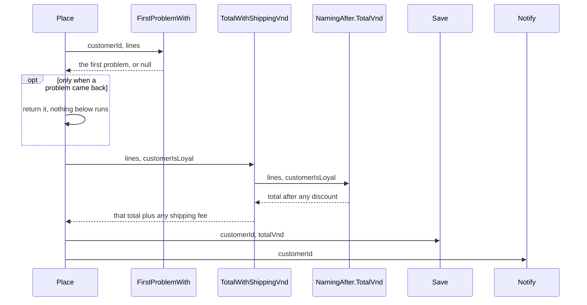

## Before you start

- [[foundation.l1.naming]] — reading a name before its body; here a name also shows whether a block does one thing.

## The situation

You are reading the Đơn Hàng console samples to find where an order's shipping fee is added. `PlaceOrderLong.cs` holds one method, `Place`, 28 lines long. It checks the order, adds up the lines, takes a discount off for a loyal customer, adds the fee, then prints that the order is saved and that an email is sent. None of these steps has a name. To be sure which line is the fee, you read all of them, and to check the total you would have to call `Place` and let it print the rest too. What would the code need for each step to be found, read and checked on its own?

## Core concepts

- one thing — a piece of work whose body you can describe honestly in a few words, with no "and"; how many lines or loops it takes does not decide it.
- extracting a function — moving a block of lines into a new function with a name, without rewriting its steps, and calling it where the block was.
- hidden input — a value a function reads that is not in its parentheses, such as a static field or an environment variable, so two calls with the same arguments can give different results; a constant does not count, since it is the same on every call.
- guard clause — an `if` at the top of a function that returns straight away when the input cannot be used, so the rest of the function can assume it is valid.
- nesting — one `if` or loop inside another; each level pushes the code one step right and adds a condition the reader must keep in mind.

## How it works



The diagram shows `Place` from `PlaceOrderSplit.cs`, the long method split up. It calls four functions in turn, each doing one thing you can name honestly: find the first problem, work out the total with shipping, save, notify. `TotalWithShippingVnd` hands part of its job to `NamingAfter.TotalVnd`, the function quoted in the naming lesson, which works out the total after any loyalty discount. A test (a method that calls a function with chosen values and checks the result) could check `TotalVnd` with just lines and a yes/no, printing nothing.

Extracting a function keeps what the code does. What changes is how values get in and out: what a block used arrives as parameters, what it produced comes back as the return value, and a moved `return` now leaves only the new function, so `Place` checks what `FirstProblemWith` sends back. The sum and discount were swapped for a call, not moved: `TotalVnd` runs the long version's same steps, its 10 now named `LoyaltyDiscountPercent`.

Dashed arrows carry return values; `Save` and `Notify` only print. No function reads a static field or an environment variable, so the same arguments give the same result, and a function's first line, the one with its name and parentheses, tells you all it needs. The fewer parameters, the less a reader or a test has to set up, unless a value was moved into a static field, which only hides it. `LoyaltyDiscountPercent` is a constant, so it hides nothing.

In the first exchange, when `FirstProblemWith` sends a problem back, `Place` returns it at once: a guard clause. Everything below can assume a valid order and stays at the left margin; written with nested `if`s instead, it would sit inside each check's own `if`, one level deeper per check.

## In the Đơn Hàng system

The long version, up to the email line:

```csharp file=samples/DonHang.Samples/Samples/Clean/PlaceOrderLong.cs tag=stage-0 lines=8-32
    public static string Place(int customerId, List<OrderLine> lines, bool customerIsLoyal)
    {
        if (customerId <= 0) return "the customer id is not valid";
        if (lines.Count == 0) return "an order needs at least one line";
        foreach (var line in lines)
        {
            if (line.Quantity <= 0) return "a line needs a quantity";
            if (line.UnitPriceVnd <= 0) return "a line needs a price";
        }

        var totalVnd = 0;
        foreach (var line in lines)
        {
            totalVnd += line.Quantity * line.UnitPriceVnd;
        }

        if (customerIsLoyal)
        {
            totalVnd -= totalVnd * 10 / 100;
        }

        totalVnd += totalVnd >= 2_000_000 ? 0 : 30_000;

        Console.WriteLine($"saving order for customer {customerId}, total {totalVnd}");
        Console.WriteLine($"sending an email to customer {customerId}");
```

Four jobs share one body. Its name, `Place`, has no "and", yet describing what this body does takes "check and total and save and email". The split `Place` keeps the name honestly: its body is four named calls whose one shared result is a placed order, and how each step works sits inside the function it calls. The `if`s at the top, including the two inside the first loop, check the order; the first two are already guard clauses, not the loop's two, which sit inside the `foreach`.

The second loop, the discount and the fee line work out the money; the underscores in `2_000_000` only group digits, and the line adds 30,000 đồng below 2,000,000 and nothing from there up. The two `Console.WriteLine` lines stand in for saving and emailing: in this sample nothing is written to a database and no email is sent. Built the same way at 200 lines instead of 28, this method would still have no step you could name, test or reuse on its own.

The split version, from `Place` to the fee line; the block stops before the closing brace of `TotalWithShippingVnd`:

```csharp file=samples/DonHang.Samples/Samples/Clean/PlaceOrderSplit.cs tag=stage-0 lines=6-30
    public static string Place(int customerId, List<OrderLine> lines, bool customerIsLoyal)
    {
        var problem = FirstProblemWith(customerId, lines);
        if (problem is not null) return problem;

        var totalVnd = TotalWithShippingVnd(lines, customerIsLoyal);
        Save(customerId, totalVnd);
        Notify(customerId);

        return $"order placed, total {totalVnd}";
    }

    private static string? FirstProblemWith(int customerId, List<OrderLine> lines)
    {
        if (customerId <= 0) return "the customer id is not valid";
        if (lines.Count == 0) return "an order needs at least one line";
        if (lines.Any(line => line.Quantity <= 0)) return "a line needs a quantity";
        if (lines.Any(line => line.UnitPriceVnd <= 0)) return "a line needs a price";
        return null;
    }

    private static int TotalWithShippingVnd(List<OrderLine> lines, bool customerIsLoyal)
    {
        var totalVnd = NamingAfter.TotalVnd(lines, customerIsLoyal);
        return totalVnd + (totalVnd >= 2_000_000 ? 0 : 30_000);
```

`FirstProblemWith` returns `string?`, a string that may be `null`; here `null` means no problem was found, and `if (problem is not null) return problem;` is the guard clause. When checks do not depend on each other, this flat shape asks less of any reader, new or experienced: no line makes you remember which `if` it sits inside.

`Save` and `Notify`, just below the block, print the same two lines as the long version. The four new functions are `private`, reachable only from inside this class, so the repository's tests reach them through `Place`; made public, `TotalWithShippingVnd` could be tested alone, since it needs nothing but its parameters. Neither `PlaceOrderLong` nor `PlaceOrderSplit` declares a field, so their functions have no static field to read as a hidden input.

One change here is more than a move. The long version checks each line inside a `foreach`. `FirstProblemWith` asks `lines.Any(...)`, which is true when any line matches the condition, first for quantities, then for prices. That keeps all four checks at one level, but it also changes which message you get when one line lacks a price and a later line lacks a quantity. The repository's test compares the two versions for one valid order only, so it does not notice. Moving lines unchanged is the safe part; rewriting them on the way is a second change that needs its own check.

## Beginners often think…

- **"Splitting code into functions makes it slower and harder to follow because you jump around."** → Actually you jump only when you want the detail: the split `Place` reads as four named steps, and you open only the one you need. Whether the calls cost time you could notice is something to measure, not guess; if placing an order feels slow, look for the cause outside these calls first. You notice this when you need one step: in the split version you go straight to `TotalWithShippingVnd`, while in the long one you read from the top to be sure where the checks end.
- **"A function is 'one thing' if it has one loop."** → Actually one thing is about what a function does, not how it is built. `FirstProblemWith` has four `if`s and no `foreach`, and it does one thing: find the first problem. The long `Place` would still check, total, save and email if its two loops were written as one. You notice this when a function's only honest name has an "and" in it, or when changing the email text means editing the method that holds the fee rule.

## Try it (3 minutes)

1. From the root of the example repository, run `dotnet run --project samples/DonHang.Samples -- place-order`; the words after `--` go to the sample program, and `place-order` picks this sample. It places one order for a customer who is not loyal, one item at 1,250,000 đồng and two at 450,000, through `PlaceOrderLong` first, then `PlaceOrderSplit`, and prints the string each `Place` returns; the long one also ends with `return $"order placed, total {totalVnd}";`.
2. Open `samples/DonHang.Samples/Program.cs`. On the line that starts `var lines =`, change `new(1, 1_250_000), new(2, 450_000)` to `new(1, 0), new(0, 450_000)`, so the first line has no price and the second no quantity. Run the same command again, then change the line back.

Expected result: the first run prints the same three lines twice, each group ending with `order placed, total 2150000`, so for this order the two versions agree. The second run prints two different lines, `a line needs a price` and then `a line needs a quantity`: the long version stops at the first line's price, while `FirstProblemWith` checks every quantity before any price.

## Connections

- [[foundation.l1.naming]] — the other half of the habit: that lesson makes a name say what a thing is; here the name decides where a function ends.
- [[foundation.l1.code-smells-basic]] — the next step: it lists deep nesting and long parameter lists as warning signs and changes structure in small, safe steps.
- [[design.l1.solid-srp]] — a related question, asked of a whole class instead of a single function.
- [[foundation.l1.env-and-config]] — an environment variable is a program's input by design; read inside a small function, it becomes a hidden input its first line does not show.

## Five-line summary

1. A function that does one thing can be named honestly, tested alone and reused; in a long function doing several, no single step can.
2. Extracting a function, steps unchanged, keeps what the code does once the caller checks what comes back; "and" in its name means two things.
3. With no hidden inputs, such as static fields or environment variables, the same arguments give the same result; fewer parameters mean less setup.
4. Guard clauses return early when the input cannot be used, so the rest of the function stays flat, never inside a check's `if`.
5. Moving lines is safe; rewriting them while you move them is a second change, and it needs its own check.
