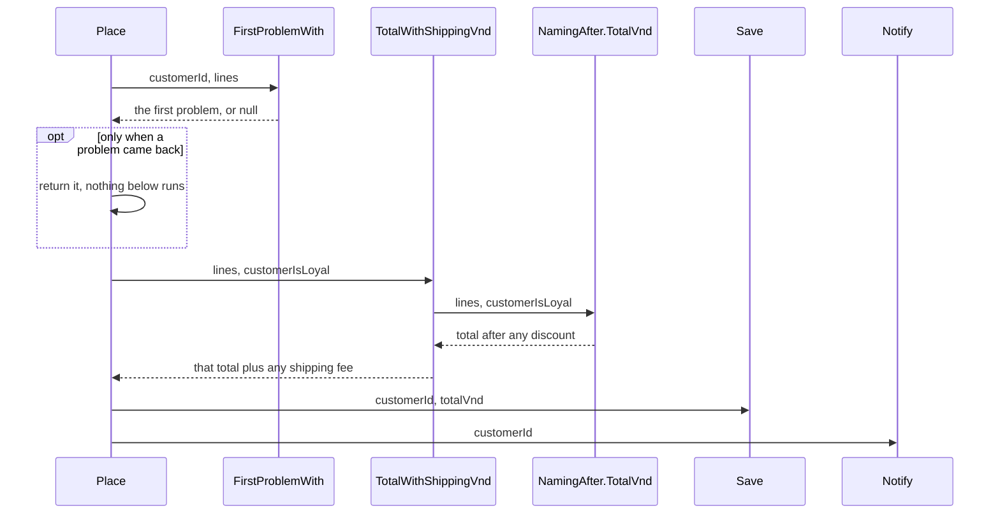

## Bạn cần biết trước

- [[foundation.l1.naming]] — đọc tên trước khi đọc thân hàm. Ở bài này, cái tên còn cho thấy một khối code có làm đúng một việc hay không.

## Tình huống

Bạn đang đọc các sample console của Đơn Hàng để tìm chỗ cộng phí vận chuyển vào đơn hàng. `PlaceOrderLong.cs` chứa một phương thức duy nhất, `Place`, dài 28 dòng. Nó kiểm tra đơn, cộng tiền các dòng hàng, trừ giảm giá cho khách thân thiết, cộng phí vận chuyển, rồi in ra rằng đơn đã được lưu và email đã được gửi. Không bước nào trong số đó có tên. Muốn chắc dòng nào là phí vận chuyển, bạn phải đọc hết. Muốn kiểm tra tổng tiền, bạn phải gọi `Place` và để nó in luôn phần còn lại. Code cần gì để từng bước tìm được, đọc được và kiểm tra được riêng lẻ?

## Khái niệm cốt lõi

- một việc — phần công việc mà bạn mô tả đúng sự thật thân hàm của nó bằng vài chữ, không cần chữ "và". Số dòng hay số vòng lặp không quyết định điều này. Thân hàm chỉ gọi các bước có tên để đi tới một kết quả thì được mô tả bằng chính kết quả đó. Thân hàm chứa luôn chi tiết của từng bước thì chỉ mô tả được bằng cách liệt kê chúng.
- tách hàm — chuyển một khối dòng code sang một hàm mới có tên, không viết lại các bước bên trong, rồi gọi hàm đó ở chỗ khối code từng nằm.
- đầu vào ẩn — giá trị mà hàm đọc nhưng không nằm trong cặp ngoặc tham số, như một static field hay một biến môi trường. Vì vậy hai lần gọi với cùng đối số có thể cho kết quả khác nhau. Hằng số không tính, vì lần gọi nào nó cũng như nhau.
- guard clause — một lệnh `if` ở đầu hàm, trả về ngay khi đầu vào không dùng được, để phần còn lại của hàm được coi đầu vào là hợp lệ.
- lồng nhau — một `if` hay vòng lặp nằm trong một `if` hay vòng lặp khác. Mỗi tầng đẩy code lùi sang phải một nấc và thêm một điều kiện người đọc phải nhớ.

## Cơ chế hoạt động



Sơ đồ cho thấy `Place` trong `PlaceOrderSplit.cs`, tức phương thức dài sau khi đã tách. Nó lần lượt gọi bốn hàm, mỗi hàm làm một việc gọi tên được đúng sự thật: tìm lỗi đầu tiên, tính tổng tiền kèm phí vận chuyển, lưu, thông báo. `TotalWithShippingVnd` giao một phần việc cho `NamingAfter.TotalVnd`, nằm trong `NamingAfter.cs`, sample của bài đặt tên. Hàm này vốn đã cộng tiền các dòng hàng và trừ giảm giá cho khách thân thiết, nên bản tách gọi lại nó thay vì chuyển các dòng đó sang. Một test (phương thức gọi một hàm với các giá trị chọn sẵn rồi kiểm tra kết quả) có thể kiểm tra `TotalVnd` chỉ với các dòng hàng và một giá trị có/không, không in gì ra.

Tách hàm giữ nguyên những gì code làm. Điều thay đổi là cách giá trị đi vào và đi ra: thứ khối code từng lấy từ `Place` giờ đến dưới dạng tham số, còn thứ nó tạo ra quay về dưới dạng giá trị trả về. Một lệnh `return` đã chuyển vào `FirstProblemWith` giờ chỉ kết thúc `FirstProblemWith`, nên `Place` phải kiểm tra thứ được trả về. `TotalVnd` chạy đúng các bước của bản dài. Số 10 trong `totalVnd * 10 / 100` (ở mục sau) giờ là `LoyaltyDiscountPercent`, một hằng số, nên không che giấu gì.

Không hàm nào đọc static field hay biến môi trường, nên cùng đối số thì cùng kết quả, và dòng đầu tiên của hàm, dòng có tên và cặp ngoặc tham số, cho bạn biết mọi thứ nó cần. Ít tham số hơn nghĩa là bên gọi hay test phải chuẩn bị ít hơn. Bớt một tham số bằng cách chuyển giá trị của nó vào static field thì không tính: giá trị đó vẫn cần, chỉ là bị giấu đi.

Khi `FirstProblemWith` trả về một lỗi, `Place` trả lỗi đó ra ngay: đó là guard clause. Mọi thứ bên dưới được coi đơn là hợp lệ và nằm sát lề trái. Nếu viết bằng các `if` lồng nhau, phần đó sẽ nằm bên trong `if` của từng phép kiểm tra, mỗi phép kiểm tra sâu thêm một tầng.

## Trong hệ thống Đơn Hàng

Bản dài, tới dòng gửi email:

```csharp file=samples/DonHang.Samples/Samples/Clean/PlaceOrderLong.cs tag=stage-0 lines=8-32
    public static string Place(int customerId, List<OrderLine> lines, bool customerIsLoyal)
    {
        if (customerId <= 0) return "the customer id is not valid";
        if (lines.Count == 0) return "an order needs at least one line";
        foreach (var line in lines)
        {
            if (line.Quantity <= 0) return "a line needs a quantity";
            if (line.UnitPriceVnd <= 0) return "a line needs a price";
        }

        var totalVnd = 0;
        foreach (var line in lines)
        {
            totalVnd += line.Quantity * line.UnitPriceVnd;
        }

        if (customerIsLoyal)
        {
            totalVnd -= totalVnd * 10 / 100;
        }

        totalVnd += totalVnd >= 2_000_000 ? 0 : 30_000;

        Console.WriteLine($"saving order for customer {customerId}, total {totalVnd}");
        Console.WriteLine($"sending an email to customer {customerId}");
```

Bốn việc dùng chung một thân hàm. Tên của nó, `Place`, không có chữ "và", nhưng muốn mô tả thân hàm này làm gì thì phải nói "kiểm tra và tính tổng và lưu và gửi email". Bản tách giữ tên `Place` mà vẫn đúng sự thật: thân hàm chỉ gọi bốn bước có tên để đi tới một kết quả, một đơn hàng đã đặt. Các `if` ở đầu kiểm tra đơn: hai cái đầu là guard clause, còn hai cái trong `foreach` cũng trả về sớm nhưng không nằm ở đầu hàm.

Vòng lặp thứ hai, phần giảm giá và dòng phí vận chuyển tính tiền. Dấu gạch dưới trong `2_000_000` chỉ để nhóm chữ số, và dòng đó cộng 30.000 đồng khi dưới 2.000.000, từ mức đó trở lên thì không cộng gì. Hai dòng `Console.WriteLine` đứng thay cho lưu và gửi email: trong sample này không có gì được ghi vào database và không email nào được gửi.

Bản tách, từ `Place` tới dòng phí vận chuyển. Khối code dừng trước dấu ngoặc đóng của `TotalWithShippingVnd`:

```csharp file=samples/DonHang.Samples/Samples/Clean/PlaceOrderSplit.cs tag=stage-0 lines=6-30
    public static string Place(int customerId, List<OrderLine> lines, bool customerIsLoyal)
    {
        var problem = FirstProblemWith(customerId, lines);
        if (problem is not null) return problem;

        var totalVnd = TotalWithShippingVnd(lines, customerIsLoyal);
        Save(customerId, totalVnd);
        Notify(customerId);

        return $"order placed, total {totalVnd}";
    }

    private static string? FirstProblemWith(int customerId, List<OrderLine> lines)
    {
        if (customerId <= 0) return "the customer id is not valid";
        if (lines.Count == 0) return "an order needs at least one line";
        if (lines.Any(line => line.Quantity <= 0)) return "a line needs a quantity";
        if (lines.Any(line => line.UnitPriceVnd <= 0)) return "a line needs a price";
        return null;
    }

    private static int TotalWithShippingVnd(List<OrderLine> lines, bool customerIsLoyal)
    {
        var totalVnd = NamingAfter.TotalVnd(lines, customerIsLoyal);
        return totalVnd + (totalVnd >= 2_000_000 ? 0 : 30_000);
```

`FirstProblemWith` trả về `string?`, tức một chuỗi có thể là `null`. Ở đây `null` nghĩa là không tìm thấy lỗi, và `if (problem is not null) return problem;` là guard clause. Khi các phép kiểm tra không phụ thuộc nhau, dạng phẳng này đòi hỏi ít hơn ở bất kỳ người đọc nào, mới hay có kinh nghiệm: không dòng nào bắt bạn nhớ nó đang nằm trong `if` nào.

`Save` và `Notify`, ngay bên dưới khối code, in ra hai dòng giống bản dài. Bốn hàm mới đều là `private`, chỉ gọi được từ bên trong class này, nên các test của repository chạm tới chúng qua `Place`: một test gọi cả hai phương thức `Place` với cùng một đơn hợp lệ và kiểm tra chúng trả về cùng một chuỗi. Nếu để public, `TotalWithShippingVnd` có thể được test riêng, vì nó không cần gì ngoài tham số của mình.

Thay bằng `TotalVnd` thì giữ nguyên các bước, còn viết lại các phép kiểm tra thì không. Bản dài kiểm tra từng dòng hàng bên trong một `foreach`. `FirstProblemWith` dùng `lines.Any(...)`, trả về true khi có dòng hàng nào thỏa điều kiện, trước tiên cho số lượng, sau đó cho giá. Cách này giữ cả bốn phép kiểm tra ở cùng một tầng, nhưng cũng đổi thông báo bạn nhận được khi một dòng thiếu giá và một dòng phía sau thiếu số lượng. Test với một đơn hợp lệ kia không cho thấy điều đó. Chuyển nguyên các dòng là phần an toàn. Viết lại chúng trong lúc chuyển là một thay đổi thứ hai, cần được kiểm tra riêng.

## Người mới hay nghĩ rằng…

- **"Tách code thành nhiều hàm làm nó chậm hơn và khó theo dõi hơn vì phải nhảy qua lại."** → Thực ra bạn chỉ nhảy khi cần xem chi tiết: `Place` bản tách đọc như bốn bước có tên, và bạn chỉ mở bước mình cần. Các lần gọi hàm có tốn thời gian đến mức nhận ra được không là chuyện phải đo, không phải đoán. Nếu đặt đơn có vẻ chậm, hãy đo xem thời gian đi đâu trước đã. Bạn sẽ nhận ra khi cần xem một bước: ở bản tách bạn đi thẳng tới `TotalWithShippingVnd`, còn ở bản dài bạn phải đọc từ đầu để chắc phần kiểm tra kết thúc ở đâu.
- **"Hàm có một vòng lặp thì là làm 'một việc'."** → Thực ra một việc là chuyện hàm làm gì, không phải nó được viết ra sao. `FirstProblemWith` có bốn `if` và không có `foreach`, và nó làm một việc: tìm lỗi đầu tiên. `Place` bản dài vẫn kiểm tra, tính tổng, lưu và gửi email kể cả khi hai vòng lặp của nó được gộp làm một. Bạn sẽ nhận ra khi cái tên đúng sự thật duy nhất của một hàm có chữ "và", hoặc khi đổi nội dung email lại phải sửa phương thức chứa quy tắc phí vận chuyển.

## Thử ngay (3 phút)

1. Từ thư mục gốc của repository ví dụ, chạy `dotnet run --project samples/DonHang.Samples -- place-order`. Các chữ sau `--` được chuyển cho chương trình sample, và `place-order` chọn sample này. Nó đặt một đơn cho khách không phải khách thân thiết, một món giá 1.250.000 đồng và hai món giá 450.000, qua `PlaceOrderLong` trước rồi `PlaceOrderSplit`, và in chuỗi mà mỗi `Place` trả về. Bản dài, ở phần dưới các dòng đã trích, trả về cùng chuỗi `order placed, total …` như bản tách.
2. Mở `samples/DonHang.Samples/Program.cs`. Ở dòng bắt đầu bằng `var lines =`, đổi `new(1, 1_250_000), new(2, 450_000)` thành `new(1, 0), new(0, 450_000)`, để dòng hàng thứ nhất không có giá và dòng thứ hai không có số lượng. Chạy lại đúng lệnh trên, rồi đổi dòng đó về như cũ.

Kết quả mong đợi: lần chạy đầu in cùng ba dòng hai lần: dòng lưu đơn, dòng gửi email, rồi `order placed, total 2150000`, nên với đơn này hai bản cho kết quả như nhau. Lần chạy thứ hai in hai dòng khác nhau, `a line needs a price` rồi `a line needs a quantity`: bản dài dừng ở giá của dòng hàng đầu tiên, còn `FirstProblemWith` kiểm tra mọi số lượng trước khi xét tới giá.

## Liên hệ

- [[foundation.l1.naming]] — nửa còn lại của cùng một thói quen: bài đó giúp cái tên nói đúng một thứ là gì, còn ở đây cái tên quyết định hàm kết thúc ở đâu.
- [[foundation.l1.code-smells-basic]] — bước tiếp theo: bài đó xếp lồng sâu và danh sách tham số dài vào các dấu hiệu cảnh báo, và đổi cấu trúc code theo từng bước nhỏ, an toàn.
- [[design.l1.solid-srp]] — một câu hỏi liên quan, đặt ra cho cả một class thay vì một hàm.
- [[foundation.l1.env-and-config]] — biến môi trường vốn được thiết kế làm đầu vào của chương trình. Nhưng khi được đọc bên trong một hàm nhỏ, nó thành đầu vào ẩn mà dòng đầu tiên của hàm không cho thấy.

## Tóm tắt 5 dòng

1. Hàm làm một việc thì đặt tên đúng sự thật được, test riêng được và dùng lại được. Trong một hàm dài làm nhiều việc, không bước nào làm được vậy.
2. Tách hàm mà giữ nguyên các bước thì giữ nguyên những gì code làm, miễn bên gọi kiểm tra thứ được trả về. Cần chữ "và" để đặt tên đúng sự thật nghĩa là có hai việc.
3. Không có đầu vào ẩn như static field hay biến môi trường thì cùng đối số cho cùng kết quả. Ít tham số hơn thì phải chuẩn bị ít hơn.
4. Guard clause trả về sớm khi đầu vào không dùng được, nên phần còn lại của hàm giữ phẳng, không bao giờ nằm trong `if` của một phép kiểm tra.
5. Chuyển nguyên các dòng là phần an toàn. Viết lại chúng trong lúc chuyển là một thay đổi thứ hai, và nó cần được kiểm tra riêng.
