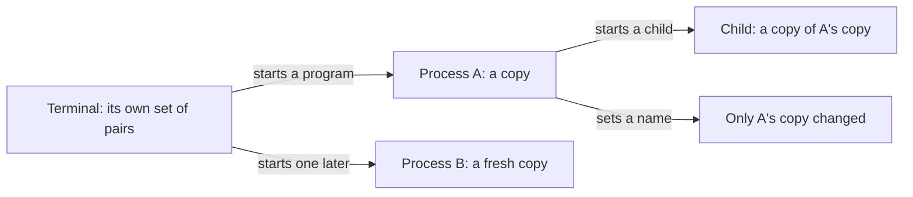

## Before you start

- [[foundation.l1.program-to-process]] — it showed that starting a program creates a process with memory of its own; this lesson adds the other thing the operating system hands to that run at the same moment: the values it starts with.

## The situation

You start the Đơn Hàng lab with `scripts/up.sh`. The lab box it starts is a process too, and it starts the scripts you run there. Inside it you run a script that prints the database password. The password appears. You read that script afterwards: it opens no file, it holds no password, and it asked you nothing. One file describes the lab box and only mentions the name of the password; the value itself sits in a second file beside it.

How does a value the program never reads out of a file get into the program?

## Core concepts

- **environment variable** — a name–value pair the operating system hands to a process when it starts, so the run can read a value without opening anything.
- environment — the whole set of those pairs that one process carries. Every process has one, and each process's set is a copy rather than a shared table.
- parent and child — the process that starts another, and the one it starts. The child begins with a copy of the parent's set, unless the parent hands it a different one.
- configuration — the inputs that decide how one run behaves: usually files it reads, the pairs it starts with, and the words typed after the program's name. A program may carry a default value in itself; among these inputs, what makes one run of the same file behave differently from another is what that run is handed.

## How it works



In the situation above, the terminal you type in is itself a process, and it carries a set of name–value pairs. When it starts a program, the operating system gives the new process its own copy of that set. A program that terminal starts later gets a fresh copy of its own, carrying whatever the terminal holds by then.

That one fact — the copy is made once, when the run begins — explains the rest. A program reads what was there when it started; nothing arrives afterwards, and the program is not watching anything.

And because a parent hands its child a copy the same way, the password in the situation travels in two copies, each made at a start. The command that starts the lab box reads it once from that second file, then creates the box with that value already in the box's set. The box then hands a copy of its own set to every script it runs.

Because the set is a copy, a program can change its own and whoever started it keeps what it had, and the copy it changed disappears when the run ends.

The same reasoning covers what does not happen. Set a name in one terminal, and a program already running in another will not see it: that run was handed its copy before you typed, and a second terminal has a set of its own.

This is why one file on disk behaves differently in two places: the instructions are identical, the values handed to the run are not. The address a run uses is the one handed to it, not the one fixed in the file — and a later lesson uses this to keep a password out of the files the whole team can read.

## In the Đơn Hàng system

The console sample under `samples/DonHang.Samples/` reads one name and prints what it decided. These are the lines inside its `Run()` method, which you start with `dotnet run --project samples/DonHang.Samples -- read-env`.

```csharp file=samples/DonHang.Samples/Samples/Computer/ReadEnv.cs tag=stage-0 lines=6-18
    private const string VariableName = "DONHANG_DB";

    public static void Run()
    {
        var configured = Environment.GetEnvironmentVariable(VariableName);
        var connectionString = configured ?? "Host=db;Database=donhang;Username=donhang";

        Console.WriteLine($"{VariableName} was {(configured is null ? "not set" : "set")}");
        Console.WriteLine($"the program will use: {connectionString}");

        Environment.SetEnvironmentVariable(VariableName, "changed inside this process");
        Console.WriteLine($"after changing it here: {Environment.GetEnvironmentVariable(VariableName)}");
        Console.WriteLine("the terminal that started this program still has its own value");
```

`Environment.GetEnvironmentVariable` returns `null` when the name has no value in this run's copy, and `??` turns that `null` into a value the program carries in itself, so the sample runs whether or not anything was handed to it. Notice the line with `??`: the address on its right — one string holding host, database and user — is the one written into the file, and the run reaches for it only when nothing was handed in. The value handed in is what differs from machine to machine. The run then sets the same name and reads it back, and the new value is there. The last line states what that setting did not do: the terminal that started the run keeps its own value, because the run has been working on a copy since it began.

The script under `scripts/computer/` makes the same three points from outside a program, and ends with the password from the situation. The block's second line first checks whether it is already inside the lab box; if it is not, it hands itself to `scripts/lab-run.sh`, which starts it again as a child of the box instead of a child of your terminal, so every line below is printed by a process in there.

```bash file=scripts/computer/env-demo.sh tag=stage-0 lines=4-17
# Everything below runs inside the lab box; this line puts it there.
[ -f /.dockerenv ] || exec "$(dirname "$0")/../lab-run.sh" "$0" "$@"

export DONHANG_GREETING='xin chào'
echo "this shell has: $(printenv DONHANG_GREETING)"

env DONHANG_GREETING='hello' sh -c 'echo "a child started with a different value sees: $DONHANG_GREETING"'
echo "this shell still has: $DONHANG_GREETING"

sh -c 'echo "a process started without the variable sees: [${DONHANG_MISSING:-nothing}]"'

echo
echo "the database password the lab uses comes in the same way:"
printenv PGPASSWORD
```

```text output=true
this shell has: xin chào
a child started with a different value sees: hello
this shell still has: xin chào
a process started without the variable sees: [nothing]

the database password the lab uses comes in the same way:
donhang-dev-password
```

`export` puts a name and a value into the set this run passes on, and `printenv` prints one of them — `printenv` is itself a program the script starts, so it reads the name out of a copy of the script's copy. On the next line `sh` is the program being started, with `-c '…'` as the words typed after its name, and the name inside those quotes is read by `sh`, out of the copy it was handed. `env DONHANG_GREETING='hello' …` starts that program with a different value and changes nothing for the run that did it, which is why the third line shows the same value as the first. The fourth line asks for a name nobody set, and `${DONHANG_MISSING:-nothing}` supplies a fallback when nothing was handed in — the same idea as `??` in the sample. The last value — the password from the situation, kept under the name `PGPASSWORD` — was typed nowhere in this script: it was put into the box's set when the box was created, and the box hands a copy to every script it runs.

## Beginners often think…

- **"If I set an environment variable, every running program sees the new value."** → Actually every one of those programs was handed its copy when it started, and nothing you type now reaches a copy that already exists. You notice this when you fix a wrong database address, leave the program running, and it keeps going to the old place until you stop it and start it again.
- **"Configuration is something the program contains."** → Actually the same file on disk is meant to run on your machine, on a colleague's and on the server, and what differs is what each run is handed, not the file. You notice this when a program that works for you fails for a teammate and the two of you are running byte-for-byte the same file.
- **"The program keeps an eye on the variable and picks up changes."** → Actually a run reads a value the way it reads any other input, at the moment it asks for it, from a copy that was fixed when the run began. You notice this when you change a value, wait, and nothing at all happens — not slowly, not eventually.

## Try it (3 minutes)

1. Start the lab box with `scripts/up.sh`, then run `scripts/computer/env-demo.sh` and note the fourth line it prints. This script re-runs itself inside the lab box, so the lines it prints come from a process the box started, not from a child of your terminal.
2. In your own terminal, type `export DONHANG_MISSING='I set this'`, then run `printenv DONHANG_MISSING` in that same terminal: it prints `I set this`, so your own copy really did take the value. Now run the script again and compare its fourth line with the first run.

Expected result: both runs print `a process started without the variable sees: [nothing]`. Your terminal did hand its copy to the command you typed, but the lines you are reading come from processes inside the lab box, which are handed their values by the box and not by you — a second place where the copy you can reach is not the copy that matters.

## Connections

- [[foundation.l1.program-to-process]] — the prerequisite, seen from a second angle: the set of pairs is handed over in the same instant, and for the same run, as the memory and the id it describes.
- [[foundation.l1.files-and-permissions]] — the other way configuration gets in, with the opposite failure: a file is read when the program asks and can change under it, while these values are fixed at the start.
- [[devops.l1.config-and-env]] — the same idea several layers up, where the values handed to a run come from a server's settings instead of your terminal.

## Five-line summary

1. A process is handed a copy of a set of name–value pairs when it starts, and reads configuration from that copy.
2. The copy is made once, at the start, so a value changed anywhere else never reaches a run that is already going.
3. A program that starts another passes on a copy, which is how the password reaches every script the lab box runs.
4. A program can change its own copy, and that change dies with the run and touches nobody else.
5. One file on disk behaves differently in two places because the values handed to each run differ, not because the instructions do.
