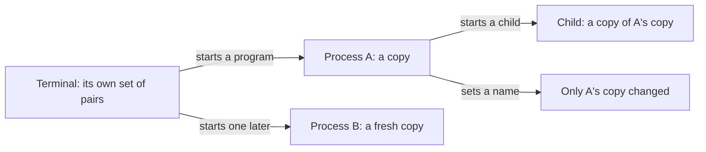

## Bạn cần biết trước

- [[foundation.l1.program-to-process]] — bài đó cho thấy chạy một chương trình là tạo ra một process có bộ nhớ riêng. Bài này thêm thứ còn lại mà hệ điều hành trao cho lần chạy đó ngay cùng lúc: các giá trị nó mang theo khi bắt đầu.

## Tình huống

Bạn bật lab Đơn Hàng bằng `scripts/up.sh`. Hộp lab mà lệnh này bật lên là một góc tách biệt trên máy bạn, có file riêng và process riêng. Bạn chạy `scripts/computer/env-demo.sh`. Script này tự chuyển vào trong hộp, được khởi chạy ở đó chứ không phải bởi terminal của bạn, rồi in ra mật khẩu database. Đọc lại script sau đó, bạn thấy nó không mở file nào, không chứa mật khẩu nào, và cũng không hỏi bạn gì. Một file, `docker-compose.yml`, mô tả hộp lab và chỉ nhắc tới tên của mật khẩu. Còn giá trị thật nằm ở file thứ hai, `.env`, ngay bên cạnh.

Chương trình không hề đọc giá trị đó từ file nào, vậy giá trị đi vào chương trình bằng đường nào?

## Khái niệm cốt lõi

- **biến môi trường** (environment variable) — một cặp tên–giá trị mà hệ điều hành (phần mềm trên máy lo khởi chạy và dừng mọi process) trao cho process khi nó khởi chạy, để lần chạy đọc được giá trị mà không phải mở thứ gì.
- môi trường — toàn bộ tập các cặp như thế mà một process mang theo. Process nào cũng có một tập, và tập của mỗi process là một bản sao chứ không phải một bảng dùng chung.
- process cha và process con — process khởi chạy process khác, và process được nó khởi chạy. Process con bắt đầu với bản sao tập của process cha, trừ khi process cha trao cho nó một tập khác.
- cấu hình — những đầu vào quyết định một lần chạy hoạt động ra sao: thường là các file nó đọc, các cặp nó mang theo lúc bắt đầu, và các từ gõ sau tên chương trình. Chương trình có thể tự mang một giá trị mặc định. Thứ làm hai lần chạy của cùng một file khác nhau là những gì mỗi lần chạy được trao.

## Cơ chế hoạt động



Terminal bạn đang gõ cũng là một process, và nó mang một tập các cặp tên–giá trị. Khi terminal khởi chạy một chương trình, hệ điều hành cho process mới một bản sao riêng của tập đó. Chương trình khởi chạy sau sẽ nhận một bản sao mới, chứa những gì terminal đang giữ ở thời điểm đó.

Chỉ một điều này, bản sao được tạo đúng một lần lúc lần chạy bắt đầu, đã giải thích mọi thứ còn lại. Chương trình đọc những gì có sẵn khi nó bắt đầu. Sau đó không có gì tự đến thêm.

Và vì process cha trao bản sao cho process con theo cùng cách đó, mật khẩu trong tình huống đi qua hai bản sao, mỗi bản được tạo ở một lần khởi chạy. `scripts/up.sh`, lệnh bật hộp lab, đọc mật khẩu một lần từ `.env` qua công cụ mà nó chạy. Sau đó nó tạo hộp với giá trị ấy, đặt dưới cái tên mà `docker-compose.yml` liệt kê, trong tập của hộp. Hộp nhận đúng tập đó khi được tạo, và mọi process mà hộp được yêu cầu khởi chạy đều bắt đầu với một bản sao của nó.

Chương trình có thể đổi bản sao của chính mình. Process đã khởi chạy nó vẫn giữ nguyên thứ nó có, và bản sao đã đổi biến mất khi lần chạy kết thúc.

Đặt một tên trong terminal này (bằng `export`, xem bên dưới), thì chương trình đang chạy ở terminal khác sẽ không thấy. Lần chạy đó đã nhận bản sao trước khi bạn gõ, và terminal thứ hai có tập riêng của nó.

Đây là lý do cùng một file trên đĩa chạy khác nhau ở hai nơi: lệnh bên trong giống hệt, còn giá trị trao cho lần chạy thì không. Chương trình viết như sample bên dưới ưu tiên giá trị được trao vào hơn giá trị cố định trong file. Một bài sau dùng điều này để giữ mật khẩu ngoài những file mà cả nhóm đều đọc được.

## Trong hệ thống Đơn Hàng

Sample console trong `samples/DonHang.Samples/` đọc một tên rồi in ra nó đã quyết định dùng gì. Dưới đây là tên nó đọc và các dòng trong phương thức `Run()`, bạn chạy bằng `dotnet run --project samples/DonHang.Samples -- read-env`.

```csharp file=samples/DonHang.Samples/Samples/Computer/ReadEnv.cs tag=stage-0 lines=6-18
    private const string VariableName = "DONHANG_DB";

    public static void Run()
    {
        var configured = Environment.GetEnvironmentVariable(VariableName);
        var connectionString = configured ?? "Host=db;Database=donhang;Username=donhang";

        Console.WriteLine($"{VariableName} was {(configured is null ? "not set" : "set")}");
        Console.WriteLine($"the program will use: {connectionString}");

        Environment.SetEnvironmentVariable(VariableName, "changed inside this process");
        Console.WriteLine($"after changing it here: {Environment.GetEnvironmentVariable(VariableName)}");
        Console.WriteLine("the terminal that started this program still has its own value");
```

`Environment.GetEnvironmentVariable` trả về `null` khi tên đó không có giá trị trong bản sao của lần chạy này, và `??` đổi `null` đó thành một giá trị chương trình tự mang theo. Ở dòng có `??`, địa chỉ bên phải (một chuỗi gồm host, database và user) là địa chỉ viết cứng trong file, và lần chạy chỉ dùng tới nó khi không có gì được trao vào. Tiếp theo, lần chạy đặt lại chính tên đó rồi đọc lại, và giá trị mới đã có ở đó. Dòng cuối nói rõ điều mà lệnh đặt giá trị kia không làm: terminal đã khởi chạy lần chạy vẫn giữ giá trị riêng, vì từ lúc bắt đầu lần chạy đã làm việc trên một bản sao. Chương trình không nhìn thấy tập của terminal, nên script bên dưới cho bạn thấy điều đó từ bên ngoài.

Script trong `scripts/computer/` chỉ ra đúng ba điểm đó từ bên ngoài chương trình, rồi kết thúc bằng mật khẩu trong tình huống. Dòng thứ hai của khối code kiểm tra xem script đã ở trong hộp lab chưa. Nếu chưa, nó tự giao mình cho `scripts/lab-run.sh`, script này khởi chạy lại nó bên trong hộp với tập các cặp của hộp thay cho tập của terminal. Vì thế mọi dòng bên dưới đều do một process trong hộp in ra.

```bash file=scripts/computer/env-demo.sh tag=stage-0 lines=4-17
# Everything below runs inside the lab box; this line puts it there.
[ -f /.dockerenv ] || exec "$(dirname "$0")/../lab-run.sh" "$0" "$@"

export DONHANG_GREETING='xin chào'
echo "this shell has: $(printenv DONHANG_GREETING)"

env DONHANG_GREETING='hello' sh -c 'echo "a child started with a different value sees: $DONHANG_GREETING"'
echo "this shell still has: $DONHANG_GREETING"

sh -c 'echo "a process started without the variable sees: [${DONHANG_MISSING:-nothing}]"'

echo
echo "the database password the lab uses comes in the same way:"
printenv PGPASSWORD
```

```text output=true
this shell has: xin chào
a child started with a different value sees: hello
this shell still has: xin chào
a process started without the variable sees: [nothing]

the database password the lab uses comes in the same way:
donhang-dev-password
```

`export` đặt một tên và một giá trị vào tập riêng của lần chạy này, và đó là tập nó truyền cho những gì nó khởi chạy. `printenv` in ra một cặp trong đó. Bản thân `printenv` cũng là một chương trình do script khởi chạy, nên nó đọc tên từ bản sao mà script trao cho. Các dòng bắt đầu bằng `this shell` nói về lần chạy của chính script, vì các dòng trong script được đọc và chạy bởi một chương trình như `sh`. Ở dòng tiếp theo, một `sh` thứ hai được khởi chạy làm process con, với `-c '…'` là các từ gõ sau tên nó, và tên nằm trong cặp nháy đó được `sh` đọc từ bản sao nó nhận. `env DONHANG_GREETING='hello' …` khởi chạy chương trình đó với một giá trị khác và không đổi gì ở lần chạy đã gọi nó. Vì thế dòng thứ ba in ra đúng giá trị như dòng đầu.

Dòng thứ tư hỏi một tên chưa ai đặt, và `${DONHANG_MISSING:-nothing}` cho một giá trị dự phòng khi không có gì được trao vào, giống ý tưởng của `??` trong sample. Giá trị cuối cùng là mật khẩu trong tình huống, giữ dưới tên `PGPASSWORD`. Không chỗ nào trong script này gõ nó ra. Nó được đặt vào tập của hộp khi hộp được tạo, và hộp trao một bản sao cho mọi script mà nó chạy.

## Người mới hay nghĩ rằng…

- **"Đặt một biến môi trường là mọi chương trình đang chạy đều thấy giá trị mới."** → Thực ra mỗi chương trình đó đã nhận bản sao của mình khi khởi chạy, và không gì bạn gõ bây giờ chạm được tới một bản sao đã tồn tại. Bạn sẽ nhận ra khi sửa một địa chỉ database bị sai nhưng để chương trình tiếp tục chạy, và nó vẫn đi tới chỗ cũ cho tới khi bạn dừng rồi khởi chạy lại.
- **"Cấu hình là thứ nằm sẵn trong chương trình."** → Thực ra cùng một file trên đĩa được dùng để chạy trên máy bạn, trên máy đồng nghiệp và trên server, và thứ khác nhau là những gì mỗi lần chạy được trao, không phải file. Bạn sẽ nhận ra khi một chương trình chạy được trên máy bạn nhưng hỏng trên máy đồng đội, trong khi hai người đang chạy cùng một file giống nhau tới từng byte.
- **"Chương trình theo dõi biến và tự cập nhật khi nó đổi."** → Thực ra đọc cùng một tên hai lần trong một lần chạy sẽ cho cùng một giá trị, trừ khi chính lần chạy đó đổi nó ở giữa, vì bản sao đã cố định từ lúc lần chạy bắt đầu và không gì bên ngoài tự ghi vào đó. Bạn sẽ nhận ra điều này trong sample: lần đọc thứ hai ra giá trị mới chỉ vì chính lần chạy đã đặt giá trị đó.

## Thử ngay (3 phút)

1. Bật hộp lab bằng `scripts/up.sh`, rồi chạy `scripts/computer/env-demo.sh` và ghi lại dòng thứ tư nó in ra. Script này tự chạy lại bên trong hộp lab, nên các dòng nó in ra đến từ một process được khởi chạy trong hộp, không phải từ một process con của terminal.
2. Trong terminal của bạn, gõ `export DONHANG_MISSING='I set this'`, rồi chạy `printenv DONHANG_MISSING` ngay trong terminal đó: nó in ra `I set this`. Giờ chạy lại script và so dòng thứ tư với lần chạy đầu.

Kết quả mong đợi: cả hai lần đều in `a process started without the variable sees: [nothing]`. Terminal có trao bản sao cho lệnh bạn gõ, nhưng các dòng bạn đang đọc đến từ process bên trong hộp lab, và chúng nhận giá trị từ hộp chứ không phải từ bạn. Đây là chỗ thứ hai cho thấy bản sao bạn chạm tới được không phải là bản sao quyết định kết quả.

## Liên hệ

- [[foundation.l1.program-to-process]] — bài tiên quyết, nhìn từ góc thứ hai: tập các cặp được trao cùng một khoảnh khắc, cho cùng một lần chạy, với bộ nhớ và id mà bài đó mô tả.
- [[foundation.l1.files-and-permissions]] — con đường còn lại để cấu hình đi vào, với kiểu hỏng ngược lại: file được đọc khi chương trình yêu cầu và có thể đổi trong lúc chương trình chạy, còn các giá trị này cố định từ lúc bắt đầu.
- [[devops.l1.config-and-env]] — cùng ý tưởng ở chặng xa hơn, nơi giá trị trao cho lần chạy đến từ cấu hình của server thay vì từ terminal của bạn.

## Tóm tắt 5 dòng

1. Khi khởi chạy, process nhận một bản sao của một tập các cặp tên–giá trị và đọc cấu hình từ bản sao đó.
2. Bản sao chỉ được tạo một lần, lúc bắt đầu, nên giá trị đổi ở nơi khác không tự đến được một lần chạy đang diễn ra.
3. Chương trình khởi chạy chương trình khác sẽ truyền đi một bản sao, và đó là cách mật khẩu tới được mọi script mà hộp lab chạy.
4. Chương trình có thể đổi bản sao của chính mình, và thay đổi đó mất cùng lần chạy, không ảnh hưởng tới ai khác.
5. Cùng một file trên đĩa chạy khác nhau ở hai nơi vì giá trị trao cho mỗi lần chạy khác nhau, không phải vì lệnh bên trong khác nhau.
