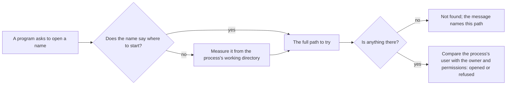

## Before you start

- [[foundation.l1.program-to-process]] — you saw the operating system build a process around a file on disk; this lesson is about two more things it attaches to that process: a folder to start from and a user to act as.

## The situation

You want a Đơn Hàng console sample to read a settings file, so you write `app.conf` into `samples/DonHang.Samples`, next to the `.cs` file that reads it. From the top of the example repository — the folder holding `samples/` and `scripts/` — you run `dotnet run --project samples/DonHang.Samples -- read-config-file`: this builds and runs the console project in that folder, and the word after `--` tells the program which sample to run. The answer is `not found`, and the full path it prints is that top folder, not the folder you put the file in, and not the one holding the compiled program. Your editor opens `app.conf` on the first try. When you hand a program a bare file name, where does it look?

## Core concepts

- path — the text you give the operating system to name a file; it is absolute when it names its own starting point, such as `/tmp/demo/app.conf` on Linux or `C:\demo\app.conf` on Windows, and relative when it does not.
- working directory — one folder the operating system attaches to every process, and the folder every relative path in that process is measured from.
- owner and permissions — every file and folder records who owns it and, for each kind of user, which of reading, writing and executing is allowed.
- the user a process runs as — a process acts as some user, and the operating system compares that user against the owner and permissions each time the process opens a file.
- bytes — a file holds bytes; text is bytes read under a rule the writer and the reader must share, including the rule for where a line ends.

## How it works



In the situation above, `app.conf` is a relative path: it names a file without saying where to start, so the operating system starts at the process's working directory. Whoever launches a process hands it a working directory, and a terminal — the window where you type commands — hands over the folder it is sitting in. That is why the program printed a path at the top of the repository: the folder you ran the command from.

A path that names its own starting point is absolute and means the same file whatever the working directory is: `/tmp/demo/app.conf` on Linux, `C:\demo\app.conf` on Windows. Any other path is relative, and the operating system measures it from the working directory before it looks.

If the folder can be searched and nothing is there, the answer is `not found`, and the message names the path tried. If something is there — or if the folder itself is closed to this process — one more check happens: the operating system compares the user your process runs as against the file's owner and permissions, and refuses if that user is not allowed what the program asked for, here reading. So one line of code has two common ways to fail, and the message says which.

Text is bytes, and the rule for where a line ends is not the same on every system: a file copied from one to another arrives with the writer's line endings. A program that runs a script takes the first word of each command line as the name of the thing to run, so that extra byte stays glued to the last word on the line — the command name itself when the line holds one word, and then the name looked up is not the name you can see.

## In the Đơn Hàng system

One sample's whole job is to say where it looked and what happened.

```csharp file=samples/DonHang.Samples/Samples/Computer/ReadConfigFile.cs tag=stage-0 lines=6-26
    private const string RelativePath = "app.conf";

    public static void Run()
    {
        Console.WriteLine($"working directory: {Directory.GetCurrentDirectory()}");
        Console.WriteLine($"this program lives in: {AppContext.BaseDirectory}");
        Console.WriteLine($"'{RelativePath}' therefore means '{Path.GetFullPath(RelativePath)}'");

        try
        {
            Console.WriteLine(File.ReadAllText(RelativePath));
        }
        catch (FileNotFoundException exception)
        {
            Console.WriteLine($"not found: {exception.FileName}");
        }
        catch (UnauthorizedAccessException exception)
        {
            Console.WriteLine($"found, but not allowed to read: {exception.Message}");
        }
    }
```

`RelativePath` is a bare name, so its three printed lines answer three questions: `Directory.GetCurrentDirectory()` is the working directory of this run, `AppContext.BaseDirectory` is where the compiled program sits, and `Path.GetFullPath` shows what the bare name comes to, always measured against the first of those, never the second. Run it from the top of the repository and the name resolves there; run it from inside `samples/DonHang.Samples` and it resolves there instead, from the same compiled files. The two `catch` blocks are the two failures from the diagram: `FileNotFoundException` when the folder exists but the file does not, `UnauthorizedAccessException` when this process may not open what is there.

The script under `scripts/computer/` makes the same two points from outside any program, without a line of C#. It runs on the small Linux machine the example repository starts for you with `scripts/up.sh`, and you need not run it yourself — the block after it is exactly what it prints.

In it, `rm -rf` removes a folder and everything in it, `mkdir -p` creates one, and `printf` with `>` writes the file. `stat` reports what the file system records about that file, with the letters after `-c` asking for the permissions, the owner, the group and the name; `chmod` changes that record. `whoami` names the user the script runs as, `cd` moves the working directory, `pwd` prints it, and `$( )` puts a command's output into the line being printed. `cat` prints a file's contents, `2>&1` sends its failure message to the same place as ordinary output, and `|| echo` prints a note after it.

```bash file=scripts/computer/permissions.sh tag=stage-0 lines=7-26
rm -rf /tmp/demo
mkdir -p /tmp/demo
cd /tmp/demo
printf 'port=8080\n' > app.conf

echo "who is this process running as: $(whoami)"
stat -c '%A %U:%G %n' app.conf

chmod 600 app.conf
stat -c '%A %U:%G %n' app.conf

echo
echo "working directory: $(pwd)"
echo "a relative path is resolved from there:"
cat app.conf

cd /
echo "working directory: $(pwd)"
cat app.conf 2>&1 || echo "the same relative path now finds nothing"
cat /tmp/demo/app.conf
```

```text output=true
who is this process running as: root
-rw-r--r-- root:root app.conf
-rw------- root:root app.conf

working directory: /tmp/demo
a relative path is resolved from there:
port=8080
working directory: /
cat: app.conf: No such file or directory
the same relative path now finds nothing
port=8080
```

Those two `stat` lines are that record: they say what the owner may do, then what other users may do, using `r` for reading, `w` for writing, `x` for executing and a dash where it is not allowed. On this machine the file the script has just created prints as `-rw-r--r--`, owned by `root`; `chmod 600` narrows it to `-rw-------`, which leaves the owner reading and writing and every other ordinary user nothing. This run still reads the file afterwards not because `root` owns it, but because `whoami` says the process runs as `root`, the one user a Linux machine does not check against these permissions when it reads or writes a file. The second half of `root:root` names a grouping of users this lesson does not use.

The rest of the script changes nothing on disk and only moves: the same `cat app.conf` prints the file while the working directory is `/tmp/demo`, finds nothing from `/`, and the absolute path works from both. Nothing about the file differed between those two attempts; only where the process was standing did.

## Beginners often think…

- **"A relative path is relative to where my source file is."** → Actually it is measured from the working directory of the running process, which whoever starts it decides and which has nothing to do with your source tree. You notice this when the same program finds the file from one folder and not from another, without a line of code changing.
- **"If I can open the file in my editor, my program can open it too."** → Actually your editor and your program are two processes, possibly running as different users and starting from different folders, so each gets its own answer for the same name. You notice this when a program on another machine cannot read a file you open over your own login without trouble.
- **"A file that works on my laptop works the same on a Linux server."** → Actually a text file written by a Windows tool that follows the Windows convention ends each line with one byte more than a Linux tool writes, and a plain copy carries those bytes across unchanged. You notice this when a script copied across fails naming a command you can see is spelled correctly, and the message prints that word with something extra after it, which a genuinely missing command would not have.

## Try it (3 minutes)

1. From the top of the example repository, run `dotnet run --project samples/DonHang.Samples -- read-config-file` and read the third line it prints.
2. Delete `samples/DonHang.Samples/app.conf` if you created it while reading The situation. Create `app.conf` at the top of the repository containing the single line `port=8080`, and run the same command again.
3. Run `cd samples/DonHang.Samples` to move there, then run `dotnet run -- read-config-file`; `--project` can be left out once you stand in the project's own folder.

Expected result: the first run ends with `not found`, the second prints `port=8080`, and the third ends with `not found` again with a path inside `samples/DonHang.Samples` — the same compiled program, three answers, decided only by the folder you ran it from.

## Connections

- [[foundation.l1.program-to-process]] — the same creation moment one step further: the working directory and the user are attached to a process exactly when the operating system builds it.
- [[foundation.l1.terminal-basics]] — the practical half of this one: the commands that move you between folders, so you can put a process where its paths make sense.
- [[foundation.l1.env-and-config]] — the other route settings take into a program, for when a file at a fixed place is the wrong answer.

## Five-line summary

1. A relative path is measured from the working directory of the running process, never from your source file or the compiled program's folder.
2. Whoever starts a process decides its working directory, so the same program finds a file from one folder and not from another.
3. Every file has an owner and permitted actions; a process runs as a user, and the operating system compares them on each open.
4. "Not found" and "not allowed" are different failures, and the path in the message tells you where the program actually looked.
5. A file is bytes, so text moved between systems keeps its line endings, which is how a working script breaks on another machine.
