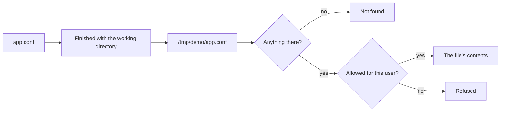

## Before you start

- [[foundation.l1.program-to-process]] — you saw that running a program creates a process with its own memory and its own id. This lesson adds the other thing the operating system remembers for every run: where that run is standing on disk.

## The situation

You are reading through the Đơn Hàng scripts and run `scripts/computer/permissions.sh`. It creates a small file called `app.conf`, prints what is in it, and everything looks ordinary. Two lines further down, the same script asks for `app.conf` again — same name, same run — and the answer is `No such file or directory`. Nothing deleted it: the last line prints the file in full. The only thing that changed was where the run was standing. Why does one name mean a file at one moment and nothing at the next?

## Core concepts

- path — the text a program hands to the operating system to say which file it means.
- absolute path — a path that starts at the top of the file tree, written `/` on a Linux machine, so it names the same file from anywhere.
- relative path — a path that does not start at the top, and names nothing until the operating system finishes it.
- working directory — the folder the operating system remembers for each process, and the one its relative paths are finished from.
- owner and permissions — what a file or folder records about who may use it: the user that owns it, the group that owns it — a named set of users the machine keeps — and what reading, writing and running each is allowed.

## How it works



In the situation above, `app.conf` is a relative path: on its own it names nothing, and the operating system finishes it with the working directory of the run — in the script below, `/tmp/demo`. Every process has one, and it can change mid-run. Standing in `/tmp/demo`, the run turns `app.conf` into `/tmp/demo/app.conf` and reads it; standing in `/`, the same name becomes `/app.conf` and finds nothing. An absolute path skips all this and works from anywhere.

The working directory is not the folder the program file sits in; a program can print both and get different answers. A run starts with the working directory of whatever started it: a program launched from a terminal begins where that terminal stood. This is what happened in the situation above: the name was right, the place it was finished from was not.

Once the name is right, two things can still surprise you: who may open the file, and how its lines end. A file or folder records who owns it and what reading, writing and running are allowed for the owner, the group and everyone else. A process normally acts with the permissions of the user that started it and does not pick that user; a few programs are set up to act as another user, and none here is. So a file can exist, be named correctly, and still refuse to open — a different failure from absence.

Windows tools traditionally end a line of text with two bytes, a carriage return then a line feed; Linux and macOS use the line feed alone, so a Windows line carries one byte more. Those bytes are stored in the file, so the difference travels with it, glued to the last word of each line.

## In the Đơn Hàng system

Start the console sample under `samples/DonHang.Samples/` from the top folder of the example system with `dotnet run --project samples/DonHang.Samples -- read-config-file`. It prints that folder, then the folder the program file sits in, then that first folder with `app.conf` added, then `not found:` with that same path. The `--project` argument is itself a relative path, so the command runs only from that top folder; from `samples/DonHang.Samples`, `dotnet run --project . -- read-config-file` runs the sample there and changes the first line. `RelativePath`, declared just above the part shown here, is `app.conf`.

```csharp file=samples/DonHang.Samples/Samples/Computer/ReadConfigFile.cs tag=stage-0 lines=10-25
        Console.WriteLine($"working directory: {Directory.GetCurrentDirectory()}");
        Console.WriteLine($"this program lives in: {AppContext.BaseDirectory}");
        Console.WriteLine($"'{RelativePath}' therefore means '{Path.GetFullPath(RelativePath)}'");

        try
        {
            Console.WriteLine(File.ReadAllText(RelativePath));
        }
        catch (FileNotFoundException exception)
        {
            Console.WriteLine($"not found: {exception.FileName}");
        }
        catch (UnauthorizedAccessException exception)
        {
            Console.WriteLine($"found, but not allowed to read: {exception.Message}");
        }
```

The first two lines print two different folders: `Directory.GetCurrentDirectory()` is the working directory of this run, `AppContext.BaseDirectory` the base directory of the application, here the folder holding the built program files. The third line shows the answer in advance: `Path.GetFullPath` finishes a relative path the same way opening it would, so printing the full path shows where the run actually looked. The two `catch` blocks keep the failures apart: `FileNotFoundException` when nothing sits at that path, its `FileName` holding that path in full; `UnauthorizedAccessException` when something does sit there and this user may not read it.

The script under `scripts/computer/` makes the same two points from outside a program, on a file it creates. Its commands: `rm -rf` deletes a folder and everything in it, `mkdir -p` creates one, `printf` with `>` writes the file, `whoami` prints the user this run acts as, `cat` prints what is in a file, and `chmod` changes what a file allows — `600` asking for reading and writing for the owner and nothing for anyone else. `stat` prints what the file records — the permissions, the owner, the group and the name, in that order — which is where each `-rw-r--r-- root:root app.conf` line comes from. In such a string, the nine characters after the first are three groups of three — owner, then group, then everyone else — each showing reading, writing and running, with `-` for what is not allowed.

```bash file=scripts/computer/permissions.sh tag=stage-0 lines=7-26
rm -rf /tmp/demo
mkdir -p /tmp/demo
cd /tmp/demo
printf 'port=8080\n' > app.conf

echo "who is this process running as: $(whoami)"
stat -c '%A %U:%G %n' app.conf

chmod 600 app.conf
stat -c '%A %U:%G %n' app.conf

echo
echo "working directory: $(pwd)"
echo "a relative path is resolved from there:"
cat app.conf

cd /
echo "working directory: $(pwd)"
cat app.conf 2>&1 || echo "the same relative path now finds nothing"
cat /tmp/demo/app.conf
```

```text output=true
who is this process running as: root
-rw-r--r-- root:root app.conf
-rw------- root:root app.conf

working directory: /tmp/demo
a relative path is resolved from there:
port=8080
working directory: /
cat: app.conf: No such file or directory
the same relative path now finds nothing
port=8080
```

Read the output in two halves. The first three lines are about permissions: the run acts as `root`, the user a Linux machine gives every permission to; the file it just created is owned by the user `root` and the group `root`, the pair in `root:root`; and the two strings beginning `-rw` are the same file before and after `chmod`. Those permissions do not stop this run from reading the file, which is why the read further down still succeeds; the refusal happens to a run acting as an ordinary user. So this output never shows a refusal; what one looks like is the `found, but not allowed to read:` line of the sample above.

The second half is about paths: `cd` moves the run and `pwd` prints where it is standing, so the same `cat app.conf` succeeds from `/tmp/demo` and fails from `/`. On that failing line, `2>&1` puts the failure message into the same output as everything else, and `||` adds the note only when `cat` fails. The file did not move: from `/`, the whole path from the top opens it.

## Beginners often think…

- **"A relative path is relative to where my source file is."** → Actually it is finished with the working directory of the run, which whoever started the run chose. You notice this when a file your program reads is found from your editor and not found when a colleague starts it from another folder.
- **"If I can open the file in my editor, my program can open it too."** → Actually opening depends on the user the run acts as and on what the file allows that user; your editor may act as a different user from the one your program gets. You notice this when something that works on your laptop reports on a server that it may not read a file that is plainly there.
- **"A text file is a text file; copying it between Windows and Linux changes nothing."** → Actually the bytes at the end of every line differ, and they travel with the file. You notice this when a script written on Windows is run on Linux and stops on a line whose first word it treats as the name of a program to run: the extra byte is glued to that word, so the name it reports is one character longer than the one you typed.

## Try it (3 minutes)

1. Start the example system with `scripts/up.sh` — it starts a small Linux machine — then run `scripts/computer/permissions.sh` from the same terminal; the script puts itself on that machine, which is why its output shows `root` and `/tmp/demo`.
2. Read the output in two passes: first the two lines beginning `-rw`, then the two lines beginning `working directory:` with what follows each.

Expected result: the two `-rw` lines describe one file before and after its permissions change, the second allowing the owner what the first allowed and nobody else anything. Below them, `app.conf` is read from `/tmp/demo`, the same name finds nothing from `/`, and the last line reads it anyway by naming it from the top.

## Connections

- [[foundation.l1.program-to-process]] — the same run from the other side: that lesson gave each process its memory and its id, this one a place to stand on disk.
- [[foundation.l1.env-and-config]] — the other road settings take into a program: values the operating system hands the run at startup, instead of a file it has to find.
- [[foundation.l1.terminal-basics]] — the same commands to type rather than ideas: moving the working directory and looking at files.

## Five-line summary

1. A relative path names nothing on its own: the operating system finishes it with the working directory of the process that asked.
2. The working directory belongs to the run, not to the folder the program file or your source file sits in.
3. A "file not found" can be a correct name finished from an unexpected place, so printing the whole path shows where the run looked.
4. Every file and folder records an owner and what reading, writing and running it allows owner, group and others; a run uses its user's permissions.
5. The bytes that end a line of text differ between Windows and Linux, and they travel with the file.
