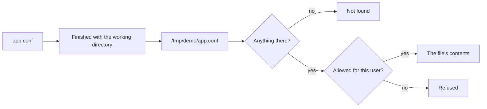

## Bạn cần biết trước

- [[foundation.l1.program-to-process]] — bài đó cho thấy chạy một chương trình là tạo ra một process có bộ nhớ riêng và id riêng. Bài này thêm thứ còn lại mà hệ điều hành giữ cho mỗi lần chạy: lần chạy đó đang đứng ở đâu trên đĩa.

## Tình huống

Bạn đang đọc qua các script của Đơn Hàng và chạy `scripts/computer/permissions.sh`. Script tạo một file nhỏ tên `app.conf`, in nội dung của nó ra, và mọi thứ trông bình thường. Vài dòng bên dưới, cũng script đó hỏi lại `app.conf`, cùng tên, cùng lần chạy, và nhận về `No such file or directory`. Không ai xóa file: dòng cuối vẫn in đầy đủ nội dung của nó. Thứ duy nhất thay đổi là chỗ lần chạy đang đứng. Vì sao cùng một cái tên lúc này chỉ tới một file, lúc sau lại không chỉ tới gì?

## Khái niệm cốt lõi

- đường dẫn (path) — đoạn chữ chương trình đưa cho hệ điều hành để nói nó muốn file nào.
- đường dẫn tuyệt đối — đường dẫn bắt đầu từ gốc cây thư mục, trên máy Linux viết là `/`, nên từ đâu nó cũng chỉ tới cùng một file.
- đường dẫn tương đối — đường dẫn không bắt đầu từ gốc, và chưa chỉ tới gì cho tới khi hệ điều hành ghép nó cho đủ.
- thư mục làm việc (working directory) — thư mục hệ điều hành ghi nhớ cho từng process, và là nơi các đường dẫn tương đối của process đó được ghép vào.
- chủ sở hữu và quyền — những gì một file hay thư mục ghi lại về ai được dùng nó: user sở hữu nó, group sở hữu nó (một tập user có tên mà máy quản lý), và mỗi bên được đọc, ghi, chạy tới đâu.

## Cơ chế hoạt động



Trong tình huống trên, `app.conf` là đường dẫn tương đối: tự nó không chỉ tới gì, và hệ điều hành ghép nó với thư mục làm việc của lần chạy, ở script bên dưới là `/tmp/demo`. Process nào cũng có một thư mục làm việc, và thư mục đó có thể đổi giữa chừng. Khi đứng ở `/tmp/demo`, lần chạy biến `app.conf` thành `/tmp/demo/app.conf` rồi đọc nó. Khi đứng ở `/`, cùng cái tên đó thành `/app.conf` và không tìm thấy gì.

Thư mục làm việc không phải là thư mục chứa file chương trình, và hai thư mục này có thể khác nhau. Lần chạy bắt đầu ở thư mục làm việc mà bên khởi chạy trao cho nó. Mặc định đó là thư mục của chính bên khởi chạy, nên chương trình mở từ terminal sẽ bắt đầu ở chỗ terminal đang đứng. Trong tình huống trên, cái tên không sai. Sai là chỗ nó được ghép vào.

Tên đúng vẫn chưa đủ. Trên máy Linux, mỗi file hay thư mục ghi lại ai sở hữu nó, và chủ sở hữu, group, những người còn lại được đọc, ghi, chạy tới đâu. Process thường hoạt động với quyền của user đã khởi chạy nó, và không tự chọn user đó. Vì thế một file có thể tồn tại, được gọi đúng tên, mà vẫn từ chối mở. Đây là kiểu hỏng khác với không tồn tại.

File mở được rồi vẫn có thể chứa những byte bạn không ngờ tới. Công cụ trên Windows xưa nay kết thúc mỗi dòng văn bản bằng hai byte, carriage return rồi line feed. Linux và macOS chỉ dùng line feed, nên một dòng viết trên Windows dài hơn một byte. Những byte đó nằm trong file, nên chép nguyên file đi đâu thì phần khác biệt cũng đi theo, dính vào từ cuối của mỗi dòng.

## Trong hệ thống Đơn Hàng

Chạy sample console trong `samples/DonHang.Samples/` từ thư mục gốc của hệ thống ví dụ bằng `dotnet run --project samples/DonHang.Samples -- read-config-file`. Phần sau `--` được chuyển cho sample, và `read-config-file` chọn sample nào chạy. Sample in ra thư mục đó, rồi thư mục chứa file chương trình, rồi thư mục đầu tiên ghép thêm `app.conf`, rồi `not found:` kèm chính đường dẫn ấy. Tham số `--project` cũng là một đường dẫn tương đối, nên lệnh này chỉ chạy được từ thư mục gốc đó. Từ `samples/DonHang.Samples`, nơi `.` chỉ chính thư mục làm việc, lệnh `dotnet run --project . -- read-config-file` chạy sample ở đó và làm đổi dòng thứ nhất, thứ ba và thứ tư. `RelativePath`, khai báo ngay phía trên đoạn code dưới đây, có giá trị `app.conf`.

```csharp file=samples/DonHang.Samples/Samples/Computer/ReadConfigFile.cs tag=stage-0 lines=10-25
        Console.WriteLine($"working directory: {Directory.GetCurrentDirectory()}");
        Console.WriteLine($"this program lives in: {AppContext.BaseDirectory}");
        Console.WriteLine($"'{RelativePath}' therefore means '{Path.GetFullPath(RelativePath)}'");

        try
        {
            Console.WriteLine(File.ReadAllText(RelativePath));
        }
        catch (FileNotFoundException exception)
        {
            Console.WriteLine($"not found: {exception.FileName}");
        }
        catch (UnauthorizedAccessException exception)
        {
            Console.WriteLine($"found, but not allowed to read: {exception.Message}");
        }
```

Hai dòng đầu in ra hai thư mục khác nhau. `Directory.GetCurrentDirectory()` là thư mục làm việc của lần chạy này, còn `AppContext.BaseDirectory` là thư mục gốc của ứng dụng, ở đây là thư mục chứa các file chương trình đã build. Dòng thứ ba cho thấy lần chạy đã tìm ở đâu: `Path.GetFullPath` ghép một đường dẫn tương đối đúng như khi mở nó. Hai khối `catch` tách riêng hai kiểu hỏng. `FileNotFoundException` xảy ra khi không có gì ở đường dẫn đó, và `FileName` của nó giữ đầy đủ đường dẫn ấy. `UnauthorizedAccessException` xảy ra khi có thứ nằm ở đó nhưng user này không được đọc.

Script trong `scripts/computer/` chỉ ra đúng hai điểm đó trên một file do chính nó tạo. Các lệnh của nó: `rm -rf` xóa một thư mục cùng mọi thứ bên trong, `mkdir -p` tạo thư mục, `printf` với `>` ghi file, `echo` in một dòng, `$( )` chèn output của một lệnh, `whoami` in user mà lần chạy này đang hoạt động dưới danh nghĩa, `cat` in nội dung file, và `chmod` đổi những gì file cho phép. Ở đây `600` yêu cầu quyền đọc và ghi cho chủ sở hữu, không cho ai khác quyền gì. `stat` in ra những gì file ghi lại, theo thứ tự: quyền, chủ sở hữu, group và tên. Mỗi dòng `-rw-r--r-- root:root app.conf` đến từ đó.

Trong chuỗi như vậy, ký tự đầu cho biết loại, `-` là file thường. Chín ký tự sau chia thành ba nhóm ba: chủ sở hữu, rồi group, rồi những người còn lại. Mỗi nhóm hiện `r` là đọc, `w` là ghi, `x` là chạy, và `-` cho quyền không được phép.

```bash file=scripts/computer/permissions.sh tag=stage-0 lines=7-26
rm -rf /tmp/demo
mkdir -p /tmp/demo
cd /tmp/demo
printf 'port=8080\n' > app.conf

echo "who is this process running as: $(whoami)"
stat -c '%A %U:%G %n' app.conf

chmod 600 app.conf
stat -c '%A %U:%G %n' app.conf

echo
echo "working directory: $(pwd)"
echo "a relative path is resolved from there:"
cat app.conf

cd /
echo "working directory: $(pwd)"
cat app.conf 2>&1 || echo "the same relative path now finds nothing"
cat /tmp/demo/app.conf
```

```text output=true
who is this process running as: root
-rw-r--r-- root:root app.conf
-rw------- root:root app.conf

working directory: /tmp/demo
a relative path is resolved from there:
port=8080
working directory: /
cat: app.conf: No such file or directory
the same relative path now finds nothing
port=8080
```

Ba dòng đầu nói về quyền. Lần chạy hoạt động dưới danh nghĩa `root`, một user không bị kiểm tra quyền đọc và ghi file. File vừa tạo thuộc về user `root` và group `root`, chính là cặp trong `root:root`. Hai chuỗi bắt đầu bằng `-rw` là cùng một file trước và sau `chmod`. Các quyền đó không cản lần chạy này đọc file, vì file thuộc về nó và vẫn cho chủ sở hữu đọc. Lần chạy dưới danh nghĩa một user thường mới bị từ chối. Vì thế output này không bao giờ cho thấy một lần từ chối.

Phần còn lại nói về đường dẫn. `cd` chuyển chỗ đứng của lần chạy và `pwd` in ra chỗ đó, nên cùng lệnh `cat app.conf` thành công từ `/tmp/demo` và thất bại từ `/`. Ở dòng thất bại, `2>&1` đưa thông báo lỗi vào cùng output với mọi thứ khác, và `||` chỉ thêm dòng ghi chú khi `cat` thất bại. File không hề di chuyển: đứng ở `/`, đường dẫn đầy đủ từ gốc vẫn mở được nó.

## Người mới hay nghĩ rằng…

- **"Đường dẫn tương đối là tương đối so với chỗ file mã nguồn của mình."** → Thực ra nó được ghép với thư mục làm việc của lần chạy, do ai khởi chạy lần chạy đó chọn. Bạn sẽ nhận ra khi file chương trình cần đọc tìm thấy được lúc chạy từ editor, nhưng không tìm thấy khi đồng nghiệp khởi chạy từ thư mục khác.
- **"Mở được file trong editor thì chương trình cũng mở được."** → Thực ra mở được hay không phụ thuộc vào user mà lần chạy hoạt động dưới danh nghĩa và những gì file cho user đó làm. Editor có thể chạy dưới một user khác với user mà chương trình nhận được. Bạn sẽ nhận ra khi thứ chạy tốt trên laptop lại báo trên server rằng nó không được đọc một file rõ ràng đang nằm đó.
- **"File văn bản thì là file văn bản, chép qua lại giữa Windows và Linux chẳng đổi gì."** → Thực ra các byte cuối mỗi dòng khác nhau, và chép thẳng thì chúng đi theo. Bạn sẽ nhận ra khi một script viết trên Windows chạy trên Linux và báo không tìm thấy lệnh ở một dòng mà lệnh đó là từ duy nhất. Byte thừa dính vào từ đó, nên cái tên trong thông báo là tên bạn gõ cộng thêm byte ấy (thông báo lỗi hiện byte đó là `\r`), và các dòng sau vẫn chạy tiếp.

## Thử ngay (3 phút)

1. Bật hệ thống ví dụ bằng `scripts/up.sh` (lệnh này bật một máy Linux nhỏ bên trong máy bạn), rồi chạy `scripts/computer/permissions.sh` từ cùng terminal. Script tự chạy trên máy đó, nên user `root` và các thư mục hiện ra là của máy đó, không phải của bạn.
2. Đọc output làm hai lượt: trước hết là hai dòng bắt đầu bằng `-rw`, sau đó là hai dòng bắt đầu bằng `working directory:` cùng những gì theo sau mỗi dòng.

Kết quả mong đợi: hai dòng `-rw` mô tả một file trước và sau khi đổi quyền, dòng thứ hai cho chủ sở hữu đúng những gì dòng đầu cho, và không cho ai khác quyền gì. Bên dưới, `app.conf` được đọc từ `/tmp/demo`, cùng tên đó không tìm thấy gì từ `/`, và dòng cuối vẫn đọc được file nhờ gọi nó bằng đường dẫn từ gốc.

## Liên hệ

- [[foundation.l1.program-to-process]] — bài đó cho mỗi process bộ nhớ và id, bài này cho nó một chỗ đứng trên đĩa.
- [[foundation.l1.env-and-config]] — những giá trị hệ điều hành trao cho lần chạy lúc khởi động, thay vì một file mà nó phải tự tìm.
- [[foundation.l1.terminal-basics]] — tự gõ các lệnh này: chuyển thư mục làm việc và xem file.

## Tóm tắt 5 dòng

1. Đường dẫn tương đối tự nó không chỉ tới gì: hệ điều hành ghép nó với thư mục làm việc của process đã hỏi.
2. Thư mục làm việc thuộc về lần chạy, không phải thư mục chứa file chương trình hay file mã nguồn.
3. Lỗi "file not found" có thể là một tên đúng được ghép từ một chỗ không ngờ, nên in ra đường dẫn đầy đủ sẽ cho thấy lần chạy đã tìm ở đâu.
4. Trên Linux, mỗi file và thư mục ghi lại chủ sở hữu và những gì nó cho chủ sở hữu, group và người khác làm, và lần chạy dùng quyền của user mà nó hoạt động dưới danh nghĩa.
5. Các byte kết thúc dòng văn bản khác nhau giữa Windows và Linux, và chép thẳng thì chúng đi theo file.
