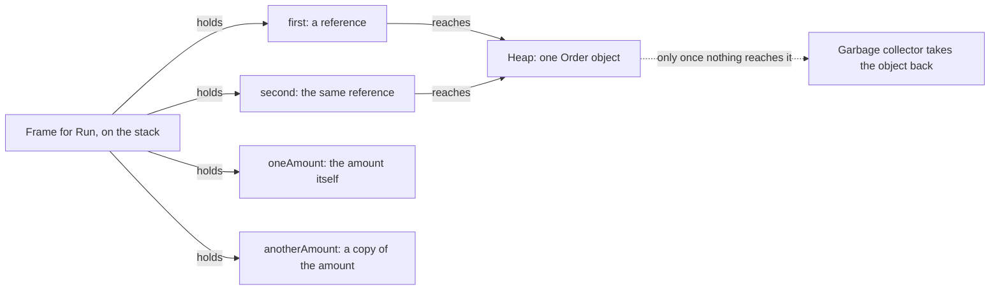

## Before you start

- [[foundation.l1.program-to-process]] — you saw that running a program gives it memory of its own. This lesson goes inside that memory and asks where each variable sits.

## The situation

You are working through the Đơn Hàng console samples. One sample makes an order whose total is `1250000` and puts it in a variable called `first`. It copies `first` into `second`, sets `second`'s total to zero, then prints `first` — and it prints zero, although you only changed `second`. A few lines below, the same three steps — make one, copy it into a second variable, change the second one — leave an amount of money untouched. Nothing was passed to another method, nothing was saved anywhere, and the two pieces of code have the same shape. Why does one assignment change something you never named, and the other one does not?

## Core concepts

- call frame — the block of memory a method gets while it runs, for its local variables.
- **stack** — the part of a process's memory where call frames are added as methods are called and removed as they return, in the reverse order.
- **heap** — the part of a process's memory where objects of a type declared with `class` live; such an object stays after the method that created it has returned.
- reference — what a variable of a class type holds: not the object itself, but a way to reach the one object on the heap.
- value type and reference type — a value type variable holds the data itself; a reference type variable holds a reference to data that lives elsewhere.
- **garbage collector** — the part of the .NET runtime (the execution environment .NET gives your program while it runs) that finds heap objects the running program can no longer reach and takes their memory back, without being asked.

## How it works



In the situation above, the method that does those three steps is called `Run`, and while it runs the stack holds one frame for it. The four local variables belong to that frame, each in its own slot (its place in the frame): `first` and `second`, which hold the order, and `oneAmount` and `anotherAmount`, which hold the amount. Exactly where the .NET runtime puts each slot is its own business; what matters here is that the slots live and die with the frame. When `Run` returns, the whole frame goes at once, and the four variables with it. That is why this memory needs no decision to release: it is taken back with the call that owns it — the frame added last is the first one to go.

What each of those four slots holds is where the two halves differ. `new Order` puts an object on the heap and gives the frame a reference to it. Copying `first` into `second` copies that reference, so both slots reach the one object; changing the total through either slot changes that object, which is what you saw. An amount of money is a value type here, so the `oneAmount` slot holds the amount itself. Copying it into `anotherAmount` produces a second, independent amount, and setting one of them to zero says nothing about the other.

The object on the heap outlives the frame that made it, because heap memory is not tied to any one call. What ends it is the garbage collector: the .NET runtime takes back heap objects the running program can no longer reach, and it chooses when to collect. You never free heap memory by hand, and nothing in this code makes a particular object's memory come back at a particular line.

## In the Đơn Hàng system

The console sample project has one file for this lesson. It declares two small types that differ in the keyword they are declared with, and then does the same three steps to each.

```csharp file=samples/DonHang.Samples/Samples/Computer/StackHeap.cs tag=stage-0 lines=5-15
    // A class: one object on the heap, however many variables point at it.
    private sealed class Order
    {
        public int TotalVnd;
    }

    // A struct: a value, copied whenever it is assigned.
    private struct Money
    {
        public int AmountVnd;
    }
```

`Order` is declared with `class` and `Money` with `struct`. A type declared with `class` is a reference type; a type declared with `struct` is a value type. Each of the two holds a single `int` and nothing else, so that keyword is the only difference that matters below. A variable of type `Order` holds a reference; a variable of type `Money` holds an amount.

```csharp file=samples/DonHang.Samples/Samples/Computer/StackHeap.cs tag=stage-0 lines=18-31
    public static void Run()
    {
        var first = new Order { TotalVnd = 1_250_000 };
        var second = first;             // copies the reference, not the object
        second.TotalVnd = 0;
        Console.WriteLine($"first.TotalVnd is now {first.TotalVnd}");

        var oneAmount = new Money { AmountVnd = 1_250_000 };
        var anotherAmount = oneAmount;  // copies the value
        anotherAmount.AmountVnd = 0;
        Console.WriteLine($"oneAmount.AmountVnd is still {oneAmount.AmountVnd}");

        Console.WriteLine("both locals disappear when Run returns; the Order does not");
    }
```

`new Order` puts one object on the heap, and `first` and `second` are two slots in the frame that both reach it, so writing through `second` is writing through `first`; the first printed line reports `0`, not the `1250000` the order started with. `Money` is a value type, so `anotherAmount` is a second amount rather than a second way to reach the first one, and the second printed line still reports `1250000`. The underscores in `1_250_000` are only a reading aid for the person; the number is the same with or without them. The last line names what happens on return: the four slots go with the frame, while the `Order` object stays on the heap until the garbage collector finds nothing reaching it.

## Beginners often think…

- **"Assigning an object to a new variable copies the object."** → Actually assignment copies what the variable holds, and for a class type that is a reference, so the two variables end up reaching one object. You notice this when you keep a copy of an order as a backup before changing it and the backup changes too.
- **"Setting a variable to null frees the memory immediately."** → Actually clearing a variable only removes one of the ways to reach the object; the object stays on the heap until the garbage collector later finds that the program cannot reach it. You notice this when the memory a system tool reports for your process — the same kind of tool that listed processes and their ids — does not fall at the line you expected, or falls long afterwards.
- **"After `second` changed the order, `first` and `second` are the same variable."** → Actually they are two separate slots, each holding its own copy of the same reference, so putting a different order into `second` leaves `first` reaching the old one. You notice this when replacing an object in one variable quietly stops the two from agreeing; add `second = new Order { TotalVnd = 7 };` after the first print, print both totals, and they no longer match.

## Try it (3 minutes)

1. In the example repository, run `dotnet run --project samples/DonHang.Samples -- stack-heap` — the last word picks the sample file shown above — and read the first two printed lines.
2. In `samples/DonHang.Samples/Samples/Computer/StackHeap.cs`, change `private struct Money` to `private sealed class Money` (`sealed` is copied from `Order` and has nothing to do with where the object lives), run the same command again, then undo the change.

Expected result: the first run prints `0` for the order and `1250000` for the amount; after changing the keyword both lines print `0`, because an amount is now an object on the heap and the second variable reaches the same one.

## Connections

- [[foundation.l1.program-to-process]] — the lesson before this one drew a process's memory as one box; this lesson divides that box in two.
- [[foundation.l1.threads-and-async-intro]] — what happens when two paths of execution inside one process reach the same heap object at the same moment.
- [[foundation.l1.collections-in-practice]] — the same question one level up: what a list or a dictionary actually holds for you, and what it copies.
- [[foundation.l1.oop-encapsulation]] — a fix for the surprise in the situation above: keep a field private so nothing outside the object can change it through a shared reference.

## Five-line summary

1. Local variables live in the method's call frame and vanish when it returns; objects of a class type live on the heap and outlive it.
2. A variable of a class type holds a reference to a heap object, not the object, so assigning it copies the reference.
3. A variable of a value type holds the data itself, so assigning it produces an independent copy.
4. The garbage collector takes back heap objects the running program can no longer reach; in .NET you never free that memory by hand.
5. Clearing a variable removes one reference; the object leaves the heap only when the garbage collector later finds the program cannot reach it.
