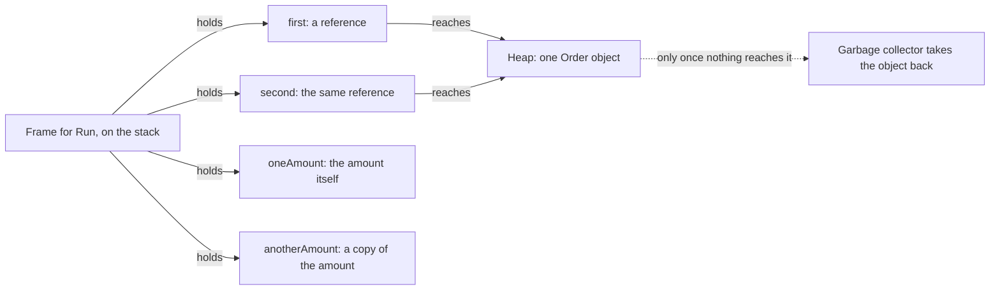

## Bạn cần biết trước

- [[foundation.l1.program-to-process]] — bạn đã thấy khi chạy, một chương trình được cấp bộ nhớ riêng. Bài này đi vào bên trong vùng nhớ đó và hỏi mỗi biến nằm ở chỗ nào.

## Tình huống

Bạn đang lần lượt chạy các sample console của Đơn Hàng. Một sample tạo một đơn hàng có tổng tiền `1250000` và đặt nó vào biến `first`. Nó chép `first` sang `second`, đặt tổng tiền của `second` về 0, rồi in `first` ra. Kết quả là 0, dù bạn chỉ đổi `second`. Vài dòng bên dưới, đúng ba bước đó (tạo một thứ, chép sang biến thứ hai, đổi biến thứ hai) lại để nguyên một khoản tiền. Không có gì được truyền sang phương thức khác, không có gì được lưu ở đâu, và hai đoạn code có cùng hình dạng. Vì sao một phép gán lại đổi một thứ bạn chưa hề gọi tên, còn phép gán kia thì không?

## Khái niệm cốt lõi

- call frame — khối bộ nhớ một phương thức nhận được trong lúc nó chạy, dành cho các biến cục bộ của nó.
- **stack** (vùng nhớ cho biến cục bộ và lời gọi hàm, cấp phát và thu hồi tự động theo thứ tự vào sau ra trước) — phần bộ nhớ của process nơi các call frame được thêm vào khi phương thức được gọi và bị bỏ đi khi phương thức trả về, theo thứ tự ngược lại.
- **heap** (vùng nhớ cho đối tượng sống lâu hơn một lời gọi hàm, trong .NET do garbage collector dọn) — phần bộ nhớ của process nơi chứa các đối tượng thuộc kiểu khai báo bằng `class`. Đối tượng như thế vẫn còn sau khi phương thức tạo ra nó đã trả về.
- tham chiếu — thứ mà biến kiểu class chứa: không phải bản thân đối tượng, mà là đường để tới đúng một đối tượng trên heap.
- kiểu giá trị và kiểu tham chiếu — biến kiểu giá trị chứa chính dữ liệu, còn biến kiểu tham chiếu chứa một tham chiếu tới dữ liệu nằm ở chỗ khác.
- **garbage collector** (thành phần của runtime tự tìm và thu hồi bộ nhớ heap không còn được tham chiếu) — phần của .NET runtime (môi trường thực thi mà .NET cấp cho chương trình trong lúc nó chạy) tìm những đối tượng trên heap mà chương trình đang chạy không còn tới được, rồi tự lấy lại bộ nhớ của chúng mà không cần ai yêu cầu.

## Cơ chế hoạt động



Trong tình huống trên, phương thức làm các bước đó là `Run`. Trong lúc nó chạy, stack giữ một frame cho nó, nằm trên frame của phương thức gọi nó. Bốn biến cục bộ của nó mỗi biến có một ô (một chỗ trong frame): `first` và `second` cho đơn hàng, `oneAmount` và `anotherAmount` cho khoản tiền. .NET runtime sắp xếp các ô ra sao là chuyện riêng của nó, còn các ô thì sống và mất cùng frame. Khi `Run` trả về, frame của nó biến mất ngay, trước frame của phương thức gọi nó. Vì thế vùng nhớ này không cần ai quyết định khi nào trả lại, khác với đối tượng trên heap bên dưới, thứ phải chờ garbage collector.

Hai nửa khác nhau ở chỗ mỗi ô chứa gì: `new Order` đặt một đối tượng lên heap và đưa cho frame một tham chiếu tới nó. Đó là mô hình C# đưa cho bạn, nên trong bài này hãy coi `Order` nằm trên heap. .NET runtime có thể lặng lẽ giữ một đối tượng trên stack khi không tham chiếu nào tới nó rời khỏi phương thức, nhưng kết quả in ra vẫn như nhau. Chép `first` sang `second` là chép tham chiếu đó, nên cả hai ô cùng tới một đối tượng, và đổi tổng tiền qua ô nào cũng là đổi đối tượng ấy. `Money`, kiểu giữ khoản tiền, là kiểu giá trị (mục sau cho thấy từ khóa nào làm nó thành như vậy), nên ô `oneAmount` chứa chính khoản tiền. Chép nó sang `anotherAmount` tạo ra khoản tiền thứ hai, độc lập, và đặt một khoản về 0 thì khoản kia vẫn giữ nguyên.

Đối tượng trên heap sống lâu hơn frame đã tạo ra nó. Garbage collector, một phần của .NET runtime, lấy lại những đối tượng trên heap mà chương trình đang chạy không còn tới được, và nó tự chọn lúc làm. Bạn không bao giờ tự tay giải phóng bộ nhớ heap, và không dòng nào trong đoạn code này khiến bộ nhớ của một đối tượng được trả lại.

## Trong hệ thống Đơn Hàng

Project sample console có một file cho bài này. File khai báo hai kiểu nhỏ chỉ khác nhau ở từ khóa dùng để khai báo, rồi làm cùng ba bước với mỗi kiểu.

```csharp file=samples/DonHang.Samples/Samples/Computer/StackHeap.cs tag=stage-0 lines=5-15
    // A class: one object on the heap, however many variables point at it.
    private sealed class Order
    {
        public int TotalVnd;
    }

    // A struct: a value, copied whenever it is assigned.
    private struct Money
    {
        public int AmountVnd;
    }
```

`Order` được khai báo bằng `class`, còn `Money` bằng `struct` (`sealed` không liên quan gì tới chỗ đối tượng nằm). Kiểu khai báo bằng `class` là kiểu tham chiếu, kiểu khai báo bằng `struct` là kiểu giá trị. Mỗi kiểu chỉ giữ đúng một `int`, nên từ khóa đó là khác biệt duy nhất có ý nghĩa ở phần dưới. Biến kiểu `Order` chứa một tham chiếu, biến kiểu `Money` chứa một khoản tiền.

```csharp file=samples/DonHang.Samples/Samples/Computer/StackHeap.cs tag=stage-0 lines=18-31
    public static void Run()
    {
        var first = new Order { TotalVnd = 1_250_000 };
        var second = first;             // copies the reference, not the object
        second.TotalVnd = 0;
        Console.WriteLine($"first.TotalVnd is now {first.TotalVnd}");

        var oneAmount = new Money { AmountVnd = 1_250_000 };
        var anotherAmount = oneAmount;  // copies the value
        anotherAmount.AmountVnd = 0;
        Console.WriteLine($"oneAmount.AmountVnd is still {oneAmount.AmountVnd}");

        Console.WriteLine("both locals disappear when Run returns; the Order does not");
    }
```

`new Order` đặt một đối tượng lên heap, còn `first` và `second` là hai ô trong frame cùng tới đối tượng đó, nên ghi qua `second` cũng là ghi qua `first`. Dòng in đầu tiên báo `0`, không phải `1250000` như lúc đơn hàng mới tạo. `Money` là kiểu giá trị, nên `anotherAmount` là một khoản tiền thứ hai chứ không phải đường thứ hai để tới khoản đầu tiên, và dòng in thứ hai vẫn báo `1250000`. Dấu gạch dưới trong `1_250_000` chỉ giúp người đọc dễ nhìn, con số vẫn như vậy dù có hay không có chúng. Dòng in cuối nói "both locals", nhưng ý là cả bốn biến cục bộ. Chúng mất theo frame, trong khi đối tượng `Order` vẫn ở trên heap cho tới khi garbage collector thấy không còn gì tới được nó.

## Người mới hay nghĩ rằng…

- **"Gán một đối tượng cho biến mới là chép cả đối tượng."** → Thực ra phép gán chép thứ mà biến đang chứa, và với kiểu class thì đó là một tham chiếu, nên hai biến cùng tới một đối tượng. Bạn sẽ nhận ra khi giữ một bản sao đơn hàng để dự phòng trước khi sửa, và bản dự phòng cũng đổi theo.
- **"Đặt biến về null là giải phóng bộ nhớ ngay."** → Thực ra xóa một biến chỉ bỏ đi một trong các đường tới đối tượng. Đối tượng vẫn ở trên heap cho tới khi garbage collector, vào lúc nào đó sau này, thấy chương trình không còn tới được nó. Bạn sẽ nhận ra khi theo dõi bộ nhớ của process trong một công cụ hiển thị bộ nhớ từng process. Con số không giảm ở dòng bạn chờ đợi. Nó có thể giảm muộn hơn, hoặc không giảm thấy rõ, vì runtime có thể giữ lại vùng nhớ đã lấy về để dùng cho các đối tượng tiếp theo.
- **"Sau khi `second` đổi đơn hàng, `first` và `second` là cùng một biến."** → Thực ra chúng là hai ô riêng, mỗi ô giữ bản sao riêng của cùng một tham chiếu, nên đặt một đơn hàng khác vào `second` thì `first` vẫn tới đơn cũ. Bạn sẽ nhận ra khi thay đối tượng trong một biến và hai biến lặng lẽ thôi khớp nhau. Hãy thêm `second = new Order { TotalVnd = 7 };` sau dòng in đầu tiên, in cả hai tổng tiền, và chúng không còn giống nhau.

## Thử ngay (3 phút)

1. Trong repo ví dụ, chạy `dotnet run --project samples/DonHang.Samples -- stack-heap` (từ cuối cùng chọn file sample ở trên) và đọc hai dòng in đầu tiên.
2. Trong `samples/DonHang.Samples/Samples/Computer/StackHeap.cs`, đổi `private struct Money` thành `private sealed class Money` (`sealed` chỉ là chép theo `Order`), chạy lại đúng lệnh đó, rồi hoàn tác thay đổi.

Kết quả mong đợi: lần chạy đầu in `0` cho đơn hàng và `1250000` cho khoản tiền. Sau khi đổi từ khóa, cả hai dòng đều in `0`, vì khoản tiền giờ là một đối tượng trên heap và biến thứ hai tới đúng đối tượng đó.

## Liên hệ

- [[foundation.l1.program-to-process]] — bài trước vẽ bộ nhớ của một process thành một hộp, bài này chia hộp đó làm hai.
- [[foundation.l1.threads-and-async-intro]] — chuyện gì xảy ra khi hai luồng thực thi trong cùng một process tới cùng một đối tượng trên heap vào cùng một lúc.
- [[foundation.l1.collections-in-practice]] — cùng câu hỏi ở tầng cao hơn: một list hay một dictionary thật ra giữ gì cho bạn, và nó chép những gì.
- [[foundation.l1.oop-encapsulation]] — cách chữa bất ngờ trong tình huống trên: để field ở chế độ private, như vậy không gì bên ngoài đối tượng đổi được nó qua một tham chiếu dùng chung.

## Tóm tắt 5 dòng

1. Biến cục bộ nằm trong call frame của phương thức và biến mất khi phương thức trả về. Đối tượng kiểu class nằm trên heap và sống lâu hơn nó.
2. Biến kiểu class chứa tham chiếu tới một đối tượng trên heap, không phải đối tượng, nên gán nó là chép tham chiếu.
3. Biến kiểu giá trị chứa chính dữ liệu, nên gán nó tạo ra một bản sao độc lập.
4. Garbage collector lấy lại những đối tượng trên heap mà chương trình đang chạy không còn tới được. Trong .NET bạn không bao giờ tự tay giải phóng vùng nhớ đó.
5. Xóa một biến chỉ bỏ đi một tham chiếu. Đối tượng rời heap chỉ khi garbage collector, vào lúc nào đó sau này, thấy chương trình không còn tới được nó.
