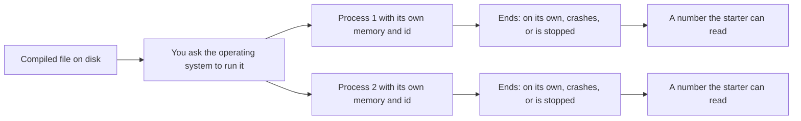

## Before you start

- No prerequisites — start here.

## The situation

You start the Đơn Hàng example system with `scripts/up.sh` — one script brings the whole thing up. The command prints a few lines, then hands your prompt back, yet minutes later the example system is still serving its pages to a browser, with no window open anywhere and nothing on screen. Curious, you run `scripts/computer/list-processes.sh`, which starts one tiny program twice. It prints two different numbers, one per copy, then stops both and shows the number the first one leaves behind. Same file on disk, two independent things alive at once, and a third one still serving pages behind them. What exactly is alive, and where do those numbers come from?

## Core concepts

- program — the compiled file sitting on disk; it does nothing on its own until someone asks the operating system to run it.
- **process** — one running copy of a program, created by the operating system with its own memory and its own place in the code it is working through.
- process id — the number the operating system gives each process, so you and other programs can name that one copy.
- exit code — the number a program returns when it ends on its own; when something stops it from outside, whoever started it reads a number that marks that instead.

## How it works



In the situation above, the file on disk is the program, and each thing you saw alive is a process. Nothing about the file changes when you run it. You hand the operating system a path, and it builds something new around that file: memory for this run, a place in the code to start from — the program's main function — and an id.

Each process gets its own memory, so one process cannot read another's variables; sharing happens only when a program explicitly asks the operating system for it. The second copy therefore starts as empty as the first one did, and the two numbers you saw are simply two ids, one for each process alive at that moment.

A process then runs on its own. It needs no window, and it need not print anything; `scripts/up.sh` returned to your prompt while the process serving those pages stayed alive behind it. Silence tells you nothing about whether a process is running.

A process ends in one of three ways: it ends on its own — its main function returns, or it asks to end — it crashes, or something outside it asks the operating system to stop it. Whichever happens, whoever started it can read one number that says which ending it was: the exit code the program itself returned, or — when it was stopped from outside — a fixed number the operating system uses to mark that kind of stop. The convention is that `0` means success and anything else means failure, which is how one script decides whether the script it called worked.

Later in Đơn Hàng, the program that answers for the whole system will be exactly this: one process, started once, that keeps running while nobody watches it.

## In the Đơn Hàng system

The console sample project has one file whose only job is to describe the process it is itself running in.

```csharp file=samples/DonHang.Samples/Samples/Computer/HelloProcess.cs tag=stage-0 lines=6-14
    public static void Run()
    {
        var process = System.Diagnostics.Process.GetCurrentProcess();

        Console.WriteLine($"process id: {process.Id}");
        Console.WriteLine($"started from: {Environment.ProcessPath}");
        Console.WriteLine($"working directory: {Environment.CurrentDirectory}");
        Console.WriteLine("this process ends when Main returns, and reports 0");
    }
```

`System.Diagnostics.Process.GetCurrentProcess()` lets the program ask about the process it is running in, and `Id` is the number the operating system assigned; while this run is alive — which is only the instant it takes to print these four lines — a system tool would list it under that same id. `Environment.ProcessPath` is the file that was started. The two are printed side by side because they are different things: the path of the started file does not change between runs, while the operating system decides an id when it creates a process, so you cannot count on two runs of the same file getting the same id. The third line prints the folder this run works in, which is not always the folder holding the started file, and which a later lesson is about. `Run` is reached from `Program.cs`, the file that starts this program, and when that file's last statement has run this process ends on its own — the first of the three endings above.

The script under `scripts/computer/` makes the same point without any C#. It starts one tiny program (`sleep`) twice, shows both copies, stops them with `kill`, then reads what three different endings leave behind. In it, `&` starts a program and lets the script carry on without waiting for it, `$!` is the id of the last program the script started that way, and `$?` is the number the last thing to finish left behind. `wait` asks for the number a program the script started left behind, `||` runs what follows it only when that number is not `0`, and `&&` only when it is `0` — together, that is how each ending gets printed.

```bash file=scripts/computer/list-processes.sh tag=stage-0 lines=7-21
sleep 30 &
first=$!
sleep 30 &
second=$!

echo "the same program started twice is two processes:"
ps -o pid=,args= -p "$first,$second" | sed 's/^ *//'

kill "$first" "$second"
wait "$first" 2>/dev/null || echo "the first one ended with exit code $?"
wait "$second" 2>/dev/null || true

echo
( exit 0 ) && echo "a program that succeeds exits with 0"
( exit 3 ) || echo "a program that fails exits with $?"
```

```text output=true
the same program started twice is two processes:
... sleep 30
... sleep 30
the first one ended with exit code 143

a program that succeeds exits with 0
a program that fails exits with 3
```

`ps` is the system tool that lists processes; here it is asked for just the id and the command of two of them, and the `sed` after it only trims the leading spaces `ps` pads its numbers with. Two lines come back for one program, because two copies are alive at once. The ids are replaced by `...` in this captured output, since they differ from run to run — which is the point.

The last three lines are three endings. `143` is what the script reports for the first copy after it was stopped from outside: a fixed number the operating system uses to mark that kind of stop, because a process stopped that way never chooses its own ending. The `2>/dev/null` on the two `wait` lines only hides a warning message that appears when a program the script started is stopped from outside. The `0` and the `3` come from two endings the script produces for itself, each choosing its own number.

## Beginners often think…

- **"Running my program twice makes the second run see the variables of the first."** → Actually each run is a separate process with its own memory, so the second starts as empty as the first did. You notice this when you count something into a variable, run the program again, and the count is back to zero.
- **"If the program prints nothing, it is not running."** → Actually printing is optional work that many programs never do, and the example system served its pages to a browser for minutes without printing a line. You notice this when the example system keeps serving pages minutes after the command that started it printed its last line.
- **"The exit code only matters to scripts."** → Actually the exit code is the one part of a run another program can check without reading a single line of output, but only if it asks for that number. You notice this when a script you called fills the screen with a failure and the script that called it carries on, because it never asked.

## Try it (3 minutes)

1. Start the example system with `scripts/up.sh` and leave it running; the script in step 2 needs it.
2. Run `scripts/computer/list-processes.sh` and read the two lines that `ps` prints — the same program name, two different ids — then run the whole script a second time and compare the ids with the first run.

Expected result: each run shows two copies of `sleep` alive at the same time with different ids, and both runs end with the same three numbers, `143`, `0` and `3`, because the endings are fixed even though the ids are not.

## Connections

- [[foundation.l1.memory-stack-heap]] — one level deeper inside the box this lesson drew: where a process's own memory actually keeps your variables.
- [[foundation.l1.env-and-config]] — the same starting moment from the other side: what the operating system hands a process at the instant it creates it.
- [[foundation.l1.threads-and-async-intro]] — what happens when one process needs to do several things at once, instead of the single place in the code described here.
- [[foundation.l1.ip-and-ports]] — how a process that keeps running, like the one still serving pages to a browser in the situation above, becomes reachable from outside.

## Five-line summary

1. A program is a file on disk; running it asks the operating system to create a process with its own memory and id.
2. Two processes started from the same program do not share memory, so neither can see the other's variables.
3. A process keeps running whether or not it prints anything, and it needs no window to be alive.
4. A process ends on its own, by crashing, or by being stopped from outside; the number its starter reads says which.
5. A system tool lists the processes alive right now with their ids, and the program that answers for Đơn Hàng will be one of them.
