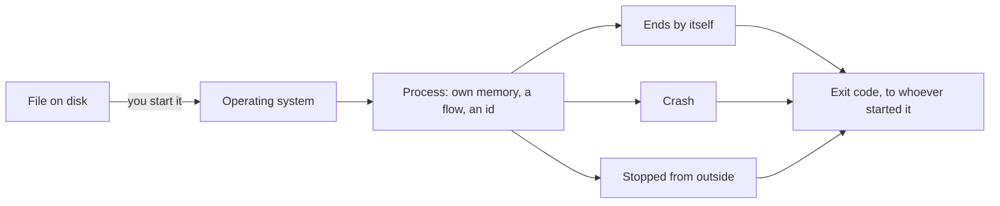

## Before you start

- No prerequisites — start here.

## The situation

You run `scripts/up.sh` on the Đơn Hàng example system for the first time. It prints its progress, finishes, and hands the terminal back to you. Nothing is on screen: no window of its own, no further output. You point a browser at the site anyway and it answers, and it still answers ten minutes later while you make coffee.

You never left anything visibly running, and your terminal is free. Something on this machine is still there, listening and answering. What keeps running after the command that started it has finished?

## Core concepts

- program — a file on disk holding instructions. It does nothing at all until something starts it.
- **process** — one run of a program. The operating system, the program that starts other programs and keeps track of them, gives that run its own memory, at least one flow of execution through the instructions — what moves through the code while the run goes on — and a number that names it while it lasts.
- process id — the number the operating system assigns to a process. It identifies that run while the run is alive, and the system may hand the same number to a later run.
- exit code — the one number a finished run leaves behind for whoever started it. The convention is `0` for success and anything else for failure, though a run stopped from outside can leave a nonzero number without having failed.

## How it works



In the situation above, `scripts/up.sh` is a file on disk, and nothing about it moves until you run it. Running it asks the operating system to build a process around it: memory that only that run can reach, at least one flow of execution through the instructions, and an id that names the run while it lasts.

The file itself does not change. Start it a second time and you get a second process, with memory of its own and a second id. A number one of them counts up is not the number the other counts, and neither can reach what the other holds unless it asks the operating system for something built for sharing, which is not part of this lesson.

A process can outlive the command that started it. `scripts/up.sh` asked for several long-lived processes, then finished; the processes it asked for stayed. That is why the site keeps answering after your terminal is free.

A run usually ends in one of three ways: it ends by itself, it crashes, or something outside it stops it. Ending by itself means its main function returns, or it asks to end. Whoever started it gets one number back. For a run that ends by itself, that number is the program's own answer, `0` for success and anything else for failure. For a run that crashes, or one stopped from outside that does nothing about the stop, the number is not one the program chose. The site that answered your browser is nothing more exotic than this: one long-lived process, sitting there, answering — and so is the part of Đơn Hàng you will build later, the one that answers other programs rather than people.

## In the Đơn Hàng system

The console sample under `samples/DonHang.Samples/` asks the operating system about its own run and prints what it learns.

```csharp file=samples/DonHang.Samples/Samples/Computer/HelloProcess.cs tag=stage-0 lines=8-13
        var process = System.Diagnostics.Process.GetCurrentProcess();

        Console.WriteLine($"process id: {process.Id}");
        Console.WriteLine($"started from: {Environment.ProcessPath}");
        Console.WriteLine($"working directory: {Environment.CurrentDirectory}");
        Console.WriteLine("this process ends when Main returns, and reports 0");
```

The first line asks the operating system for the run the program is in; the next three print things about that one run, and the last one states in words how the run will end — `Main` returns, and the run reports `0`. `process.Id` is the number the operating system assigned to this run, and the same kind of tool the script below uses to list runs would list it under that number. `Environment.ProcessPath` is the file that was started — the same one on every run started the same way, while the id changes. `Environment.CurrentDirectory` is the folder this run works in, which a later lesson takes up.

The script under `scripts/computer/` makes the same points with two copies of one program. `sleep` is a program that does nothing but stay alive for the number of seconds you give it, which is why two copies can still be listed a moment later. All of this exists to show one program alive twice, and three kinds of ending.

```bash file=scripts/computer/list-processes.sh tag=stage-0 lines=7-21
sleep 30 &
first=$!
sleep 30 &
second=$!

echo "the same program started twice is two processes:"
ps -o pid=,args= -p "$first,$second" | sed 's/^ *//'

kill "$first" "$second"
wait "$first" 2>/dev/null || echo "the first one ended with exit code $?"
wait "$second" 2>/dev/null || true

echo
( exit 0 ) && echo "a program that succeeds exits with 0"
( exit 3 ) || echo "a program that fails exits with $?"
```

```text output=true
the same program started twice is two processes:
... sleep 30
... sleep 30
the first one ended with exit code 143

a program that succeeds exits with 0
a program that fails exits with 3
```

Two spellings matter here: `&` lets the script start a program and carry on without waiting, which is why both `sleep 30` runs are alive at the same time; and commands inside `( … )` run as a separate run of the script itself, which `exit 3` ends with the number 3. The others — `$!`, `ps`, `kill`, `wait`, `$?`, `sed` — belong to the terminal module and are not what this lesson is about; between them they list the two runs, stop them, and report the number the first one left.

Now the output. The two `sleep 30` lines are the same program listed twice under different ids; the captured file writes them as `...` because the ids change on every run. Both copies are then stopped the same way, and the script reports an ending number for the first one only, to keep the output short. That copy did not choose `143` — it was stopped from outside, and `143` is what this script reports for that kind of stop when the example system runs it. The last two lines are not programs on disk at all: each is the script ending a copy of itself with a number it chose, `0` for success and `3` for failure.

## Beginners often think…

- **"Running my program twice makes the second run see the variables of the first."** → Actually each run is a separate process with its own memory, and starts from nothing. You notice this when you run a program twice to "keep the list from the first run" and the second one starts with an empty list.
- **"If the program prints nothing, it is not running."** → Actually printing and running are separate things: `scripts/up.sh` goes quiet and the site keeps answering for as long as you leave it. You notice this when you start a program a second time because the first showed nothing, and the second one fails because the first still holds something only one run at a time can have.
- **"A program that ended without an error message ended fine."** → Actually the ending is reported as a number, and a program can print nothing and still leave a nonzero one. You notice this when one of your scripts calls another, the called one prints nothing at all, and the calling one carries on — the failure was only in the number nobody read.

## Try it (3 minutes)

1. Start the example system with `scripts/up.sh` and leave it running; step 2 needs it up.
2. In the same terminal, run `scripts/computer/list-processes.sh` twice in a row. The script runs on the same machine as the example system, which is why step 1 has to be done first, and the numbers below are the ones that machine reports. Compare the two ids printed by the first run with the two printed by the second.

Expected result: each run lists the same program `sleep 30` twice under two different ids, and across the two runs you will almost certainly see four different numbers — one run of a program, one id. The three numbers after them are the same both times, as the example system runs it: `143` for the copy stopped from outside, then `0` and `3` for the two endings the script chose for itself.

## Connections

- [[foundation.l1.memory-stack-heap]] — one layer in: it opens the "own memory" this lesson hands to each process and shows where your variables sit inside it.
- [[foundation.l1.ip-and-ports]] — the same running program seen from the network: how something outside the machine reaches one process among the many the machine is running.

## Five-line summary

1. A program is a file on disk; a process is one run of it, with its own memory, at least one flow, and an id.
2. Starting the same file twice gives two processes, and neither can see what the other holds unless it asks for sharing.
3. A process can outlive the command that started it, and it can run for as long as you leave it while printing nothing.
4. A run usually ends by itself, by crashing, or because something outside it stopped it.
5. Whoever started it reads one number, the exit code: `0` for success, anything else for failure, and a stop from outside can decide it instead.
