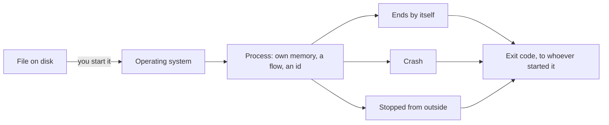

## Bạn cần biết trước

- Không cần gì trước, hãy bắt đầu từ đây.

## Tình huống

Lần đầu tiên bạn chạy `scripts/up.sh` trên Đơn Hàng, hệ thống đặt hàng nhỏ mà cả khóa học xoay quanh. Script in ra tiến độ và địa chỉ của trang web, kết thúc, rồi trả terminal lại cho bạn. Màn hình không còn gì khác: không có cửa sổ riêng, không in thêm dòng nào. Bạn vẫn mở địa chỉ đó trên trình duyệt và trang web trả lời, mười phút sau, lúc bạn pha cà phê, nó vẫn trả lời.

Bạn không để thứ gì chạy trước mắt, và terminal đang rảnh. Vậy mà trên máy này vẫn có thứ gì đó đang chờ trình duyệt và trả lời nó. Thứ gì vẫn chạy tiếp sau khi lệnh khởi động nó đã kết thúc?

## Khái niệm cốt lõi

- chương trình — một file trên đĩa chứa các lệnh. Nó hoàn toàn không làm gì cho tới khi có thứ khởi động nó.
- **process** (một chương trình đang chạy, có bộ nhớ riêng và được hệ điều hành cấp CPU) — một lần chạy của chương trình. Hệ điều hành là chương trình khởi động các chương trình khác, cấp bộ nhớ cho chúng và theo dõi chúng. Mỗi lần chạy được nó cấp bộ nhớ riêng, ít nhất một luồng thực thi đi qua các lệnh (tức lần lượt làm theo từng lệnh, một lần chạy có thể có nhiều luồng, bài sau sẽ nói), và một con số để gọi tên lần chạy đó trong lúc nó còn sống. Một process đang chạy cũng có thể tự tạo bản sao của chính nó, và bản sao đó cũng là một process.
- process id — con số hệ điều hành gán cho một process. Nó xác định lần chạy đó trong lúc lần chạy còn sống, và hệ điều hành có thể cấp lại đúng con số này cho một lần chạy sau.
- exit code — con số duy nhất mà một lần chạy đã kết thúc để lại cho bên đã khởi động nó. Quy ước là `0` cho thành công và mọi số khác cho thất bại, dù một lần chạy bị dừng từ bên ngoài có thể để lại số khác 0 mà không hề thất bại.

## Cơ chế hoạt động



Trong tình huống trên, `scripts/up.sh` là một file trên đĩa, và script cũng được tính là chương trình. Không có gì trong nó chuyển động cho tới khi bạn chạy nó. Chạy nó tức là nhờ hệ điều hành dựng một process quanh nó: vùng nhớ chỉ lần chạy đó tới được, ít nhất một luồng thực thi, và một id gọi tên lần chạy trong lúc nó còn sống.

Khởi động cùng file đó lần thứ hai, bạn có process thứ hai, với bộ nhớ riêng và id thứ hai. Không process nào tới được thứ process kia đang giữ, trừ khi nó nhờ hệ điều hành cấp một thứ làm ra để dùng chung.

Một process có thể sống lâu hơn lệnh đã khởi động nó. `scripts/up.sh` yêu cầu chạy vài process sống lâu, chỉ chờ tới khi chúng đã lên chứ không chờ chúng kết thúc, rồi kết thúc. Các process đó ở lại, và một trong số chúng là thứ đang trả lời trình duyệt. Trang web là một process sống lâu như thế, phần Đơn Hàng bạn sẽ xây sau này cũng vậy.

Một lần chạy thường kết thúc theo một trong ba cách: tự kết thúc, bị crash, hoặc bị thứ gì đó bên ngoài dừng lại. Tự kết thúc nghĩa là hàm main của nó trả về, hoặc nó tự xin kết thúc. Crash nghĩa là nó gặp một lỗi mà nó không xử lý và bị kết thúc vì lỗi đó.

Bên đã khởi động nó nhận lại một con số. Với lần chạy tự kết thúc, con số đó là câu trả lời của chính nó, `0` cho thành công và mọi số khác cho thất bại. Sau khi crash, con số không phải do chương trình chọn. Khi bên ngoài dừng một lần chạy, lần chạy có thể được báo trước và tự chọn con số của mình. `sleep` ở phần dưới không phản ứng, nên con số nó để lại không phải của nó.

## Trong hệ thống Đơn Hàng

Sample console trong `samples/DonHang.Samples/` hỏi hệ điều hành về chính lần chạy của nó và in ra những gì biết được.

```csharp file=samples/DonHang.Samples/Samples/Computer/HelloProcess.cs tag=stage-0 lines=8-13
        var process = System.Diagnostics.Process.GetCurrentProcess();

        Console.WriteLine($"process id: {process.Id}");
        Console.WriteLine($"started from: {Environment.ProcessPath}");
        Console.WriteLine($"working directory: {Environment.CurrentDirectory}");
        Console.WriteLine("this process ends when Main returns, and reports 0");
```

Dòng đầu hỏi hệ điều hành về lần chạy mà chương trình đang ở trong. Ba dòng tiếp theo in các thông tin về đúng lần chạy đó, còn dòng cuối nói bằng lời lần chạy sẽ kết thúc thế nào: `Main` trả về, và lần chạy báo `0`. `process.Id` là con số hệ điều hành đã gán cho lần chạy này. Một công cụ liệt kê các lần chạy trên cùng máy, như `ps` trong script bên dưới làm bên trong hệ thống ví dụ, liệt kê từng lần chạy bằng loại số này. `Environment.ProcessPath` là file đã được khởi động, giống nhau ở mọi lần chạy khởi động cùng một kiểu, trong khi id thì đổi. `Environment.CurrentDirectory` là thư mục mà lần chạy này làm việc trong đó, bài sau sẽ nói tới.

Script trong `scripts/computer/` cho thấy cùng những điểm đó bằng hai bản sao của một chương trình. Script này không chạy thẳng trên máy bạn. Bạn khởi động nó từ terminal, và nó chạy bên trong hệ thống ví dụ mà `scripts/up.sh` đã khởi động, nên hệ thống đó phải lên trước. `sleep` là chương trình không làm gì ngoài sống đúng số giây bạn đưa cho nó, vì thế một lúc sau vẫn liệt kê được hai bản sao. Tất cả chỉ để cho thấy một chương trình sống hai lần, và ba con số kết thúc: một số lần chạy không tự chọn, và hai số script tự chọn cho mình.

```bash file=scripts/computer/list-processes.sh tag=stage-0 lines=7-21
sleep 30 &
first=$!
sleep 30 &
second=$!

echo "the same program started twice is two processes:"
ps -o pid=,args= -p "$first,$second" | sed 's/^ *//'

kill "$first" "$second"
wait "$first" 2>/dev/null || echo "the first one ended with exit code $?"
wait "$second" 2>/dev/null || true

echo
( exit 0 ) && echo "a program that succeeds exits with 0"
( exit 3 ) || echo "a program that fails exits with $?"
```

```text output=true
the same program started twice is two processes:
... sleep 30
... sleep 30
the first one ended with exit code 143

a program that succeeds exits with 0
a program that fails exits with 3
```

Có hai cách viết cần để ý: `&` cho script khởi động một chương trình rồi đi tiếp mà không chờ, và `$!` ngay sau đó giữ id của lần chạy vừa khởi động, nhờ vậy hai lần chạy `sleep 30` cùng sống một lúc. Các lệnh trong `( … )` chạy trong một bản sao riêng của script đang chạy, tức một process riêng chứ không phải lần khởi động mới của file, và `exit 3` kết thúc bản sao đó với số 3. Một process đang chạy có thể tự sao chép như thế, và bản sao cũng là một process, có id và con số kết thúc riêng, dù không có file nào được khởi động.

Ở hai dòng cuối, `&&` chỉ chạy lệnh tiếp theo nếu con số là `0`, còn `||` chỉ chạy nếu nó khác `0`. Những thứ còn lại, `ps`, `kill`, `wait`, `$?`, `sed`, `2>/dev/null`, `|| true`, thuộc về module terminal: dòng `ps` liệt kê hai lần chạy, dòng `kill` dừng chúng, và dòng `wait` đầu tiên in con số mà lần chạy thứ nhất để lại.

Giờ tới kết quả in ra. Hai dòng `sleep 30` là cùng một chương trình được liệt kê hai lần với hai id khác nhau. Kết quả ở trên ghi chúng thành `...` vì id đổi sau mỗi lần chạy. Sau đó cả hai bản sao bị dừng theo cùng một kiểu, và script chỉ báo con số kết thúc của bản đầu tiên cho kết quả ngắn gọn. Bản sao đó không chọn `143`: nó bị dừng từ bên ngoài, và `143` là số script báo cho kiểu dừng này bên trong hệ thống ví dụ, nơi script luôn chạy. Hai dòng cuối hoàn toàn không phải chương trình trên đĩa: mỗi dòng là script kết thúc một bản sao của chính nó bằng con số nó tự chọn, `0` cho thành công và `3` cho thất bại.

## Người mới hay nghĩ rằng…

- **"Chạy chương trình hai lần thì lần thứ hai thấy được biến của lần thứ nhất."** → Thực ra mỗi lần chạy là một process riêng với bộ nhớ riêng, và bắt đầu từ con số không. Bạn sẽ nhận ra khi chạy chương trình lần hai để "giữ lại danh sách từ lần chạy đầu" và lần thứ hai bắt đầu với danh sách rỗng.
- **"Chương trình không in gì tức là nó không chạy."** → Thực ra in và chạy là hai chuyện khác nhau: `scripts/up.sh` im lặng còn trang web vẫn trả lời chừng nào bạn còn để nó chạy. Bạn sẽ nhận ra khi khởi động chương trình lần hai vì lần đầu không hiện gì, và giờ có hai bản sao của cùng một chương trình đang chạy.
- **"Chương trình kết thúc mà không báo lỗi là đã kết thúc ổn."** → Thực ra cách kết thúc được báo bằng một con số, và chương trình có thể không in gì mà vẫn để lại số khác 0. Bạn sẽ nhận ra khi một script của bạn gọi script khác, script được gọi không in gì cả, và script gọi cứ thế chạy tiếp, còn thất bại chỉ nằm trong con số không ai đọc.

## Thử ngay (3 phút)

1. Khởi động hệ thống ví dụ bằng `scripts/up.sh`. Script tự kết thúc và hệ thống vẫn chạy, bước 2 cần điều đó.
2. Trong cùng terminal, chạy `scripts/computer/list-processes.sh` hai lần liên tiếp. Như mục "Trong hệ thống Đơn Hàng" đã nói, script chạy bên trong hệ thống ví dụ, nên phải làm bước 1 trước, và các con số bên dưới là những số nó báo ở đó. So sánh hai id do lần chạy đầu in ra với hai id do lần chạy thứ hai in ra.

Kết quả mong đợi: mỗi lần chạy liệt kê cùng chương trình `sleep 30` hai lần với hai id khác nhau, và qua hai lần chạy gần như chắc chắn bạn thấy bốn con số khác nhau: một lần chạy của chương trình, một id. Ba con số phía sau thì giống nhau ở cả hai lần, theo cách hệ thống ví dụ chạy script: `143` cho bản sao bị dừng từ bên ngoài, rồi `0` và `3` cho hai cách kết thúc mà script tự chọn.

## Liên hệ

- [[foundation.l1.memory-stack-heap]] — sâu thêm một bước: mở "bộ nhớ riêng" mà bài này cấp cho mỗi process và cho thấy biến của bạn nằm ở đâu trong đó.
- [[foundation.l1.ip-and-ports]] — cùng chương trình đang chạy đó nhìn từ phía mạng: thứ gì đó bên ngoài máy tới được đúng một process trong rất nhiều process máy đang chạy bằng cách nào.

## Tóm tắt 5 dòng

1. Chương trình là một file trên đĩa. Process là một lần chạy của nó, với bộ nhớ riêng, ít nhất một luồng thực thi, và một id.
2. Khởi động cùng file hai lần cho ra hai process, và không process nào thấy được thứ process kia đang giữ, trừ khi nó xin dùng chung.
3. Một process có thể sống lâu hơn lệnh đã khởi động nó, và có thể chạy chừng nào bạn còn để nó chạy mà không in gì.
4. Một lần chạy thường tự kết thúc, bị crash, hoặc bị thứ gì đó bên ngoài dừng lại.
5. Bên đã khởi động nó đọc một con số, là exit code: `0` cho thành công, số khác cho thất bại, và một lần dừng từ bên ngoài có thể quyết định con số đó thay nó.
