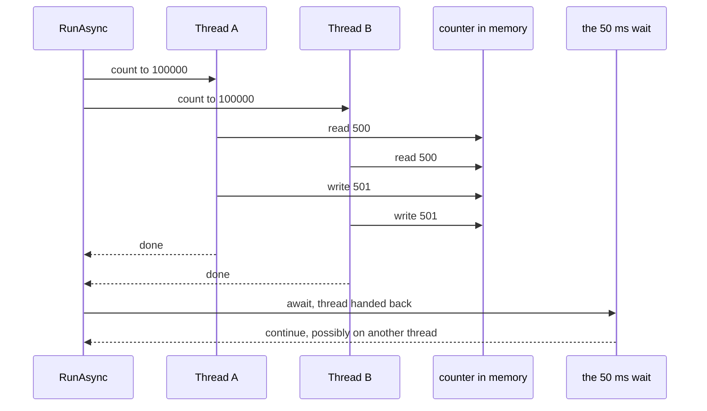

## Before you start

- [[foundation.l1.program-to-process]] — you saw that a run gets its own memory and at least one flow of execution; this lesson opens that flow up into several.
- [[foundation.l1.memory-stack-heap]] — you saw that objects of a class type live on the heap and that a variable can hold a reference to one; this lesson puts two flows on the same heap object.

## The situation

Đơn Hàng at `stage-0` ships a small console project with one sample per lesson. You run the concurrency one: `dotnet run --project samples/DonHang.Samples -- threads-vs-async`. It starts two loops, each adding one to the same counter a hundred thousand times, then prints the total. The sentence says the two threads added 200000, but the counter beside it is often smaller, and a second run prints a different number again. The arithmetic in the loop is plainly right, nothing threw, and the last line reports a different thread from the first. Where do the missing counts go, and why does the run finish on a thread it did not start on?

## Core concepts

- **thread** — one path of execution inside a process; a process has at least one, can ask for more, and every thread of that process reads the same heap.
- shared variable — one place in memory that more than one thread reads and writes, which is what the counter in the situation above is.
- blocking — sitting inside a call and holding a thread until an answer arrives, doing nothing meanwhile.
- **async/await** — a way of writing a wait so the thread is handed back to the pool it came from while nothing is happening, and the rest of the method continues once the answer arrives.

## How it works



In the situation above, the method the sample runs, `RunAsync`, begins on one thread, whose number the first line prints. It hands each loop to a pool of worker threads that the runtime — the .NET machinery running your process — keeps ready. A thread is borrowed from that pool for a piece of work and given back when it ends; free below means back in the pool. On a machine that can run two threads at the same moment the two loops usually do overlap, and `RunAsync` goes on only when both report done. Both loops act on one variable, `counter`; threads of one process share memory that way, and the sharing is the point and also the danger.

Follow a single increment. Adding one is three steps: read the value, add one, write it back. If Thread A reads 500 and Thread B reads 500 before A writes 501, both write 501 and one increment is gone. Nothing broke. The two paths interleaved in an order the program never chose, and an increment can be lost this way but never invented, so the printed total is at most 200000 and rarely exactly that.

That was two threads on one variable; the rest is a wait nobody holds. `Task.Delay(50)` is a wait, not work: with nothing to compute, a thread sitting inside it would be blocking, held with nothing to do. Waiting for a file, a network reply or a database is idle in the same way. Writing `await` in front hands that thread back and records what should happen next. When the wait ends, the method continues on whatever thread is free, which is why the last line can print a different number. No thread was made for the wait; one was given back.

## In the Đơn Hàng system

The whole lesson is one method. Its first half puts two threads on one variable; its second half waits without holding a thread at all. A method is written `async` so that it may contain `await`, and it gives back a `Task`: the same kind of value that stands for work in flight, so whoever called it can wait on it too.

```csharp file=samples/DonHang.Samples/Samples/Computer/ThreadsVsAsync.cs tag=stage-0 lines=6-15
    public static async Task RunAsync()
    {
        Console.WriteLine($"start, on thread {Environment.CurrentManagedThreadId}");

        // Two threads, one object: both add to the same counter on the heap.
        var counter = 0;
        var first = Task.Run(() => { for (var i = 0; i < 100_000; i++) counter++; });
        var second = Task.Run(() => { for (var i = 0; i < 100_000; i++) counter++; });
        await Task.WhenAll(first, second);
        Console.WriteLine($"two threads added 200000 and the counter says {counter}");
```

`Task.Run` hands a piece of code to the runtime, which queues it to the pool of worker threads to run there while this thread carries on, and gives back a value that stands for that running work, which you can wait on. `await Task.WhenAll(first, second)` continues only when both of those values report they are finished, and hands the thread back until then, exactly as the wait below does. `counter` is written as a local of the method, but both loops use it, so the compiler places it on the heap, where both threads can reach it, rather than on the call frame of one of them. A local that only the method itself uses can live in the call frame, because it dies with the call; a local that code running outside that flow still uses cannot, so the compiler puts it where every thread of the process can reach it. Read the last line carefully: the words `two threads added 200000` are fixed text in the code, printed whatever the counter holds.

```csharp file=samples/DonHang.Samples/Samples/Computer/ThreadsVsAsync.cs tag=stage-0 lines=17-19
        // Waiting without a thread: nothing is running during this pause.
        await Task.Delay(50);
        Console.WriteLine($"after waiting, on thread {Environment.CurrentManagedThreadId}");
```

`Task.Delay(50)` is a pause with nothing to compute, and the `await` in front of it gives the thread back for about those fifty milliseconds. `Environment.CurrentManagedThreadId` is the number of the thread the line is running on. Compare the two lines that print it: the first runs before any waiting, the last runs after, and they can report different numbers because the method continued wherever there was room. Nothing in these two lines creates a thread or asks for a particular one; the earlier `Task.Run` calls were what put work on other threads.

These two halves are two failures you will meet. A program whose work is done by one thread does nothing at all while that thread sits inside a wait, which is what the second half here avoids; in programs with a screen, one that stops responding is often such a thread, held where it could have been handed back. Two threads changing one variable produce a total that is wrong and different on every run. Both look like broken logic, and neither is.

## Beginners often think…

- **"async makes my code run in parallel on another thread."** → Actually `await` starts nothing and moves nothing on its own; it hands the thread back until the thing being waited for finishes. You notice this when the fifty-millisecond wait still takes about fifty milliseconds, and when you `await` two slow calls one after the other the run still takes as long as both together.
- **"Adding await makes the method faster."** → Actually the wait lasts exactly as long either way; what changes is that the thread is free for whatever else the program has to run meanwhile, and in this sample there is nothing else. You notice this when one run of the program is no quicker after the change, while the same program, when it has many pieces of work waiting on the same kind of idle wait at once, gets through more of them with the same number of threads.
- **"Two threads each adding one cannot lose a count."** → Actually adding one is a read, an add and a write, and both threads can read the same value before either writes. You notice this when a total lands slightly below what you expect and is never the same twice.

## Try it (3 minutes)

1. From the root of the Đơn Hàng repository, run `dotnet run --project samples/DonHang.Samples -- threads-vs-async` three times. Write down the counter and the two thread numbers each time.
2. Look at the two numbers inside one run: the one printed before the loops start and the one printed after the wait.

Expected result: the counter is at most 200000, usually below it, and usually not the same on any two runs, while the loop in the file never changes. The thread number on the last line is often not the one on the first line, and nothing in the file asked for that move.

## Connections

- [[foundation.l1.memory-stack-heap]] — the prerequisite from the other side: sharing memory is what lets two threads reach one variable, and that reach is exactly where the counts are lost.
- [[foundation.l1.async-in-csharp]] — the next step: the same `await`, read line by line inside one method, including what happens when you forget the keyword.
- [[backend.l1.request-lifecycle]] — the same idea one layer up, where a server serves many callers at once by handing a thread back on every wait instead of holding one per caller.

## Five-line summary

1. A thread is one path of execution inside a process; threads of one process share memory and can change the same variable.
2. Two threads changing one variable lose changes, because reading, adding and writing back is three steps that can interleave.
3. Waiting for a file, a network reply or a database is idle time; async/await hands the thread back for that time instead of holding it.
4. async/await creates no thread: it gives one back during the wait and continues afterwards, possibly on a different thread.
5. A thread held inside a wait leaves a program doing nothing meanwhile; two threads changing one variable make a wrong total that differs every run.
