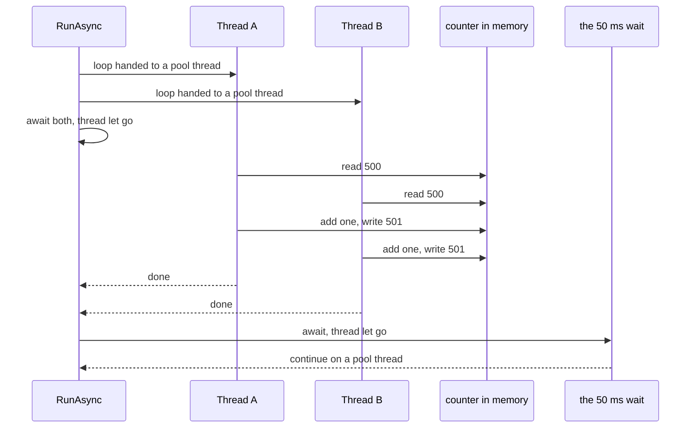

## Before you start

- [[foundation.l1.program-to-process]] — you saw that a run gets its own memory and at least one flow of execution; this lesson opens that flow up into several.
- [[foundation.l1.memory-stack-heap]] — you saw that objects of a class type live on the heap and that a variable can hold a reference to one; this lesson puts two flows on the same heap object.

## The situation

Đơn Hàng at `stage-0` ships a small console project with one sample per lesson. You run the concurrency one: `dotnet run --project samples/DonHang.Samples -- threads-vs-async`. It starts two loops, each adding one to the same counter a hundred thousand times, then prints the total. The printed line says the two threads added 200000, but the number at its end is often smaller, and a second run prints a different number again. The arithmetic in the loop is plainly right, nothing threw, and the last line reports a different thread from the first. Where do the missing counts go, and why does the run finish on a thread it did not start on?

## Core concepts

- **thread** — one path of execution inside a process; a process has at least one, can ask for more, and every thread of that process reads the same heap.
- shared variable — one place in memory that more than one thread reads and writes, which is what the counter in the situation above is.
- blocking — sitting inside a call and holding a thread until an answer arrives, doing nothing meanwhile.
- thread pool — worker threads that the runtime, the .NET machinery running your process, keeps ready; one is borrowed for a piece of work and given back when it ends.
- **async/await** — a way of writing a wait so that the method lets go of the thread running it while nothing is happening, and the rest of the method continues once the answer arrives.

## How it works


```mermaid
sequenceDiagram
  participant R as RunAsync
  participant A as Thread A
  participant B as Thread B
  participant C as counter in memory
  participant W as the 50 ms wait
  R->>A: loop handed to a pool thread
  R->>B: loop handed to a pool thread
  R->>R: await both, thread let go
  A->>C: read 500
  B->>C: read 500
  A->>C: add one, write 501
  B->>C: add one, write 501
  A-->>R: done
  B-->>R: done
  R->>W: await, thread let go
  W-->>R: continue on a pool thread
```

The sample's method, `RunAsync`, begins on one thread, whose number the first line prints. It hands each loop to the thread pool. On a machine that can run two threads at the same moment the two loops usually do overlap. Most laptops and desktops today can; if every run prints exactly 200000, yours is likely not running the two at once, and you did nothing wrong. `RunAsync` waits for both to report done with an `await`, the first point where it leaves its starting thread. Both loops act on one variable, `counter`: threads of one process share memory, which is the point and the danger.

Follow a single increment. Adding one is three steps: read the value, add one, write it back. If Thread A reads 500 and Thread B reads 500 before A writes 501, both write 501 and one increment is gone. Nothing broke. The two paths interleaved in an order the program never chose, and an increment can be lost this way but never invented, so the printed total is at most 200000 and rarely exactly that.

The second half is a wait. `Task.Delay(50)`, a pause of fifty milliseconds, is a wait, not work: a thread sitting inside it would be blocking, held with nothing to do. Waiting for a file, a network reply or a database is idle in the same way. Writing `await` in front lets go of that thread and records what should happen next. In this program, after each await the method continues on a pool thread. The thread a program starts on is its own, not one borrowed from the pool, so the method cannot land back on it, which is why the last line prints a different number.

## In the Đơn Hàng system

The whole lesson is one method. Its first half puts two threads on one variable; its second half waits without holding a thread at all. A method is written `async` so that it may contain `await`, and this one gives back a `Task`: a value that stands for work that is still running, so whoever called it can wait on it too.

```csharp file=samples/DonHang.Samples/Samples/Computer/ThreadsVsAsync.cs tag=stage-0 lines=6-15
    public static async Task RunAsync()
    {
        Console.WriteLine($"start, on thread {Environment.CurrentManagedThreadId}");

        // Two threads, one object: both add to the same counter on the heap.
        var counter = 0;
        var first = Task.Run(() => { for (var i = 0; i < 100_000; i++) counter++; });
        var second = Task.Run(() => { for (var i = 0; i < 100_000; i++) counter++; });
        await Task.WhenAll(first, second);
        Console.WriteLine($"two threads added 200000 and the counter says {counter}");
```

`Task.Run` hands a piece of code to the runtime, which queues it to the pool of worker threads to run there while this thread carries on, and gives back a value that stands for that running work, which you can wait on. `await Task.WhenAll(first, second)` continues only when both of those values report they are finished, and lets go of the thread until then. This first `await` is where the method leaves the thread it started on; the later wait may or may not move it again.

`counter` is written as a local of the method, but both loops use it, so the compiler places it on the heap, even though it is a plain number, not an object of a class type. A local that only the method itself uses can live in the call frame, because it dies with the call; a local that code running outside that flow — the two loop bodies handed to `Task.Run` — still uses cannot, so the compiler puts it where every thread of the process can reach it.

Read the last line carefully: the words `two threads added 200000` are fixed text in the code, printed whatever the counter holds.

```csharp file=samples/DonHang.Samples/Samples/Computer/ThreadsVsAsync.cs tag=stage-0 lines=17-19
        // Waiting without a thread: nothing is running during this pause.
        await Task.Delay(50);
        Console.WriteLine($"after waiting, on thread {Environment.CurrentManagedThreadId}");
```

`Task.Delay(50)` is a pause with nothing to compute, and the `await` in front of it gives the thread back for about those fifty milliseconds. `Environment.CurrentManagedThreadId` is the number of the thread the line is running on. Compare the two lines that print it: the first runs before any await, the last after two, and the move happened at the first of them. Nothing in these two lines creates a thread or asks for a particular one; the earlier `Task.Run` calls were what put work on other threads.

These two halves are two failures you will meet. A program whose work is done by one thread does nothing at all while that thread sits inside a wait, which is what the second half here avoids; in programs with a screen, one that stops responding is often such a thread, held where it could have been handed back. Two threads changing one variable can produce a total that is wrong and rarely the same twice. Both look like wrong arithmetic, and neither is: the arithmetic is right, and the fault lies in how the threads and the wait are used.

## Beginners often think…

- **"async makes my code run in parallel on another thread."** → Actually `await` starts nothing running alongside; it hands the thread back until the thing being waited for finishes. You notice this when you `await` two slow calls one after the other and the run still takes as long as both together.
- **"Adding await makes the method faster."** → Actually a wait lasts about as long whether the thread is held through it or handed back; what changes is that the thread is free for whatever else the program has to run meanwhile, and in this sample there is nothing else. You notice this when one run is no quicker after the change. The gain is the free thread: a program with a screen keeps responding during the wait, and a program with many pieces of work waiting at once gets through more of them with the same number of threads.
- **"Two threads each adding one cannot lose a count."** → Actually adding one is a read, an add and a write, and both threads can read the same value before either writes. You notice this when a total lands below what you expect — sometimes far below — and is rarely the same twice.

## Try it (3 minutes)

1. From the root of the Đơn Hàng repository, run `dotnet run --project samples/DonHang.Samples -- threads-vs-async` three times. Write down the counter and the two thread numbers each time.
2. Look at the two numbers inside one run: the one printed before the loops start and the one printed after the wait.

Expected result: the counter is at most 200000, usually below it, and usually not the same on any two runs, while the loop in the file never changes. The thread number on the last line is not the one on the first line, and nothing in the file asked for that move.

## Connections

- [[foundation.l1.memory-stack-heap]] — the prerequisite from the other side: sharing memory is what lets two threads reach one variable, and that reach is exactly where the counts are lost.
- [[foundation.l1.async-in-csharp]] — the next step: the same `await`, read line by line inside one method, including what happens when you forget the keyword.
- [[backend.l1.request-lifecycle]] — the same idea one layer up, where a server serves many callers at once by handing a thread back on every wait instead of holding one per caller.

## Five-line summary

1. A thread is one path of execution inside a process; threads of one process share memory and can change the same variable.
2. Two threads changing one variable can lose changes, because reading, adding and writing back is three steps that can interleave.
3. Waiting for a file, a network reply or a database is idle time; async/await hands the thread back for that time instead of holding it.
4. async/await creates no thread: it gives one back during the wait and continues afterwards, possibly on a different thread.
5. A program whose only thread is held in a wait does nothing meanwhile; two threads changing one variable can make a wrong, shifting total.
