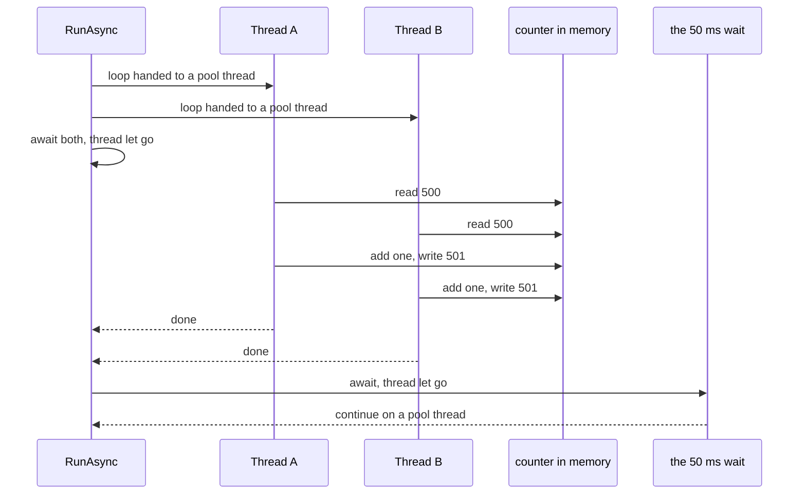

## Bạn cần biết trước

- [[foundation.l1.program-to-process]] — bạn đã thấy mỗi lần chạy, chương trình được cấp bộ nhớ riêng và có ít nhất một luồng thực thi. Bài này tách luồng đó ra thành nhiều luồng.
- [[foundation.l1.memory-stack-heap]] — bạn đã thấy đối tượng kiểu class nằm trên heap và một biến có thể giữ tham chiếu tới nó. Bài này đặt hai luồng lên cùng một đối tượng trên heap.

## Tình huống

Ở `stage-0`, Đơn Hàng có một project console nhỏ, mỗi bài một sample. Bạn chạy sample về chạy đồng thời: `dotnet run --project samples/DonHang.Samples -- threads-vs-async`. Nó khởi động hai vòng lặp, mỗi vòng cộng một vào cùng một biến đếm 100.000 lần, rồi in tổng ra. Dòng in ra nói hai thread đã cộng 200000, nhưng con số ở cuối dòng thường nhỏ hơn, và chạy lần hai lại ra một số khác. Phép cộng trong vòng lặp rõ ràng đúng, không có gì báo lỗi, và dòng cuối báo một thread khác với dòng đầu. Những lần cộng bị thiếu đi đâu, và vì sao chương trình kết thúc trên một thread không phải thread nó bắt đầu?

## Khái niệm cốt lõi

- **thread** (luồng thực thi bên trong một process, các thread cùng process dùng chung bộ nhớ) — một đường thực thi bên trong process. Process có ít nhất một thread, có thể xin thêm, và mọi thread của process đó đọc cùng một heap.
- biến dùng chung — một chỗ trong bộ nhớ mà nhiều thread cùng đọc và ghi. Biến đếm trong tình huống trên chính là như vậy.
- blocking — nằm trong một lời gọi và giữ thread cho tới khi có kết quả, trong lúc đó không làm gì cả.
- thread pool — các thread làm việc mà runtime, phần máy móc .NET đang chạy process của bạn, giữ sẵn. Mỗi phần việc mượn một thread và trả lại khi xong.
- **async/await** (cú pháp viết code chờ I/O mà không chặn thread) — cách viết một lần chờ sao cho phương thức nhả thread đang chạy nó ra trong lúc không có gì xảy ra, và phần còn lại của phương thức chạy tiếp khi có kết quả.

## Cơ chế hoạt động



Phương thức của sample, `RunAsync`, bắt đầu trên một thread, và dòng in đầu tiên cho biết số của thread đó. Nó giao mỗi vòng lặp cho thread pool. Trên máy chạy được hai thread cùng một lúc, hai vòng lặp thường chồng lên nhau thật. Phần lớn laptop và máy bàn hiện nay chạy được như vậy. Nếu lần nào cũng in đúng 200000, nhiều khả năng máy bạn không chạy hai vòng cùng lúc, và bạn không làm sai gì cả. `RunAsync` dùng `await` để chờ cả hai báo xong, và đó là chỗ đầu tiên phương thức rời thread ban đầu. Cả hai vòng lặp cùng tác động lên một biến, `counter`: các thread của một process dùng chung bộ nhớ, đó vừa là mục đích vừa là mối nguy.

Hãy theo dõi một lần cộng. Cộng một gồm ba bước: đọc giá trị, cộng thêm một, ghi lại. Nếu Thread A đọc được 500 và Thread B cũng đọc được 500 trước khi A ghi 501, cả hai đều ghi 501 và một lần cộng biến mất. Không có gì hỏng cả. Hai luồng đan xen theo một thứ tự mà chương trình không hề chọn. Theo cách này một lần cộng có thể mất nhưng không bao giờ tự sinh ra, nên tổng in ra tối đa là 200000 và hiếm khi đúng bằng con số đó.

Nửa sau là một lần chờ. `Task.Delay(50)`, một khoảng dừng 50 ms, là chờ chứ không phải làm việc: một thread nằm bên trong nó sẽ bị blocking, bị giữ mà không có gì để làm. Chờ đọc file, chờ phản hồi qua mạng hay chờ database cũng rảnh y như vậy. Viết `await` phía trước sẽ nhả thread đó ra và ghi nhớ bước tiếp theo cần làm. Trong chương trình này, sau mỗi lần await, phương thức chạy tiếp trên một thread của pool. Thread mà chương trình khởi động trên đó là thread riêng của nó, không phải thread mượn từ pool, nên phương thức không thể quay về đúng thread đó. Vì thế dòng cuối in ra một số khác.

## Trong hệ thống Đơn Hàng

Cả bài xoay quanh một phương thức. Nửa đầu đặt hai thread lên một biến, nửa sau chờ mà không giữ thread nào. Phương thức được khai báo `async` để có thể chứa `await`, và phương thức này trả về một `Task`: một giá trị đại diện cho phần việc vẫn đang chạy, để nơi gọi nó cũng chờ được.

```csharp file=samples/DonHang.Samples/Samples/Computer/ThreadsVsAsync.cs tag=stage-0 lines=6-15
    public static async Task RunAsync()
    {
        Console.WriteLine($"start, on thread {Environment.CurrentManagedThreadId}");

        // Two threads, one object: both add to the same counter on the heap.
        var counter = 0;
        var first = Task.Run(() => { for (var i = 0; i < 100_000; i++) counter++; });
        var second = Task.Run(() => { for (var i = 0; i < 100_000; i++) counter++; });
        await Task.WhenAll(first, second);
        Console.WriteLine($"two threads added 200000 and the counter says {counter}");
```

`Task.Run` giao một đoạn code cho runtime. Runtime xếp nó vào hàng đợi của pool các thread làm việc để chạy ở đó trong khi thread hiện tại làm tiếp, và trả về một giá trị đại diện cho phần việc đang chạy ấy để bạn chờ. `await Task.WhenAll(first, second)` chỉ chạy tiếp khi cả hai giá trị đó báo đã xong, và nhả thread ra cho tới lúc ấy. Lần `await` đầu tiên này là chỗ phương thức rời thread nó bắt đầu. Lần chờ sau có thể chuyển nó sang thread khác nữa hoặc không.

`counter` được viết như biến cục bộ của phương thức, nhưng cả hai vòng lặp đều dùng nó, nên compiler đặt nó lên heap, dù nó chỉ là một con số chứ không phải đối tượng kiểu class. Biến cục bộ chỉ phương thức dùng thì nằm được trong call frame, vì nó mất cùng lời gọi. Biến cục bộ mà code chạy ngoài luồng đó vẫn dùng, ở đây là hai thân vòng lặp giao cho `Task.Run`, thì không nằm ở đó được, nên compiler đặt nó vào chỗ mọi thread của process đều tới được.

Hãy đọc kỹ dòng cuối: chữ `two threads added 200000` là văn bản cố định trong code, in ra bất kể biến đếm đang giữ số nào.

```csharp file=samples/DonHang.Samples/Samples/Computer/ThreadsVsAsync.cs tag=stage-0 lines=17-19
        // Waiting without a thread: nothing is running during this pause.
        await Task.Delay(50);
        Console.WriteLine($"after waiting, on thread {Environment.CurrentManagedThreadId}");
```

`Task.Delay(50)` là một khoảng dừng không có gì để tính, và `await` phía trước trả thread lại trong khoảng 50 ms đó. `Environment.CurrentManagedThreadId` là số của thread đang chạy dòng code. So hai dòng in con số này: dòng đầu chạy trước mọi lần await, dòng cuối chạy sau hai lần, và thread đã đổi ngay ở lần đầu tiên. Không có gì trong hai dòng này tạo thread hay đòi một thread cụ thể. Chính các lời gọi `Task.Run` trước đó mới đưa việc sang thread khác.

Hai nửa này là hai lỗi bạn sẽ gặp. Một chương trình mà mọi việc do một thread làm sẽ đứng im hoàn toàn trong lúc thread đó nằm chờ, và nửa sau ở đây tránh đúng điều đó. Ở chương trình có giao diện, màn hình bị treo thường là do một thread như thế, bị giữ ở chỗ lẽ ra có thể trả lại. Hai thread cùng đổi một biến có thể cho ra tổng sai, và hiếm khi sai giống nhau hai lần. Cả hai trông như tính toán sai, nhưng đều không phải: phép tính đúng, lỗi nằm ở cách dùng thread và lần chờ.

## Người mới hay nghĩ rằng…

- **"async làm code chạy song song trên một thread khác."** → Thực ra `await` không khởi động thứ gì chạy song song. Nó trả thread lại cho tới khi thứ đang được chờ xong. Bạn sẽ nhận ra khi `await` hai lời gọi chậm lần lượt, và tổng thời gian chạy vẫn bằng cả hai cộng lại.
- **"Thêm await làm phương thức chạy nhanh hơn."** → Thực ra một lần chờ kéo dài gần như bằng nhau dù thread bị giữ suốt hay được trả lại. Điều thay đổi là thread được rảnh để chạy việc khác của chương trình trong lúc đó, mà trong sample này không có việc khác nào. Bạn sẽ nhận ra khi một lần chạy không nhanh hơn sau khi đổi. Lợi ích nằm ở thread được rảnh: chương trình có giao diện vẫn phản hồi trong lúc chờ, còn chương trình có nhiều phần việc cùng chờ một lúc thì xử lý được nhiều việc hơn với cùng số thread.
- **"Hai thread mỗi thread cộng một thì không thể mất lần đếm nào."** → Thực ra cộng một là đọc, cộng rồi ghi, và cả hai thread có thể đọc cùng một giá trị trước khi thread nào kịp ghi. Bạn sẽ nhận ra khi tổng thấp hơn con số bạn chờ đợi, có khi thấp hơn nhiều, và hiếm khi giống nhau hai lần.

## Thử ngay (3 phút)

1. Từ thư mục gốc của repo Đơn Hàng, chạy `dotnet run --project samples/DonHang.Samples -- threads-vs-async` ba lần. Mỗi lần ghi lại giá trị biến đếm và hai số thread.
2. Nhìn hai số thread trong cùng một lần chạy: số in ra trước khi vòng lặp bắt đầu và số in ra sau lần chờ.

Kết quả mong đợi: biến đếm tối đa là 200000, thường thấp hơn, và thường không lần nào giống lần nào, trong khi vòng lặp trong file không hề đổi. Số thread ở dòng cuối khác số ở dòng đầu, và không có gì trong file yêu cầu chuyển thread như vậy.

## Liên hệ

- [[foundation.l1.memory-stack-heap]] — bài nền nhìn từ phía bên kia: dùng chung bộ nhớ là thứ cho hai thread cùng tới một biến, và cũng chính ở đó các lần đếm bị mất.
- [[foundation.l1.async-in-csharp]] — bước tiếp theo: vẫn `await` đó, đọc từng dòng trong một phương thức, kể cả chuyện gì xảy ra khi bạn quên từ khóa.
- [[backend.l1.request-lifecycle]] — cùng ý tưởng ở tầng cao hơn, nơi server phục vụ nhiều người gọi cùng lúc bằng cách trả thread lại mỗi lần chờ, thay vì giữ một thread cho mỗi người gọi.

## Tóm tắt 5 dòng

1. Thread là một đường thực thi bên trong process. Các thread của một process dùng chung bộ nhớ và có thể đổi cùng một biến.
2. Hai thread cùng đổi một biến có thể làm mất thay đổi, vì đọc, cộng và ghi lại là ba bước có thể đan xen nhau.
3. Chờ file, chờ phản hồi qua mạng hay chờ database là thời gian rảnh. async/await trả thread lại trong khoảng đó thay vì giữ nó.
4. async/await không tạo thread nào: nó trả thread lại trong lúc chờ rồi chạy tiếp sau đó, có thể trên một thread khác.
5. Chương trình có thread duy nhất bị giữ trong lúc chờ thì đứng im suốt thời gian đó. Hai thread cùng đổi một biến có thể cho ra tổng sai và thay đổi mỗi lần chạy.
