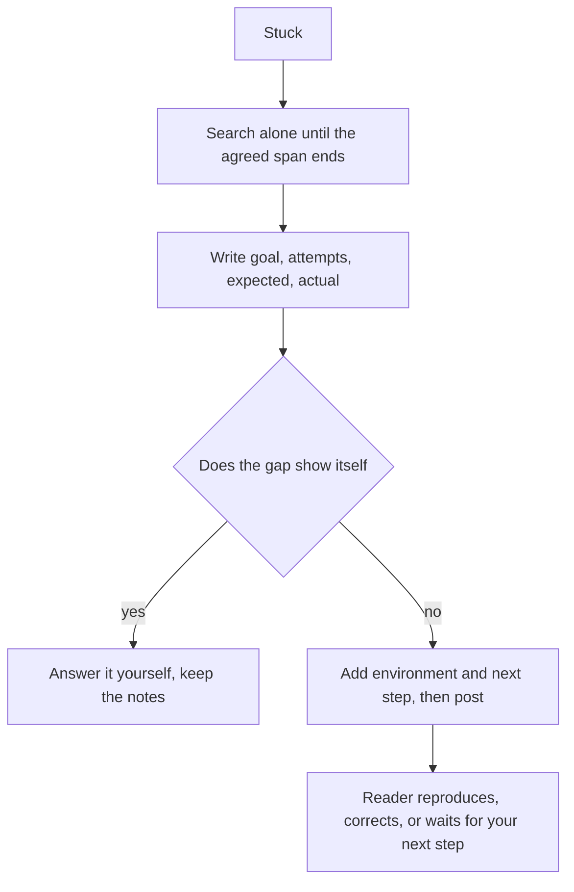

## Before you start

- [[foundation.l2.debugging-method]] — you narrowed a failure by halving until one input and one wrong value were left, writing down every run and its result. A question is that record, rewritten for someone who was not sitting next to you.

## The situation

You are partway through the HTTP scripts of Đơn Hàng at `stage-0`, the tag this lesson uses. The lab — a second machine the repository starts for you, with names and settings your machine does not share — answers: `scripts/http/status-codes.sh` prints its responses as expected. You want the encrypted site in your own browser, and `STAGE.md`, the setup file, gives its address: `donhang.local`, port 8443, over https. You type it, and nothing appears; you try a second browser and restart the lab, and forty-five minutes go. You type in the team chat that the secure site does not work; nobody replies. What has to be in that message before a reader who was not there can help?

## Core concepts

- goal — the outcome you are trying to reach, stated before the thing that blocked you, so a reader can tell you the whole route is wrong.
- attempts — every thing you tried and the result each one gave, in the order you ran them, not a list of names.
- expectation — the result you believed you would get, in one sentence.
- actual result — what happened instead, with the error text copied character for character rather than described.
- environment — the version, the machine, the branch and the data your attempts ran against.
- next step — what you will do if nobody answers, and when you will do it.

## How it works



In the situation above you sent only the symptom. The reader has no goal, no attempts, no expectation, no error text and no machine, so any reply has to start with a question of their own, which is why such a message can sit unanswered.

The decision is how long you stay stuck alone. Teams usually agree on a span of time, search alone inside it, and ask when it ends; its length is theirs to set, which is why this lesson gives none. Asking in the first minute can spend a colleague's attention on something you would have found yourself; asking after a day spends your own day.

Then write the first four lines in order: the goal, each attempt with its result, what you expected, and what happened. The goal lets a reader say the whole route is wrong before helping you along it. The attempts tell them what is already ruled out, so nobody repeats your forty-five minutes. Expectation and result next to each other make the failure judgeable: the result alone says what happened, only the expectation says it was wrong.

Often the gap, the step you skipped, shows itself while you write. That is the same work the debugging loop asks for — shrinking the distance between what you did and the first thing that was wrong — done on paper instead of on a running command. When that happens, you answer your own question and send nothing, keeping the lines you wrote.

When it does not, add the environment and one last line: what you will do next if nobody answers, and when. That line turns a question into a decision: with your environment and attempts in hand, a reader can run your case, correct you, or wait for the step you named.

## In the Đơn Hàng system

The repository carries the form itself, written in Vietnamese because the shape matters more than the language.

```text file=docs/craft/question-template.md tag=stage-0 lines=6-11
Mục tiêu: <việc tôi đang cố làm xong>
Đã thử: <những gì tôi đã thử và kết quả từng cái>
Mong đợi: <tôi nghĩ điều gì sẽ xảy ra>
Thực tế: <điều đã xảy ra, kèm thông báo lỗi nguyên văn>
Môi trường: <phiên bản, môi trường, dữ liệu>
Tiếp theo: <việc tôi sẽ làm nếu không ai trả lời>
```

Six lines: goal, attempts, expectation, actual result, environment, next step. Note what `Đã thử` asks for — each attempt *and its result*, and the result is the half that carries information. `Thực tế` asks for the message word for word, not a retelling of it.

In the situation above, `Môi trường` is the line that would have ended the search on its own: it makes you write down your own machine and your own browser. The setup file `STAGE.md`, at the root of the example repository, asks you to add the line `127.0.0.1 donhang.local` to a file it names on your own machine; that line tells your machine that the name `donhang.local` means this machine itself, which a browser needs before the name opens at all. Your machine reads that file before it asks DNS, so with no line in it the name has no IP address here. You never added it, and no script noticed, because the scripts run inside the lab, where the name already has an address.

The same file says why the form works, and when to use it.

```markdown file=docs/craft/question-template.md tag=stage-0 lines=34-38
Viết xong bốn dòng đầu, rất nhiều lần bạn tự trả lời được câu hỏi — vì viết
buộc bạn phải thu hẹp phạm vi, đúng bước bạn đã bỏ qua.

Dòng cuối biến câu hỏi thành một quyết định: người đọc biết bạn không đứng yên
chờ, và biết khi nào cần chặn bạn lại.
```

Two paragraphs, two claims. The first says that finishing the first four lines often answers the question, and gives the reason: writing forces you to narrow the scope, at the exact step you skipped. The second says the closing line converts a question into a decision the team can react to — they learn you are moving, and they learn when to stop you.

## Beginners often think…

- **"Asking questions makes me look incompetent."** → Actually a filled-in question shows what you tried and what you already ruled out, so the reader sees method rather than a gap; a message with no attempts in it gives them nothing to see. You notice this when the reply to a filled-in question is an answer, while the reply to "it does not work" is three questions.
- **"A screenshot of the error is a sufficient question."** → Actually the text inside a picture cannot be selected or pasted into a command, so the reader has to retype it, and the picture still omits your goal, your attempts and your environment. You notice this when the first answer you get asks you to paste the text that was already on your screen.
- **"Waiting longer is politer, so I should ask only when I am truly stuck."** → Actually waiting past the agreed span costs your own day, and the thing you are stuck on may be one the person beside you has already met. You notice this when the answer arrives in one line and your day is already gone.

## Try it (3 minutes)

1. Think of something that blocks you and that you can make happen again now — in this repository or anywhere — so its message is on screen while you write. Open `docs/craft/question-template.md` at `stage-0`, copy its six lines into an empty file, and fill them in order, without opening anything else first.
2. Then read back exactly two of your lines. For `Đã thử`: does every attempt carry its result, or only its name? For `Thực tế`: is the message copied, or described in your own words?

Expected result: every entry on `Đã thử` names a result and not just an action, and `Thực tế` holds copied text rather than your own words. `Môi trường` often surfaces something you never checked; check that thing before you send anything.

<details><summary>Suggested answer</summary>

For the situation in this lesson the six lines read roughly: goal — open the encrypted Đơn Hàng site in my own browser; attempts — second browser, same nothing; restarted the lab, its scripts still answer; expectation — the page appears in my own browser; actual — the browser never reaches a server, no response at all; environment — my own machine and browser, lab at `stage-0`, scripts run inside the lab; next step — in thirty minutes I will compare what address the name gives inside the lab and on my machine.

The environment line and the next-step line, written honestly, point at the same place before anyone answers.

</details>

## Connections

- [[foundation.l2.debugging-method]] — its prerequisite and its supplier: the loop produces the attempts and results that the `Đã thử` line asks for.
- [[foundation.l2.reading-docs]] — the step before this one; you ask a person after the page for your version has failed to answer you.
- [[foundation.l2.writing-bug-reports]] — the same discipline pointed at a defect someone else must reproduce, rather than at your own blockage.
- [[foundation.l2.using-ai-assistants]] — the same six lines asked of a machine, which cannot see your environment at all unless you write it down.

## Five-line summary

1. A good question states the goal, what you tried with each result, what you expected, what happened with the exact error, and your environment.
2. Write it in that order, because the goal lets a reader redirect you and the attempts stop anyone repeating your search.
3. Writing the question often answers it, since those lines make you say exactly what you did and what came back.
4. Search alone for an agreed span, then ask; too early spends a colleague's time, too late spends your day.
5. End with what you will do next if nobody answers, which turns your question into a decision the team can react to.
