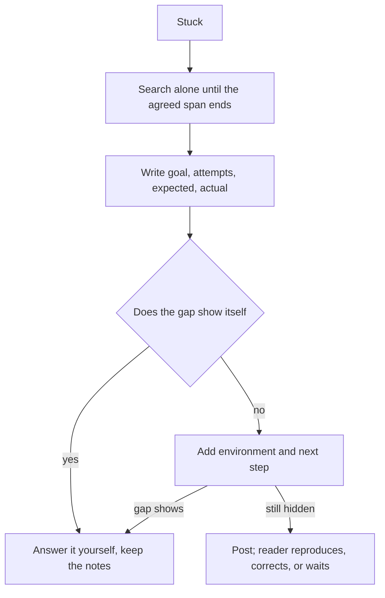

## Bạn cần biết trước

- [[foundation.l2.debugging-method]] — bạn khoanh vùng lỗi bằng cách chia đôi cho tới khi chỉ còn một đầu vào và một giá trị sai, ghi lại từng lần chạy cùng kết quả của nó. Một câu hỏi chính là bản ghi đó, viết lại cho người không ngồi cạnh bạn lúc ấy.

## Tình huống

Bạn đang làm dở phần script HTTP của Đơn Hàng ở `stage-0`, một điểm cố định, có tên, trong lịch sử của repository. Lab là một máy thứ hai được bật sẵn cho bạn, nơi `scripts/http/status-codes.sh` in ra các response. Lab biết những cái tên mà máy bạn không biết, chẳng hạn `donhang.local`. Bạn muốn mở trang web đã mã hóa ngay trên trình duyệt của mình, và `STAGE.md` ghi địa chỉ: `donhang.local`, port 8443, qua https (HTTP chạy trên TLS). Bạn gõ vào, không có gì hiện ra. Bạn thử trình duyệt thứ hai, khởi động lại lab, script trong lab vẫn trả lời bình thường. Bốn mươi lăm phút trôi qua. Bạn nhắn vào nhóm chat của đội rằng trang web không chạy, không ai trả lời. Tin nhắn đó phải có gì thì một người không có mặt lúc ấy mới giúp được?

## Khái niệm cốt lõi

- mục tiêu — kết quả bạn đang cố đạt được, nêu trước cả thứ đang chặn bạn, để người đọc có thể nói cho bạn biết cả hướng đi đã sai.
- những gì đã thử — mọi thứ bạn đã thử và kết quả của từng cái, theo đúng thứ tự bạn chạy, không phải một danh sách tên gọi.
- mong đợi — kết quả bạn tin là sẽ nhận được, gói trong một câu.
- kết quả thực tế — điều đã xảy ra thay vào đó, với nội dung lỗi chép nguyên từng ký tự thay vì kể lại.
- môi trường — phiên bản, máy, branch và dữ liệu mà các lần thử của bạn đã chạy trên đó.
- bước tiếp theo — bạn sẽ làm gì nếu không ai trả lời, và làm vào lúc nào.

## Cơ chế hoạt động



Trong tình huống trên, bạn chỉ gửi đi triệu chứng. Người đọc không có mục tiêu, không có những gì đã thử, không có mong đợi, không có nội dung lỗi, cũng không biết máy nào. Vì thế câu trả lời nào cũng phải bắt đầu bằng một câu hỏi ngược lại, và đó là lý do tin nhắn như vậy dễ bị bỏ lửng.

Quyết định đầu tiên là bạn tự loay hoay một mình bao lâu. Các đội thường thống nhất một khoảng thời gian: bạn tự tìm trong khoảng đó, hết giờ thì hỏi. Dài bao lâu là do đội quyết. Hỏi ngay phút đầu có thể tiêu sự chú ý của đồng nghiệp vào thứ bạn tự tìm ra được. Hỏi sau cả ngày thì tiêu mất ngày của chính bạn.

Rồi viết bốn dòng theo thứ tự: mục tiêu, từng lần thử cùng kết quả, điều bạn mong đợi, và điều đã xảy ra. Mục tiêu cho người đọc cơ hội nói cả hướng đi đã sai trước khi giúp bạn đi tiếp trên hướng đó. Những gì đã thử cho họ biết điều gì đã bị loại trừ, để không ai lặp lại bốn mươi lăm phút của bạn. Mong đợi đặt cạnh kết quả thì mới phán đoán được chỗ hỏng: kết quả chỉ nói điều gì đã xảy ra, còn mong đợi mới nói điều đó là sai.

Thường thì khoảng trống, tức bước bạn đã bỏ qua, tự lộ ra ngay khi bạn viết. Đó cũng chính là thứ vòng debug đòi hỏi — thu hẹp khoảng cách giữa những gì bạn đã làm và chỗ đầu tiên bị sai — chỉ khác là làm trên giấy thay vì trên một lệnh đang chạy. Khi khoảng trống lộ ra, bạn tự trả lời, không gửi gì cả, và giữ lại mấy dòng đã viết.

Khi nó chưa lộ ra, hãy thêm môi trường và một dòng cuối: bạn sẽ làm gì tiếp nếu không ai trả lời, và làm lúc nào. Viết hai dòng này cũng có thể làm lộ khoảng trống. Nếu vậy, bạn cũng dừng ở đó. Dòng cuối biến câu hỏi thành một quyết định: có môi trường và những gì đã thử trong tay, người đọc có thể chạy lại trường hợp của bạn, sửa cho bạn, hoặc chờ bước bạn đã nêu.

## Trong hệ thống Đơn Hàng

Repository có sẵn chính cái khuôn này, viết bằng tiếng Việt vì hình dạng của nó quan trọng hơn ngôn ngữ.

```text file=docs/craft/question-template.md tag=stage-0 lines=6-11
Mục tiêu: <việc tôi đang cố làm xong>
Đã thử: <những gì tôi đã thử và kết quả từng cái>
Mong đợi: <tôi nghĩ điều gì sẽ xảy ra>
Thực tế: <điều đã xảy ra, kèm thông báo lỗi nguyên văn>
Môi trường: <phiên bản, môi trường, dữ liệu>
Tiếp theo: <việc tôi sẽ làm nếu không ai trả lời>
```

Sáu dòng: mục tiêu, những gì đã thử, mong đợi, kết quả thực tế, môi trường, bước tiếp theo. Để ý `Đã thử` đòi gì — từng lần thử *và kết quả của nó*, và kết quả mới là nửa mang thông tin. `Thực tế` đòi thông báo lỗi nguyên văn, không phải lời kể lại. `Môi trường` bao gồm cả máy và branch, như ở phần Khái niệm cốt lõi.

Trong tình huống trên, `Môi trường` là dòng tự nó đã đủ kết thúc cuộc tìm kiếm. Dòng này hỏi các lần thử chạy trong môi trường nào, và ở đây đó là máy bạn, trình duyệt của bạn, không phải lab. Đặt cạnh những gì đã thử, nơi các script chạy trong lab, nó cho thấy mọi lần chạy thất bại đều ở trên máy bạn, còn mọi lần chạy trong lab đều ổn. Vậy bạn đi tìm một bước mà máy bạn cần.

File hướng dẫn cài đặt `STAGE.md`, ở thư mục gốc của repository ví dụ, liệt kê những gì máy bạn cần. Đọc lại thì thấy nó yêu cầu thêm dòng `127.0.0.1 donhang.local` vào một file nó chỉ rõ trên máy bạn. Dòng đó báo cho máy bạn biết cái tên `donhang.local` nghĩa là chính máy này. Lab chuyển port 8443 của nó sang port 8443 trên máy bạn, nên gọi tới máy bạn ở port đó là tới được trang web của lab. Cơ chế tra tên thông thường của máy bạn đọc file đó trước khi hỏi DNS, và không DNS server nào bạn gọi tới biết cái tên này. Không có dòng đó, không có gì trên máy bạn gán địa chỉ cho cái tên. Bạn chưa bao giờ thêm nó, và không script nào phát hiện ra, vì các script chạy bên trong lab, nơi cái tên đã có địa chỉ sẵn.

Cũng file đó giải thích vì sao cái khuôn có tác dụng.

```markdown file=docs/craft/question-template.md tag=stage-0 lines=34-38
Viết xong bốn dòng đầu, rất nhiều lần bạn tự trả lời được câu hỏi — vì viết
buộc bạn phải thu hẹp phạm vi, đúng bước bạn đã bỏ qua.

Dòng cuối biến câu hỏi thành một quyết định: người đọc biết bạn không đứng yên
chờ, và biết khi nào cần chặn bạn lại.
```

Đoạn đầu nói rằng viết xong bốn dòng đầu thường là đã có câu trả lời, và nêu lý do: viết buộc bạn thu hẹp phạm vi, đúng ở bước bạn đã bỏ qua. Đoạn sau nói dòng cuối biến câu hỏi thành một quyết định mà đội có thể phản hồi — họ biết bạn vẫn đang đi tiếp, và biết lúc nào cần chặn bạn lại.

## Người mới hay nghĩ rằng…

- **"Đặt câu hỏi làm mình trông kém cỏi."** → Thực ra một câu hỏi điền đủ cho thấy bạn đã thử gì và đã loại trừ gì, nên người đọc thấy phương pháp chứ không thấy lỗ hổng. Còn một tin nhắn không có lần thử nào thì chẳng cho họ thấy gì. Bạn sẽ nhận ra khi câu hỏi điền đủ nhận về một câu trả lời, còn "nó không chạy" nhận về ba câu hỏi ngược lại.
- **"Ảnh chụp màn hình lỗi là đủ thành một câu hỏi."** → Thực ra chữ trong ảnh không phải thứ người đọc dán thẳng vào lệnh được, nên họ phải gõ lại hoặc tách chữ ra, và bức ảnh vẫn thiếu mục tiêu, những gì bạn đã thử và môi trường. Bạn sẽ nhận ra khi câu trả lời đầu tiên nhận được là lời nhờ bạn dán đoạn chữ vốn đã nằm trên màn hình của mình.
- **"Chờ lâu hơn thì lịch sự hơn, nên chỉ hỏi khi thật sự bế tắc."** → Thực ra chờ quá khoảng thời gian đã thống nhất thì tốn ngày của chính bạn, và thứ đang chặn bạn có thể là thứ người ngồi cạnh đã gặp rồi. Bạn sẽ nhận ra khi câu trả lời đến chỉ trong một dòng, còn ngày của bạn thì đã hết.

## Thử ngay (3 phút)

1. Nghĩ tới một thứ đang chặn bạn mà bạn có thể làm nó xảy ra lại ngay bây giờ — trong repository này hay ở đâu cũng được — để thông báo lỗi nằm trên màn hình khi bạn viết. Nếu lúc này không có gì chặn bạn, hãy dùng tình huống ở mục 2. Mở `docs/craft/question-template.md` trong bản Đơn Hàng của bạn, đã ở `stage-0`, chép sáu dòng của nó vào một file trống, rồi điền theo thứ tự, không mở thêm thứ gì trước.
2. Sau đó đọc lại đúng hai dòng. Với `Đã thử`: mỗi lần thử có kèm kết quả không, hay chỉ có tên? Với `Thực tế`: thông báo lỗi được chép lại, hay được kể bằng lời của bạn?

Kết quả mong đợi: mỗi mục trong `Đã thử` nêu một kết quả chứ không chỉ một hành động, và `Thực tế` chứa đoạn chữ chép nguyên chứ không phải lời của bạn. Nếu bạn dùng tình huống ở mục 2, `Thực tế` nên ghi chỗ đoạn chữ chép nguyên sẽ được dán vào, không mô tả nó. Nếu khi viết `Môi trường` bạn nhận ra một thứ mình chưa từng kiểm tra, hãy kiểm tra nó trước khi gửi bất cứ gì.

<details><summary>Gợi ý đáp án</summary>

Với tình huống trong bài, sáu dòng đại khái như sau. Mục tiêu — mở trang Đơn Hàng đã mã hóa trên trình duyệt của mình. Đã thử — trình duyệt thứ hai, vẫn không có gì, rồi khởi động lại lab, script trong lab vẫn trả lời. Mong đợi — trang hiện ra trên trình duyệt của mình. Thực tế — thứ trình duyệt hiện ra thay vào đó, dán nguyên văn vào đây. Môi trường — máy và trình duyệt của mình, lab ở `stage-0`, script chạy bên trong lab. Bước tiếp theo — ba mươi phút nữa, mình sẽ so địa chỉ mà cái tên trỏ tới ở trong lab và trên máy mình.

Dòng môi trường và dòng bước tiếp theo cùng chỉ vào một chỗ trước khi có ai trả lời.

</details>

## Liên hệ

- [[foundation.l2.debugging-method]] — bài tiên quyết và cũng là nguồn cung cấp: vòng lặp đó tạo ra những lần thử và kết quả mà dòng `Đã thử` đòi hỏi.
- [[foundation.l2.reading-docs]] — bước đứng trước bài này: bạn hỏi người khác sau khi trang tài liệu cho phiên bản của bạn không trả lời được.
- [[foundation.l2.writing-bug-reports]] — cùng kỷ luật đó, nhưng hướng vào một lỗi mà người khác phải tái hiện, thay vì vào chỗ bạn đang bị chặn.
- [[foundation.l2.using-ai-assistants]] — cũng sáu dòng ấy nhưng hỏi một cỗ máy, thứ không nhìn thấy môi trường của bạn trừ khi bạn viết nó ra.

## Tóm tắt 5 dòng

1. Một câu hỏi tốt nêu mục tiêu, những gì bạn đã thử cùng kết quả từng lần, điều bạn mong đợi, điều đã xảy ra kèm lỗi nguyên văn, và môi trường của bạn.
2. Viết theo đúng thứ tự đó, vì mục tiêu cho người đọc chỉnh hướng cho bạn, còn những gì đã thử giúp không ai phải tìm lại từ đầu.
3. Viết câu hỏi ra thường đã trả lời được nó, vì những dòng đó buộc bạn nói chính xác mình đã làm gì và nhận lại gì.
4. Tự tìm trong khoảng thời gian đã thống nhất rồi mới hỏi. Hỏi quá sớm tốn thời gian của đồng nghiệp, hỏi quá muộn tốn ngày của bạn.
5. Kết thúc bằng việc bạn sẽ làm nếu không ai trả lời, để câu hỏi thành một quyết định mà đội có thể phản hồi.
