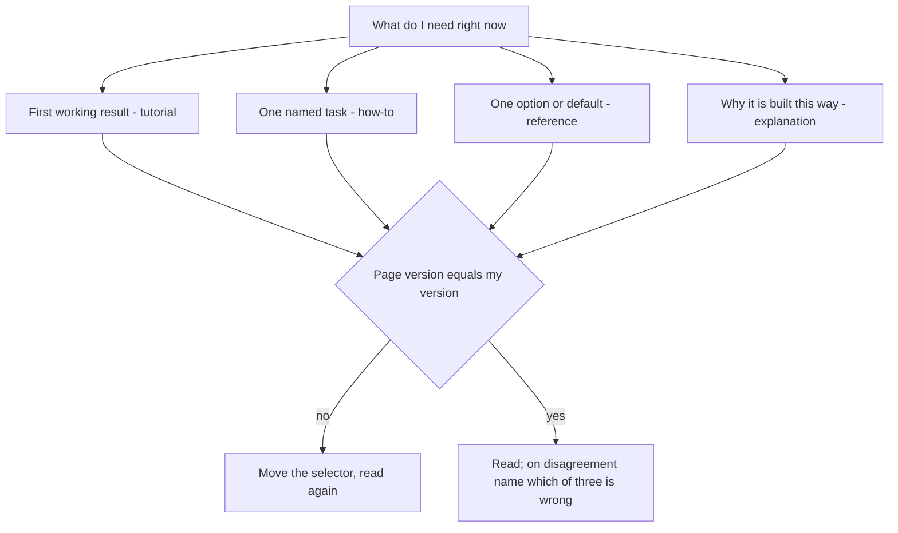

## Before you start

- No prerequisites — start here.

## The situation

You are working through the HTTP scripts of Đơn Hàng at `stage-0`, the first tagged state of the example repository — a saved point you move to with `git checkout stage-0`. Running `scripts/http/cache-headers.sh` prints a response whose headers include `Cache-Control: max-age=60`, and you want to know what that promises. You search the header name and open the first result, a blog post. It says a browser will reuse the response for a minute, but never names the release it was written against, never quotes the document that defines the header. Nothing tells you whether that sentence is about your server or the author's. Where should you have looked first, and how do you read that page so you stop guessing?

## Core concepts

- tutorial — a page that walks you through a whole goal in its own sequence of steps, so you follow it in order rather than jumping in.
- how-to — a page that does one named thing for a reader who already has the context; you search for the task, then follow only those steps.
- reference — a dry listing of what exists: the options, their defaults, the errors; you search it for one entry and read nothing else.
- explanation — a page about why the thing was built this way; you read it when the reference is correct but still makes no sense to you.
- specification — the standards document that defines something with no single product behind it, such as an HTTP header; it is a reference, and it has no version selector.
- version selector — the control near the top of a documentation page that chooses which release (version) of the product the page describes.

## How it works



In the situation above, the header you met is defined in a reference — for a standard header, that reference is a specification — so a blog was the wrong first stop: you had a lookup question and went to a story. Start from your question, not from the search box.

You still search, but for the product's own documentation site first; then search inside it, not the whole web. When the thing has no product — a header, a status code — search for the specification by name.

If you have never made the thing work, you want a tutorial, in its own order. If you have the context and want one named task done, you want a how-to. If you want one option, one default or one error message, you want a reference: jump to that entry rather than read from the top; you will usually get there faster. If the reference is correct and still makes no sense, you want an explanation — of the four kinds above, a shape you read through rather than search; a tutorial is read in order too, but for its steps.

Sites label these differently: a how-to may sit under Tasks, an explanation under Concepts. Match the shape, not the word.

Once the page is open, find the version selector before you read the first sentence. A documentation site usually keeps one set of pages per release, and the default set is not always the release you are running. Move it to your version, then read.

Then compare the page with what your machine does. When they disagree, check three things: the version the page describes, the version you are running, and an assumption you made about your own setup. Name which one you are betting on before changing any code.

## In the Đơn Hàng system

The repository keeps a checklist for exactly this, written in Vietnamese so that learning to read English pages is not itself a prerequisite. Its first box you answer before you open anything, and the last one you answer from your own machine; the two in the middle you answer with the page on screen, before you read a word of it.

```markdown file=docs/craft/doc-reading-checklist.md tag=stage-0 lines=5-10
- [ ] Tôi đang tìm **loại** thông tin nào: hướng dẫn nhập môn, hướng dẫn làm một
      việc cụ thể, tra cứu, hay giải thích nguyên lý?
- [ ] Trang này thuộc loại nào? Trang tra cứu thì **tìm**, đừng đọc từ đầu.
- [ ] Trang này viết cho phiên bản nào? Có bộ chọn phiên bản ở đầu trang không?
- [ ] Phiên bản tôi đang dùng là gì? Nếu hai số khác nhau, mọi câu ở dưới đều
      cần nghi ngờ.
```

Four boxes, and not one of them is about English. The first two settle the shape: which kind of information you want, and which kind the page in front of you actually is. The last two are a pair of version numbers — the release the page documents, and the release you run. When those two differ, every sentence below is a guess until you check it.

The closing group of the same file is about the language itself.

```markdown file=docs/craft/doc-reading-checklist.md tag=stage-0 lines=29-35
Tài liệu kỹ thuật dùng một vốn từ hẹp và dùng rất chính xác. Vài chục từ lặp đi
lặp lại: *deprecated*, *default*, *required*, *optional*, *idempotent*,
*throws*, *unless*, *at least once*, *must*, *should*, *may*.

*must*, *should*, *may* trong tài liệu tiêu chuẩn không phải cách nói lịch sự —
chúng là ba mức bắt buộc khác nhau. Đọc câu theo cấu trúc, đừng dịch từng từ.
Tài liệu chính thức thường **dễ** hơn bài blog, vì nó không cố kể chuyện.
```

That short list of words is both the problem and the solution. Technical documentation reuses a narrow set of words with fixed meanings, so the same words keep coming back across products and pages. Read each sentence for its structure — what is required, of whom, under which condition — rather than one word at a time.

The sharpest case is a specification, where `MUST`, `SHOULD` and `MAY` in capitals mark three different strengths of requirement, not three degrees of politeness. The specification says so itself, and it says the capitals are what make the difference: the same words in lower case are ordinary English. `MUST` is an absolute requirement; `SHOULD` is recommended — you may depart from it only for a valid reason whose full implications you have weighed; `MAY` is truly optional. The checklist above writes them in lower case because it is prose, not a specification.

## Beginners often think…

- **"Official docs are harder than blog posts, so start with blogs."** → Actually a blog post often leaves out the release it was written against and folds the author's own setup into the steps, so you cannot tell which of its sentences applies to you, while an official page usually states its version at the top. You notice this when a blog's command fails on an option your release does not have.
- **"If my English is weak, machine translation of the docs is enough."** → Actually translation tends to flatten exactly the words that carry the meaning, turning `MUST`, `SHOULD` and `MAY` into one polite verb and `deprecated` — still working, but no longer recommended and often on its way out — into "old". You notice this when the translated sentence reads perfectly and your code still does the opposite.
- **"If the page disagrees with my machine, the page is wrong."** → Actually the page's release, your release and your own assumption are all candidates, and your own assumption is the one people skip. You notice this when the header you were certain you had sent turns out never to have been sent.

## Try it (3 minutes)

1. With the example repository at `stage-0` and the lab up — run `scripts/up.sh` once; it starts the site and the database the scripts talk to — run `scripts/http/cache-headers.sh` and copy the exact header line it prints under the first response.
2. Before searching for anything, write two lines: which of the four shapes you need for that header, and which release you are asking about. Then open the official reference page for that header — for a standard header, that page is its specification — search the page for the header name, and read only the paragraph you land on. A specification has no version selector, so note the document's own number instead and move on.

Expected result: you reach the defining sentence in under a minute without reading the page from the top, and you can state in one sentence what the value promises — or, if the page and the script look like they disagree, you can name which of the three candidates you will check first.

## Connections

- [[foundation.l1.http-caching]] — the lesson that sends you to a specification in the first place; this one is how you read it once you are there.
- [[foundation.l1.reading-code]] — the same strategy aimed at a codebase instead of a page: find the shape, find your entry point, do not start at the top.
- [[foundation.l2.asking-good-questions]] — the step after this one, for when the page genuinely does not answer you.
- [[foundation.l2.using-ai-assistants]] — this lesson is its prerequisite: you can only check an assistant's answer if you can find the page it should have quoted.

## Five-line summary

1. Read the official page for your own version, in the shape that fits your question, and search it rather than read it.
2. Documentation comes in four shapes — tutorial, how-to, reference, explanation — and a reference is searched, not read from the top.
3. Check the version selector before the first sentence; a page for another release answers a question you did not ask.
4. Technical English is a small vocabulary used precisely, so read each sentence's structure instead of translating it word by word.
5. When a page and your machine disagree, check the page's version, your version and your assumption — and name which one you are betting on.
