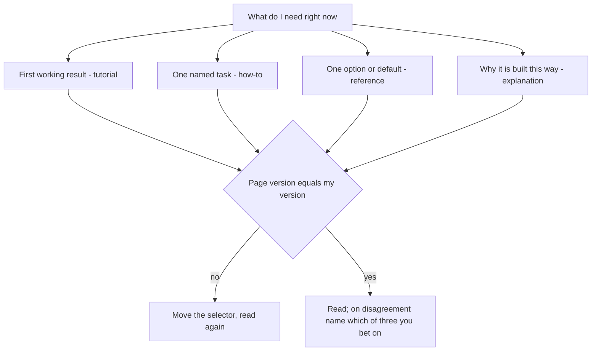

## Bạn cần biết trước

- Không cần bài nào trước — bắt đầu từ đây.

## Tình huống

Bạn đang làm dở phần script HTTP của Đơn Hàng ở `stage-0`, trạng thái đầu tiên được gắn tag của repository ví dụ — một điểm đã lưu mà bạn chuyển tới bằng `git checkout stage-0`. Chạy `scripts/http/cache-headers.sh` in ra một response có header `Cache-Control: max-age=60`, và bạn muốn biết dòng đó hứa hẹn điều gì. Bạn tìm tên header và mở kết quả đầu tiên, một bài blog. Bài viết nói trình duyệt sẽ dùng lại response trong một phút, nhưng không hề nêu nó viết cho bản phát hành nào, cũng không trích tài liệu định nghĩa header đó. Không có gì cho bạn biết câu ấy nói về server của bạn hay server của tác giả. Lẽ ra bạn phải tìm ở đâu trước, và đọc trang đó thế nào để thôi phải đoán?

## Khái niệm cốt lõi

- tutorial (hướng dẫn nhập môn) — trang dẫn bạn đi trọn một mục tiêu qua chuỗi bước riêng của nó, nên bạn đi theo đúng thứ tự thay vì nhảy vào giữa.
- how-to (hướng dẫn làm một việc) — trang làm một việc có tên cho người đọc đã có sẵn bối cảnh. Bạn tìm đúng việc đó rồi chỉ làm theo các bước của nó.
- reference (tra cứu) — bản liệt kê khô khan những gì đang có: các tùy chọn, giá trị mặc định, các lỗi. Bạn tìm trong đó một mục và không đọc gì khác.
- explanation (giải thích nguyên lý) — trang nói vì sao thứ đó được làm theo cách này. Bạn đọc nó khi trang tra cứu đúng mà bạn vẫn không hiểu.
- specification (đặc tả) — tài liệu tiêu chuẩn định nghĩa một thứ không thuộc về riêng sản phẩm nào, chẳng hạn một HTTP header. Nó là một trang tra cứu. Các giao thức Internet như HTTP được định nghĩa trong những tài liệu đánh số gọi là RFC. RFC không có bộ chọn phiên bản: đặc tả thay đổi thì được xuất bản thành RFC mới với số mới, và RFC sau ghi ngay ở đầu rằng nó obsoletes (thay thế) hay updates (bổ sung) những RFC nào trước đó. Con số đó là thứ bạn ghi lại thay cho phiên bản. Hãy kiểm tra xem có RFC nào mới hơn thay thế hay bổ sung nó không.
- bộ chọn phiên bản (version selector) — ô điều khiển gần đầu một trang tài liệu, dùng để chọn trang mô tả bản phát hành (phiên bản) nào của sản phẩm.

## Cơ chế hoạt động



Header trong tình huống được định nghĩa trong một đặc tả, tức một trang tra cứu, nên bài blog là chỗ dừng đầu tiên sai.

Hãy tìm trang tài liệu riêng của sản phẩm trước, rồi tìm bên trong trang đó chứ không tìm khắp web. Khi thứ bạn cần không thuộc sản phẩm nào, như một header, hãy tìm đặc tả của nó theo tên. Phiên bản của đặc tả chính là số hiệu của nó: ghi số đó lại và kiểm tra rằng không có số mới hơn thay thế hay bổ sung nó. Nếu có, mở số mới hơn và đọc số đó. Trang RFC chính thức ghi ngay ở đầu khi có RFC sau thay thế hay bổ sung nó: `This RFC is now obsolete, see RFC <number>` hoặc `Updated by` kèm các số sau. Nếu không thấy dòng nào như vậy, chưa có gì mới hơn thay thế hay bổ sung nó.

Nếu bạn chưa từng làm cho thứ đó chạy lần nào, bạn cần tutorial. Nếu bạn đã có bối cảnh và muốn làm xong một việc có tên, bạn cần how-to. Nếu bạn cần một tùy chọn, một giá trị mặc định hay một thông báo lỗi, bạn cần reference: nhảy thẳng tới mục đó, thường nhanh hơn đọc từ đầu. Nếu trang tra cứu đúng mà vẫn khó hiểu, bạn cần explanation, loại trang mà cũng như tutorial, bạn đọc từ đầu tới cuối chứ không tìm.

Mỗi trang đặt tên các loại này khác nhau: how-to có thể nằm dưới mục Tasks, explanation nằm dưới Concepts. Hãy nhìn hình dạng trang, đừng nhìn chữ.

Khi đã mở trang, tìm bộ chọn phiên bản trước câu đầu tiên. Một trang tài liệu thường giữ một bộ trang cho mỗi bản phát hành, và bản mặc định không phải lúc nào cũng là bản bạn dùng. Chuyển nó sang phiên bản của bạn rồi mới đọc. Với đặc tả, bước kiểm tra phiên bản trong sơ đồ là số hiệu tài liệu, không phải bộ chọn.

Khi trang tài liệu và máy bạn nói khác nhau, hãy kiểm tra ba thứ: phiên bản trang mô tả, phiên bản bạn đang chạy, và một giả định bạn đã đặt ra về cách cài đặt của chính mình. Nói rõ bạn đặt cược vào thứ nào trước khi sửa bất kỳ dòng code nào.

## Trong hệ thống Đơn Hàng

Repository có sẵn một checklist cho đúng việc này, viết bằng tiếng Việt để biết đọc trang tiếng Anh không trở thành điều kiện bắt buộc trước. Bạn trả lời ô đầu tiên trước khi mở bất cứ thứ gì, hai ô giữa khi trang đã hiện trên màn hình nhưng chưa đọc phần thân, và ô cuối từ máy của mình.

```markdown file=docs/craft/doc-reading-checklist.md tag=stage-0 lines=5-10
- [ ] Tôi đang tìm **loại** thông tin nào: hướng dẫn nhập môn, hướng dẫn làm một
      việc cụ thể, tra cứu, hay giải thích nguyên lý?
- [ ] Trang này thuộc loại nào? Trang tra cứu thì **tìm**, đừng đọc từ đầu.
- [ ] Trang này viết cho phiên bản nào? Có bộ chọn phiên bản ở đầu trang không?
- [ ] Phiên bản tôi đang dùng là gì? Nếu hai số khác nhau, mọi câu ở dưới đều
      cần nghi ngờ.
```

Bốn ô, và không ô nào nói về tiếng Anh. Hai ô đầu chốt hình dạng: bạn muốn loại thông tin nào, và trang trước mặt thật ra thuộc loại nào. Hai ô sau là một cặp số phiên bản — bản phát hành mà trang mô tả, và bản phát hành bạn đang chạy. Khi hai số đó khác nhau, mọi câu bên dưới đều chỉ là phỏng đoán cho tới khi bạn kiểm tra.

Nhóm cuối của cùng file đó mới nói về chính ngôn ngữ.

```markdown file=docs/craft/doc-reading-checklist.md tag=stage-0 lines=29-35
Tài liệu kỹ thuật dùng một vốn từ hẹp và dùng rất chính xác. Vài chục từ lặp đi
lặp lại: *deprecated*, *default*, *required*, *optional*, *idempotent*,
*throws*, *unless*, *at least once*, *must*, *should*, *may*.

*must*, *should*, *may* trong tài liệu tiêu chuẩn không phải cách nói lịch sự —
chúng là ba mức bắt buộc khác nhau. Đọc câu theo cấu trúc, đừng dịch từng từ.
Tài liệu chính thức thường **dễ** hơn bài blog, vì nó không cố kể chuyện.
```

Danh sách từ ngắn ấy vừa là vấn đề vừa là lời giải. Tài liệu kỹ thuật dùng đi dùng lại một vốn từ hẹp với nghĩa cố định, nên cùng những từ đó cứ trở lại ở mọi sản phẩm, mọi trang. Hãy đọc mỗi câu theo cấu trúc của nó — điều gì là bắt buộc, với ai, trong điều kiện nào — thay vì dịch từng từ.

Trường hợp rõ nhất là đặc tả, nơi `MUST`, `SHOULD` và `MAY` viết hoa đánh dấu ba mức bắt buộc khác nhau, không phải ba mức lịch sự. Đặc tả nào dùng các từ này thường nói ngay gần đầu rằng chúng mang đúng những nghĩa đó. Các đặc tả gần đây, như đặc tả HTTP, còn nói thêm rằng chúng chỉ mang nghĩa đó khi viết hoa, còn viết thường thì chỉ là tiếng Anh bình thường.

`MUST` là yêu cầu tuyệt đối. `SHOULD` là khuyến nghị — bạn chỉ được làm khác khi có lý do chính đáng và đã cân nhắc đủ mọi hệ quả. `MAY` là hoàn toàn tùy chọn. Checklist ở trên viết chúng bằng chữ thường vì đó là văn xuôi, không phải đặc tả.

## Người mới hay nghĩ rằng…

- **"Tài liệu chính thức khó hơn bài blog, nên bắt đầu từ blog."** → Thực ra bài blog hay bỏ qua bản phát hành mà nó viết cho, và trộn cách cài đặt riêng của tác giả vào các bước, nên bạn không biết câu nào áp dụng cho mình. Trong khi đó, trang chính thức thường ghi phiên bản ngay ở đầu. Bạn sẽ nhận ra khi lệnh trong bài blog lỗi vì một tùy chọn mà bản phát hành của bạn không có.
- **"Tiếng Anh yếu thì dịch máy tài liệu là đủ."** → Thực ra bản dịch hay làm phẳng đúng những từ mang nghĩa, biến `MUST`, `SHOULD` và `MAY` thành cùng một động từ lịch sự, và biến `deprecated` — vẫn chạy, nhưng không còn được khuyến nghị và thường sắp bị bỏ — thành "cũ". Bạn sẽ nhận ra khi câu dịch đọc rất trôi mà code của bạn vẫn làm điều ngược lại.
- **"Trang tài liệu nói khác máy mình thì trang sai."** → Thực ra bản phát hành của trang, bản phát hành của bạn và giả định của chính bạn đều có thể là thủ phạm, và giả định của bạn là thứ dễ bị bỏ qua nhất. Bạn sẽ nhận ra khi cái header bạn chắc chắn server trả về hóa ra do một thứ nằm giữa bạn và server thêm vào, chẳng hạn một cache.

## Thử ngay (3 phút)

1. Với repository ví dụ ở `stage-0`, chạy `scripts/up.sh` một lần. Script này bật lab box — một máy Linux nhỏ nơi mọi script chạy, để kết quả giống nhau trên mọi máy tính — cùng trang web mà các script gọi tới và database, rồi in `The lab is up.` khi đã sẵn sàng. Sau đó chạy `scripts/http/cache-headers.sh` và chép nguyên dòng `Cache-Control` nó in dưới response đầu tiên.
2. Trước khi tìm bất cứ gì, viết hai dòng: bạn cần loại nào trong bốn hình dạng cho header đó, và thứ gì đứng thay cho phiên bản của nó (với một header, đó là số hiệu của đặc tả). Rồi mở trang tra cứu chính thức cho header đó — với một header chuẩn, trang đó chính là đặc tả của nó — tìm trong trang chữ `max-age`, tức từ đứng trước dấu `=` trong dòng bạn đã chép, và chỉ đọc đoạn định nghĩa nó. Ghi lại con số in ở đầu trang rồi đi tiếp.

Kết quả mong đợi: bạn tới được câu định nghĩa trong chưa đầy một phút mà không đọc trang từ đầu, và bạn nói được trong một câu, bằng đúng lời của đoạn đó, giá trị này hứa hẹn điều gì, rồi so với lời của bài blog trong tình huống — hoặc, nếu trang và script có vẻ nói khác nhau, bạn nêu được mình sẽ kiểm tra thứ nào trong ba thủ phạm trước.

## Liên hệ

- [[foundation.l1.http-caching]] — bài đưa bạn tới một đặc tả ngay từ đầu. Bài này là cách đọc nó khi bạn đã tới đó.
- [[foundation.l1.reading-code]] — cùng chiến lược ấy nhưng nhắm vào một codebase thay vì một trang: tìm hình dạng, tìm điểm vào của bạn, đừng bắt đầu từ dòng đầu.
- [[foundation.l2.asking-good-questions]] — bước sau bài này, cho lúc trang tài liệu thật sự không trả lời được bạn.
- [[foundation.l2.using-ai-assistants]] — bài này là tiên quyết của nó: bạn chỉ kiểm được câu trả lời của trợ lý khi bạn tìm được trang mà lẽ ra nó phải trích.

## Tóm tắt 5 dòng

1. Đọc trang chính thức cho đúng phiên bản của bạn, đúng loại hợp với câu hỏi, và tìm trong trang tra cứu thay vì đọc từ đầu.
2. Tài liệu có bốn hình dạng — tutorial, how-to, reference, explanation — và reference là để tìm, không phải để đọc từ đầu.
3. Xem bộ chọn phiên bản trước câu đầu tiên. Trang cho bản phát hành khác trả lời một câu bạn không hỏi.
4. Tiếng Anh kỹ thuật là một vốn từ nhỏ dùng rất chính xác, nên hãy đọc cấu trúc từng câu thay vì dịch từng từ.
5. Khi trang và máy bạn nói khác nhau, kiểm tra phiên bản của trang, phiên bản của bạn và giả định của bạn — và nói rõ bạn đặt cược vào thứ nào.
