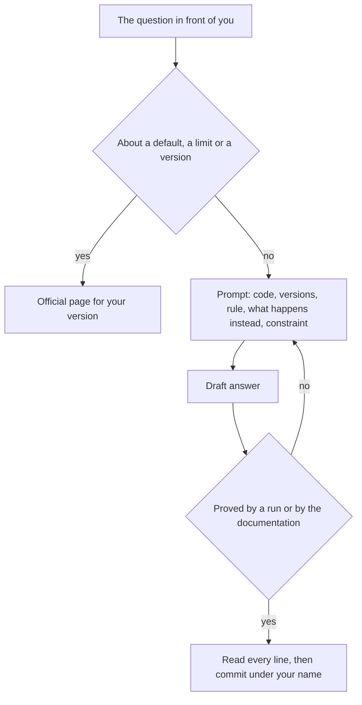

## Before you start

- [[foundation.l2.reading-docs]] — you can find the official page for the version you run and search it for one entry. That skill turns an assistant's answer into something you check, not something you believe.
- [[foundation.l2.debugging-method]] — you narrow a failure by halving until you hold the smallest case that still fails. What you hand an assistant is that narrowed case, not the whole file.

## The situation

Order 1 of Đơn Hàng still totals 1.250.000 đồng instead of 2.150.000. The failing sample — the run that prints `expected 2150000, got 1250000` — is on your screen, and instead of narrowing it you paste the whole file into an assistant and type "fix this bug". A rewritten method comes back in a naming style nothing in this repository uses, calling a helper method this repository does not have. You run it, and the number changes but is still wrong. You reply "still wrong"; it apologises and hands you a third version worded just as certainly as the first, and ten minutes are gone with nothing new known about order 1. What was missing from that exchange?

## Core concepts

- assistant (an AI coding assistant) — a program that writes an answer to whatever you give it; what it hands back is a draft, not a checked result.
- prompt — everything you give it in one turn: your question plus the code, versions, rules and error text you paste with it.
- context — the parts of a prompt that tie the answer to your situation: the code you are looking at, the versions in force, the rule that must hold, what happens instead, and one constraint on the answer.
- plausible answer — one shaped like a correct answer, with the same tone and believable names, carrying nothing that shows anyone checked it.
- verification — the step that makes an answer prove itself: you run it against a case you can reproduce, or you find the sentence in the official documentation for your version it should have come from.

## How it works



Start by sorting the question. If it asks what something does by default, what its limit is, or how a named version behaves, the answer belongs on an official page: a plausible answer about a default carries no sign of having been checked, so an invented one is worded exactly like a correct one. Nothing in the wording separates them; the official page for your version can.

Everything else — your code, your failure, your goal — is worth asking, and the prompt is where the work is. In the situation above the prompt was three words and a file. Nothing in it said which project it was for, and what came back showed that: a naming style this repository does not use and a helper method it does not have. Attach the five parts — the code you are looking at, the versions in force, the rule that must hold, what happens instead, and one constraint on the answer. Ask for the reasoning and for a page you can open, so the answer arrives with its own handle for checking.

Then treat what comes back as a draft. It becomes a result only after verification: you run it against the case you can reproduce, or you open the page it pointed at. When it fails, change the prompt rather than replying "still wrong" — a reply that carries no new information gives the assistant nothing new to work from, so the next version is another guess. When it holds, read every line before it enters a commit; your name is on it, and someone on your team reads the change before it is merged and asks why each line is there.

## In the Đơn Hàng system

At `stage-0` — the example repository as it stands at this point of the course — it carries one Vietnamese page on this: `docs/craft/ai-prompt-examples.md`. It opens with a request of the same shape as yours, a line of intent and nothing else, this time asking for a cancel feature.

```markdown file=docs/craft/ai-prompt-examples.md tag=stage-0 lines=5-9
> Viết cho tôi chức năng hủy đơn hàng.

Không có phiên bản, không có ngữ cảnh, không có ràng buộc. Bạn sẽ nhận về một
đoạn code trông hợp lý, dùng thư viện bạn không có, theo quy ước không phải của
đội, và bạn không đủ thông tin để biết nó sai chỗ nào.
```

The page names its three gaps — no version, no context, no constraint — then the cost: code that looks reasonable, uses a library you do not have, follows conventions that are not your team's, and leaves you unable to say where it is wrong. That last clause matters most: an answer you cannot judge saves no work.

The page then shows a request about the same feature, written to be judgeable.

```markdown file=docs/craft/ai-prompt-examples.md tag=stage-0 lines=13-17
> Đây là `OrderService.Cancel` của tôi (dán code). Dự án dùng .NET 10 và
> PostgreSQL 17. Quy tắc nghiệp vụ: chỉ đơn ở trạng thái `new` mới hủy được;
> hủy đơn đã hủy phải trả về lỗi xung đột. Hiện tại đơn `shipped` cũng bị hủy.
> Chỉ ra chỗ sai, giải thích vì sao, và nói rõ điều gì trong .NET khiến nó xảy
> ra. Đừng viết lại cả phương thức.
```

The five parts are all there: the code, where the quoted prompt writes `(dán code)`; the versions, .NET 10 and PostgreSQL 17; the rule; what happens instead; and one constraint, do not rewrite the whole method. It also asks for the reasoning and the platform behaviour behind the bug, and both you can check.

The rest of the page sorts the work into three tasks to hand over and three to keep. The three it hands over: explaining unfamiliar code; generating tests — small runs that call a method on chosen inputs and check what comes back — by listing its edge cases (the unusual inputs at the boundaries of what it accepts); and writing the failure out for a machine to read, a prompt worth writing even if you never send it. They share one property: checking the result is cheap.

You confirm an explanation by running the code; a wrong list of edge cases still leaves you something to read and prune; and the third pays before it is answered, because writing the failure out often shows you the bug yourself. The page stops at three, but repetitive code that a single run can check belongs on the same side, because checking it is just as cheap.

The three it keeps back:

- Questions about default values, limits and versions go to the official documentation, for the reason above: the assistant produces text that sounds reasonable, not verified truth.
- Code you have not read line by line still enters a commit carrying your name, not the assistant's.
- Real customer data must not be pasted into any outside tool at all — here the risk is disclosure, not a wrong answer.

The page's closing paragraph names the posture this lesson asks for: treat the assistant as a very confident, broadly informed colleague who is sometimes completely wrong in the same voice used when right, and read and check its draft before you use it.

## Beginners often think…

- **"If the assistant is confident, it is probably right."** → Actually a confident tone is not evidence that anything was checked, so a wrong answer and a right one arrive in the same voice. You notice this when it apologises, then hands you a third version worded as certainly as the first two.
- **"Using AI means I do not need to understand the code."** → Actually understanding is what the commit records and what you answer for, since the code will be read, changed and broken by people who ask why it is written this way. You notice this when someone reading your change asks what a line does and the only honest answer is that it came with the rest.

## Try it (3 minutes)

1. From the top folder of the example repository at `stage-0`, run `dotnet run --project samples/DonHang.Samples -- wrong-total` and copy the first line it prints. Then open `docs/craft/ai-prompt-examples.md` and read its good question once, for shape only.
2. Write the prompt you would send about this failure, in a file or on paper, using that shape, with `(paste code)` where the code goes.

Expected result: the run's first line is `expected 2150000, got 1250000` — a second line about a one-line order follows — and your prompt names both numbers. Check your draft for the two parts that are easiest to leave out, the rule and the constraint; they decide whether you get an answer you can judge.

<details><summary>Suggested answer</summary>

A prompt with all five parts reads roughly: here is the method that totals an order (paste code); the project runs .NET 10; an order's total must be the sum of every line, quantity times unit price; for order 1 the printed total is 1.250.000 where 2.150.000 is expected; say which line is wrong and why, and do not rewrite the method. Without the rule, nothing says what counts as wrong; without the constraint, you get a new method instead of a located defect.

</details>

## Connections

- [[foundation.l2.reading-docs]] — the prerequisite and the check itself: an answer about a default is worth nothing until you find it on the official page.
- [[foundation.l2.debugging-method]] — what you do before asking: narrowing produces both the small question and the reproducible case that judges the answer.
- [[foundation.l2.asking-good-questions]] — the same parts aimed at a person; a colleague tells you when the question makes no sense, and an assistant answers it anyway.
- [[foundation.l2.writing-bug-reports]] — the same discipline applied to a failure you hand to your team, not to a tool.

## Five-line summary

1. An assistant returns a plausible draft, not a verified fact, so give it real context and check every answer before your name goes on it.
2. Questions about defaults, limits and versions belong to the official documentation, because an invented answer is written exactly like a correct one.
3. A useful prompt carries the code, the versions in force, the rule that must hold, what happens instead, and one constraint.
4. Hand it work you can check cheaply — explaining code, generating tests, writing the failure out — and keep code you have not read.
5. You answer for what you commit; that the assistant wrote it explains nothing to the person reading your change.
