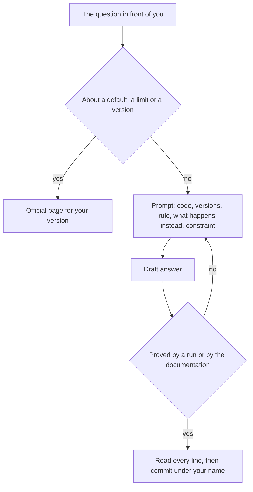

## Bạn cần biết trước

- [[foundation.l2.reading-docs]] — bạn tìm được trang chính thức cho đúng phiên bản mình đang chạy và tra một mục trong đó. Nhờ vậy, câu trả lời của trợ lý thành thứ bạn kiểm tra, không phải thứ bạn tin.
- [[foundation.l2.debugging-method]] — bạn khoanh vùng lỗi bằng cách chia đôi cho tới khi còn lại trường hợp nhỏ nhất vẫn lỗi. Thứ bạn đưa cho trợ lý là trường hợp đã khoanh vùng đó, không phải cả file.

## Tình huống

Đơn số 1 của Đơn Hàng có tổng 1.250.000 đồng thay vì 2.150.000. Sample đang lỗi — một chương trình nhỏ trong repository, tái hiện đúng bug này và in `expected 2150000, got 1250000` — đang mở trên màn hình. Thay vì khoanh vùng, bạn dán cả file vào trợ lý và gõ "fix this bug". Bạn nhận về một phương thức viết lại theo kiểu đặt tên không chỗ nào trong repository dùng, gọi một hàm phụ mà repository không có. Bạn chạy thử: con số đổi nhưng vẫn sai. Bạn trả lời "vẫn sai", trợ lý xin lỗi rồi đưa bản thứ hai, giọng chắc chắn y như bản đầu. Mười phút trôi qua mà bạn không biết thêm gì về đơn số 1. Cuộc trao đổi đó thiếu gì?

## Khái niệm cốt lõi

- trợ lý (AI coding assistant) — một chương trình viết ra câu trả lời cho bất cứ thứ gì bạn đưa vào. Thứ nó trả về là bản nháp, không phải kết quả đã kiểm tra.
- prompt — mọi thứ bạn đưa cho nó trong một lượt: câu hỏi, cùng với code, phiên bản, quy tắc và nội dung lỗi bạn dán kèm.
- ngữ cảnh — những phần của prompt buộc câu trả lời vào đúng tình huống của bạn: đoạn code bạn đang xem, các phiên bản đang dùng, quy tắc phải đúng, điều đang xảy ra thay vào đó, và một ràng buộc cho câu trả lời.
- câu trả lời nghe hợp lý — câu trả lời có dáng của câu trả lời đúng, cùng giọng điệu, tên gọi nghe tin được, nhưng không mang dấu hiệu nào cho thấy đã có ai kiểm tra.
- kiểm chứng — bước bắt câu trả lời tự chứng minh: bạn chạy nó với một trường hợp tái hiện được, hoặc tìm ra câu trong tài liệu chính thức của phiên bản bạn dùng mà lẽ ra nó phải lấy từ đó.

## Cơ chế hoạt động



Bắt đầu bằng phân loại câu hỏi. Nếu nó hỏi một thứ mặc định làm gì, giới hạn của nó là bao nhiêu, hay một phiên bản cụ thể hoạt động ra sao, thì câu trả lời nằm trên trang chính thức. Một câu trả lời về giá trị mặc định không mang dấu hiệu nào cho thấy đã được kiểm tra, nên câu bịa ra có thể được viết tự tin y như câu đúng. Lời văn không đủ để phân biệt hai loại, còn trang chính thức cho phiên bản của bạn thì đủ.

Mọi thứ còn lại — code của bạn, lỗi bạn gặp, mục tiêu bạn muốn — đều đáng hỏi, và phần công sức nằm ở prompt. Trong tình huống trên, prompt chỉ gồm ba chữ và một file, không có gì cho biết nó dành cho project nào, và câu trả lời phản ánh đúng điều đó: một kiểu đặt tên và một hàm phụ mà repository này không có. Hãy kèm đủ năm phần: đoạn code bạn đang xem, các phiên bản đang dùng, quy tắc phải đúng, điều đang xảy ra thay vào đó, và một ràng buộc cho câu trả lời. Hãy yêu cầu nó giải thích lập luận và chỉ ra một trang bạn mở được, để câu trả lời tự mang theo chỗ bám cho bạn kiểm tra.

Sau đó, coi thứ nhận về là bản nháp. Nó chỉ thành kết quả sau khi kiểm chứng: bạn chạy nó với trường hợp tái hiện được, hoặc mở trang nó chỉ tới và xác nhận đó là trang chính thức cho phiên bản của bạn, vì chính lời chỉ dẫn đó cũng là một phần của bản nháp. Khi nó sai, hãy sửa prompt thay vì trả lời "vẫn sai". Một câu trả lời không mang thông tin mới thì trợ lý cũng không có gì mới để dựa vào, nên bản tiếp theo nhiều khả năng lại là một lần đoán. Khi nó đúng, hãy đọc từng dòng trước khi đưa vào commit. Tên bạn nằm trên đó, và ở những đội review trước khi merge, sẽ có người đọc thay đổi và hỏi vì sao từng dòng có mặt ở đó.

## Trong hệ thống Đơn Hàng

Ở `stage-0`, repository ví dụ có một trang tiếng Việt về chủ đề này: `docs/craft/ai-prompt-examples.md`. Trang mở đầu bằng một yêu cầu giống hệt kiểu của bạn, chỉ một dòng mong muốn và không gì khác, lần này là xin chức năng hủy đơn.

```markdown file=docs/craft/ai-prompt-examples.md tag=stage-0 lines=5-9
> Viết cho tôi chức năng hủy đơn hàng.

Không có phiên bản, không có ngữ cảnh, không có ràng buộc. Bạn sẽ nhận về một
đoạn code trông hợp lý, dùng thư viện bạn không có, theo quy ước không phải của
đội, và bạn không đủ thông tin để biết nó sai chỗ nào.
```

Trang gọi tên ba chỗ thiếu, rồi cái giá phải trả, và kết thúc ở phần quan trọng nhất: bạn không nói được code sai ở đâu, và một câu trả lời bạn không đánh giá được thì tiết kiệm ít công hơn vẻ ngoài của nó.

Tiếp theo, trang đưa ra một yêu cầu về cùng chức năng, được viết để có thể đánh giá.

```markdown file=docs/craft/ai-prompt-examples.md tag=stage-0 lines=13-17
> Đây là `OrderService.Cancel` của tôi (dán code). Dự án dùng .NET 10 và
> PostgreSQL 17. Quy tắc nghiệp vụ: chỉ đơn ở trạng thái `new` mới hủy được;
> hủy đơn đã hủy phải trả về lỗi xung đột. Hiện tại đơn `shipped` cũng bị hủy.
> Chỉ ra chỗ sai, giải thích vì sao, và nói rõ điều gì trong .NET khiến nó xảy
> ra. Đừng viết lại cả phương thức.
```

Đủ cả năm phần: code — `OrderService.Cancel`, phương thức hủy một đơn — nằm ở chỗ prompt ghi `(dán code)`. Phiên bản là .NET 10 và PostgreSQL 17 (cơ sở dữ liệu project dùng để lưu đơn). Rồi đến quy tắc, điều đang xảy ra thay vào đó, và một ràng buộc: đừng viết lại cả phương thức. Prompt còn hỏi vì sao, và điều gì trong .NET gây ra bug. Điều thứ nhất bạn kiểm tra với code, điều thứ hai trên trang chính thức của .NET 10.

Phần còn lại của trang chia công việc thành ba thứ nên giao và ba thứ nên giữ. Thứ nhất nên giao là giải thích code lạ. Thứ hai là sinh test — những lần chạy nhỏ gọi code của bạn với đầu vào chọn sẵn và kiểm tra kết quả trả về — bằng cách liệt kê các trường hợp biên (đầu vào nằm ở rìa của những gì phương thức chấp nhận). Thứ ba là viết lỗi ra thành một prompt cho trợ lý — đáng làm kể cả khi bạn không bao giờ gửi, vì viết ra thường giúp bạn tự thấy bug. Ba thứ này có chung một đặc điểm: kiểm tra kết quả rất rẻ.

Bạn xác nhận một lời giải thích bằng cách chạy code. Một danh sách trường hợp biên sai vẫn để lại cho bạn thứ để đọc và lọc bớt. Còn một lỗi đã viết ra chỉ tốn vài phút: nó chỉ bạn tới dòng nào thì sample đang lỗi sẽ xác nhận hoặc bác bỏ dòng đó. Trang dừng ở ba thứ, nhưng code lặp đi lặp lại mà một lần chạy kiểm tra được cũng thuộc về cùng phía.

Ba thứ trang giữ lại:

- Câu hỏi về giá trị mặc định, giới hạn và phiên bản thì tra tài liệu chính thức, vì lý do đã nói ở trên: trợ lý tạo ra văn bản nghe hợp lý, không phải sự thật đã kiểm chứng.
- Đọc code từng dòng trước khi đưa vào commit vẫn là phần của bạn. Commit mang tên bạn, không phải tên trợ lý.
- Không dán dữ liệu khách hàng thật vào bất kỳ công cụ bên ngoài nào — ở đây rủi ro là lộ dữ liệu, không phải câu trả lời sai.

Trang khép lại bằng đúng thái độ bài này yêu cầu: coi trợ lý như một đồng nghiệp rất tự tin, biết rộng, thỉnh thoảng sai hoàn toàn nhưng vẫn bằng giọng lúc nó đúng, và kiểm tra bản nháp của nó trước khi dùng.

## Người mới hay nghĩ rằng…

- **"Trợ lý nói chắc chắn thì chắc là đúng."** → Thực ra giọng tự tin không phải bằng chứng cho thấy có gì đã được kiểm tra, nên câu trả lời sai và câu trả lời đúng đến với cùng một giọng. Bạn sẽ nhận ra khi nó xin lỗi, rồi đưa bản thứ hai với giọng chắc chắn y như bản đầu.
- **"Dùng AI thì không cần hiểu code."** → Thực ra sự hiểu chính là thứ commit ghi lại, và là thứ bạn phải chịu trách nhiệm khi sau này có người hỏi vì sao code viết như vậy. Bạn sẽ nhận ra khi người đọc thay đổi của bạn hỏi một dòng làm gì, và câu trả lời thật lòng duy nhất là nó đi kèm với phần còn lại.

## Thử ngay (3 phút)

1. Từ thư mục gốc của repository ví dụ ở `stage-0`, chạy `dotnet run --project samples/DonHang.Samples -- wrong-total` và chép lại dòng đầu tiên nó in ra. Sau đó mở `docs/craft/ai-prompt-examples.md` và đọc một lượt yêu cầu thứ hai được trích trong đó (yêu cầu về `OrderService.Cancel` ở trên), chỉ để nắm khuôn.
2. Viết prompt bạn sẽ gửi về lỗi này theo đúng khuôn đó, ghi `(paste code)` ở chỗ đặt code. Quy tắc ở đây: tổng của một đơn bằng tổng các dòng, mỗi dòng là số lượng nhân đơn giá.

Kết quả mong đợi: dòng đầu tiên của lần chạy là `expected 2150000, got 1250000` — tiếp theo là một dòng thứ hai về một đơn chỉ có một dòng — và prompt của bạn nêu cả hai con số. Soát lại bản nháp xem đã có quy tắc và ràng buộc chưa, vì đó là hai phần dễ bị bỏ sót nhất.

<details><summary>Gợi ý đáp án</summary>

Một prompt đủ năm phần sẽ đại khái như sau: "Đây là phương thức tính tổng một đơn (paste code). Project chạy .NET 10. Tổng của một đơn phải bằng tổng các dòng. Với đơn số 1, tổng in ra là 1.250.000 trong khi mong đợi 2.150.000. Hãy chỉ ra dòng nào sai và vì sao, đừng viết lại phương thức." Thiếu quy tắc thì không có gì nói điều gì là sai. Thiếu ràng buộc thì bạn nhận về một phương thức mới thay vì một chỗ lỗi được chỉ ra.

</details>

## Liên hệ

- [[foundation.l2.reading-docs]] — chính bước kiểm tra: một câu trả lời về giá trị mặc định chỉ có giá trị khi bạn tìm thấy nó trên trang chính thức.
- [[foundation.l2.debugging-method]] — khoanh vùng trước khi hỏi cho bạn cả câu hỏi nhỏ lẫn trường hợp dùng để đánh giá câu trả lời.
- [[foundation.l2.asking-good-questions]] — cũng các phần ấy nhưng hướng tới một con người. Đồng nghiệp sẽ nói cho bạn biết khi câu hỏi vô nghĩa, còn trợ lý có thể vẫn trả lời.
- [[foundation.l2.writing-bug-reports]] — cùng kỷ luật đó, cho một lỗi bạn giao lại cho đội.

## Tóm tắt 5 dòng

1. Trợ lý trả về một bản nháp nghe hợp lý, không phải sự thật đã kiểm chứng, nên hãy đưa cho nó ngữ cảnh thật và kiểm tra mọi câu trả lời trước khi tên bạn nằm trên đó.
2. Câu hỏi về giá trị mặc định, giới hạn và phiên bản thuộc về tài liệu chính thức, vì câu trả lời bịa có thể được viết giống hệt câu trả lời đúng.
3. Một prompt hữu ích mang theo code, các phiên bản đang dùng, quy tắc phải đúng, điều đang xảy ra thay vào đó, và một ràng buộc.
4. Giao cho nó những việc bạn kiểm tra được với chi phí thấp — giải thích code, sinh test, viết lỗi ra — và tự đọc từng dòng trước khi commit.
5. Bạn chịu trách nhiệm cho những gì mình commit. "Trợ lý viết" không giải thích được gì cho người đang đọc thay đổi của bạn.
