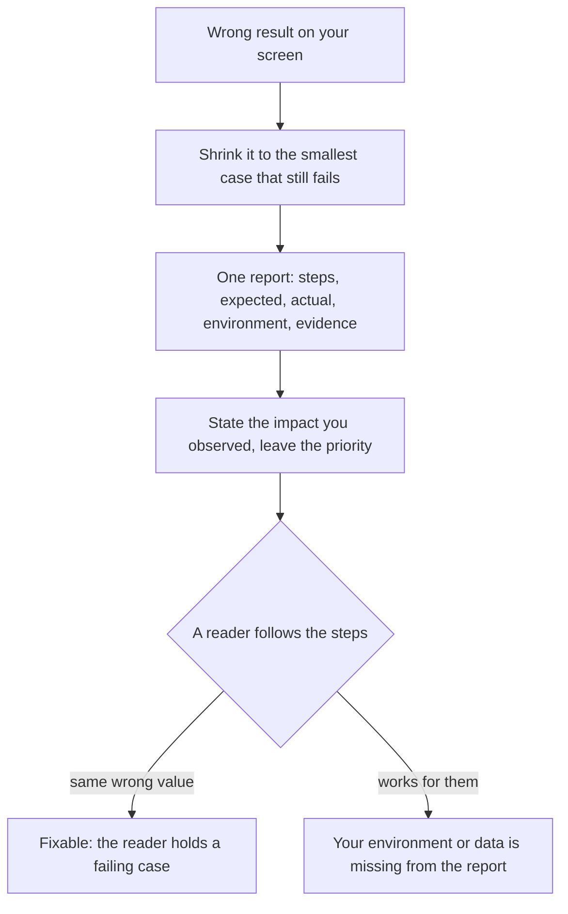

## Before you start

- [[foundation.l2.asking-good-questions]] — you wrote goal, attempts, expectation, actual result and environment for something that blocked you. A report is those lines turned outward, for a reader the failure is not blocking.

## The situation

You have just found a wrong order total in `samples/DonHang.Samples`, the console project of Đơn Hàng at `stage-0`, the first checkpoint of the example repository. Order 1 holds two lines, a keyboard and two mice, and the total on screen is short by the last line. It is late, so you write one entry in the team's bug tracker, where the team records defects: the total is wrong, the sample data looks odd, the project takes forever to start. A picture goes beside it. Two days later the entry comes back untouched, marked not reproducible. What has to be in it before a reader who never saw your screen gets the same wrong number?

## Core concepts

- **bug report** — a written defect description carrying everything a reader needs to produce the same failure themselves, with you not in the room.
- steps to reproduce — numbered actions, starting from a state the reader can reach without asking you, that end in the failure every time.
- expected result and actual result — the value you believed you would get and the one you got, written next to each other.
- environment and evidence — the version, machine, account and data your steps ran against, plus the log line, picture or record id that shows the failure.
- impact and priority — how much harm the defect does and to whom, which you observe, versus when it gets fixed, which someone else decides.
- smallest reproduction — the least you have to do and still see the failure; everything you took away is a place the bug is not.

## How it works



In the situation above the entry carried a symptom and a picture, nothing anybody could run. The report a reader needs starts before the writing, by shrinking. You know order 1 is wrong; the sample data holds other orders to try — order 2 with one line, order 3 with two — and an order with one line is a smaller case than an order with two, so moving to it is how you take something away here. Everything you take away while the failure stays rules that part out; a description rules nothing out, which is what the template's second rule says below.

Then write one report for one defect. Steps come first, numbered, starting from a state the reader reaches without you. Expected and actual results go next to each other, because the actual value alone says what happened and only the expectation says it was wrong. Environment and evidence follow: the version, the data, the account, and the ids of the records that show how far the failure spreads.

Impact is yours to state, since you watched it: who is affected, how many, and whether there is a way around it. When it gets fixed is a different question with a different owner, and deciding both takes that choice away from them.

A suspected cause comes last, if you have one, and says in words that it is a guess. A reader who takes your guess for a finding stops looking where you did not look. That reader is also the test in the diagram: one who reproduces your value holds a failing case, one for whom it works has told you your environment or your data never reached the report.

## In the Đơn Hàng system

The repository carries the form itself, in Vietnamese: the shape matters more than the language.

```text file=docs/craft/bug-report-template.md tag=stage-0 lines=6-15
Tiêu đề: <một lỗi, nói rõ triệu chứng>
Các bước tái hiện:
  1. ...
  2. ...
Kết quả mong đợi: ...
Kết quả thực tế: ...
Môi trường: <phiên bản, môi trường, tài khoản, dữ liệu>
Bằng chứng: <log, ảnh chụp, id bản ghi>
Mức ảnh hưởng: <ai bị ảnh hưởng, bao nhiêu người, có cách nào đi vòng không>
Nghi ngờ nguyên nhân: <nếu có — ghi rõ đây là phỏng đoán>
```

Eight fields: title, steps to reproduce, expected result, actual result, environment, evidence, impact, suspected cause. Read what `Tiêu đề` asks for — *một lỗi*, one defect, named by its symptom, which is where your three-problem entry already failed. `Mức ảnh hưởng` asks three things and no more: who is affected, how many of them, and whether there is a way around it. `Nghi ngờ nguyên nhân` asks for the label in the field itself — *ghi rõ đây là phỏng đoán*, say plainly that this is a guess.

The file's worked example fills these fields for the very total you found. Order 1 has two lines; expected 2.150.000 đồng, actual 1.250.000 đồng, which is the price of the keyboard alone. Its evidence line is the part worth copying: orders 1 and 3 are both wrong, and order 2, which has one line, shows 0. Those three are rows of the sample data, the orders the repository already ships with, and order 2 is a one-line order — the smallest shape a case there can have. Its impact line says *phần lớn đơn*, most orders, where the sample data makes it exactly half.

Under the example the same file states its three rules.

```markdown file=docs/craft/bug-report-template.md tag=stage-0 lines=41-45
1. **Một lỗi một báo cáo.** Báo cáo gộp ba vấn đề thường được sửa không vấn đề nào.
2. **Tái hiện nhỏ nhất.** Đơn 2 chỉ có một dòng và hiện 0 — chi tiết đó thu hẹp
   phạm vi hơn cả trang mô tả.
3. **Phân biệt mức ảnh hưởng và độ ưu tiên.** Mức ảnh hưởng do bạn quan sát; độ
   ưu tiên do người quản lý sản phẩm quyết định. Đừng tự đặt cả hai.
```

One defect per report, because a report holding three problems tends to get none of them fixed — there is no single thing to close. The smallest reproduction narrows the search more than a page of description: an order with one line showing 0 says the failure is in how the lines are counted, not in any price. And the last rule separates the two fields the situation above mixed: you observe the impact, the person holding the product sets the order of work, and you set only your half.

## Beginners often think…

- **"'It does not work' plus a screenshot is a bug report."** → Actually nobody can run a sentence, and a picture gives the reader a number to retype rather than text to paste, so without steps, the two results, the environment and the data a reader has nothing to repeat. You notice this when your entry returns marked not reproducible and the first reply asks which order you opened.
- **"I should not report a bug unless I know the cause."** → Actually finding the cause is the fixing work, and holding the report until then burns the days when only you can still see the failure. You notice this when you finally write it up and the data that produced it has been replaced.
- **"Impact and priority are one field, so I set both."** → Actually impact is the harm you watched, while priority weighs that harm against everything else the team owes, which is usually not what you were looking at when you found the defect. You notice this when a defect you marked highest sits untouched beside a smaller one that blocks everyone.

## Try it (3 minutes)

1. Open `docs/craft/bug-report-template.md` at `stage-0` and copy its ten template lines into an empty file. Fill them for the wrong order total, using the order numbers and prices this lesson gave you: `Các bước tái hiện` numbered from running the `wrong-total` sample of `samples/DonHang.Samples`, `Kết quả mong đợi` and `Kết quả thực tế` as two numbers rather than two adjectives.
2. Now read back two of your lines. For `Các bước tái hiện`: could someone who has never opened this repository do step 1? For `Bằng chứng`: does it name records, or does it say "several orders"?

Expected result: step 1 names the sample to run and a record id, not an assumption about what the reader has open; `Bằng chứng` names orders by number, one of them the smallest case that still fails.

<details><summary>Suggested answer</summary>

Title: the total of a multi-line order is short by its last line. Steps: run the `wrong-total` sample of `samples/DonHang.Samples`, which totals order 1 — a keyboard at 1.250.000 and two mice at 450.000 each — and read the printed total. Expected 2.150.000 đồng, actual 1.250.000 đồng. Environment: the example repository at `stage-0`, sample data unchanged.

Evidence: the same run also prints a one-line case, and that one shows 0; orders 2 and 3 of the sample data — figures from the repository, not from this lesson — have exactly those two shapes, one line at 890.000 and two lines at 3.200.000 and 320.000. Impact: the run exercises order 1 only, so the rest is by shape — every order, since the total drops its last line: the six multi-line orders (1, 3, 5, 7, 10 and 12) come out short, the six one-line orders show 0, and there is no way around it. Suspected cause, and a guess: the summing loop stops one line early.

</details>

## Connections

- [[foundation.l2.asking-good-questions]] — the same discipline aimed elsewhere: a question asks a reader to unblock you, a report asks a reader to reproduce a failure that is not theirs.
- [[foundation.l2.debugging-method]] — both supplier and customer of this lesson: its narrowing loop produces the smallest reproduction a report carries, and the report hands the next person a failing case.
- [[management.l1.user-story-and-ac]] — the same idea from the other end: a story writes down what correct looks like before anyone builds it, a report what wrong looked like after.

## Five-line summary

1. A bug report gives steps to reproduce, expected and actual results, environment, evidence and observed impact, so a reader can produce the failure alone.
2. One defect per report, because a report holding three problems has nothing single to close and usually gets none of them fixed.
3. Shrink the failure before writing; the smallest case that still fails narrows the search further than any amount of description.
4. Impact is what you observed and priority is when the team will pay for it; different fields, different owners.
5. Include a suspected cause when you have one, labelled as a guess, so nobody stops looking where you did not look.
