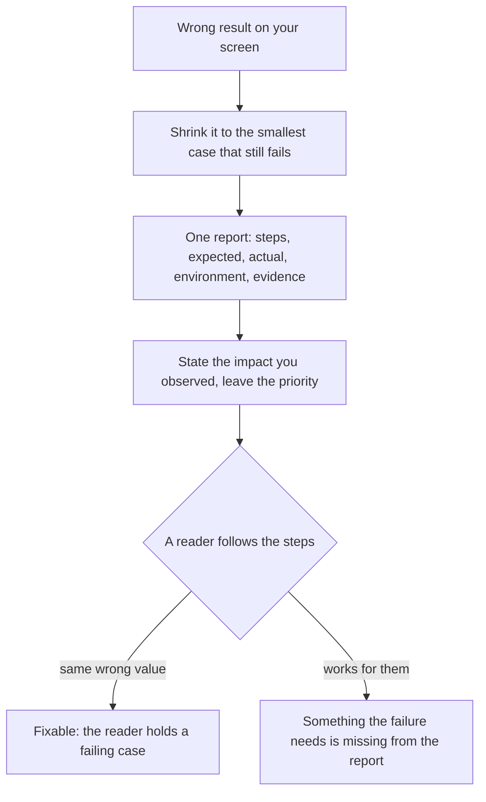

## Bạn cần biết trước

- [[foundation.l2.asking-good-questions]] — bạn đã viết ra mục tiêu, những gì đã thử, kết quả mong đợi, kết quả thực tế và môi trường cho một thứ đang chặn mình. Một bản báo cáo lỗi chính là những dòng đó hướng ra ngoài, cho một người đọc mà lỗi không hề chặn họ.

## Tình huống

Bạn phát hiện tổng tiền của một đơn bị sai trong `samples/DonHang.Samples`, project console của Đơn Hàng ở `stage-0`. Project này chạy từng sample theo tên: `dotnet run --project samples/DonHang.Samples -- wrong-total` tính tổng đơn số 1, gồm một bàn phím và một dòng thứ hai là hai con chuột giá 450.000 mỗi con, và kết quả hụt đúng bằng dòng cuối. Một trường hợp chỉ có một dòng mà lần chạy đó cũng in ra thì hiện 0. Lúc đã muộn, bạn ghi một mục vào công cụ theo dõi lỗi của đội, nơi các lỗi được ghi lại và đóng khi đã sửa xong: tổng bị sai, dữ liệu mẫu trông lạ, project khởi động chậm. Kèm theo là một tấm ảnh chụp màn hình. Hai ngày sau, mục đó quay về với nhãn không tái hiện được. Nó cần chứa những gì để một người chưa từng thấy màn hình của bạn cũng nhận được đúng con số sai đó?

## Khái niệm cốt lõi

- **bug report** (Mô tả lỗi đủ để người khác tái hiện: bước, kết quả mong đợi, kết quả thực tế, môi trường) — bản mô tả lỗi bằng chữ, mang mọi thứ người đọc cần để tự tạo ra đúng lỗi đó mà không cần bạn ngồi cạnh.
- các bước tái hiện — những thao tác đánh số, bắt đầu từ một trạng thái người đọc tự đạt được mà không phải hỏi bạn, và lần nào cũng kết thúc bằng lỗi.
- kết quả mong đợi và kết quả thực tế — giá trị bạn tin mình sẽ nhận được và giá trị bạn thật sự nhận được, viết cạnh nhau.
- môi trường và bằng chứng — phiên bản, máy, tài khoản và dữ liệu mà các bước của bạn đã chạy trên đó, cùng dòng log, ảnh chụp hoặc id bản ghi cho thấy lỗi.
- mức ảnh hưởng và độ ưu tiên — lỗi gây hại bao nhiêu và cho ai, là thứ bạn quan sát được, khác với khi nào nó được sửa, là thứ người khác quyết định.
- tái hiện nhỏ nhất — lượng thao tác ít nhất mà vẫn thấy lỗi. Mỗi thứ bạn bỏ đi được là một thứ lỗi không cần tới.

## Cơ chế hoạt động



Một bản báo cáo bắt đầu từ trước khi viết, bằng bước thu nhỏ. Bạn biết đơn số 1 sai. Một đơn chỉ có một dòng là trường hợp nhỏ hơn, và lần chạy `wrong-total` đã in sẵn một trường hợp như vậy: đơn số 1 cắt còn dòng bàn phím, hiện 0. Trường hợp một dòng đó là tái hiện nhỏ nhất của bạn. Trong dữ liệu mẫu, đơn số 2 có dáng đó, một dòng, còn đơn số 3 có hai dòng, đúng như cách ví dụ mẫu trong template bên dưới đánh số chúng. Mỗi thứ bạn bỏ đi mà lỗi vẫn còn là một thứ lỗi không cần tới. Viết thêm mô tả thì không bỏ đi được gì, nên nó không thể cho thấy lỗi không cần những gì. Quy tắc thứ hai của template, trích bên dưới, cũng nói đúng điều này.

Sau đó, viết một báo cáo cho một lỗi. Các bước đi trước, đánh số, bắt đầu từ trạng thái người đọc tự đạt được mà không cần bạn. Kết quả mong đợi và kết quả thực tế nằm cạnh nhau, vì chỉ riêng giá trị thực tế cho biết chuyện gì đã xảy ra, còn phải có kết quả mong đợi mới cho biết đó là sai. Tiếp theo là môi trường và bằng chứng: phiên bản, dữ liệu, tài khoản, và các id bản ghi cho thấy lỗi lan rộng tới đâu.

Mức ảnh hưởng là phần bạn nêu, vì chính bạn đã chứng kiến: ai bị ảnh hưởng, bao nhiêu người, và có cách đi vòng hay không. Khi nào sửa là một câu hỏi khác, thuộc về một người khác. Tự quyết cả hai là lấy mất lựa chọn đó khỏi tay họ.

Nghi ngờ nguyên nhân là trường tùy chọn cuối cùng, không phải một bước trong sơ đồ, và phải nói rõ bằng chữ rằng đó là phỏng đoán. Người đọc coi phỏng đoán của bạn là kết luận sẽ thôi tìm ở những chỗ bạn chưa tìm. Người đọc đó cũng chính là phép thử trong sơ đồ: ai tái hiện được đúng giá trị của bạn là đang cầm một trường hợp lỗi, còn ai chạy thấy bình thường thì thường đang báo cho bạn biết rằng một thứ lỗi cần tới, hay gặp nhất là môi trường hoặc dữ liệu của bạn, chưa bao giờ vào tới bản báo cáo.

## Trong hệ thống Đơn Hàng

Repository có sẵn chính biểu mẫu này, bằng tiếng Việt: hình dạng quan trọng hơn ngôn ngữ.

```text file=docs/craft/bug-report-template.md tag=stage-0 lines=6-15
Tiêu đề: <một lỗi, nói rõ triệu chứng>
Các bước tái hiện:
  1. ...
  2. ...
Kết quả mong đợi: ...
Kết quả thực tế: ...
Môi trường: <phiên bản, môi trường, tài khoản, dữ liệu>
Bằng chứng: <log, ảnh chụp, id bản ghi>
Mức ảnh hưởng: <ai bị ảnh hưởng, bao nhiêu người, có cách nào đi vòng không>
Nghi ngờ nguyên nhân: <nếu có — ghi rõ đây là phỏng đoán>
```

Tám trường: tiêu đề, các bước tái hiện, kết quả mong đợi, kết quả thực tế, môi trường, bằng chứng, mức ảnh hưởng, nghi ngờ nguyên nhân. Hãy đọc kỹ `Tiêu đề` yêu cầu gì — *một lỗi*, gọi tên bằng triệu chứng, và đây chính là chỗ mục ghi ba vấn đề của bạn đã hỏng ngay từ đầu. `Mức ảnh hưởng` hỏi đúng ba điều, không hơn: ai bị ảnh hưởng, bao nhiêu người, và có cách đi vòng hay không. `Nghi ngờ nguyên nhân` đòi ghi nhãn ngay trong trường — *ghi rõ đây là phỏng đoán*.

Ví dụ mẫu trong file điền các trường này cho đúng con số tổng bạn vừa phát hiện. Đơn số 1 có hai dòng. Mong đợi 2.150.000 đồng, thực tế 1.250.000 đồng, tức giá riêng của bàn phím. Dòng bằng chứng của nó là phần đáng chép theo: đơn 1 và đơn 3 đều sai, còn đơn 2, chỉ có một dòng, hiện 0. Ba đơn đó là các dòng trong dữ liệu mẫu, và đơn 2 có dáng nhỏ nhất mà một trường hợp ở đó có thể có. Dòng mức ảnh hưởng của nó ghi *phần lớn đơn*, và như vậy là đếm thiếu: trong dữ liệu mẫu, một nửa số đơn có nhiều dòng và bị hụt, nửa còn lại hiện 0, nên đơn nào cũng sai, và dòng của bạn nên nói đúng như vậy.

Bên dưới ví dụ, cùng file nêu ba quy tắc.

```markdown file=docs/craft/bug-report-template.md tag=stage-0 lines=41-45
1. **Một lỗi một báo cáo.** Báo cáo gộp ba vấn đề thường được sửa không vấn đề nào.
2. **Tái hiện nhỏ nhất.** Đơn 2 chỉ có một dòng và hiện 0 — chi tiết đó thu hẹp
   phạm vi hơn cả trang mô tả.
3. **Phân biệt mức ảnh hưởng và độ ưu tiên.** Mức ảnh hưởng do bạn quan sát; độ
   ưu tiên do người quản lý sản phẩm quyết định. Đừng tự đặt cả hai.
```

Một lỗi một báo cáo, vì báo cáo gộp ba vấn đề thường chẳng vấn đề nào được sửa — không có một thứ duy nhất để đóng lại. Tái hiện nhỏ nhất thu hẹp vùng tìm kiếm hơn cả một trang mô tả: một đơn một dòng hiện 0 cho biết lỗi nằm ở cách đếm các dòng, không nằm ở giá nào cả. Còn quy tắc cuối tách hai trường mà tình huống ở trên đã trộn lẫn: bạn quan sát mức ảnh hưởng, người quyết định đội sản phẩm làm gì tiếp theo đặt thứ tự công việc, và bạn chỉ điền nửa của mình.

## Người mới hay nghĩ rằng…

- **"Một câu 'nó không chạy' kèm ảnh chụp màn hình là đủ thành bug report."** → Thực ra không ai chạy được một câu văn, và một tấm ảnh chỉ cho người đọc một con số để gõ lại chứ không phải chữ để dán, nên thiếu các bước, hai kết quả, môi trường và dữ liệu thì người đọc không có gì để lặp lại. Bạn sẽ nhận ra khi mục của bạn quay về với nhãn không tái hiện được và câu trả lời đầu tiên hỏi bạn đã mở đơn nào.
- **"Chưa biết nguyên nhân thì chưa nên báo lỗi."** → Thực ra tìm nguyên nhân chính là phần công việc sửa lỗi, và giữ báo cáo lại tới lúc đó là đốt đi những ngày mà chỉ bạn còn thấy được lỗi. Bạn sẽ nhận ra khi cuối cùng ngồi viết thì dữ liệu gây ra lỗi đã bị thay mất.
- **"Mức ảnh hưởng và độ ưu tiên là một trường, nên mình đặt luôn cả hai."** → Thực ra mức ảnh hưởng là thiệt hại bạn đã chứng kiến, còn độ ưu tiên cân thiệt hại đó với mọi thứ khác đội đang nợ, và thường đó không phải thứ bạn đang nhìn khi phát hiện lỗi. Bạn sẽ nhận ra khi một lỗi bạn đánh dấu cao nhất nằm yên bên cạnh một lỗi nhỏ hơn đang chặn cả đội.

## Thử ngay (3 phút)

1. Mở `docs/craft/bug-report-template.md` ở `stage-0` và chép mười dòng template (tám trường, hai dòng trong đó là bước đánh số) vào một file trống. Điền cho lỗi tổng tiền của đơn, dùng số đơn và giá bài này đã cho: `Các bước tái hiện` đánh số, bắt đầu từ chạy sample `wrong-total` của `samples/DonHang.Samples`, còn `Kết quả mong đợi` và `Kết quả thực tế` là hai con số chứ không phải hai tính từ.
2. Giờ đọc lại hai dòng bạn vừa viết. Với `Các bước tái hiện`: một người chưa từng mở repository này có làm được bước 1 không? Với `Bằng chứng`: dòng đó nêu tên bản ghi, hay chỉ ghi "một vài đơn"?

Kết quả mong đợi: bước 1 nêu tên sample cần chạy và một id bản ghi, không giả định người đọc đang mở sẵn thứ gì. `Bằng chứng` nêu các đơn theo số, trong đó có một đơn là trường hợp nhỏ nhất vẫn lỗi.

<details><summary>Gợi ý đáp án</summary>

Tiêu đề: tổng của đơn nhiều dòng bị hụt đúng bằng dòng cuối. Các bước: chạy sample `wrong-total` của `samples/DonHang.Samples`, sample này tính tổng đơn số 1 — một bàn phím giá 1.250.000 và hai con chuột giá 450.000 mỗi con — rồi đọc tổng được in ra. Mong đợi 2.150.000 đồng, thực tế 1.250.000 đồng. Môi trường: repository ví dụ ở `stage-0`, dữ liệu mẫu giữ nguyên.

Bằng chứng: cùng lần chạy đó cũng in một trường hợp một dòng, và trường hợp đó hiện 0. Ví dụ mẫu của template ghi đơn 1 và đơn 3 bị hụt, còn đơn 2, một dòng, hiện 0. Mức ảnh hưởng: lần chạy chỉ kiểm tra đơn số 1, nên phần còn lại suy ra từ dáng của đơn — mọi đơn đều sai, vì tổng bỏ mất dòng cuối: đơn nhiều dòng bị hụt, đơn một dòng hiện 0, và không có cách đi vòng. Nghi ngờ nguyên nhân, và đây là phỏng đoán: vòng lặp cộng tổng dừng sớm một dòng.

</details>

## Liên hệ

- [[foundation.l2.asking-good-questions]] — cùng một kỷ luật nhưng nhắm hướng khác: câu hỏi nhờ người đọc gỡ chặn cho bạn, còn báo cáo nhờ người đọc tái hiện một lỗi không phải của họ.
- [[foundation.l2.debugging-method]] — vừa cung cấp cho bài này vừa nhận từ nó: cách cắt nhỏ từng bước một trường hợp lỗi ở bài đó tạo ra tái hiện nhỏ nhất mà báo cáo mang theo, còn báo cáo trao cho người tiếp theo một trường hợp lỗi.
- [[management.l1.user-story-and-ac]] — cùng ý tưởng nhìn từ đầu bên kia: một story ghi ra thế nào là đúng trước khi ai đó xây, còn báo cáo ghi ra cái sai trông như thế nào sau khi đã xảy ra.

## Tóm tắt 5 dòng

1. Một bug report đưa ra các bước tái hiện, kết quả mong đợi và thực tế, môi trường, bằng chứng và mức ảnh hưởng đã quan sát, để người đọc tự tạo ra lỗi.
2. Một lỗi một báo cáo, vì báo cáo gộp ba vấn đề không có một thứ duy nhất để đóng lại và thường chẳng vấn đề nào được sửa.
3. Thu nhỏ lỗi trước khi viết. Trường hợp nhỏ nhất vẫn lỗi thu hẹp vùng tìm kiếm hơn bất kỳ lượng mô tả nào.
4. Mức ảnh hưởng là thứ bạn quan sát, độ ưu tiên là khi nào lỗi được sửa: hai trường khác nhau, hai người chịu trách nhiệm khác nhau.
5. Có nghi ngờ nguyên nhân thì ghi vào, kèm nhãn phỏng đoán, để không ai thôi tìm ở chỗ bạn chưa tìm.
