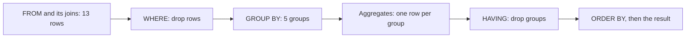

## Before you start

- [[foundation.l1.sql-join]] — you write `SELECT`, `WHERE` and `ORDER BY` and you know `WHERE` drops rows; you can pair `customers`, `orders` and `payments` with `INNER JOIN` and `LEFT JOIN`; and you read the row count that `psql`, PostgreSQL's terminal client, prints under a result. This lesson turns those paired rows into one number each.

## The situation

The shop asks a money question: how much has each customer actually paid? Join `customers` to `orders`, then `orders` to `payments`, both with `LEFT JOIN`, and psql gives you thirteen rows — one per order, plus the customer who never ordered; no order in this data has two payments, so the second join adds no rows. To answer, you add `2150000`, `890000` and `1730000` in your head for Trần Minh Anh, then again for three more people, and you are unsure what to write for the customer with no orders. The shop wants five rows, one per customer, each with a total. How do you make PostgreSQL collapse the thirteen rows into one number per customer?

## Core concepts

- aggregate function — a function such as `count`, `sum`, `avg`, `min` or `max` that reads many rows and returns one value.
- group — the set of rows that share the same values in the columns you group by; here, all the rows belonging to one customer.
- `GROUP BY` — the clause naming those columns, after which the result has one row per group instead of one row per input row.
- `HAVING` — the clause that drops whole groups after their aggregates are computed, the way `WHERE` drops rows before any group exists.
- `count(*)` and `count(column)` — the first counts the rows of the group, the second counts only the rows where that column is not `NULL`.
- `coalesce` — a function returning its first argument that is not `NULL`, which is how a customer with no payments shows `0` rather than an empty cell.

## How it works



In the situation above, the thirteen joined rows are the input and the five customers are the groups. Read the diagram left to right: each step hands its rows to the next, and the diagram describes what comes out, not the steps PostgreSQL takes internally.

`FROM` and its joins build the rows first, exactly as in the previous lesson. `WHERE` then drops rows one by one, before any grouping happens. It may test a column of any joined table, but it may not contain an aggregate function, because at that point there is no group to aggregate over.

`GROUP BY c.id, c.full_name` — `c` is the short name the query gives `customers` — puts the surviving rows into one group per pair of values: every row whose `c.id` is 1 lands in the same group. Because the result now has one row per group, `SELECT` may name only a column that is listed in `GROUP BY` or wrapped in an aggregate, and `HAVING` may name only those same columns. Anything else would leave the database choosing between three different values for a group of three rows. PostgreSQL 17 allows one relaxation of that rule: when you group by a table's primary key, you may select that table's other columns, since the key already fixes them.

Each aggregate then reads its own group and returns one value, so the five groups become five rows. `HAVING` is the last filter and the only one that sees finished totals, which is why a condition on a total belongs there. `ORDER BY` sorts the rows that are left.

## In the Đơn Hàng system

The query file opens with the shop's question.

```sql file=db/queries/revenue-by-customer.sql tag=stage-0 lines=5-14
SELECT c.id,
       c.full_name,
       count(*)      AS rows_in_group,
       count(p.id)   AS payments_made,
       coalesce(sum(p.amount_vnd), 0) AS paid_vnd
FROM customers AS c
LEFT JOIN orders AS o   ON o.customer_id = c.id
LEFT JOIN payments AS p ON p.order_id = o.id
GROUP BY c.id, c.full_name
ORDER BY paid_vnd DESC, c.id;
```

Both joins are `LEFT JOIN` with `customers` on the left, so every customer survives to the grouping step, Vũ Gia Khánh included. Grouping makes five groups out of thirteen rows, and psql answers `(5 rows)`: Phạm Thu Hà first with `6400000` from one payment, then `4870000`, `4770000`, Lê Quốc Dũng's `3150000` and `0`.

The two counts in one row differ wherever an order has no payment — Nguyễn Bảo Châu's group reports `rows_in_group` 3 and `payments_made` 2 — because `count(*)` counts the rows of the group while `count(p.id)` skips the row where the join found nothing. Vũ Gia Khánh's group is the far end of the same case: one row, no payment, so `count(*)` is 1 and `count(p.id)` is 0. His `sum` has no values to add and returns `NULL`, not zero, and `coalesce` is what turns that into the `0` the shop can read.

The second query in the file moves a condition to each side of the grouping step.

```sql file=db/queries/revenue-by-customer.sql tag=stage-0 lines=16-24
-- WHERE filters rows before grouping; HAVING filters the groups afterwards.
SELECT c.full_name, sum(p.amount_vnd) AS paid_vnd
FROM customers AS c
INNER JOIN orders AS o   ON o.customer_id = c.id
INNER JOIN payments AS p ON p.order_id = o.id
WHERE p.method = 'card'
GROUP BY c.full_name
HAVING sum(p.amount_vnd) > 2000000
ORDER BY paid_vnd DESC;
```

`WHERE p.method = 'card'` runs before grouping, so every total here is built from card payments only. Lê Quốc Dũng's falls from `3150000` to `2140000`, because his `cod` payment — `cod` is another value of `p.method` in this data — was dropped before his group was formed, and Nguyễn Bảo Châu and Phạm Thu Hà leave the result entirely: they paid by other methods, the `INNER JOIN` and the filter leave them no rows, and a group is only made from rows that arrive. Vũ Gia Khánh was gone one step earlier: the `INNER JOIN` keeps no customer without an order. `HAVING sum(p.amount_vnd) > 2000000` then tests the two finished totals; both pass, so psql answers `(2 rows)`.

The `HAVING` line (line 23) repeats `sum(p.amount_vnd)` rather than the shorter name `paid_vnd` given on the `SELECT` line (line 17), because `ORDER BY` accepts the name `AS` gives a column, here `paid_vnd`, and `HAVING` does not — like `WHERE`, it is written in terms of the input columns.

Swapping the two conditions fails in both directions. `sum(p.amount_vnd) > 2000000` in `WHERE` is rejected, since no total exists yet. `p.method = 'card'` in `HAVING` is rejected too, because by then `method` is neither grouped nor aggregated, and a group can hold payment rows that disagree about it — without the filter, Nguyễn Bảo Châu's holds a `bank_transfer` and a `cod`.

## Beginners often think…

- **"I can SELECT any column when I use GROUP BY."** → Actually PostgreSQL rejects the query, because one group can hold several values for the column and nothing says which to show. You notice this when you add `o.status`, another column of `orders`, to the first query above: the query that ran a moment ago now refuses to run, and the relaxation of section 4 does not apply, because that query groups `customers`' primary key, not `orders`'.
- **"HAVING is just another way to write WHERE."** → Actually `WHERE` decides which rows go into a group and `HAVING` decides which finished groups stay, so the same condition in the two places gives different numbers or an error. You notice this when a total shrinks after you add a `WHERE` line you meant only to narrow the list of customers: the second query's `WHERE` cuts `1010000` from Lê Quốc Dũng's total as a side effect of choosing who appears.

## Try it (3 minutes)

1. Start Đơn Hàng's PostgreSQL with `scripts/up.sh`, then run `scripts/sql/run-query.sh revenue-by-customer`. Read the row count under each of the two results, and compare Lê Quốc Dũng's `paid_vnd` in the first with his total in the second.
2. Open `db/queries/revenue-by-customer.sql`, change `2000000` on the `HAVING` line (line 23) to `3000000`, save, and run the same command again. Undo the edit when you are done.

Expected result: the first result ends with `(5 rows)`, starts with Phạm Thu Hà at `6400000` and ends with Vũ Gia Khánh at `1`, `0`, `0`; the second ends with `(2 rows)` and shows Lê Quốc Dũng at `2140000`, not the `3150000` he has in the first, because `WHERE` removed his `cod` payment before the group was built. After the edit, the second result ends with `(1 row)` and only Trần Minh Anh is left, while the first result is unchanged.

## Connections

- [[foundation.l1.sql-join]] — the fix for the repeated rows it ends on: grouping folds the rows of a one-to-many back into one row per customer.
- [[foundation.l1.sql-select]] — the same clauses in the same order, with two steps inserted between `WHERE` and `ORDER BY`; `NULL` behaves here as it does there, which is why `count(p.id)` and `sum` skip it.
- [[foundation.l1.tables-keys-relations]] — the primary key declared there is what makes `GROUP BY c.id` the safe way to group customers who might share a name.
- [[foundation.l1.sql-index-intro]] — the cost side of the same query: why reading many rows to produce five numbers can be slow, and what the database can be given to make it faster.

## Five-line summary

1. `GROUP BY` collapses many rows into one row per group, and an aggregate function turns each group's rows into a single value.
2. Every column in `SELECT` is grouped or inside an aggregate; the database rejects anything else, unless its table's primary key is grouped.
3. `WHERE` drops rows before the groups are built; `HAVING` drops whole groups after their aggregates are computed.
4. `count(*)` counts the group's rows and `count(column)` skips `NULL`s, which is how a customer with no payment reports 1 and 0.
5. `sum` over no values returns `NULL`, not zero, so `coalesce` is what puts a readable `0` next to that customer.
