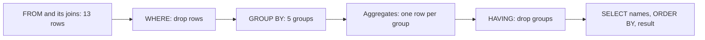

## Bạn cần biết trước

- [[foundation.l1.sql-join]] — bạn viết được `SELECT`, `WHERE`, `ORDER BY` và biết `WHERE` bỏ bớt dòng. Bạn ghép được `customers`, `orders` và `payments` bằng `INNER JOIN` và `LEFT JOIN`, và đọc được số dòng mà `psql`, trình dòng lệnh của PostgreSQL, in dưới kết quả. Bài này biến các dòng đã ghép đó thành mỗi nhóm một con số.

## Tình huống

Cửa hàng hỏi một câu về tiền: mỗi khách thực sự đã trả bao nhiêu? Bạn ghép `customers` với `orders`, rồi `orders` với `payments`, cả hai bằng `LEFT JOIN`, và psql trả về 13 dòng: mỗi đơn một dòng, thêm một dòng cho vị khách chưa từng đặt đơn. Trong dữ liệu này không đơn nào có hai lần thanh toán, nên phép ghép thứ hai không làm tăng số dòng. Để trả lời, bạn nhẩm `2150000`, `890000` và `1730000` cho Trần Minh Anh, rồi làm lại cho ba người nữa, và không chắc nên ghi gì cho vị khách không có đơn nào. Cửa hàng muốn năm dòng, mỗi khách một dòng, mỗi dòng một tổng. Làm sao để PostgreSQL gộp 13 dòng thành mỗi khách một con số?

## Khái niệm cốt lõi

- hàm tổng hợp — hàm như `count`, `sum`, `avg`, `min` hay `max`, đọc nhiều dòng và trả về một giá trị.
- nhóm — tập các dòng có cùng giá trị ở những cột bạn dùng để gom nhóm. Ở đây là mọi dòng thuộc về một khách.
- `GROUP BY` — mệnh đề gọi tên các cột đó. Sau nó, kết quả có mỗi nhóm một dòng thay vì mỗi dòng đầu vào một dòng.
- `HAVING` — mệnh đề bỏ cả nhóm sau khi các giá trị tổng hợp của nhóm đã tính xong, giống cách `WHERE` bỏ dòng trước khi có nhóm nào.
- `count(*)` và `count(column)` — cái đầu đếm số dòng của nhóm, cái sau chỉ đếm những dòng mà cột đó không `NULL`.
- `coalesce` — hàm trả về đối số đầu tiên không `NULL`. Nhờ nó, khách chưa thanh toán lần nào hiện `0` thay vì một ô trống.

## Cơ chế hoạt động



Trong tình huống trên, 13 dòng đã ghép là đầu vào, còn năm khách là năm nhóm. Mỗi bước chuyển các dòng của mình cho bước sau. Sơ đồ mô tả thứ gì đi ra, không phải các bước PostgreSQL làm bên trong.

`FROM` và các JOIN của nó dựng các dòng trước. Sau đó `WHERE` bỏ từng dòng, trước khi có bất kỳ phép gom nhóm nào. `WHERE` được thử cột của bất kỳ bảng nào đã ghép, nhưng không được chứa hàm tổng hợp, vì lúc đó chưa có nhóm nào để tổng hợp.

`GROUP BY c.id, c.full_name` — `c` là tên ngắn mà `AS` đặt cho `customers` trong câu truy vấn — xếp các dòng còn lại vào mỗi cặp giá trị một nhóm: mọi dòng có `c.id` bằng 1 rơi vào cùng một nhóm. Vì kết quả giờ có mỗi nhóm một dòng, `SELECT` chỉ được gọi tên cột có trong `GROUP BY` hoặc nằm trong một hàm tổng hợp, và `HAVING` cũng chỉ được gọi tên đúng những cột đó.

PostgreSQL 17 cho phép nới một điều: khi bạn gom nhóm theo khóa chính của một bảng, `SELECT` và `HAVING` được gọi tên các cột khác của bảng đó, vì một giá trị khóa nghĩa là một dòng của bảng, nên mỗi cột chỉ có một giá trị. Câu truy vấn bên dưới vẫn ghi `c.full_name` trong `GROUP BY`, cách này cũng chạy và không làm đổi các nhóm.

Tiếp theo, mỗi hàm tổng hợp đọc nhóm của mình và trả về một giá trị, nên năm nhóm thành năm dòng. `HAVING` là bộ lọc cuối cùng và là bộ lọc duy nhất nhìn thấy các tổng đã tính xong, vì thế điều kiện trên một tổng phải đặt ở đó. Các dòng kết quả, với những tên mà `SELECT` đặt bằng `AS`, chỉ được tính lúc này, sau `HAVING`. `ORDER BY` nhận những tên đó. `HAVING` thì không, giống `WHERE`, nên ở đó bạn phải viết lại biểu thức. `ORDER BY` sắp xếp những dòng còn lại.

## Trong hệ thống Đơn Hàng

File truy vấn mở đầu bằng câu hỏi của cửa hàng.

```sql file=db/queries/revenue-by-customer.sql tag=stage-0 lines=5-14
SELECT c.id,
       c.full_name,
       count(*)      AS rows_in_group,
       count(p.id)   AS payments_made,
       coalesce(sum(p.amount_vnd), 0) AS paid_vnd
FROM customers AS c
LEFT JOIN orders AS o   ON o.customer_id = c.id
LEFT JOIN payments AS p ON p.order_id = o.id
GROUP BY c.id, c.full_name
ORDER BY paid_vnd DESC, c.id;
```

Cả hai phép ghép đều là `LEFT JOIN` với `customers` bên trái, nên mọi khách đều đi tới bước gom nhóm, kể cả Vũ Gia Khánh. Gom nhóm tạo năm nhóm từ 13 dòng, và psql trả lời `(5 rows)`: đứng đầu là Phạm Thu Hà với `6400000` từ một lần thanh toán, rồi `4870000` của Nguyễn Bảo Châu, `4770000` của Trần Minh Anh, `3150000` của Lê Quốc Dũng và `0` của Vũ Gia Khánh. `AS` đặt cho mỗi cột tính toán cái tên mà psql in phía trên nó, như `paid_vnd`.

Hai phép đếm trong cùng một dòng khác nhau ở chỗ nào có đơn chưa thanh toán. Nhóm của Nguyễn Bảo Châu báo `rows_in_group` là 3 và `payments_made` là 2, vì `count(*)` đếm số dòng của nhóm, còn `count(p.id)` bỏ qua dòng mà phép ghép không tìm thấy gì. Nhóm của Vũ Gia Khánh là trường hợp tận cùng của tình huống đó: một dòng, không thanh toán, nên `count(*)` là 1 và `count(p.id)` là 0. `sum` của anh không có giá trị nào để cộng và trả về `NULL`, không phải số không, và chính `coalesce` biến nó thành số `0` mà cửa hàng đọc được.

Câu truy vấn thứ hai trong file đặt mỗi điều kiện ở một phía của bước gom nhóm.

```sql file=db/queries/revenue-by-customer.sql tag=stage-0 lines=16-24
-- WHERE filters rows before grouping; HAVING filters the groups afterwards.
SELECT c.full_name, sum(p.amount_vnd) AS paid_vnd
FROM customers AS c
INNER JOIN orders AS o   ON o.customer_id = c.id
INNER JOIN payments AS p ON p.order_id = o.id
WHERE p.method = 'card'
GROUP BY c.full_name
HAVING sum(p.amount_vnd) > 2000000
ORDER BY paid_vnd DESC;
```

`WHERE p.method = 'card'` chạy trước khi gom nhóm, nên mọi tổng ở đây chỉ tính từ các lần thanh toán bằng thẻ. Tổng của Lê Quốc Dũng giảm từ `3150000` xuống `2140000`, vì lần thanh toán `cod` của anh — `cod` là một giá trị khác của `p.method` trong dữ liệu này — đã bị bỏ trước khi nhóm của anh được lập. Nguyễn Bảo Châu và Phạm Thu Hà biến mất hẳn khỏi kết quả: họ trả bằng phương thức khác, `INNER JOIN` và bộ lọc không để lại dòng nào cho họ, mà nhóm chỉ được lập từ những dòng đi tới nơi. Vũ Gia Khánh đã rời đi sớm hơn một bước: `INNER JOIN` không giữ khách nào chưa có đơn. Kể cả với `LEFT JOIN`, `WHERE` vẫn bỏ dòng của anh: `p.method` ở dòng đó là `NULL`, và phép thử trên `NULL` không cho kết quả đúng. Sau đó `HAVING sum(p.amount_vnd) > 2000000` thử hai tổng đã tính xong, `4770000` của Trần Minh Anh và `2140000` của Lê Quốc Dũng. Cả hai đều qua, nên psql trả lời `(2 rows)`.

Dòng `HAVING` viết lại `sum(p.amount_vnd)` thay vì dùng tên `paid_vnd` từ dòng `SELECT`: `ORDER BY` nhận tên đầu ra, còn `HAVING` chỉ nhận cột đã gom nhóm và hàm tổng hợp.

Đổi chỗ hai điều kiện thì hỏng theo cả hai chiều. `sum(p.amount_vnd) > 2000000` đặt trong `WHERE` bị từ chối, vì lúc đó chưa có tổng nào. `p.method = 'card'` đặt trong `HAVING` cũng bị từ chối, vì tới lúc đó `method` không được gom nhóm cũng không nằm trong hàm tổng hợp, và một nhóm có thể chứa các dòng thanh toán mang giá trị khác nhau ở cột này. Nếu không có bộ lọc, nhóm của Nguyễn Bảo Châu chứa một `bank_transfer` và một `cod`.

## Người mới hay nghĩ rằng…

- **"Dùng GROUP BY thì SELECT cột nào cũng được."** → Thực ra PostgreSQL từ chối câu truy vấn, vì một nhóm có thể chứa nhiều giá trị ở cột đó và không có gì cho biết nên hiện giá trị nào. Bạn sẽ nhận ra khi thêm `o.status`, một cột khác của `orders`, vào câu truy vấn đầu tiên ở trên: câu vừa chạy được giờ không chịu chạy nữa. Điều nới lỏng về khóa chính ở phần "Cơ chế hoạt động" không áp dụng, vì câu truy vấn đó gom nhóm theo khóa chính của `customers`, không phải của `orders`.
- **"HAVING chỉ là WHERE viết theo kiểu khác."** → Thực ra `WHERE` quyết định dòng nào đi vào nhóm, còn `HAVING` quyết định nhóm đã tính xong nào được giữ lại, nên cùng một điều kiện đặt ở hai chỗ sẽ cho con số khác nhau hoặc báo lỗi. Bạn sẽ nhận ra khi một tổng bị co lại sau khi bạn thêm một dòng `WHERE` chỉ định để thu hẹp danh sách khách: `WHERE` của câu truy vấn thứ hai cắt `1010000` khỏi tổng của Lê Quốc Dũng, như một tác dụng phụ của thao tác chọn ai được hiện ra.

## Thử ngay (3 phút)

1. Khởi động PostgreSQL của Đơn Hàng bằng `scripts/up.sh`, rồi chạy `scripts/sql/run-query.sh revenue-by-customer`. Đọc số dòng dưới mỗi kết quả trong hai kết quả, và so `paid_vnd` của Lê Quốc Dũng ở kết quả đầu với tổng của anh ở kết quả sau.
2. Mở `db/queries/revenue-by-customer.sql`, đổi `2000000` ở dòng `HAVING` (dòng 23) thành `3000000`, lưu lại, và chạy lại đúng lệnh trên. Xong thì hoàn tác thay đổi.

Kết quả mong đợi: kết quả thứ nhất kết thúc bằng `(5 rows)`, bắt đầu với Phạm Thu Hà ở `6400000` và kết thúc với Vũ Gia Khánh ở `rows_in_group` 1, `payments_made` 0, `paid_vnd` 0. Kết quả thứ hai kết thúc bằng `(2 rows)` và cho Lê Quốc Dũng ở `2140000`, không phải `3150000` như ở kết quả đầu, vì `WHERE` đã bỏ lần thanh toán `cod` của anh trước khi nhóm được lập. Sau khi sửa, kết quả thứ hai kết thúc bằng `(1 row)` và chỉ còn Trần Minh Anh, còn kết quả thứ nhất không đổi.

## Liên hệ

- [[foundation.l1.sql-join]] — cách chữa các dòng lặp mà bài đó dừng lại: gom nhóm gộp các dòng của một liên kết một-nhiều về lại mỗi khách một dòng.
- [[foundation.l1.sql-select]] — vẫn các mệnh đề ấy theo đúng thứ tự ấy, với `GROUP BY` và `HAVING` chen vào giữa `WHERE` và `ORDER BY`. `NULL` vẫn nghĩa là không xác định, và các hàm tổng hợp như `count(p.id)` và `sum` được định nghĩa là bỏ qua nó.
- [[foundation.l1.tables-keys-relations]] — khóa chính khai báo ở đó là thứ khiến `GROUP BY c.id` trở thành cách an toàn để gom nhóm những khách có thể trùng tên.
- [[foundation.l1.sql-index-intro]] — mặt chi phí của cùng câu truy vấn này: vì sao đọc nhiều dòng để ra năm con số có thể chậm, và có thể trao cho cơ sở dữ liệu thứ gì để nó nhanh hơn.

## Tóm tắt 5 dòng

1. `GROUP BY` gộp nhiều dòng thành mỗi nhóm một dòng, và hàm tổng hợp biến các dòng của mỗi nhóm thành một giá trị duy nhất.
2. Mọi cột trong `SELECT` phải được gom nhóm hoặc nằm trong hàm tổng hợp. Cơ sở dữ liệu từ chối mọi thứ khác, trừ khi khóa chính của bảng chứa cột đó đã được gom nhóm.
3. `WHERE` bỏ dòng trước khi các nhóm được lập. `HAVING` bỏ cả nhóm sau khi các giá trị tổng hợp đã tính xong.
4. `count(*)` đếm số dòng của nhóm, còn `count(column)` bỏ qua `NULL`, nên khách chưa thanh toán lần nào báo 1 và 0.
5. `sum` trên tập không có giá trị nào trả về `NULL`, không phải số không, nên `coalesce` là thứ đặt số `0` dễ đọc cạnh vị khách đó.
