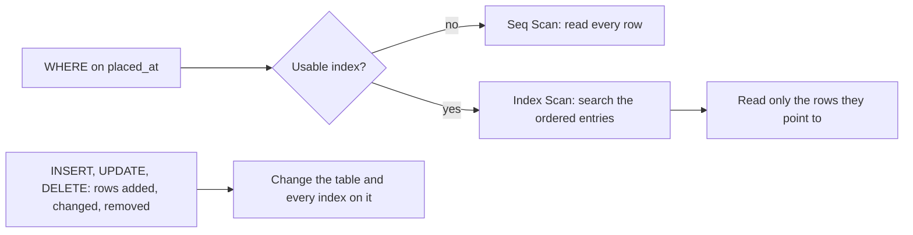

## Before you start

- [[foundation.l1.sql-select]] — you write what you want and PostgreSQL decides how to find it; this lesson opens up the "how", and shows why one `WHERE` costs far more than another.

## The situation

Support asks which order was placed at 14:40 on 5 March. You write the `WHERE` you already know, run it against the `orders` table in the lab (the PostgreSQL that `scripts/up.sh` starts for this course), and the answer arrives at once: the table holds twelve rows. Then you open `db/queries/index-demo.sql`. It builds a table of two hundred thousand rows, asks one question of it, adds two lines — one that creates an index, one that refreshes PostgreSQL's notes about the table — and asks the same question again. The rows and the question stay the same, yet PostgreSQL does not answer the two alike. What do those two lines change?

## Core concepts

- sequential scan — the plan step that reads a table from its first row to its last and keeps the rows the test accepts.
- **index** — what `CREATE INDEX` builds by default: a separate structure beside the table holding the values of one column in order, each value paired with the place of the row it came from.
- index scan — the plan step that searches the index for the entries the test accepts, then reads only the rows those entries point to.
- query plan — the steps PostgreSQL settles on to answer one query; `EXPLAIN` prints them without running it.

## How it works



With only twelve rows no plan looks different; two hundred thousand rows make the difference visible.

Start at the left of the diagram. A query arrives with a test on one column: `placed_at` equals one instant. PostgreSQL has to decide how to find the rows that pass. With nothing but the table, the only way is to read it from the first row to the last and try the test on each one, which the plan calls a sequential scan. That answers the question, and it reads two hundred thousand rows to return one.

An index gives PostgreSQL a second place to look. Its entries hold the values of `placed_at` in order, each with the place of its row, and ordered values can be searched without reading them one by one. So PostgreSQL searches the index for the entries that pass the test, then reads only the rows they point to. In the plan the test moves from a `Filter` line, checked for each row the step scans so that only passing rows are output, to an `Index Cond` line, used to search the index, so the rows it rejects are never read from the table. A join condition tests one column against another, so a column you join on counts as one you filter on.

The lower half of the diagram is the price. An index is a second copy of that column, so it occupies disk, and it has to stay in step with its table: every `INSERT` that adds a row writes into the index as well, so does every `UPDATE` that changes an indexed column, and every row a `DELETE` removes leaves an entry the database cleans up later. An index nothing searches is cost with no return.

## In the Đơn Hàng system

`db/queries/index-demo.sql` builds a table large enough for the difference to show: two hundred thousand rows, one per minute from the start of the year, in a temporary table called `order_log` that lasts until psql exits, so the script rebuilds it on every run. Each row carries an `id`, a `customer_id` no index covers, and a `placed_at` minute; exactly one row carries the minute the queries ask about.

```sql file=db/queries/index-demo.sql tag=stage-0 lines=13-24
EXPLAIN (COSTS OFF)
SELECT * FROM order_log WHERE placed_at = '2026-01-02 03:04:00+07';

CREATE INDEX order_log_placed_at_idx ON order_log (placed_at);
ANALYZE order_log;

EXPLAIN (COSTS OFF)
SELECT * FROM order_log WHERE placed_at = '2026-01-02 03:04:00+07';

-- The index cannot help once a function is applied to the indexed column.
EXPLAIN (COSTS OFF)
SELECT * FROM order_log WHERE date(placed_at) = '2026-01-02';
```

`EXPLAIN` prints the plan for the statement after it and does not run that statement; `COSTS OFF` drops the estimated numbers, so only the shape of the plan is left. Above this excerpt the file switches off the helpers PostgreSQL can split one scan across, so no plan here grows the extra lines those helpers add: each one below is two lines, the scan step and its condition. The first and second queries are the same text; between them stand `CREATE INDEX`, which names the index, the table and the column, and `ANALYZE`, which refreshes the statistics — PostgreSQL's notes on how many rows a table holds and how their values spread — that it reads when it plans. Of the two, `CREATE INDEX` is the line that gives the second plan somewhere else to look; `ANALYZE` opens no new way to reach a row, it only brings those notes up to date after the table and its index were built a moment earlier. The third query tests `date(placed_at)` instead of `placed_at`.

A script hands the file to psql inside the lab, always with the same connection options, of which only `--file` and `--echo-queries` matter here:

```bash file=scripts/sql/explain.sh tag=stage-0 lines=7-9
psql --host db --username donhang --dbname donhang \
     --no-psqlrc --echo-queries --set ON_ERROR_STOP=on \
     --file /repo/db/queries/index-demo.sql
```

Inside the lab the repository is mounted at `/repo` and the database answers on the host name `db`, so this is the same file you opened. `--echo-queries` prints each statement above its answer, which is why the queries appear again below:

```text output=true
...
 Seq Scan on order_log
   Filter: (placed_at = '2026-01-02 03:04:00+07'::timestamp with time zone)
(2 rows)

CREATE INDEX order_log_placed_at_idx ON order_log (placed_at);
...
 Index Scan using order_log_placed_at_idx on order_log
   Index Cond: (placed_at = '2026-01-02 03:04:00+07'::timestamp with time zone)
(2 rows)
...
 Seq Scan on order_log
   Filter: (date(placed_at) = '2026-01-02'::date)
(2 rows)
```

The `::…` tail on each condition is PostgreSQL restating the value's type; what matters here is the first word of each plan and the column its condition names. Before the `CREATE INDEX` line, PostgreSQL would have read every row and tried the test on each; after it, the same query reaches its row through `order_log_placed_at_idx`. The third plan is a sequential scan again, although the index exists and the query names the same column: the index stores `placed_at` values, and the test asks about `date(placed_at)`, which it never stored. The same holds for a text column searched in the middle: searching ordered entries means comparing values from their first characters, and `LIKE '%webcam%'` asks for rows whose text contains `webcam` anywhere, which says nothing about how the value starts, so the search has nowhere to begin.

## Beginners often think…

- **"Adding an index always makes queries faster."** → Actually an index helps only the tests whose column and shape it fits, and it makes every write that touches that column do more work, on top of the disk it holds. You notice this when a load that inserts many rows gets slower after somebody indexes the table.
- **"The database automatically indexes the columns I search."** → Actually PostgreSQL builds an index for a `PRIMARY KEY` and for a `UNIQUE` constraint (a column declared to hold no repeated value); no ordinary column gets one until you write `CREATE INDEX`, and a column that only declares a foreign key with `REFERENCES`, such as `orders.customer_id`, has none. You notice this when a filter or a join on a foreign key column still shows a sequential scan.
- **"`EXPLAIN` runs my query, so it is unsafe on a large table."** → Actually `EXPLAIN` on its own prints the plan and does not execute the statement, which is why it returns whatever the table's size. You notice this when it answers instantly and ends with `(2 rows)` — the two lines of the plan, not rows of the table.

## Try it (3 minutes)

1. In a terminal at the repository root, run `scripts/up.sh` and wait for `The lab is up.`, then run `scripts/sql/explain.sh`.
2. Read the three plans in order and note the first word of each. Then add one more `EXPLAIN (COSTS OFF)` at the end of `db/queries/index-demo.sql`, this time testing `customer_id = 3`, and run the script again.

Expected result: the first plan is a `Seq Scan`, the second an `Index Scan using order_log_placed_at_idx`, the third a `Seq Scan` again. The fourth is a `Seq Scan` too, because `order_log` has an index on `placed_at` and on nothing else.

## Connections

- [[foundation.l1.sql-select]] — prerequisite: it wrote the `WHERE` this lesson prices, and `EXPLAIN` is where "PostgreSQL decides how" becomes something you can read.
- [[foundation.l1.sql-join]] — a join condition is a test on a column like any other, which is why the foreign key column you join on is usually the first column worth considering for an index, when the joins it speeds up matter more than the writes it slows down.
- [[foundation.l1.complexity-intro]] — the same two shapes one layer up: reading every row, or going straight to the one you want, is the difference that lesson measures in C#.
- [[backend.l2.indexes-and-plans]] — the same subject two levels up: which index a query planner picks, and how to read a plan with its costs and timings left in.

## Five-line summary

1. An index lets PostgreSQL find the rows a `WHERE` wants without reading every row, and that is the whole difference between the two plans.
2. Without a usable index the plan is a sequential scan: every row read, the test tried on each.
3. PostgreSQL indexes a primary key and a unique constraint by itself; an ordinary column, a foreign key included, gets one only when you create it.
4. An index costs disk and slows writes to its column, so index a column you filter or join on when reads outweigh those writes.
5. `EXPLAIN` prints the plan without running the query, and the plan stops using an index once the test applies a function to that column.
