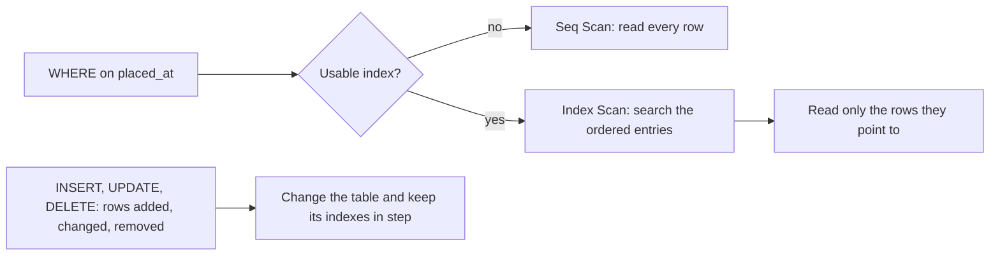

## Bạn cần biết trước

- [[foundation.l1.sql-select]] — bạn viết ra thứ mình muốn, còn PostgreSQL quyết định cách tìm nó. Bài này mở phần "cách tìm" đó ra, và cho thấy vì sao một `WHERE` tốn hơn hẳn một `WHERE` khác.

## Tình huống

Bộ phận hỗ trợ hỏi đơn nào được đặt lúc 14:40 ngày 5 tháng 3. Bạn viết cái `WHERE` đã biết, chạy nó trên bảng `orders` trong lab (PostgreSQL mà `scripts/up.sh` khởi động cho khóa học này), và câu trả lời đến ngay: bảng chỉ có mười hai dòng. Để xem chuyện gì xảy ra khi bảng lớn hơn nhiều, bạn mở `db/queries/index-demo.sql`. File này dựng một bảng hai trăm nghìn dòng, hỏi nó một câu, thêm hai dòng lệnh, một dòng tạo index, một dòng cập nhật ghi chú của PostgreSQL về bảng, rồi hỏi lại đúng câu đó. Dữ liệu vẫn vậy, câu hỏi vẫn vậy, nhưng PostgreSQL lập kế hoạch cho hai lần hỏi khác nhau. Hai dòng lệnh đó đã thay đổi điều gì?

## Khái niệm cốt lõi

- quét tuần tự — bước trong kế hoạch đọc bảng từng dòng một, từ dòng đầu tiên, và giữ lại các dòng qua được phép thử.
- **index** (cấu trúc phụ giúp tìm dòng theo cột nhanh mà không quét cả bảng, tốn chỗ và làm chậm ghi) — thứ `CREATE INDEX` dựng ra theo mặc định: một cấu trúc riêng đặt cạnh bảng, chứa các giá trị của một cột theo thứ tự, mỗi giá trị đi kèm vị trí của dòng mà nó lấy từ đó.
- quét index — bước trong kế hoạch dò trong index để tìm các mục qua được phép thử, rồi chỉ đọc những dòng mà các mục đó trỏ tới.
- kế hoạch truy vấn — các bước PostgreSQL chốt để trả lời một câu truy vấn. `EXPLAIN` in chúng ra mà không chạy câu truy vấn.

## Cơ chế hoạt động



Sơ đồ bắt đầu bằng một phép thử trên `placed_at`, bằng đúng một thời điểm. Nếu chỉ có bảng, PostgreSQL đọc từng dòng và thử điều kiện trên mỗi dòng, bước mà kế hoạch gọi là quét tuần tự: đọc hai trăm nghìn dòng để trả về một.

Index cho PostgreSQL một chỗ thứ hai để tìm. Các mục của index chứa giá trị `placed_at` theo thứ tự, và giá trị đã xếp thứ tự thì dò được mà không cần đọc lần lượt từng cái. Trước khi có index, kế hoạch đặt phép thử trên dòng `Filter`, kiểm tra với từng dòng mà bước đó quét qua. Sau khi có index, phép thử nằm trên dòng `Index Cond`, dùng để dò trong index, nên những dòng không qua phép thử không bao giờ bị đọc từ bảng.

Với chỉ mười hai dòng, kế hoạch nào trông cũng như nhau. Nhánh "yes" trong sơ đồ là đường PostgreSQL có thể đi, không phải đường bắt buộc: PostgreSQL chọn dựa trên ghi chú về số dòng của bảng, và đọc hết một bảng nhỏ như vậy rẻ đến mức nó vẫn đi nhánh "no".

PostgreSQL có thể trả lời một JOIN bằng cách lấy từng dòng của bảng này, và với mỗi dòng, tra các dòng khớp ở bảng kia. Với `orders.customer_id = customers.id`, khi lấy khách 3, phép thử trở thành `orders.customer_id = 3`: một cột bằng một giá trị, đúng loại mà index trên `customer_id` có thể dò. Vì vậy cột bạn dùng để JOIN cũng tính là cột bạn dùng để lọc.

Nửa dưới của sơ đồ là cái giá. Index chiếm chỗ trên đĩa và phải luôn khớp với bảng: mỗi `INSERT` đều ghi vào index, một `UPDATE` thường cũng vậy (luôn luôn khi nó đổi một cột có index), còn các dòng bị `DELETE` xóa để lại những mục mà PostgreSQL tự dọn trong một lượt sau. Một index không ai dò tới chỉ là chi phí không mang lại gì.

## Trong hệ thống Đơn Hàng

`db/queries/index-demo.sql` dựng một bảng đủ lớn để thấy khác biệt: hai trăm nghìn dòng, mỗi phút một dòng tính từ đầu năm, trong một bảng tạm tên `order_log` chỉ tồn tại tới khi psql thoát, nên mỗi lần chạy script lại dựng bảng từ đầu. Mỗi dòng có một `id`, một `customer_id` không có index nào phủ, và một phút `placed_at`. Đúng một dòng mang phút mà các câu truy vấn hỏi tới.

```sql file=db/queries/index-demo.sql tag=stage-0 lines=13-24
EXPLAIN (COSTS OFF)
SELECT * FROM order_log WHERE placed_at = '2026-01-02 03:04:00+07';

CREATE INDEX order_log_placed_at_idx ON order_log (placed_at);
ANALYZE order_log;

EXPLAIN (COSTS OFF)
SELECT * FROM order_log WHERE placed_at = '2026-01-02 03:04:00+07';

-- The index cannot help once a function is applied to the indexed column.
EXPLAIN (COSTS OFF)
SELECT * FROM order_log WHERE date(placed_at) = '2026-01-02';
```

`EXPLAIN` in kế hoạch cho câu lệnh đứng sau nó và không chạy câu lệnh đó. `COSTS OFF` bỏ các con số ước tính, chỉ để lại hình dạng của kế hoạch. Mỗi kế hoạch bên dưới gồm hai dòng: bước quét và điều kiện của bước đó. Câu truy vấn thứ nhất và thứ hai giống hệt nhau về chữ. Giữa chúng là `CREATE INDEX`, ghi tên index, tên bảng và tên cột, và `ANALYZE`. `ANALYZE` cập nhật thống kê: ghi chú của PostgreSQL về số dòng trong bảng và cách giá trị phân bố, được đọc khi lập kế hoạch. Trong hai dòng đó, `CREATE INDEX` là dòng cho kế hoạch thứ hai một chỗ khác để tìm. `ANALYZE` không mở thêm đường nào tới một dòng, chỉ làm mới các ghi chú sau khi bảng và index vừa được dựng ngay trước đó. Câu truy vấn thứ ba thử `date(placed_at)`, phần ngày của `placed_at`, thay vì chính `placed_at`.

Một script đưa file này cho psql bên trong lab, lần nào cũng với cùng các tùy chọn kết nối, trong đó chỉ `--file` và `--echo-queries` là đáng chú ý ở đây:

```bash file=scripts/sql/explain.sh tag=stage-0 lines=7-9
psql --host db --username donhang --dbname donhang \
     --no-psqlrc --echo-queries --set ON_ERROR_STOP=on \
     --file /repo/db/queries/index-demo.sql
```

Lab thấy thư mục dự án này dưới tên `/repo` và database trả lời ở host `db`, nên đây chính là file bạn đã mở. `--echo-queries` in mỗi câu lệnh phía trên câu trả lời của nó, vì thế các câu lệnh xuất hiện trong kết quả. `...` đánh dấu những chỗ bị cắt bớt:

```text output=true
...
 Seq Scan on order_log
   Filter: (placed_at = '2026-01-02 03:04:00+07'::timestamp with time zone)
(2 rows)

CREATE INDEX order_log_placed_at_idx ON order_log (placed_at);
...
 Index Scan using order_log_placed_at_idx on order_log
   Index Cond: (placed_at = '2026-01-02 03:04:00+07'::timestamp with time zone)
(2 rows)
...
 Seq Scan on order_log
   Filter: (date(placed_at) = '2026-01-02'::date)
(2 rows)
```

Phần đuôi `::…` ở mỗi điều kiện là PostgreSQL nhắc lại kiểu của giá trị. Điều cần xem ở đây là chữ đầu tiên của mỗi kế hoạch và cột mà điều kiện gọi tên. Trước dòng `CREATE INDEX`, PostgreSQL sẽ đọc mọi dòng và thử điều kiện trên từng dòng. Sau đó, cùng câu truy vấn ấy đi tới dòng cần tìm qua `order_log_placed_at_idx`. Kế hoạch thứ ba lại là quét tuần tự, dù index đã có và câu truy vấn gọi đúng cột đó: index lưu giá trị `placed_at`, còn phép thử hỏi về `date(placed_at)`, thứ index chưa bao giờ lưu.

Điều tương tự xảy ra với cột văn bản khi bạn tìm một đoạn nằm giữa chuỗi, vì các mục văn bản đã xếp thứ tự được so từ những ký tự đầu, giống từ trong từ điển. `LIKE`, phép so văn bản với một mẫu, là cách thường gặp: `LIKE '%Webcam%'` trên `name` của sản phẩm, trong đó `%` thay cho một đoạn văn bản bất kỳ, không cho ký tự đầu nào để bắt đầu, nên phép dò không có chỗ nào để khởi đầu.

## Người mới hay nghĩ rằng…

- **"Thêm index thì truy vấn lúc nào cũng nhanh hơn."** → Thực ra index chỉ giúp những phép thử có cột và dạng khớp với nó, và nó bắt mọi lần ghi vào bảng phải làm thêm, chưa kể chỗ trên đĩa mà nó chiếm. Bạn sẽ nhận ra khi một job chèn nhiều dòng chạy chậm đi sau khi ai đó thêm index cho bảng.
- **"Database tự tạo index cho những cột mình hay tìm."** → Thực ra PostgreSQL tạo index cho `PRIMARY KEY` và cho ràng buộc `UNIQUE` (cột được khai báo không chứa giá trị lặp). Không cột thường nào có index cho tới khi bạn viết `CREATE INDEX`, và một cột chỉ khai báo khóa ngoại bằng `REFERENCES`, như `orders.customer_id`, thì không có index nào. Bạn sẽ nhận ra khi một phép lọc hay một JOIN trên cột khóa ngoại vẫn hiện quét tuần tự.
- **"`EXPLAIN` chạy câu truy vấn, nên dùng trên bảng lớn là không an toàn."** → Thực ra `EXPLAIN` đứng riêng chỉ in kế hoạch và không thực thi câu lệnh, vì thế nó trả lời ngay dù bảng lớn cỡ nào. Bạn sẽ nhận ra khi nó trả lời tức thì và kết thúc bằng `(2 rows)`, tức hai dòng của kế hoạch, không phải các dòng của bảng.

## Thử ngay (3 phút)

1. Mở terminal ở gốc thư mục dự án, chạy `scripts/up.sh` và chờ tới khi thấy `The lab is up.`, rồi chạy `scripts/sql/explain.sh`.
2. Đọc lần lượt ba kế hoạch và ghi lại chữ đầu tiên của mỗi cái. Sau đó thêm một `EXPLAIN (COSTS OFF)` nữa vào cuối `db/queries/index-demo.sql`, lần này là `SELECT * FROM order_log WHERE customer_id = 3`, rồi chạy lại script.

Kết quả mong đợi: kế hoạch đầu là `Seq Scan`, kế hoạch thứ hai là `Index Scan using order_log_placed_at_idx`, kế hoạch thứ ba lại là `Seq Scan`. Kế hoạch thứ tư cũng là `Seq Scan`, vì `order_log` chỉ có index trên `placed_at` và không có trên cột nào khác.

## Liên hệ

- [[foundation.l1.sql-select]] — bài tiên quyết: bài đó viết cái `WHERE` mà bài này định giá, và `EXPLAIN` là nơi "PostgreSQL quyết định cách tìm" trở thành thứ bạn đọc được.
- [[foundation.l1.sql-join]] — điều kiện JOIN cũng là một phép thử trên một cột như mọi phép thử khác, vì thế cột khóa ngoại bạn dùng để JOIN là ứng viên cho index, khi các JOIN mà index tăng tốc quan trọng hơn các lần ghi mà nó làm chậm.
- [[foundation.l1.complexity-intro]] — cùng hai hình dạng ấy nhưng trong code: đọc mọi dòng, hoặc đi thẳng tới dòng cần tìm, là khác biệt mà bài đó đo bằng C#.
- [[backend.l2.indexes-and-plans]] — cùng chủ đề ở hai cấp cao hơn: PostgreSQL chọn index nào, và cách đọc một kế hoạch còn giữ nguyên chi phí và thời gian.

## Tóm tắt 5 dòng

1. Index cho PostgreSQL tìm các dòng mà một `WHERE` cần mà không phải đọc mọi dòng, và đó là toàn bộ khác biệt giữa hai kế hoạch.
2. Không có index dùng được thì kế hoạch là quét tuần tự: đọc mọi dòng, thử điều kiện trên từng dòng.
3. PostgreSQL tự tạo index cho khóa chính và ràng buộc unique. Cột thường, kể cả khóa ngoại, chỉ có index khi bạn tạo.
4. Index tốn đĩa và làm chậm các lần ghi vào bảng, nên hãy tạo index cho cột bạn lọc hoặc JOIN khi lượng đọc lớn hơn cái giá của những lần ghi đó.
5. `EXPLAIN` in kế hoạch mà không chạy câu truy vấn, và kế hoạch thôi dùng index khi phép thử áp một hàm lên cột đó.
