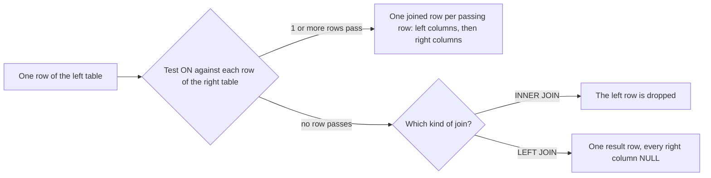

## Before you start

- [[foundation.l1.sql-select]] — you can read `SELECT … FROM … WHERE … ORDER BY` and you check psql's row count before trusting the rows; here `FROM` names two tables at once.

## The situation

The shop wants a list of orders with the name of the customer who placed each one. You run a `SELECT` on `orders` and get twelve rows, but each row names its customer only as a number in `customer_id`: order 3 says `2`. The names live in another table, `customers`, where row 2 is `Nguyễn Bảo Châu`, and you could match the numbers by eye, twelve times. Then the shop asks a second question: which customers have never ordered anything? Now you are hunting for a number that appears nowhere in `orders`. How do you make PostgreSQL match the rows of two tables for you, including the rows that have no match?

## Core concepts

- **JOIN** — the part of `FROM` that puts two tables side by side, pairing a row of one with a row of the other wherever a condition holds.
- join condition — the test written after `ON`, usually that a foreign key equals the primary key it points to, as in `c.id = o.customer_id`, where `c` and `o` are short names for `customers` and `orders`, set in the first query below.
- `INNER JOIN` — keeps only the pairs that pass the condition, so a row with no partner does not appear in the result at all.
- `LEFT JOIN` — keeps every row of the table written before it, with `NULL` in all of the other table's columns when that row has no partner.
- cross product — every row of one table paired with every row of the other, so tables of 12 and 5 rows give 60 rows.

## How it works



In the situation above, "who placed order 3" means: find the row of `customers` whose `id` equals order 3's `customer_id`. A join does that for every row at once. The test after `ON` is the join condition. Every join condition in Đơn Hàng's query files compares a foreign key with the primary key it points to, because that pair of columns is exactly the link the tables store.

Follow the diagram for one row of the left table, the table written first. The condition is tested against each row of the right table. Every row that passes produces one joined row: the left row's columns, then the right row's. The `SELECT` list then picks which of them you see, and in what order. The diagram describes which rows come out, not the steps PostgreSQL takes to find them.

When exactly one row passes, you get one result row. Every order has exactly one customer, so `orders` joined to `customers` gives 12 rows for 12 orders. When several rows pass, the left row repeats. With `customers` on the left and `orders` on the right, customer 1 appears three times, once per order. This is the one-to-many link at work, and it is why counting the rows after such an `INNER JOIN` counts the "many" side, as the next section shows.

When no row passes, the kind of join decides. `INNER JOIN` drops the left row. `LEFT JOIN` keeps it once and fills every column of the right table with `NULL`. Customer 5, who never ordered, is such a row: it vanishes from an `INNER JOIN` and appears once, with no order, in a `LEFT JOIN`.

If the condition passes for every pair, each left row repeats once per row of the right table, and the result is the cross product.

## In the Đơn Hàng system

The first query file answers the shop's first question, then shows what a one-to-many join does to a count.

```sql file=db/queries/join-orders-customers.sql tag=stage-0 lines=5-17
SELECT o.id AS order_id,
       c.full_name,
       o.status,
       o.placed_at
FROM orders AS o
INNER JOIN customers AS c ON c.id = o.customer_id
ORDER BY o.id;

-- Joining through a one-to-many multiplies rows: one line per item, not per
-- order. There are 12 orders but more order lines than that.
SELECT count(*) AS rows_after_joining_items
FROM orders AS o
INNER JOIN order_items AS i ON i.order_id = o.id;
```

`FROM orders AS o` gives `orders` the short name `o` for this query, so `o.id` means the `id` of `orders`, and `o.id AS order_id` renames that column in the output. Both tables have an `id`, so the short name tells PostgreSQL which one you mean. Line 10, `INNER JOIN customers AS c ON c.id = o.customer_id`, holds the join condition: the customer's primary key equals the order's foreign key. psql reports `(12 rows)` for the first query, and order 3 now reads `Nguyễn Bảo Châu`. The second query joins `order_items` instead, and `count(*)` returns the number of rows rather than the rows: 18, because the 12 orders have 18 item rows between them.

The second file answers the shop's other question.

```sql file=db/queries/left-join-customers-without-orders.sql tag=stage-0 lines=6-15
SELECT c.id, c.full_name, o.id AS order_id
FROM customers AS c
LEFT JOIN orders AS o ON o.customer_id = c.id
ORDER BY c.id, o.id;

SELECT c.id, c.full_name
FROM customers AS c
LEFT JOIN orders AS o ON o.customer_id = c.id
WHERE o.id IS NULL
ORDER BY c.id;
```

The first query keeps all five customers, so it returns `(13 rows)`: customers 1 to 4 three times each, and customer 5, `Vũ Gia Khánh`, once, with an empty `order_id` cell, because psql prints `NULL` as nothing. The second query adds `WHERE o.id IS NULL`. `IS NULL` is true exactly when the value is `NULL`, while `o.id = NULL` would give unknown for every row and keep none. `WHERE` takes effect after the join has built the rows, and `orders.id` is a primary key, so it is never `NULL` in a real order; a `NULL` there can only mean that no order matched. The result is one row, customer 5. An `INNER JOIN` could not answer this question, because it drops exactly the row you are looking for.

Now break line 10 of the first file in your head. `ON c.id = c.id` compares each customer with itself, which is true for every pair, so each of the 12 orders is paired with all 5 customers: 60 rows, and no error. Each order now shows up five times, once with each name, and nothing marks four of them as wrong. A missing condition does the same when you list both tables as `FROM orders, customers` with no `WHERE` to link them; leaving `ON` out of an `INNER JOIN` or `LEFT JOIN` instead stops with an error. The row count is what gives it away, so compare it with the number you expect whenever you write or change a join.

## Beginners often think…

- **"LEFT JOIN and INNER JOIN give the same rows, just in a different order."** → Actually they differ in which rows come back: a left row with no partner is dropped by `INNER JOIN` and kept, with `NULL`s, by `LEFT JOIN`. Neither promises any order without `ORDER BY`. The two return the same rows only when every left row has a partner, which is why the difference hides in test data where everyone has ordered. You notice this when a customer you know exists, like customer 5, is missing from a list built with `INNER JOIN`.
- **"Joining tables makes the query return one row per order."** → Actually a join returns one row per matching pair, so each order repeats once per item as soon as `order_items` joins in: 18 rows for 12 orders. Counting after such a join counts items, not orders, unless you group the rows back into one per order, which [[foundation.l1.sql-group-by]] shows how to do. You notice this when a count of orders comes out larger than the number of orders you can list.

## Try it (3 minutes)

1. Start Đơn Hàng's PostgreSQL, the one these query files run against, with `scripts/up.sh`, then run `scripts/sql/run-query.sh left-join-customers-without-orders`. In the first result, find customer 1 and customer 5, then read the row count under the result.
2. Open `db/queries/left-join-customers-without-orders.sql`, change `LEFT JOIN` on line 8 to `INNER JOIN`, save, and run the same command again. Undo the edit when you are done.

Expected result: the first run's first result ends with `(13 rows)`, shows `Trần Minh Anh` three times, once per order, and shows `Vũ Gia Khánh` once with an empty `order_id`; the second result is that single row for `Vũ Gia Khánh`. After the edit, the first result ends with `(12 rows)` and `Vũ Gia Khánh` is gone from it, while the second result, which still uses `LEFT JOIN`, is unchanged.

## Connections

- [[foundation.l1.sql-select]] — the same clauses and the same row count, now reading from two tables; `WHERE` still takes effect after `FROM`, joins included.
- [[foundation.l1.tables-keys-relations]] — the foreign keys declared there are the links a join condition follows back.
- [[foundation.l1.sql-group-by]] — the fix for repeated rows: grouping the joined rows back into one per order or per customer.
- [[backend.l1.efcore-n-plus-one]] — the same pairing asked for from C# code, and the cost of fetching each order's customer in a separate query instead of one join.

## Five-line summary

1. A JOIN pairs rows of two tables wherever the `ON` condition holds, usually where a foreign key equals the primary key it points to.
2. `INNER JOIN` keeps only matching pairs; `LEFT JOIN` also keeps each unmatched left row once, with `NULL` in the right table's columns.
3. To find customers without orders, `LEFT JOIN` them to `orders` and keep the rows where the order's `id` is `NULL`.
4. Joining through a one-to-many repeats the "one" row per match, so counting afterwards counts items, not orders, unless you group.
5. A condition that holds for every pair silently returns every combination, 60 rows instead of 12; check the row count after each join.
