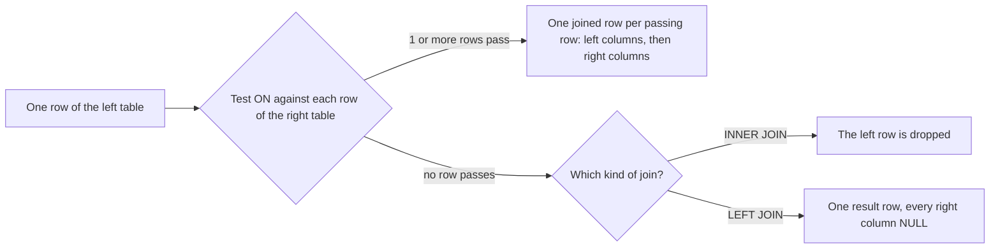

## Bạn cần biết trước

- [[foundation.l1.sql-select]] — bạn đọc được `SELECT … FROM … WHERE … ORDER BY` và biết xem số dòng psql báo trước khi tin vào kết quả. Ở bài này `FROM` gọi tên hai bảng cùng lúc.

## Tình huống

Cửa hàng muốn một danh sách đơn hàng kèm tên khách đã đặt từng đơn. Bạn chạy `SELECT` trên `orders` và nhận 12 dòng, nhưng mỗi dòng chỉ ghi khách hàng bằng một con số trong `customer_id`: đơn 3 ghi `2`. Tên khách nằm ở bảng khác, `customers`, nơi dòng 2 là `Nguyễn Bảo Châu`, và bạn có thể dò số bằng mắt, 12 lần. Rồi cửa hàng hỏi thêm: khách nào chưa từng đặt đơn nào? Giờ bạn phải đi tìm một con số không hề xuất hiện trong `orders`. Làm sao để PostgreSQL tự ghép dòng của hai bảng cho bạn, kể cả những dòng không có cặp?

## Khái niệm cốt lõi

- **JOIN** (phép ghép dòng của hai bảng theo điều kiện, thường qua khóa ngoại) — phần của `FROM` đặt hai bảng cạnh nhau, ghép một dòng của bảng này với một dòng của bảng kia ở bất cứ chỗ nào điều kiện đúng.
- điều kiện ghép — phép thử viết sau `ON`, thường là khóa ngoại bằng khóa chính mà nó trỏ tới, như `c.id = o.customer_id`, trong đó `c` và `o` là tên ngắn của `customers` và `orders`, đặt trong câu truy vấn đầu tiên bên dưới.
- `INNER JOIN` — chỉ giữ các cặp qua được điều kiện, nên một dòng không có cặp sẽ hoàn toàn không có mặt trong kết quả.
- `LEFT JOIN` — giữ mọi dòng của bảng viết trước nó, với `NULL` ở tất cả các cột của bảng kia khi dòng đó không có cặp.
- tích chéo — mọi dòng của bảng này ghép với mọi dòng của bảng kia, nên hai bảng 12 và 5 dòng cho ra 60 dòng.

## Cơ chế hoạt động



Trong tình huống trên, "ai đặt đơn 3" nghĩa là: tìm dòng của `customers` có `id` bằng `customer_id` của đơn 3. JOIN làm điều đó cho mọi dòng cùng lúc. Phép thử sau `ON` là điều kiện ghép. Mọi điều kiện ghép trong các file truy vấn của Đơn Hàng đều so một khóa ngoại với khóa chính mà nó trỏ tới, vì cặp cột đó chính là mối liên kết mà các bảng lưu lại.

Hãy theo sơ đồ với một dòng của bảng trái, tức bảng viết trước. Điều kiện được thử với từng dòng của bảng phải. Mỗi dòng qua được sinh ra một dòng ghép: các cột của dòng trái, rồi các cột của dòng phải. Sau đó danh sách `SELECT` chọn bạn thấy cột nào, theo thứ tự nào. Sơ đồ mô tả dòng nào đi ra, không phải các bước PostgreSQL dùng để tìm chúng.

Khi đúng một dòng qua được, bạn nhận một dòng kết quả. Đơn nào cũng có đúng một khách, nên `orders` ghép với `customers` cho 12 dòng ứng với 12 đơn. Khi nhiều dòng qua được, dòng trái lặp lại. Với `customers` bên trái và `orders` bên phải, khách 1 xuất hiện ba lần, mỗi đơn một lần. Đây là liên kết một-nhiều đang hoạt động, và cũng là lý do đếm số dòng sau một `INNER JOIN` như vậy là đếm phía "nhiều", như phần tiếp theo cho thấy.

Khi không dòng nào qua được, loại JOIN quyết định. `INNER JOIN` bỏ dòng trái. `LEFT JOIN` giữ nó một lần và điền `NULL` vào mọi cột của bảng phải. Khách 5, người chưa từng đặt đơn, là một dòng như thế: biến mất khỏi `INNER JOIN` và xuất hiện một lần, không có đơn nào, trong `LEFT JOIN`.

Nếu điều kiện đúng với mọi cặp, mỗi dòng trái lặp lại một lần cho mỗi dòng của bảng phải, và kết quả là tích chéo.

## Trong hệ thống Đơn Hàng

File truy vấn đầu tiên trả lời câu hỏi thứ nhất của cửa hàng, rồi cho thấy một JOIN một-nhiều làm gì với phép đếm.

```sql file=db/queries/join-orders-customers.sql tag=stage-0 lines=5-17
SELECT o.id AS order_id,
       c.full_name,
       o.status,
       o.placed_at
FROM orders AS o
INNER JOIN customers AS c ON c.id = o.customer_id
ORDER BY o.id;

-- Joining through a one-to-many multiplies rows: one line per item, not per
-- order. There are 12 orders but more order lines than that.
SELECT count(*) AS rows_after_joining_items
FROM orders AS o
INNER JOIN order_items AS i ON i.order_id = o.id;
```

`FROM orders AS o` đặt cho `orders` tên ngắn `o` trong câu truy vấn này, nên `o.id` nghĩa là `id` của `orders`, còn `o.id AS order_id` đổi tên cột đó trong kết quả. Cả hai bảng đều có `id`, nên tên ngắn cho PostgreSQL biết bạn muốn cột nào. Dòng 10, `INNER JOIN customers AS c ON c.id = o.customer_id`, chứa điều kiện ghép: khóa chính của khách bằng khóa ngoại của đơn. psql báo `(12 rows)` cho câu truy vấn đầu, và đơn 3 giờ ghi `Nguyễn Bảo Châu`. Câu truy vấn thứ hai ghép `order_items` thay vào đó, và `count(*)` trả về số dòng thay vì các dòng: 18, vì 12 đơn có tổng cộng 18 dòng mặt hàng.

File thứ hai trả lời câu hỏi còn lại của cửa hàng.

```sql file=db/queries/left-join-customers-without-orders.sql tag=stage-0 lines=6-15
SELECT c.id, c.full_name, o.id AS order_id
FROM customers AS c
LEFT JOIN orders AS o ON o.customer_id = c.id
ORDER BY c.id, o.id;

SELECT c.id, c.full_name
FROM customers AS c
LEFT JOIN orders AS o ON o.customer_id = c.id
WHERE o.id IS NULL
ORDER BY c.id;
```

Câu truy vấn đầu giữ cả năm khách, nên trả về `(13 rows)`: khách 1 đến 4 mỗi người ba lần, và khách 5, `Vũ Gia Khánh`, một lần, với ô `order_id` trống, vì psql in `NULL` thành khoảng trắng. Câu truy vấn thứ hai thêm `WHERE o.id IS NULL`. `IS NULL` đúng khi và chỉ khi giá trị là `NULL`, còn `o.id = NULL` sẽ cho kết quả "không xác định" với mọi dòng và không giữ dòng nào. `WHERE` có hiệu lực sau khi JOIN đã dựng xong các dòng, và `orders.id` là khóa chính nên không bao giờ `NULL` ở một đơn thật. Vì thế `NULL` ở đó chỉ có thể nghĩa là không có đơn nào khớp. Kết quả là một dòng, khách 5. `INNER JOIN` không trả lời được câu này, vì nó bỏ đúng dòng bạn đang tìm.

Giờ hãy thử làm hỏng dòng 10 của file đầu trong đầu. `ON c.id = c.id` so mỗi khách với chính nó, điều này đúng với mọi cặp, nên mỗi đơn trong 12 đơn ghép với cả 5 khách: 60 dòng, và không có lỗi nào. Mỗi đơn giờ hiện năm lần, mỗi lần với một tên, và chẳng có gì đánh dấu bốn lần trong đó là sai. Thiếu điều kiện cũng cho kết quả tương tự khi bạn liệt kê hai bảng dạng `FROM orders, customers` mà không có `WHERE` nối chúng. Ngược lại, bỏ `ON` khỏi một `INNER JOIN` hay `LEFT JOIN` thì câu lệnh dừng với lỗi. Số dòng mới là thứ để lộ vấn đề, nên hãy so nó với con số bạn chờ đợi mỗi khi viết hoặc sửa một JOIN.

## Người mới hay nghĩ rằng…

- **"LEFT JOIN và INNER JOIN cho cùng các dòng, chỉ khác thứ tự."** → Thực ra chúng khác nhau ở chỗ dòng nào được trả về: một dòng trái không có cặp bị `INNER JOIN` bỏ đi, còn `LEFT JOIN` giữ lại kèm các `NULL`. Không loại nào hứa thứ tự nếu thiếu `ORDER BY`. Hai loại chỉ trả cùng các dòng khi mọi dòng trái đều có cặp, và đó là lý do sự khác biệt nấp kỹ trong dữ liệu thử mà ai cũng đã đặt đơn. Bạn sẽ nhận ra khi một khách bạn biết chắc là có, như khách 5, lại vắng mặt trong danh sách dựng bằng `INNER JOIN`.
- **"Ghép bảng thì câu truy vấn trả về mỗi đơn một dòng."** → Thực ra JOIN trả về mỗi cặp khớp một dòng, nên mỗi đơn lặp lại một lần cho mỗi mặt hàng ngay khi `order_items` tham gia: 18 dòng cho 12 đơn. Đếm sau một JOIN như vậy là đếm mặt hàng, không phải đơn, trừ khi bạn gom các dòng lại thành mỗi đơn một dòng, điều mà [[foundation.l1.sql-group-by]] chỉ cách làm. Bạn sẽ nhận ra khi số đơn đếm được lớn hơn số đơn bạn liệt kê ra được.

## Thử ngay (3 phút)

1. Khởi động PostgreSQL của Đơn Hàng, nơi các file truy vấn này chạy, bằng `scripts/up.sh`, rồi chạy `scripts/sql/run-query.sh left-join-customers-without-orders`. Trong kết quả đầu tiên, tìm khách 1 và khách 5, rồi đọc số dòng dưới kết quả.
2. Mở `db/queries/left-join-customers-without-orders.sql`, đổi `LEFT JOIN` ở dòng 8 thành `INNER JOIN`, lưu lại, và chạy lại đúng lệnh trên. Xong thì hoàn tác thay đổi.

Kết quả mong đợi: ở lần chạy đầu, kết quả thứ nhất kết thúc bằng `(13 rows)`, có `Trần Minh Anh` ba lần, mỗi đơn một lần, và `Vũ Gia Khánh` một lần với `order_id` trống. Kết quả thứ hai là đúng một dòng của `Vũ Gia Khánh`. Sau khi sửa, kết quả thứ nhất kết thúc bằng `(12 rows)` và không còn `Vũ Gia Khánh`, còn kết quả thứ hai, vẫn dùng `LEFT JOIN`, không đổi.

## Liên hệ

- [[foundation.l1.sql-select]] — vẫn các mệnh đề ấy và vẫn số dòng ấy, giờ đọc từ hai bảng. `WHERE` vẫn có hiệu lực sau `FROM`, kể cả khi có JOIN.
- [[foundation.l1.tables-keys-relations]] — các khóa ngoại khai báo ở đó chính là các liên kết mà điều kiện ghép đi theo.
- [[foundation.l1.sql-group-by]] — cách chữa các dòng lặp: gom các dòng đã ghép về lại mỗi đơn hoặc mỗi khách một dòng.
- [[backend.l1.efcore-n-plus-one]] — cùng phép ghép này nhưng yêu cầu từ code C#, và cái giá khi lấy khách của từng đơn bằng một câu truy vấn riêng thay vì một JOIN.

## Tóm tắt 5 dòng

1. JOIN ghép dòng của hai bảng ở chỗ điều kiện `ON` đúng, thường là chỗ khóa ngoại bằng khóa chính mà nó trỏ tới.
2. `INNER JOIN` chỉ giữ các cặp khớp. `LEFT JOIN` giữ thêm mỗi dòng trái không khớp một lần, với `NULL` ở các cột của bảng phải.
3. Để tìm khách chưa có đơn, `LEFT JOIN` họ với `orders` và giữ các dòng mà `id` của đơn là `NULL`.
4. Ghép qua liên kết một-nhiều sẽ lặp dòng phía "một" theo từng cặp khớp, nên đếm sau đó là đếm mặt hàng, không phải đơn, trừ khi bạn gom nhóm.
5. Điều kiện đúng với mọi cặp sẽ lặng lẽ trả về mọi tổ hợp, 60 dòng thay vì 12. Hãy kiểm tra số dòng sau mỗi JOIN.
