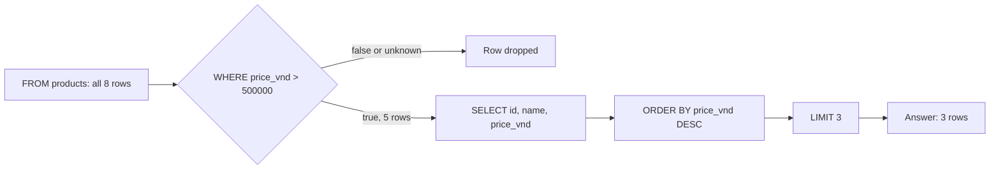

## Before you start

- [[foundation.l1.tables-keys-relations]] — you know that Đơn Hàng keeps its data in PostgreSQL tables, one row per thing and one column per fact; this lesson reads rows back out of one of them.

## The situation

The shop wants a box on its home page showing the three most expensive products that cost more than 500,000 đồng. A teammate writes a query for it and shows you what PostgreSQL printed: products 1, 3 and 4, `Bàn phím cơ`, `Tai nghe` and `Màn hình 24 inch`.

You open `db/seed.sql` to check the prices: it fills the tables of the lab, the copy of Đơn Hàng that `scripts/up.sh` starts on your laptop, with their starting rows in the order it lists them. `Tai nghe` costs 890,000 đồng, while `Ổ cứng SSD 512GB` costs 1,450,000 and is missing. The query ran without an error, and every product it returned does cost more than 500,000. What did the query fail to say?

## Core concepts

- query — a question written in SQL, the language PostgreSQL reads, which PostgreSQL answers with rows; `db/queries/select-basics.sql` holds three of them.
- clause — one part of a query, opened by a keyword: `SELECT` names the columns to show, `FROM` the table, `WHERE` the test a row must pass, `ORDER BY` the sort, and `LIMIT` how many rows to keep.
- `NULL` — the marker PostgreSQL uses for a value that is unknown; it is not zero and not empty text.
- psql — the program that sends a query to PostgreSQL and prints the answer as a table; here it runs in the lab box, a small separate machine that `scripts/up.sh` starts on your own laptop.
- row count — the line such as `(3 rows)` that psql prints under an answer, saying how many rows came back.

## How it works



The diagram follows the first query in `db/queries/select-basics.sql`, the one that answers the situation correctly. You write its clauses as `SELECT`, `FROM`, `WHERE`, `ORDER BY`, `LIMIT`. Read the diagram in the order the clauses take effect; PostgreSQL may take other steps inside, as the last paragraph explains.

`FROM products` starts with every row of the table: all eight products. `WHERE price_vnd > 500000` then tests each row and keeps it only when the test is true; false and unknown are both dropped. Unknown comes from `NULL`: a comparison such as `=` or `<>` (SQL's "not equal", like `!=` in C#) with `NULL` on either side gives `NULL`, not true or false. Nobody can say whether an unknown price is bigger than 500,000, so a product whose `price_vnd` held `NULL` would fail this test and quietly never reach the home-page box. Here five products pass.

`SELECT id, name, price_vnd` picks the columns to show from those five rows. `ORDER BY price_vnd DESC` sorts them, most expensive first; without `DESC` the sort runs from smallest up. It may sort by any column of the table, even one `SELECT` does not show: `SELECT` only decides what gets printed, and the rest of each row is still there for `ORDER BY` to use. Only then does `LIMIT 3` keep the first three sorted rows.

So filtering comes before sorting, and sorting before cutting. `LIMIT` cuts from whatever order exists at that moment. With no `ORDER BY`, PostgreSQL returns rows in whatever order it happens to read them, and promises none. The situation's query had no `ORDER BY`, so "the first three" meant nothing in particular.

The query never says how to find the rows. You describe the answer; PostgreSQL works out its own steps, which only have to give the same rows as the diagram.

## In the Đơn Hàng system

This lesson's query file asks the `products` table three questions.

```sql file=db/queries/select-basics.sql tag=stage-0 lines=5-19
SELECT id, name, price_vnd
FROM products
WHERE price_vnd > 500000
ORDER BY price_vnd DESC
LIMIT 3;

-- The same query without ORDER BY may return any three of the matching rows.
SELECT id, name
FROM products
WHERE price_vnd > 500000
LIMIT 3;

-- NULL means "unknown", so nothing is ever equal to it, not even NULL itself.
SELECT NULL = NULL AS "null_equals_null",
       NULL IS NULL AS "null_is_null";
```

The first query is the diagram, clause by clause, and each query ends with `;`. The second is the situation's query: the same `WHERE`, no `ORDER BY`, and the comment above it says what that costs. The third asks PostgreSQL two questions about `NULL` directly, and `AS` gives each answer a column name. Every column in Đơn Hàng's tables is created with the rule `NOT NULL`, written out or implied by its `PRIMARY KEY`, so PostgreSQL refuses to store `NULL` in it; this query makes one on purpose. So in this lesson, `NULL` appears only where a query writes it, as in the `<> NULL` mistake below.

A script runs the file through psql:

```bash file=scripts/sql/run-query.sh tag=stage-0 lines=7-11
query="${1:-select-basics}"

psql --host db --username donhang --dbname donhang \
     --no-psqlrc --echo-queries --set ON_ERROR_STOP=on \
     --file "/repo/db/queries/${query}.sql"
```

With no argument it runs `select-basics`. The options you can ignore in this lesson pick the server, the user to log in as, and which of the server's named sets of tables to use, skip psql's start-up settings files, and stop at the first error. `--file` hands psql the query file, and `--echo-queries` makes psql print each query before its answer, which is why the output repeats the SQL:

```text output=true
...
SELECT id, name, price_vnd
FROM products
WHERE price_vnd > 500000
ORDER BY price_vnd DESC
LIMIT 3;
 id |       name       | price_vnd
----+------------------+-----------
  4 | Màn hình 24 inch |   3200000
  6 | Ổ cứng SSD 512GB |   1450000
  1 | Bàn phím cơ      |   1250000
(3 rows)

SELECT id, name
FROM products
WHERE price_vnd > 500000
LIMIT 3;
 id |       name
----+------------------
  1 | Bàn phím cơ
  3 | Tai nghe
  4 | Màn hình 24 inch
(3 rows)

SELECT NULL = NULL AS "null_equals_null",
       NULL IS NULL AS "null_is_null";
 null_equals_null | null_is_null
------------------+--------------
                  | t
(1 row)
```

psql prints each answer as a table: a line of column names, a dashed line, one line per row, then the row count. When you check any query, read the count first and compare it with what you expected. Five products cost more than 500,000 đồng, and both answers end with `(3 rows)`, so `LIMIT` dropped two.

In the last table, `null_is_null` shows `t`, the way PostgreSQL writes true (false is `f`). `null_equals_null` looks empty: that blank is `NULL` itself, because psql prints nothing for an unknown value. So the comment's "never equal" means never true: `NULL = NULL` answers `NULL`, not false.

## Beginners often think…

- **"WHERE price_vnd <> NULL finds rows with a price."** → Actually `price_vnd <> NULL` gives `NULL` for every row, whatever the price, so `WHERE` keeps none and the query returns no rows. To ask whether a column holds a value, write `price_vnd IS NOT NULL`; `IS NULL` asks the opposite, as the third query shows. You notice this when a query that looks right prints `(0 rows)` and no error.
- **"LIMIT 10 gives the first 10 rows that were inserted."** → Actually, without `ORDER BY`, `LIMIT` keeps the first rows in whatever order PostgreSQL reads them, and the documentation says that order must not be relied on. In the lab, ids 1, 3 and 4 happen to follow `db/seed.sql`, which makes the belief look true. You notice this when the same query lists different rows on another copy of the data, or on another run, though nobody changed it.

## Try it (3 minutes)

1. Open `db/seed.sql` and count the products whose price is above 500,000 đồng.
2. In a terminal at the repository root, run `scripts/up.sh` and wait for `The lab is up.` If the lab is already up, running it again does no harm: it keeps the files it created the first time and every row PostgreSQL holds. Then run `scripts/sql/run-query.sh`; it runs psql inside the lab box, where your repository folder appears as `/repo`. Read the row count under each of the first two answers, then name the one line the second query needs to answer the situation.

Expected result: five products cost more than 500,000 đồng (ids 1, 3, 4, 6 and 7), yet both answers end with `(3 rows)`. The first dropped the two cheapest, ids 3 and 7. The second dropped ids 6 and 7, for no reason the query states.

<details><summary>Suggested answer</summary>

`ORDER BY price_vnd DESC`, placed between `WHERE` and `LIMIT 3`, as in the first query. The sort may use a column the query does not show, so the second query then returns products 4, 6 and 1.

</details>

## Connections

- [[foundation.l1.tables-keys-relations]] — prerequisite: it built the tables this lesson reads, one row per thing.
- [[foundation.l1.sql-join]] — the next step: one query that reads two tables at once through a foreign key, which is how an order's row reaches its customer's name.
- [[foundation.l1.sql-write]] — the same `WHERE`, used to choose which rows to change or remove instead of which rows to show.
- [[foundation.l1.sql-index-intro]] — the other half of "you say what, PostgreSQL decides how": why some `WHERE` tests are answered without reading every row.

## Five-line summary

1. A query says which rows you want — table, test, order, how many; PostgreSQL chooses how to find them, and any order left unsaid.
2. The clauses take effect in order: `FROM`, `WHERE`, the `SELECT` columns, `ORDER BY`, then `LIMIT`.
3. `WHERE` keeps a row only when its test is true; `=` or `<>` with `NULL` gives unknown, so that row vanishes.
4. `LIMIT` without `ORDER BY` returns some matching rows, not necessarily the first inserted and not necessarily the best.
5. psql prints the answer as a table ending in a row count; check that count before trusting the rows.
