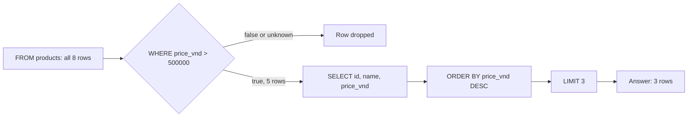

## Bạn cần biết trước

- [[foundation.l1.tables-keys-relations]] — bạn biết Đơn Hàng giữ dữ liệu trong các bảng PostgreSQL, mỗi dòng là một thứ và mỗi cột là một thông tin về nó. Bài này đọc các dòng ra từ một trong những bảng đó.

## Tình huống

Cửa hàng muốn đặt ở trang chủ một ô hiện ba sản phẩm đắt nhất trong số các sản phẩm giá trên 500.000 đồng. Một đồng nghiệp viết câu truy vấn cho ô đó và cho bạn xem PostgreSQL in ra gì: sản phẩm 1, 3 và 4, tức `Bàn phím cơ`, `Tai nghe` và `Màn hình 24 inch`.

Bạn mở `db/seed.sql` để xem giá. File này đổ các dòng ban đầu vào bảng, theo đúng thứ tự nó liệt kê. Lab là bản Đơn Hàng mà `scripts/up.sh` khởi động trên laptop. `Tai nghe` giá 890.000 đồng, trong khi `Ổ cứng SSD 512GB` giá 1.450.000 lại không có mặt. Câu truy vấn chạy không lỗi, và sản phẩm nào nó trả về cũng đúng là giá trên 500.000. Vậy câu truy vấn đã quên nói điều gì?

## Khái niệm cốt lõi

- câu truy vấn (query) — một câu hỏi viết bằng SQL, ngôn ngữ mà PostgreSQL đọc, và PostgreSQL trả lời bằng các dòng. `db/queries/select-basics.sql` chứa ba câu như vậy.
- mệnh đề (clause) — một phần của câu truy vấn, mở đầu bằng một từ khóa: `SELECT` gọi tên các cột cần hiện, `FROM` gọi tên bảng, `WHERE` là phép thử mà dòng phải qua, `ORDER BY` là cách sắp xếp, còn `LIMIT` là số dòng giữ lại.
- `NULL` — dấu hiệu PostgreSQL dùng cho một giá trị chưa biết. Nó không phải số 0 và không phải chuỗi rỗng.
- psql — chương trình gửi câu truy vấn tới PostgreSQL và in câu trả lời thành bảng. Ở đây nó chạy trong lab, bản Đơn Hàng nói ở phần tình huống.
- số dòng (row count) — dòng như `(3 rows)` mà psql in dưới câu trả lời, cho biết có bao nhiêu dòng trả về.

## Cơ chế hoạt động



Sơ đồ đi theo câu truy vấn đầu tiên trong `db/queries/select-basics.sql`, câu trả lời đúng cho tình huống. Bạn viết các mệnh đề theo thứ tự `SELECT`, `FROM`, `WHERE`, `ORDER BY`, `LIMIT`. Hãy đọc sơ đồ theo thứ tự các mệnh đề có hiệu lực: các dòng bạn nhận được luôn giống như khi những bước này chạy theo đúng thứ tự đó, dù bên trong PostgreSQL có làm khác đi.

`FROM products` bắt đầu với mọi dòng của bảng: cả tám sản phẩm. Sau đó `WHERE price_vnd > 500000` thử từng dòng và chỉ giữ dòng khi phép thử đúng. Sai và không xác định đều bị bỏ. "Không xác định" đến từ `NULL`: một phép so sánh như `=` hay `<>` (dấu "khác" của SQL, giống `!=` trong C#) có `NULL` ở bất kỳ bên nào sẽ cho ra `NULL`, không phải đúng hay sai. Không ai nói được một giá chưa biết có lớn hơn 500.000 hay không, nên sản phẩm nào có `price_vnd` là `NULL` sẽ trượt phép thử này và lặng lẽ không bao giờ lên được ô ở trang chủ. Ở đây có năm sản phẩm qua được.

`SELECT id, name, price_vnd` chọn các cột cần hiện từ năm dòng đó. `ORDER BY price_vnd DESC` sắp xếp chúng, đắt nhất lên đầu. Không có `DESC` thì thứ tự đi từ nhỏ lên. Trong câu truy vấn kiểu này, `ORDER BY` được sắp theo bất kỳ cột nào của bảng, kể cả cột mà `SELECT` không hiện: `SELECT` chỉ quyết định cái gì được in ra, phần còn lại của mỗi dòng vẫn ở đó cho `ORDER BY` dùng. Chỉ đến lúc này `LIMIT 3` mới giữ ba dòng đầu sau khi sắp.

Vậy lọc đi trước sắp, và sắp đi trước cắt. `LIMIT` cắt theo thứ tự đang có ở thời điểm đó. Không có `ORDER BY`, PostgreSQL trả các dòng theo thứ tự nó tình cờ đọc được, và không hứa thứ tự nào. Câu truy vấn trong tình huống không có `ORDER BY`, nên "ba dòng đầu" chẳng mang nghĩa gì cụ thể.

Câu truy vấn không bao giờ nói cách tìm các dòng. Bạn mô tả câu trả lời, còn PostgreSQL tự tính ra các bước của nó.

## Trong hệ thống Đơn Hàng

File truy vấn của bài này hỏi bảng `products` ba câu.

```sql file=db/queries/select-basics.sql tag=stage-0 lines=5-19
SELECT id, name, price_vnd
FROM products
WHERE price_vnd > 500000
ORDER BY price_vnd DESC
LIMIT 3;

-- The same query without ORDER BY may return any three of the matching rows.
SELECT id, name
FROM products
WHERE price_vnd > 500000
LIMIT 3;

-- NULL means "unknown", so nothing is ever equal to it, not even NULL itself.
SELECT NULL = NULL AS "null_equals_null",
       NULL IS NULL AS "null_is_null";
```

Câu đầu chính là sơ đồ, từng mệnh đề một, và câu nào cũng kết thúc bằng `;`. Câu thứ hai là câu truy vấn trong tình huống: cùng `WHERE`, không có `ORDER BY`, và chú thích phía trên nói rõ cái giá phải trả. Câu thứ ba không có `FROM` vì nó không đọc bảng nào: nó hỏi thẳng PostgreSQL hai câu về `NULL`, `SELECT` in cả hai câu trả lời thành một dòng, và `AS` đặt tên cột cho từng câu trả lời. Mọi cột trong các bảng của Đơn Hàng đều có quy tắc `NOT NULL`: viết rõ ở các cột thường, và ngầm có ở mỗi cột khóa chính, nên PostgreSQL từ chối lưu `NULL` vào đó. Câu truy vấn này cố ý tạo ra một `NULL`. Vì thế trong bài này, `NULL` chỉ xuất hiện ở chỗ câu truy vấn tự viết ra, như lỗi `<> NULL` ở phần dưới.

Một script chạy file này qua psql:

```bash file=scripts/sql/run-query.sh tag=stage-0 lines=7-11
query="${1:-select-basics}"

psql --host db --username donhang --dbname donhang \
     --no-psqlrc --echo-queries --set ON_ERROR_STOP=on \
     --file "/repo/db/queries/${query}.sql"
```

Không có tham số thì nó chạy `select-basics`. Những tùy chọn bạn có thể bỏ qua trong bài này chọn PostgreSQL nào để nói chuyện (cái trong lab), user để đăng nhập, bộ bảng có tên nào của nó để dùng, bỏ qua các file cấu hình khởi động của psql, và dừng ở lỗi đầu tiên. `--file` đưa file truy vấn cho psql, còn `--echo-queries` bắt psql in từng câu truy vấn trước câu trả lời của nó, nên kết quả lặp lại phần SQL:

```text output=true
...
SELECT id, name, price_vnd
FROM products
WHERE price_vnd > 500000
ORDER BY price_vnd DESC
LIMIT 3;
 id |       name       | price_vnd
----+------------------+-----------
  4 | Màn hình 24 inch |   3200000
  6 | Ổ cứng SSD 512GB |   1450000
  1 | Bàn phím cơ      |   1250000
(3 rows)

SELECT id, name
FROM products
WHERE price_vnd > 500000
LIMIT 3;
 id |       name
----+------------------
  1 | Bàn phím cơ
  3 | Tai nghe
  4 | Màn hình 24 inch
(3 rows)

SELECT NULL = NULL AS "null_equals_null",
       NULL IS NULL AS "null_is_null";
 null_equals_null | null_is_null
------------------+--------------
                  | t
(1 row)
```

psql in mỗi câu trả lời thành một bảng: một dòng tên cột, một dòng gạch ngang, mỗi dòng dữ liệu một dòng, rồi đến số dòng. Khi kiểm tra bất kỳ câu truy vấn nào, hãy đọc số dòng trước và so với con số bạn chờ đợi. Có năm sản phẩm giá trên 500.000 đồng, mà cả hai câu trả lời đều kết thúc bằng `(3 rows)`, nên `LIMIT` đã bỏ đi hai.

Trong bảng cuối, `null_is_null` hiện `t`, cách PostgreSQL viết "đúng" (sai là `f`). `null_equals_null` trông như trống: khoảng trống đó chính là `NULL`, vì psql không in gì cho một giá trị chưa biết. Vậy "không bao giờ bằng" trong chú thích nghĩa là không bao giờ đúng: `NULL = NULL` trả về `NULL`, không phải sai.

## Người mới hay nghĩ rằng…

- **"WHERE price_vnd <> NULL tìm ra các dòng có giá."** → Thực ra `price_vnd <> NULL` cho ra `NULL` với mọi dòng, giá bao nhiêu cũng vậy, nên `WHERE` không giữ dòng nào và câu truy vấn trả về rỗng. Muốn hỏi một cột có giá trị hay không, hãy viết `price_vnd IS NOT NULL`. `IS NULL` hỏi điều ngược lại, như câu truy vấn thứ ba cho thấy. Bạn sẽ nhận ra khi một câu truy vấn trông có vẻ đúng lại in `(0 rows)` mà không báo lỗi.
- **"LIMIT 10 cho ra 10 dòng được thêm vào đầu tiên."** → Thực ra, không có `ORDER BY`, `LIMIT` giữ các dòng đầu theo thứ tự PostgreSQL đọc được, và tài liệu nói không được dựa vào thứ tự đó. Trong lab, id 1, 3 và 4 tình cờ theo đúng `db/seed.sql`, khiến niềm tin này trông như đúng. Bạn sẽ nhận ra khi cùng một câu truy vấn, không ai sửa gì, lại liệt kê các dòng khác trên một bản dữ liệu khác, hoặc ở một lần chạy khác.

## Thử ngay (3 phút)

1. Mở `db/seed.sql` và đếm số sản phẩm có giá trên 500.000 đồng.
2. Mở terminal ở thư mục gốc của repository, chạy `scripts/up.sh` và chờ dòng `The lab is up.` Nếu lab đã chạy rồi thì chạy lại cũng không sao: nó giữ nguyên các file đã tạo ở lần đầu và mọi dòng PostgreSQL đang lưu. Sau đó chạy `scripts/sql/run-query.sh`. Script này chạy psql bên trong lab, nơi thư mục repository hiện ra dưới tên `/repo`. Đọc số dòng dưới mỗi câu trả lời trong hai câu đầu, rồi chỉ ra dòng duy nhất mà câu truy vấn thứ hai còn thiếu để trả lời đúng tình huống.

Kết quả mong đợi: có năm sản phẩm giá trên 500.000 đồng (id 1, 3, 4, 6 và 7), nhưng cả hai câu trả lời đều kết thúc bằng `(3 rows)`. Câu đầu bỏ hai sản phẩm rẻ nhất, id 3 và 7. Câu thứ hai bỏ id 6 và 7, vì một lý do mà câu truy vấn không hề nói ra.

<details><summary>Gợi ý đáp án</summary>

`ORDER BY price_vnd DESC`, đặt giữa `WHERE` và `LIMIT 3`, như ở câu truy vấn đầu. Phép sắp xếp được dùng cột mà câu truy vấn không hiện, nên lúc đó câu thứ hai trả về sản phẩm 4, 6 và 1.

</details>

## Liên hệ

- [[foundation.l1.tables-keys-relations]] — bài cần học trước: nó dựng các bảng mà bài này đọc, mỗi dòng là một thứ.
- [[foundation.l1.sql-join]] — bước tiếp theo: một câu truy vấn đọc hai bảng cùng lúc qua khóa ngoại, đó là cách dòng của một đơn tìm tới tên khách đã đặt nó.
- [[foundation.l1.sql-write]] — vẫn `WHERE` ấy, nhưng dùng để chọn dòng nào cần sửa hoặc xóa thay vì dòng nào cần hiện.
- [[foundation.l1.sql-index-intro]] — nửa còn lại của "bạn nói cái gì, PostgreSQL quyết định cách nào": vì sao một số phép thử `WHERE` được trả lời mà không cần đọc mọi dòng.

## Tóm tắt 5 dòng

1. Câu truy vấn nói bạn muốn những dòng nào — bảng, phép thử, thứ tự, bao nhiêu dòng. PostgreSQL chọn cách tìm chúng, và cả thứ tự nào bạn không nói ra.
2. Các mệnh đề có hiệu lực theo thứ tự: `FROM`, `WHERE`, các cột của `SELECT`, `ORDER BY`, rồi `LIMIT`.
3. `WHERE` chỉ giữ một dòng khi phép thử đúng. `=` hay `<>` với `NULL` cho ra "không xác định", nên dòng đó biến mất.
4. `LIMIT` không có `ORDER BY` trả về vài dòng khớp nào đó, không chắc là những dòng thêm vào đầu tiên, cũng không chắc là những dòng tốt nhất.
5. psql in câu trả lời thành bảng, kết thúc bằng số dòng. Hãy kiểm tra con số đó trước khi tin vào các dòng.
