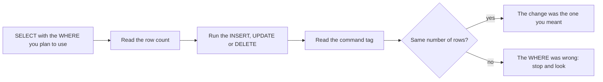

## Before you start

- [[foundation.l1.sql-select]] — you write `SELECT … FROM … WHERE`, you know `WHERE` keeps only the rows whose test is true, and you read the row count that psql, PostgreSQL's terminal client, prints under a result. This lesson gives that same `WHERE` the power to change rows instead of showing them.

## The situation

The shop sends you three small jobs for the lab, your own copy of Đơn Hàng's database that `scripts/up.sh` starts: list a laptop bag at 390,000 đồng, cut `Giá đỡ laptop` to 300,000, and remove the bag again once the listing has been checked. Every statement you have written so far only printed rows; these three change them. Nothing asks you to confirm, nothing shows a preview, and once a change reaches the shop's real database there is no undo button. The shop has eight products, and a wrong price is the kind of thing customers find first. What do you look at before you run the change?

## Core concepts

- `INSERT` — the statement that adds rows to a table: you name the table, the columns you are filling, and a `VALUES` line holding one value per named column.
- `UPDATE` — the statement that changes rows that already exist: `SET` says which columns get which new values, and `WHERE` says in which rows.
- `DELETE` — the statement that removes whole rows; it has no `SET`, because nothing of the row survives to be changed.
- `WHERE` in a write — the same test as in a `SELECT`, except that it now picks the rows the change hits; an `UPDATE` or `DELETE` written without it is legal and hits every row of the table.
- command tag — the short answer PostgreSQL returns for a statement that produces no rows, which psql shows under it, such as `UPDATE 1`; it gives the number of rows the statement actually touched.
- `RETURNING` — a PostgreSQL clause you may add to any of the three, which makes the statement also hand back the rows it wrote, including values the database chose itself.

## How it works



In the situation above, you look first at a `SELECT` carrying the `WHERE` of the change you are about to make. It shows those rows and how many there are. As long as nothing else writes to the table in between, that number is how many rows your `UPDATE` or `DELETE` will touch, learnt while touching nothing.

Then you run the write. PostgreSQL applies it to every row the `WHERE` keeps, no more and no fewer. It asks nothing first, and once the statement has run the only undo the database itself offers is a `ROLLBACK`: it takes back every change made since the matching `BEGIN`, which is why the lab file opens one. Outside such a pair the change stands, and only writing the old values back undoes it. An `UPDATE` or `DELETE` with no `WHERE` keeps every row, so it changes or removes all of them, and PostgreSQL accepts it as readily as any other.

psql then prints a command tag: `UPDATE 1`, `DELETE 3`, or `INSERT 0 1`. The last number is the row count; the `0` before it is a leftover field you can ignore. Compare it with the `SELECT`'s number. Equal numbers mean the `WHERE` you ran is the `WHERE` you tested. Any other number means it is not: a larger one means extra rows have already changed, a smaller one that your `WHERE` was narrower than the one you tested, so part of the change did not happen. Either way, stop and look.

The database refuses some writes on its own. A foreign key is a promise that a referencing row always finds what it references, so PostgreSQL rejects a `DELETE` that would break it, unless the tables were declared with a rule for that case; the rejected statement leaves nothing behind.

## In the Đơn Hàng system

`db/queries/write-basics.sql` does the shop's three jobs in order. Line 4's `BEGIN` and line 21's `ROLLBACK` wrap them: `ROLLBACK` undoes every change made since `BEGIN`, so the file can be run again and leaves the lab as it found it. That pair is there for the lab only; in the shop's real database the three statements would stand, exactly as section 2 says. A later lesson is about the pair.

```sql file=db/queries/write-basics.sql tag=stage-0 lines=4-21
BEGIN;

-- Look before you change: run the SELECT with the WHERE you are about to use.
SELECT id, name, price_vnd FROM products WHERE price_vnd < 500000;

-- lesson: foundation.l1.sql-write
INSERT INTO products (name, price_vnd)
VALUES ('Túi đựng laptop', 390000)
RETURNING id, name, price_vnd;

UPDATE products
SET price_vnd = 300000
WHERE name = 'Giá đỡ laptop';

DELETE FROM products
WHERE name = 'Túi đựng laptop';

ROLLBACK;
```

The `SELECT` on line 7 is the look-before-you-change step. On the rows the lab starts with it answers `(3 rows)`: `Chuột không dây` at 450,000, `Giá đỡ laptop` at 320,000 and `Đèn bàn LED` at 280,000. The `UPDATE` on lines 14–16 then uses a narrower `WHERE` than that `SELECT` — one name instead of a price range — and reports `UPDATE 1`. The two numbers only have to match when the `SELECT` carries the same `WHERE` as the write; the check for this `UPDATE` would be a `SELECT` on that one name, which answers `(1 row)`.

The `INSERT` names two columns and leaves `id` out, because `products.id` was declared an identity column when the table was created: PostgreSQL takes the next number from the table's own counter, which the lab's starting data leaves at 8, so the new row takes 9. `RETURNING id, name, price_vnd` is how you learn that number without asking a second question, and it is how an application learns the number of the order it has just placed. The `DELETE` on lines 18–19 removes that row by name and reports `DELETE 1`.

`ROLLBACK` then takes all three changes back, except the counter — a rollback does not wind that back, for a reason a later lesson gives; that is why line 37 sets it to 8 again.

The statement after the rollback asks for something the shop cannot have. The only line to read in it is the `DELETE`; the lines around it are PostgreSQL's way of catching an error, where the `%` is the place the database's own message lands, and this lesson does not ask you to write them.

```sql file=db/queries/write-basics.sql tag=stage-0 lines=23-37
-- A foreign key refuses to leave orders pointing at a customer who is gone.
-- The block below catches the refusal and prints it instead of stopping.
DO $$
BEGIN
    DELETE FROM customers WHERE id = 1;
EXCEPTION WHEN foreign_key_violation THEN
    RAISE NOTICE 'the database refused: %', SQLERRM;
END;
$$;

SELECT count(*) AS products_after_rollback FROM products;

-- The rollback undid the rows, but a sequence never goes backwards. Put it
-- back, so that running this file again prints exactly the same thing.
SELECT setval(pg_get_serial_sequence('products', 'id'), 8);
```

Customer 1 placed orders 1, 2 and 10. `orders.customer_id` is a foreign key into `customers`, and the place where Đơn Hàng's tables are declared says nothing about what should happen to those orders if their customer disappears, so PostgreSQL's default applies: refuse. A refusal cancels the whole statement, not the offending row alone. Without the block around it, the refusal would stop the file with an error; here it is caught and printed as a `NOTICE` line beginning `the database refused:`, so you read the message and the file goes on. Line 33 then counts the products and answers `8`, the same eight the file started with.

## Beginners often think…

- **"DELETE with a wrong WHERE just deletes nothing."** → Actually a wrong `WHERE` is usually still true of some rows — the wrong ones — and `DELETE` removes every one of them; only a `WHERE` true of nothing deletes nothing. You notice this when the command tag reads `DELETE 3` where you expected `DELETE 1`, and the two rows you did not mean are gone before you finish reading the line.
- **"The database will ask me to confirm before deleting many rows."** → Actually PostgreSQL runs the statement as written and reports afterwards; the refusal above is a declared rule being enforced, not a question being asked. You notice this when you replace the `WHERE` line of the `UPDATE` with a bare `;`, so the statement still ends: it is accepted, every price in the table becomes 300,000 — the eight products plus the row just inserted — and `UPDATE 9` is the first you hear of it.

## Try it (3 minutes)

1. Start the lab with `scripts/up.sh`, then run `scripts/sql/run-query.sh write-basics`. Read the row count under the first `SELECT`, then every line psql prints under the statements that follow it.
2. Open `db/queries/write-basics.sql` and replace line 16 — the `WHERE` of the `UPDATE` — with a single `;` on its own line, so the `UPDATE` stays a complete statement. Run the same command again, and put the line back when you are done.

Expected result: the first run prints, in this order,

1. `(3 rows)` under the first `SELECT`;
2. the inserted row, with `id` 9;
3. `UPDATE 1`, then `DELETE 1`;
4. a `NOTICE` line beginning `the database refused:`;
5. a line showing `8` products left, then a one-row `setval` result of `8`.

After the edit the run prints `UPDATE 9` instead of `UPDATE 1` — the nine rows are the eight products plus the one the `INSERT` added — and the count after the rollback is still `8`.

## Connections

- [[foundation.l1.sql-select]] — the same `WHERE` promoted: there it chose which rows you saw, here it chooses which rows change.
- [[foundation.l1.transaction-intro]] — names the `BEGIN` and `ROLLBACK` pair this file leans on, and states the guarantee that lets several writes fail together.
- [[foundation.l1.tables-keys-relations]] — the foreign key declared there is what refuses the `DELETE` in section 5; the rule lives where the tables are declared, not in your statement.

## Five-line summary

1. `INSERT` adds rows, `UPDATE` changes the rows its `WHERE` selects, `DELETE` removes them; that `WHERE` is the whole safety mechanism.
2. An `UPDATE` or `DELETE` written without a `WHERE` is legal and touches every row of the table.
3. Run the `SELECT` with the same `WHERE` first, then check the write's command tag against the row count you saw.
4. `RETURNING` hands back the rows a write produced, including an `id` the database generated, which is how an application learns a new row's number.
5. A foreign key makes the database refuse a `DELETE` that would orphan rows, unless the tables declare otherwise; a refusal cancels the whole statement.
