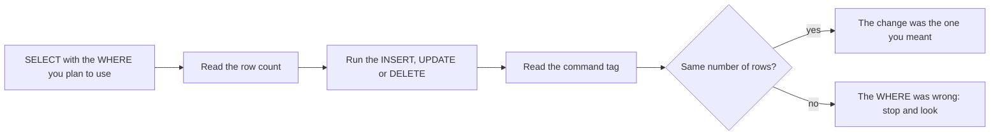

## Bạn cần biết trước

- [[foundation.l1.sql-select]] — bạn viết được `SELECT … FROM … WHERE`, biết `WHERE` chỉ giữ những dòng có phép thử đúng, và đọc được số dòng mà psql, chương trình terminal của PostgreSQL, in dưới câu trả lời. Bài này cho chính `WHERE` đó quyền thay đổi các dòng thay vì chỉ hiện chúng.

## Tình huống

Cửa hàng giao cho bạn ba việc nhỏ trên lab, bản sao cơ sở dữ liệu Đơn Hàng của riêng bạn mà `scripts/up.sh` khởi động: đăng bán một chiếc túi đựng laptop giá 390.000 đồng, hạ giá `Giá đỡ laptop` xuống 300.000, rồi gỡ chiếc túi đi khi đã kiểm tra xong bài đăng. Mọi câu lệnh bạn viết tới giờ chỉ in dòng ra. Ba câu này thì thay đổi chúng. Không ai hỏi bạn xác nhận, không có bản xem trước, và khi thay đổi đã chạm tới cơ sở dữ liệu thật của cửa hàng thì không có nút hoàn tác. Cửa hàng có tám sản phẩm. Bạn nhìn vào đâu trước khi chạy thay đổi?

## Khái niệm cốt lõi

- `INSERT` — câu lệnh thêm dòng vào bảng: bạn gọi tên bảng, các cột sẽ điền, và một dòng `VALUES` chứa đúng một giá trị cho mỗi cột đã gọi tên.
- `UPDATE` — câu lệnh sửa những dòng đã có: `SET` nói cột nào nhận giá trị mới nào, còn `WHERE` nói ở những dòng nào.
- `DELETE` — câu lệnh xóa nguyên dòng. Nó không có `SET`, vì dòng bị xóa chẳng còn phần nào để sửa.
- `WHERE` trong câu lệnh ghi — vẫn là phép thử như trong `SELECT`, chỉ khác là giờ nó chọn những dòng mà thay đổi sẽ đụng tới. Một câu `UPDATE` hay `DELETE` viết thiếu nó vẫn hợp lệ và đụng tới mọi dòng của bảng.
- command tag — câu trả lời ngắn PostgreSQL gửi về khi một câu lệnh chạy xong. psql hiện nó dưới câu lệnh ghi, ví dụ `UPDATE 1`, kể cả khi câu lệnh đó cũng trả về dòng. Nó cho biết câu lệnh đã đụng tới bao nhiêu dòng.
- `RETURNING` — mệnh đề của PostgreSQL mà bạn có thể thêm vào bất kỳ câu nào trong ba câu trên, để câu lệnh trả lại luôn những dòng nó vừa ghi, kể cả các giá trị do cơ sở dữ liệu tự chọn.

## Cơ chế hoạt động



Trong tình huống trên, trước hết bạn nhìn vào một câu `SELECT` mang đúng `WHERE` của thay đổi sắp làm. Nó hiện các dòng đó và cho biết có bao nhiêu dòng. Miễn là không có gì khác ghi vào bảng ở giữa, con số ấy chính là số dòng mà `UPDATE` hay `DELETE` sẽ đụng tới, và bạn biết được nó mà chưa đụng vào gì cả.

Sau đó bạn chạy câu lệnh ghi. PostgreSQL áp nó lên mọi dòng mà `WHERE` giữ lại, không hơn không kém, và không hỏi gì trước. Cách hoàn tác mà bài này dùng là `ROLLBACK`: nó lấy lại những dòng đã đổi kể từ `BEGIN` tương ứng. Đó là lý do file `db/queries/write-basics.sql` của lab (phần 5) bọc các thay đổi giữa một `BEGIN` và một `ROLLBACK`. Ngoài cặp đó, câu lệnh đứng riêng, và chỉ có ghi lại giá trị cũ mới hoàn tác được nó.

Rồi psql in ra một command tag: `UPDATE 1`, `DELETE 3`, hoặc `INSERT 0 1`. Số cuối là số dòng. Số `0` đứng trước là một trường còn sót lại, bạn cứ bỏ qua. Hãy so nó với con số của `SELECT`. Hai số bằng nhau nghĩa là `WHERE` bạn chạy chính là `WHERE` bạn đã thử. Số nào khác thì không phải: lớn hơn nghĩa là đã có thêm dòng bị đổi, nhỏ hơn nghĩa là `WHERE` của bạn hẹp hơn cái đã thử, nên một phần thay đổi không xảy ra. Trường hợp nào cũng vậy, hãy dừng lại và xem xét.

Cơ sở dữ liệu tự từ chối một số câu lệnh ghi. Khóa ngoại là lời hứa rằng dòng tham chiếu luôn tìm thấy thứ nó tham chiếu tới, nên PostgreSQL từ chối câu `DELETE` nào phá lời hứa đó, trừ khi lúc khai báo bảng đã có quy tắc cho trường hợp này. Câu lệnh bị từ chối không để lại gì.

## Trong hệ thống Đơn Hàng

`db/queries/write-basics.sql` làm lần lượt ba việc của cửa hàng. `BEGIN` ở dòng 4 và `ROLLBACK` ở dòng 21 bọc chúng lại, nên file chạy lại bao nhiêu lần cũng được và trả lab về nguyên trạng.

```sql file=db/queries/write-basics.sql tag=stage-0 lines=4-21
BEGIN;

-- Look before you change: run the SELECT with the WHERE you are about to use.
SELECT id, name, price_vnd FROM products WHERE price_vnd < 500000;

-- lesson: foundation.l1.sql-write
INSERT INTO products (name, price_vnd)
VALUES ('Túi đựng laptop', 390000)
RETURNING id, name, price_vnd;

UPDATE products
SET price_vnd = 300000
WHERE name = 'Giá đỡ laptop';

DELETE FROM products
WHERE name = 'Túi đựng laptop';

ROLLBACK;
```

Hai con số chỉ cần khớp khi `SELECT` mang cùng `WHERE` với câu lệnh ghi, mà câu `SELECT` đầu tiên của file, ở dòng 7, quét rộng hơn câu `UPDATE`: nó ở đó để hiện giá các sản phẩm rẻ hơn trước khi đổi. Với các dòng lab có lúc đầu, nó trả lời `(3 rows)`: `Chuột không dây` giá 450.000, `Giá đỡ laptop` giá 320.000 và `Đèn bàn LED` giá 280.000. Câu `UPDATE` ở dòng 14–16 chọn theo một cái tên thay vì một khoảng giá, và báo `UPDATE 1`. Câu kiểm tra dành riêng cho nó sẽ là một `SELECT` theo đúng cái tên đó, và câu ấy trả lời `(1 row)`.

Câu `INSERT` gọi tên hai cột và bỏ qua `id`, vì `products.id` được khai báo là cột identity khi tạo bảng — một cột mà bảng tự điền từ bộ đếm riêng của nó mỗi khi `INSERT` bỏ qua cột đó. Dữ liệu ban đầu của lab để bộ đếm ở 8, nên dòng mới nhận số 9. `RETURNING id, name, price_vnd` là cách bạn biết con số đó mà không phải hỏi thêm câu thứ hai, và cũng là cách một ứng dụng biết số của đơn hàng nó vừa đặt. Câu `DELETE` ở dòng 18–19 xóa dòng đó theo tên và báo `DELETE 1`.

Sau đó `ROLLBACK` lấy lại cả ba thay đổi, trừ bộ đếm — rollback không kéo nó lùi lại, vì một lý do mà bài sau sẽ giải thích. Trong code, bộ đếm này gọi là sequence. `setval` ở dòng 37 đặt nó về 8 và in số 8 đó thành một câu trả lời một dòng.

Trong câu lệnh sau rollback, dòng duy nhất cần đọc là `DELETE`. Các dòng quanh nó, kể cả `BEGIN` ở dòng 26 (không phải `BEGIN` của phần 4), là cách PostgreSQL bắt lỗi, trong đó `%` là chỗ thông báo của chính cơ sở dữ liệu được đặt vào. Bài này không yêu cầu bạn viết chúng.

```sql file=db/queries/write-basics.sql tag=stage-0 lines=23-37
-- A foreign key refuses to leave orders pointing at a customer who is gone.
-- The block below catches the refusal and prints it instead of stopping.
DO $$
BEGIN
    DELETE FROM customers WHERE id = 1;
EXCEPTION WHEN foreign_key_violation THEN
    RAISE NOTICE 'the database refused: %', SQLERRM;
END;
$$;

SELECT count(*) AS products_after_rollback FROM products;

-- The rollback undid the rows, but a sequence never goes backwards. Put it
-- back, so that running this file again prints exactly the same thing.
SELECT setval(pg_get_serial_sequence('products', 'id'), 8);
```

Khách hàng 1 đã đặt các đơn 1, 2 và 10. `orders.customer_id` là khóa ngoại trỏ vào `customers`, và chỗ khai báo các bảng của Đơn Hàng không nói gì về chuyện các đơn đó sẽ ra sao nếu khách của chúng biến mất, nên PostgreSQL dùng mặc định: từ chối. Một lần từ chối hủy cả câu lệnh, không riêng dòng gây lỗi. Nếu không có khối bọc quanh, lần từ chối này sẽ dừng cả lượt chạy, vì script của lab bảo psql dừng ở lỗi đầu tiên. Ở đây nó được bắt lại và in thành một dòng `NOTICE` bắt đầu bằng `the database refused:`, nên bạn đọc được thông báo và file chạy tiếp. Sau đó dòng 33 đếm số sản phẩm — `count(*)` hỏi có bao nhiêu dòng thay vì lấy chính các dòng — và trả lời `8`, đúng tám sản phẩm lúc file bắt đầu.

## Người mới hay nghĩ rằng…

- **"DELETE với WHERE sai thì chỉ không xóa gì thôi."** → Thực ra một `WHERE` sai thường vẫn đúng với vài dòng nào đó — những dòng không phải dòng bạn muốn — và `DELETE` xóa hết chúng. Chỉ `WHERE` không đúng với dòng nào mới không xóa gì. Bạn sẽ nhận ra khi command tag báo `DELETE 3` trong lúc bạn chờ `DELETE 1`, và hai dòng bạn không định xóa đã mất.
- **"Cơ sở dữ liệu sẽ hỏi xác nhận trước khi xóa nhiều dòng."** → Thực ra PostgreSQL chạy câu lệnh đúng như bạn viết rồi mới báo lại. Lần từ chối ở trên là một quy tắc đã khai báo đang được thực thi, không phải một câu hỏi. Bạn sẽ nhận ra khi thay dòng `WHERE` của câu `UPDATE` bằng một dấu `;` trơn để câu lệnh vẫn kết thúc: nó được chấp nhận, mọi giá trong bảng thành 300.000, và `UPDATE 9` (tám sản phẩm cộng chiếc túi mà `INSERT` vừa thêm) là tin đầu tiên bạn nghe về chuyện đó.

## Thử ngay (3 phút)

1. Khởi động lab bằng `scripts/up.sh`, rồi chạy `scripts/sql/run-query.sh write-basics`. Đọc số dòng dưới câu `SELECT` đầu tiên, rồi đọc mọi dòng psql in dưới các câu lệnh tiếp theo.
2. Mở `db/queries/write-basics.sql` và thay dòng 16, `WHERE name = 'Giá đỡ laptop';`, bằng một dấu `;` đứng riêng một dòng, để câu `UPDATE` vẫn là một câu lệnh hoàn chỉnh. Chạy lại đúng lệnh cũ, và trả dòng đó về như cũ khi xong.

Kết quả mong đợi: lần chạy đầu in ra, theo thứ tự,

1. `(3 rows)` dưới câu `SELECT` đầu tiên;
2. dòng vừa thêm, với `id` là 9, tiếp theo là `INSERT 0 1`;
3. `UPDATE 1`, rồi `DELETE 1`;
4. một dòng `NOTICE` bắt đầu bằng `the database refused:`;
5. một dòng cho thấy còn `8` sản phẩm, rồi một câu trả lời một dòng của `setval` là `8`.

Những dòng psql in cho `SET`, `BEGIN`, `ROLLBACK` và khối `DO` là command tag của riêng chúng, còn phần câu lệnh psql in lại phía trên mỗi kết quả thì bạn cũng có thể bỏ qua.

Sau khi sửa, lượt chạy in `UPDATE 9` thay cho `UPDATE 1`, và số sản phẩm đếm được sau rollback vẫn là `8`.

## Liên hệ

- [[foundation.l1.sql-select]] — vẫn `WHERE` ấy nhưng được nâng quyền: ở đó nó chọn dòng nào bạn thấy, ở đây nó chọn dòng nào bị đổi.
- [[foundation.l1.transaction-intro]] — đặt tên cho cặp `BEGIN` và `ROLLBACK` mà file này dựa vào, và nêu cam kết cho phép nhiều câu lệnh ghi cùng thất bại một lượt.
- [[foundation.l1.tables-keys-relations]] — khóa ngoại khai báo ở đó chính là thứ từ chối câu `DELETE` trong phần 5. Quy tắc nằm ở chỗ khai báo bảng, không nằm trong câu lệnh của bạn.

## Tóm tắt 5 dòng

1. `INSERT` thêm dòng, `UPDATE` sửa những dòng mà `WHERE` của nó chọn, `DELETE` xóa chúng. Với `UPDATE` và `DELETE`, chính `WHERE` đó quyết định dòng nào bị đổi.
2. Câu `UPDATE` hay `DELETE` viết thiếu `WHERE` vẫn hợp lệ và đụng tới mọi dòng của bảng.
3. Chạy `SELECT` với cùng `WHERE` trước, rồi so command tag của câu lệnh ghi với số dòng bạn đã thấy.
4. `RETURNING` trả lại những dòng mà câu lệnh ghi tạo ra, kể cả `id` do cơ sở dữ liệu sinh, và đó là cách một ứng dụng biết số của dòng mới.
5. Khóa ngoại từ chối câu `DELETE` nào sẽ để lại các dòng trỏ vào khoảng không, trừ khi bảng khai báo khác đi. Một lần từ chối hủy cả câu lệnh.
