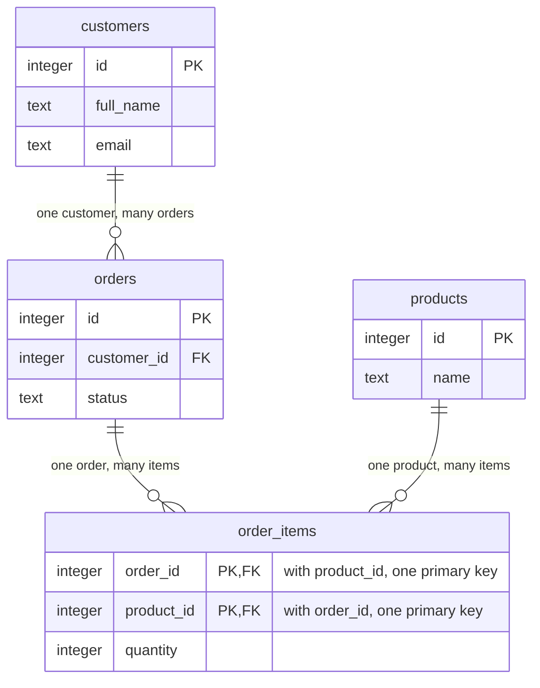

## Before you start

- No prerequisites — start here.

## The situation

The shop wants a page that lists each order with the customer's name and the products bought. Đơn Hàng's data lives in a database, a store that holds it as tables, run by a program called PostgreSQL. You open `db/seed.sql`, the file that fills that database, expecting one list of orders that holds the name and the products. The first order reads `( 1, 1, '2026-03-02 09:15:00+07', 'paid')`: a number, another number, a time and a status, but no name and no product. The products each order bought turn up further down, under `order_items`, as rows of four numbers each. How do a few numbers in a row record who ordered what?

## Core concepts

- table — a named collection of rows of one kind of thing, where every row has the same columns; `orders` holds one row per order, and `customer_id` is one of its columns.
- **primary key** — the column, or group of columns, whose value identifies exactly one row of its table; in `orders` it is `id`.
- **foreign key** — a column whose value must equal the key of a row in the table it points at, unless the row leaves it with no value; in Đơn Hàng that key is always the primary key, and `orders.customer_id` is one, pointing at a row of `customers`.
- joining table — a table whose rows each pair one row of one table with one row of another; `order_items` pairs orders with products.
- normalisation — arranging tables so that each fact is stored in exactly one place.

## How it works



The diagram shows four of Đơn Hàng's six tables and some of their columns. `PK` marks a primary key column and `FK` a foreign key column; each line's label, repeated in symbols at its ends, says how many rows sit on each side.

In the situation above, the primary key of `orders` is `id`. PostgreSQL rejects a row whose `id` has no value (`NULL`) or repeats the `id` of a row already in the table, so the first `1` in the seed line names exactly one order. You keep that value unchanged, because other rows store it to point at this one.

Follow the first line, from `customers` to `orders`. One customer places many orders and each order has one customer, a shape called one-to-many. The link is stored on the many side: every order carries `customer_id`, a foreign key holding one customer's `id`, the second number in the seed line. PostgreSQL refuses an order whose `customer_id` matches no customer. With foreign keys written like Đơn Hàng's, it also refuses to change a customer's `id` while an order holds it: that order would match no customer.

Products do not fit that shape. One order holds several products, and one product appears in many orders: many-to-many. A foreign key in `orders` could point at only one product, and one in `products` at only one order. So a joining table sits between them. Each row of `order_items` says "this product, in this order", with a foreign key to each side. The two lines into `order_items` are therefore two one-to-many links.

The customer's name is not in `orders`. It lives once, in `customers`, and every order reaches it through `customer_id`. That is normalisation. A fact stored in one place cannot disagree with itself.

## In the Đơn Hàng system

Đơn Hàng's database is created from two files: PostgreSQL carries out the commands in `db/schema.sql`, which make every table, then those in `db/seed.sql`, which fill them. The first lines of `db/schema.sql` make three tables.

```sql file=db/schema.sql tag=stage-0 lines=4-24
CREATE TABLE products (
    id        integer GENERATED BY DEFAULT AS IDENTITY PRIMARY KEY,
    name      text NOT NULL,
    price_vnd integer NOT NULL CHECK (price_vnd > 0)
);

-- lesson: foundation.l1.tables-keys-relations
CREATE TABLE customers (
    id        integer GENERATED BY DEFAULT AS IDENTITY PRIMARY KEY,
    full_name text NOT NULL,
    email     text NOT NULL UNIQUE,
    city      text NOT NULL
);

CREATE TABLE orders (
    id          integer GENERATED BY DEFAULT AS IDENTITY PRIMARY KEY,
    customer_id integer NOT NULL REFERENCES customers (id),
    placed_at   timestamptz NOT NULL,
    status      text NOT NULL
                CHECK (status IN ('new', 'paid', 'shipped', 'cancelled'))
);
```

Each column definition inside the brackets gives its name, the kind of value it holds (such as `integer` for whole numbers, `text`, or `timestamptz` for a moment in time), then rules every row must pass; the rule on `status` continues on the next line. A line starting with `--` is a comment for readers; PostgreSQL ignores it.

`PRIMARY KEY` on `id` declares the primary key, and `GENERATED BY DEFAULT AS IDENTITY` lets PostgreSQL fill it with the next number when a new row arrives without one. So the key is a counter, not a fact about the customer. Now look at `email`: `UNIQUE` makes PostgreSQL refuse a second customer with the same address, yet it is not the key, because a customer may change their address and the key should stay unchanged. `REFERENCES customers (id)` is what makes `customer_id` a foreign key, and `NOT NULL` means no order exists without a customer.

The joining table comes a few lines later:

```sql file=db/schema.sql tag=stage-0 lines=26-32
CREATE TABLE order_items (
    order_id       integer NOT NULL REFERENCES orders (id),
    product_id     integer NOT NULL REFERENCES products (id),
    quantity       integer NOT NULL CHECK (quantity > 0),
    unit_price_vnd integer NOT NULL CHECK (unit_price_vnd > 0),
    PRIMARY KEY (order_id, product_id)
);
```

It has two foreign keys, one per side. Its last line is not a column: it makes the pair `(order_id, product_id)` the primary key, so one product appears at most once in one order. Two units of a product are one row with a `quantity` of 2, as in the seed row `( 1, 2, 2,  450000)`: order 1, product 2, two of them at 450,000 đồng each. `unit_price_vnd` looks like a copy of `products.price_vnd`, but its name gives it a different job: the price per unit this order was charged. When a product's price can change later, old orders must keep what they cost, so that fact belongs to the order item.

## Beginners often think…

- **"I should store the customer's name in the order so I can show it quickly."** → Actually the name belongs only in `customers`, reached through `customer_id`, because a copy in every order has to be changed in every order. When a customer corrects their name, you update one row; with copies you must find them all, and any you miss keeps the old name. You notice this when one report lists the same customer twice under two spellings. Copying a fact on purpose for speed is a real technique, usually kept for a slowdown you have measured, and you then own keeping every copy in step.
- **"The primary key should be something meaningful, like the phone number."** → Actually a meaningful value can change or be shared, and a key must do neither: people change phone numbers, and a family may share one. Other tables store the key to point at the row. The foreign key `REFERENCES customers (id)` in `db/schema.sql` refuses any order whose `customer_id` matches no customer, so it also refuses a change to a customer's key while their orders still hold the old one. Đơn Hàng avoids this: it numbers customers with a plain counter and keeps `email` `UNIQUE` but not the key. You notice this, in a table keyed by phone number, when a customer changes number and the update fails.

## Try it (3 minutes)

1. Open `db/schema.sql` in the example repository and find the two tables this lesson has not shown: `payments` and `notifications`.
2. For each one, find the line containing `REFERENCES`. Say which table it points at, which side is "many", and whether it is a joining table.

Expected result: both contain `REFERENCES orders (id)` on their `order_id` column, so each is one-to-many from `orders`: one order can have many payments and many notifications, and each belongs to exactly one order. Neither is a joining table, because each has a foreign key to only one table, so its rows do not pair up rows of two tables.

## Connections

- [[foundation.l1.sql-select]] — this lesson is its prerequisite: the next lesson reads rows back out of these tables, which needs knowing what one row means.
- [[foundation.l1.sql-join]] — the other half of normalisation: it puts rows from separate tables back together through these same foreign keys, which is how the page in the situation gets the customer's name.
- [[foundation.l1.sql-write]] — the foreign key seen from the other side: why PostgreSQL stops you deleting a customer who still has orders.
- [[backend.l1.efcore-mapping]] — the same tables and keys, seen from the C# code of the backend track.

## Five-line summary

1. Keys let each fact live in exactly one table, while every row that needs it points to it.
2. A primary key identifies one row; PostgreSQL keeps it unique and never missing, and you keep it unchanged.
3. In Đơn Hàng a foreign key holds another row's primary key; one-to-many puts it on the many side, like `orders.customer_id`.
4. Many-to-many needs a joining table: each row of `order_items` pairs one order with one product.
5. The customer's name lives only in `customers`, so it cannot disagree with itself; orders reach it through `customer_id`.
